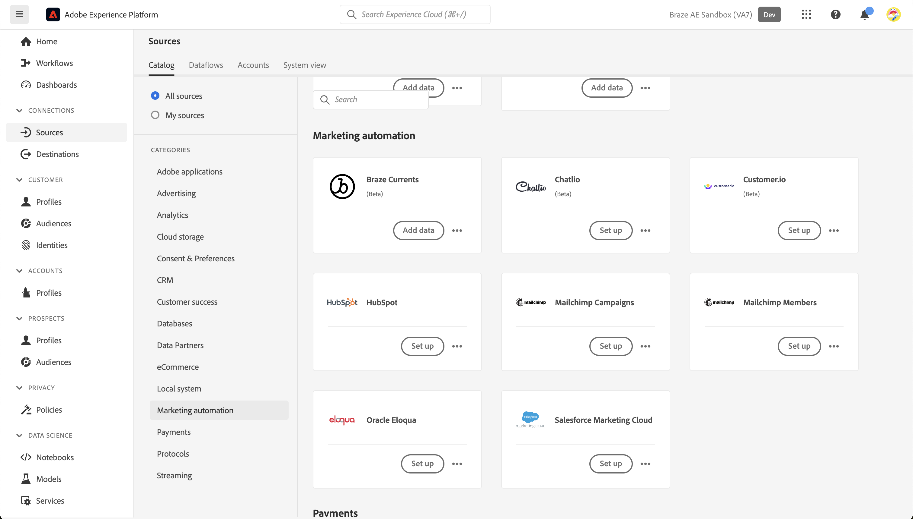
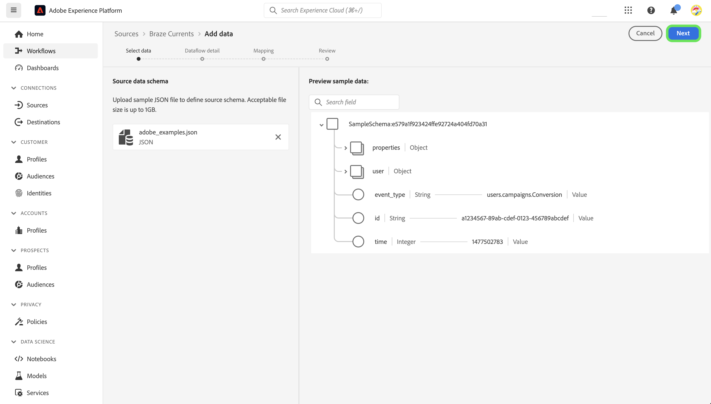
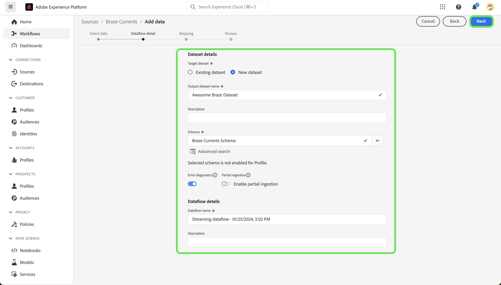
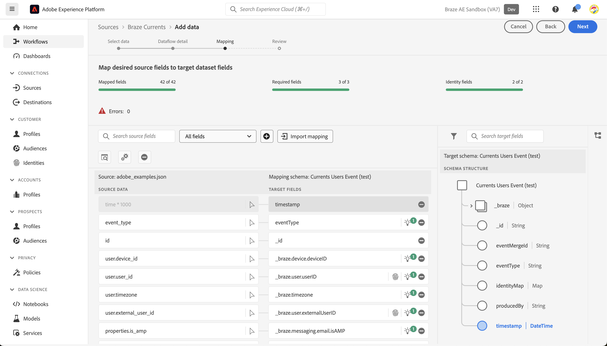
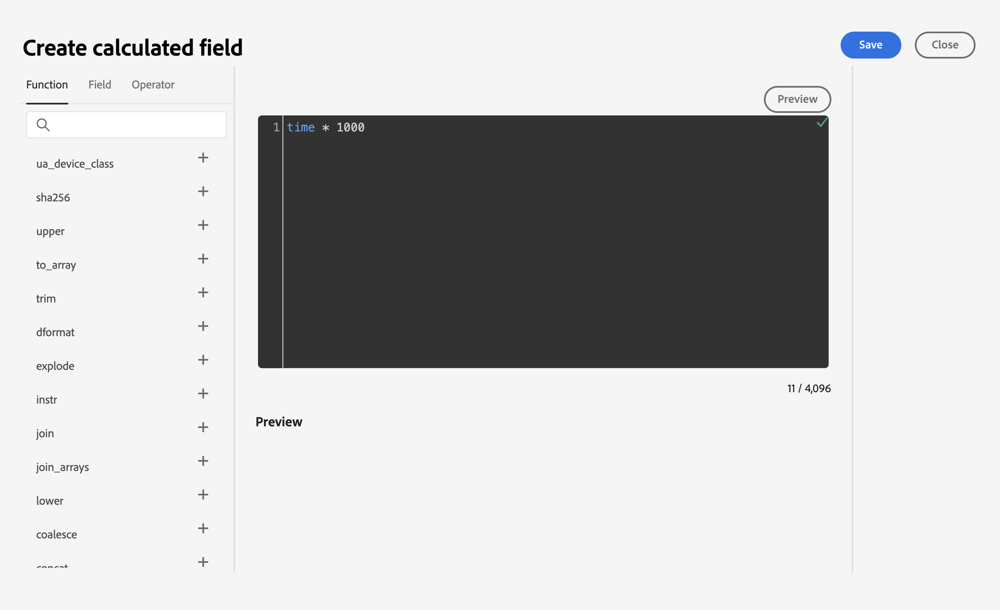

# Create a [!DNL Braze] source connection in the UI

>[!NOTE]
>
>The [!DNL Braze] source is in beta. Please read the [sources overview](../../../../home.md#terms-and-conditions) for more information on using beta-labeled sources.

[!DNL Braze] powers customer-centric interactions between consumers and brands in real-time. [!DNL Braze Currents] is a real-time data stream of engagement events from the Braze platform that is the most robust yet granular export out of the [!DNL Braze] platform. 

Read the following tutorial to learn how to bring engagement events data from your [!DNL Braze] account to Adobe Experience Platform in the UI.

## Prerequisites

In order to complete the steps in this guide, you will need:

* A login to [Adobe Experience Platform](https://platform.adobe.com) and permission to create a new streaming source connection.
* A login to your [[!DNL Braze] dashboard](https://dashboard.braze.com/sign_in), an unused [Currents Connector license](https://www.braze.com/docs/user_guide/data_and_analytics/braze_currents), and permissions to create a connector. For more information, read the [requirements to set up [!DNL Currents]](https://www.braze.com/docs/user_guide/data_and_analytics/braze_currents/setting_up_currents/#requirements).

## Getting started

This tutorial requires a working understanding of the following components of Adobe Experience Platform:

* [[!DNL Experience Data Model (XDM)] System](../../../../../xdm/home.md): The standardized framework by which [!DNL Experience Platform] organizes customer experience data.
    * [Basics of schema composition](../../../../../xdm/schema/composition.md): Learn about the basic building blocks of XDM schemas, including key principles and best practices in schema composition.
    * [Schema Editor tutorial](../../../../../xdm/tutorials/create-schema-ui.md): Learn how to create custom schemas using the Schema Editor UI.
* [[!DNL Real-Time Customer Profile]](../../../../../profile/home.md): Provides a unified, real-time consumer profile based on aggregated data from multiple sources.

This tutorial also requires a working understanding of [[!DNL Braze] Currents](https://www.braze.com/docs/user_guide/data_and_analytics/braze_currents).

If you already have a [!DNL Braze] connection, you may skip the remainder of this document and proceed to the tutorial on [configuring a dataflow](../../dataflow/marketing-automation.md).

## Connect your [!DNL Braze] account to Experience Platform

In the Platform UI, select **[!UICONTROL Sources]** from the left navigation to access the [!UICONTROL Sources] workspace. You can select the appropriate category from the catalog on the left-hand side of your screen. Alternatively, you can find the specific source you wish to work with using the search option.

Under the *Marketing Automation* category, select **[!UICONTROL Braze]**, and then select **[!UICONTROL Add data]**.

Next, upload the provided [Braze Currents sample file](https://github.com/Appboy/currents-examples/blob/master/sample-data/Adobe/adobe_examples.json). This file contains all possible the fields that Braze might send as part of an event.

Once your file is uploaded, you must provide your dataflow details, including information on your dataset and the schema that you are mapping to.

Then, configure mapping for your data using the mapping interface.

>[!IMPORTANT]
>
>Braze timestamps are not expressed in milliseconds, but rather in seconds. In order for the timestamps in Experience Platform to be accurately reflected, you need to create calculated fields in milliseconds. A calculation of "time * 1000" will properly convert to milliseconds, suitable for mapping to a timestamp field within Experience Platform.
>
>

### Gather required credentials

Once your connection is created, you must collect the following credential values, which you will then provide in the Braze Dashboard to send data to [!DNL Platform]. For more information, read the [!DNL Braze] [guide on navigating to Currents](https://www.braze.com/docs/user_guide/data_and_analytics/braze_currents/setting_up_currents/#step-2-navigate-to-currents).

| Field | Description |
| ---------- | ----------- |
| `Client ID` | The client ID associated with your [!DNL Platform] source. |
| `Client Secret` | The client secret associated with your [!DNL Platform] source. |
| `Tenant ID` | The tenant ID associated with your [!DNL Platform] source. |
| `Sandbox Name` | The sandbox associated with your [!DNL Platform] source. |
| `Dataflow ID` | The dataflow ID associated with your [!DNL Platform] source. |
| `Streaming Endpoint` | The streaming endpoint associated with your [!DNL Platform] source. Note that Braze will automatically convert this to the batch streaming endpoint. |

### Configure [!DNL Braze Currents] to stream data to your data source

Within the [!DNL Braze Dashboard], navigate to Partner Integrations **->** Data Export, then select **[!DNL Create New Current]**. You will be prompted to provide a name for the connector, contact information for notifications about the connector, and the credentials listed above. Select the events you wish to receive, optionally configure any desired field exclusions/transformations, and then select **[!DNL Launch Current]**.

## Next steps

By following this tutorial, you have established a connection to your [!DNL Braze] account. You can now continue on to the next tutorial and [configure a dataflow to bring marketing automation system data into [!DNL Platform]](../../dataflow/marketing-automation.md).