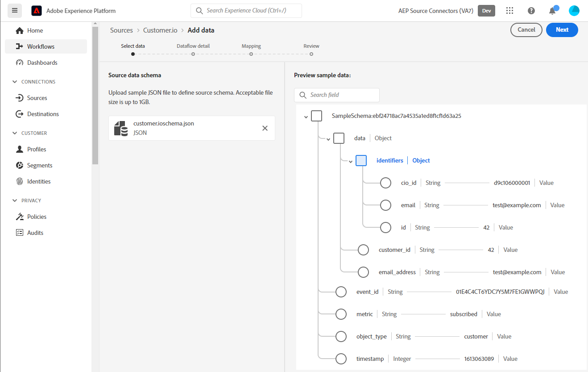

# (Beta) Create a [!DNL Customer.io] source connection in the UI

>[!NOTE]
>
>The [!DNL Customer.io] source is in beta. See the [sources overview](../../../../home.md#terms-and-conditions) for more information on using beta-labelled sources.

This tutorial provides steps for creating a [!DNL Customer.io] source connection using the Adobe Experience Platform user interface.

## Getting started {#getting-started}

This tutorial requires a working understanding of the following components of Experience Platform:

* [[!DNL Experience Data Model (XDM)] System](../../../../../xdm/home.md): The standardized framework by which [!DNL Experience Platform] organizes customer experience data.
  * [Basics of schema composition](../../../../../xdm/schema/composition.md): Learn about the basic building blocks of XDM schemas, including key principles and best practices in schema composition.
  * [Schema Editor tutorial](../../../../../xdm/tutorials/create-schema-ui.md): Learn how to create custom schemas using the Schema Editor UI.
* [[!DNL Real-Time Customer Profile]](../../../../../profile/home.md): Provides a unified, real-time consumer profile based on aggregated data from multiple sources.

## Prerequisite - Sample JSON to define source schema for [!DNL Customer.io] {#prerequisites-json-schema}

Before creating a [!DNL Customer.io] source connection, you will require a source schema to be provided. You can use the below JSON.

```
{
  "event_id": "01E4C4CT6YDC7Y5M7FE1GWWPQJ",
  "object_type": "customer",
  "metric": "subscribed",
  "timestamp": 1613063089,
  "data": {
    "customer_id": "42",
    "email_address": "test@example.com",
    "identifiers": {
      "id": "42",
      "email": "test@example.com",
      "cio_id": "d9c106000001"
    }
  }
}
```

### Create a Platform schema for [!DNL Customer.io]

Before creating a [!DNL Customer.io] source connection, you must also ensure that you first create a Platform schema to use for your source. See the tutorial on [creating a Platform schema](../../../../../xdm/schema/composition.md) for comprehensive steps on how to create a schema.


## Install source connection {#install-source-connection}

In the Platform UI, select **[!UICONTROL Sources]** from the left navigation bar to access the [!UICONTROL Sources] workspace. The [!UICONTROL Catalog] screen displays a variety of sources with which you can create an account.

You can select the appropriate category from the catalog on the left-hand side of your screen. Alternatively, you can find the specific source you wish to work with using the search option.

Under the *Marketing automation* category, select **[!UICONTROL Customer.io]**, and then select **[!UICONTROL Add data]**.


## Upload sample JSON file to define source schema {#sample-upload-json-schema}

Select [!UICONTROL Upload Files] to input your sample JSON schema, alternatively you can drag and drop the JSON file. Refer to the [prerequisites](#prerequisites-json-schema) section if you need an example JSON schema.



### Mappings

All the mappings listed below are mandatory and should be setup before proceeding to the [!UICONTROL Review] stage.

| Source Field | Description |
| --- | --- |
| `object_type` | Object Type, refer to the [!DNL Customer.io] [events](https://customer.io/docs/webhooks/#events) documentation for the supported types. |
| `id` | Object Id. |
| `email` | Email address associated with the object. |
| `event_id` | Unique identifier of the event. |
| `cio_id` | [!DNL Customer.io] identifier for the event.|
| `metric` | Event Type, refer to the [!DNL Customer.io] [events](https://customer.io/docs/webhooks/#events) documentation for the supported types. |
| `timestamp` | Timestamp when the event occurred. |

>[!NOTE]
>
> Do not map `cio_id` when executing [!DNL Customer.io] webhook in the `test mode` as there will be no associated field sent from [!DNL Customer.io].

## Configure dataflow {#configure-dataflow}

Proceed to the tutorial on [configuring a dataflow](../../dataflow/crm.md) and complete the workflow.

## Set up [!DNL Customer.io] webhook {#set-up-webhook}

Navigate to the API Usage section of the existing / new dataflow used for setting up the [!DNL Customer.io] source.

Next, you will require to construct a URL using the API details generated within Platform which will be used to configure the webhook on [!DNL Customer.io].


Note down the values of the fields below: 
* [!UICONTROL Dataflow ID]
* [!UICONTROL Streaming endpoint]

Construct a URL using these values exactly following the pattern below:
```{STREAMING_ENDPOINT}?x-adobe-flow-id={DATAFLOW_ID}```

Example of a constructed webhook URL: ``https://dcs.adobedc.net/collection/febc116d22ba0ea2868e9c93b199375302afb8a589617700991bb8f3f0341ad7?x-adobe-flow-id=439b3fc4-3042-4a3a-b5e0-a494898d3fb0``

Next, login to your account on [[!DNL Customer.io]](https://customer.io/) and create a reporting webhook by following this [tutorial](https://customer.io/docs/webhooks/#setup).

Use the URL that was constructed in the [!UICONTROL WEBHOOK ENDPOINT] field.
![[DNL Customer.io] UI screenshot showing the webhook endpoint field](../../images/tutorials/create/customerio-webhook/webhook.png)

Refer to the [!DNL Customer.io] [events](https://customer.io/docs/webhooks/#events) documentation section to understand in detail on the various events that can be selected, each events' message will be ingested into Platform when any [!DNL Customer.io] action event trigger criteria are satisfied.

## Additional resources

The sections below provide additional resources that you can refer to when using the [DNL Customer.io] source.

### Guardrails {#guardrails}

Refer to the [DNL Customer.io] [Timeouts and failures](https://customer.io/docs/webhooks/#timeouts-and-failures) page.

### Validation {#validation}

To validate that you have correctly set up the source and [!DNL Customer.io] messages are being ingested, follow the steps below:

* You can check the [!DNL Customer.io] **[!UICONTROL Activity Logs]** page to identify the events being captured by [!DNL Customer.io].


* In the Platform UI, select **[!UICONTROL View Dataflows]** beside the [!DNL Customer.io] card menu on the sources catalog. Next, select **[!UICONTROL Preview dataset]** to verify the data that was ingested for the events that you have selected within [!DNL Customer.io].

