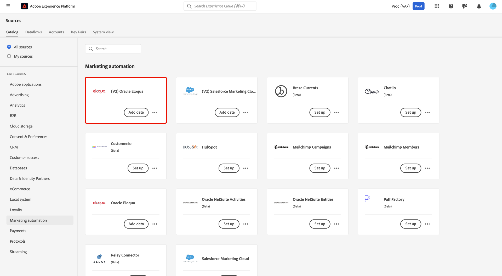
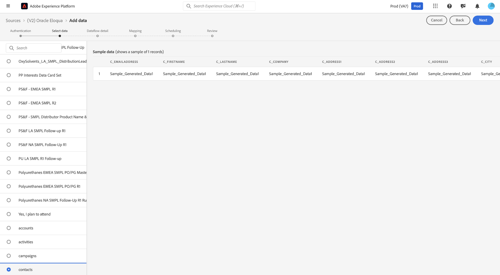
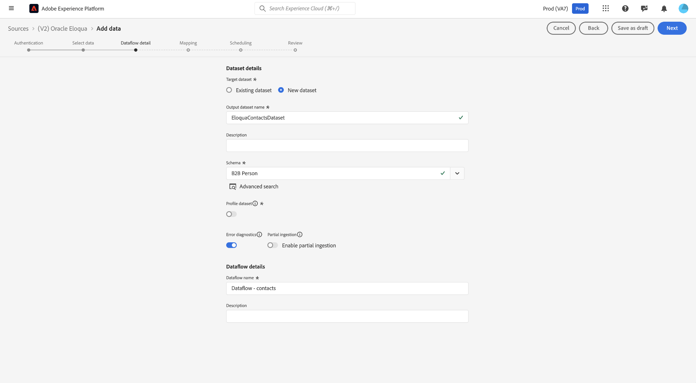
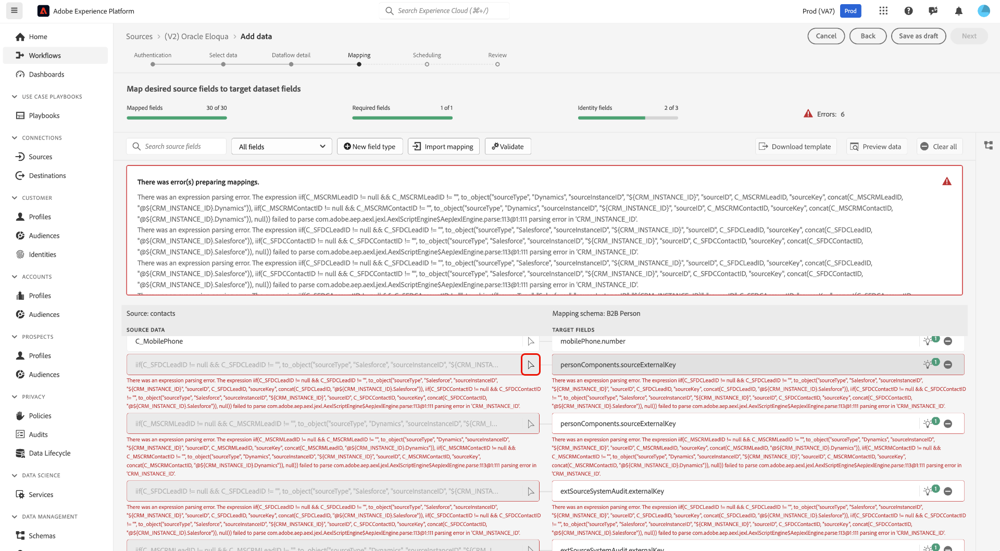
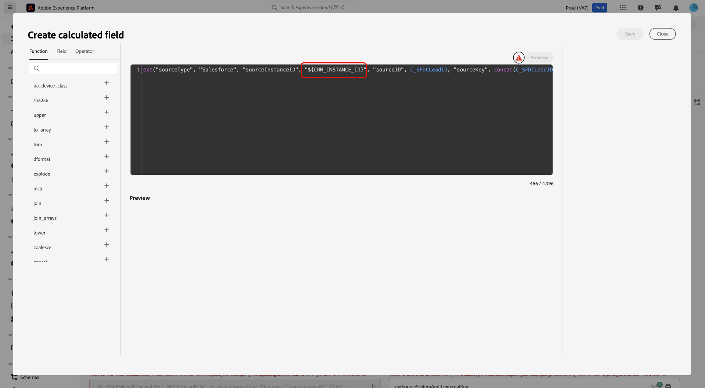
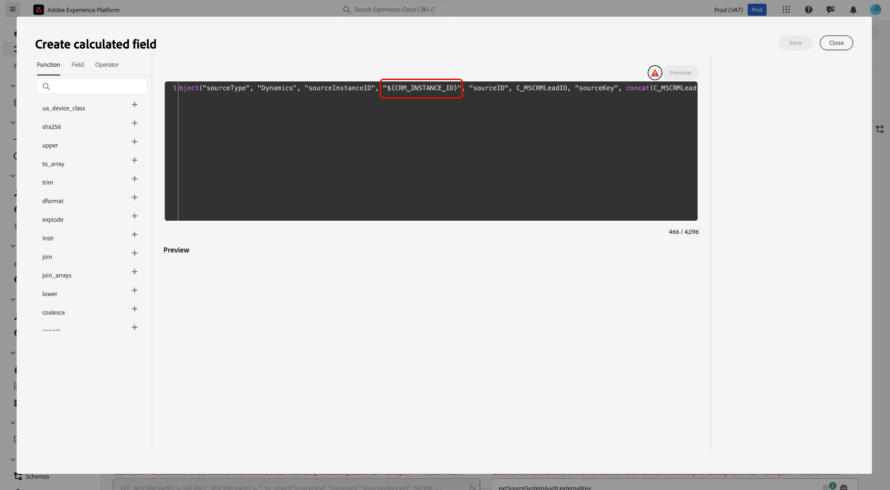
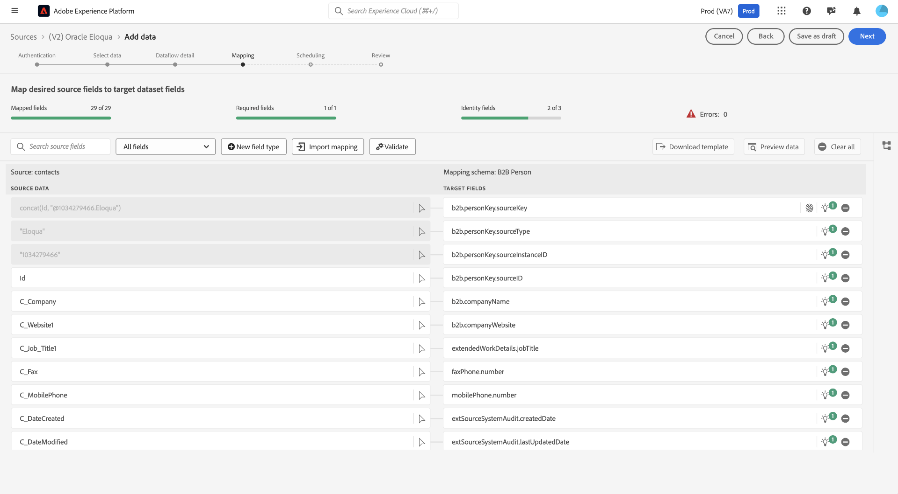
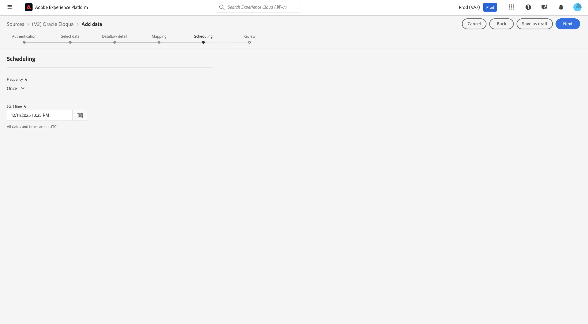
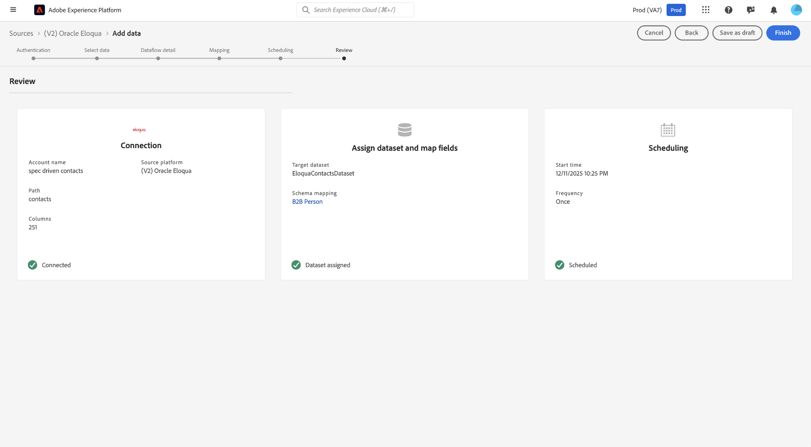

# Connect [!DNL Oracle Eloqua] (V2) to Experience Platform in the UI

The [!DNL Oracle Eloqua (V2)] source connector empowers you to connect your Oracle Eloqua account with Adobe Experience Platform, enabling automated and scalable ingestion of key B2B marketing data, including contacts, accounts, campaigns, and engagement activities.

Use this source connector to configure secure authentication, select the exact Eloqua data entities you need, and map them to standardized Experience Data Model (XDM) schemas. Flexible scheduling options allow you to set up both initial data loads and recurring, incremental syncs, ensuring your marketing data remains current and actionable.

Built on Adobe's enterprise ingestion framework, the [!DNL Oracle Eloqua (V2)] source connector provides a reliable, extensible foundation for campaign optimization, performance measurement, and cross-channel personalization.

Read this guide to learn how to connect your [!DNL Oracle Eloqua] account to Adobe Experience Platform using the sources workspace in the Experience Platform user interface.

## Get started

This tutorial requires a working understanding of the following components of Experience Platform:

* [[!DNL Experience Data Model (XDM)] System](../../../../../xdm/home.md): The standardized framework by which Experience Platform organizes customer experience data.
  * [Basics of schema composition](../../../../../xdm/schema/composition.md): Learn about the basic building blocks of XDM schemas, including key principles and best practices in schema composition.
  * [Schema Editor tutorial](../../../../../xdm/tutorials/create-schema-ui.md): Learn how to create custom schemas using the Schema Editor UI.
* [[!DNL Real-Time Customer Profile]](../../../../../profile/home.md): Provides a unified, real-time consumer profile based on aggregated data from multiple sources.

### Gather required credentials {#credentials}

Read the [[!DNL Eloqua] overview](../../../../connectors/marketing-automation/eloqua.md) for information on authentication.

## Navigate the sources catalog {#catalog}

In the Experience Platform UI, select **[!UICONTROL Sources]** from the left navigation to access the *[!UICONTROL Sources]* workspace. Choose a category or use the search bar to find your source.

To connect to [!DNL Eloqua], go to the *[!UICONTROL Marketing Automation]* category, select the **[!UICONTROL (V2) Oracle Eloqua]** source card, and then select **[!UICONTROL Set up]**.

>[!TIP]
>
>Sources in the sources catalog display the **[!UICONTROL Set up]** option when a given source does not yet have an authenticated account. Once an authenticated account is created, this option changes to **[!UICONTROL Add data]**.

## Use an existing account {#existing}

To use an existing account, select **[!UICONTROL Existing account]** and then select the [!DNL Eloqua] account that you want to use.

## Create a new account {#new}

To create a new account, select **[!UICONTROL New account]** and provide a name and description under your [!UICONTROL Source connection details]. Next, under [!UICONTROL Account authentication], provide values for your **Client ID**, **Client secret**, **Username**, **Password**, and **Base endpoint**. You can read the [authentication guide](../../../../connectors/marketing-automation/eloqua.md) for more information on these credentials. When finished, select **[!UICONTROL Connect to source]** and allow for a few seconds for your connection to establish.

## Select data

Use the select data interface to select the [!DNL Eloqua] entity that you want to ingest to Experience Platform.

>[!TIP]
>
>When selecting data, you will notice that, except for campaigns, the other entities display representative sample data. This approach ensures you can preview available fields and structure, as [!DNL Eloqua] public APIs currently retrieve real data for campaigns only. For the remaining entities, sample data is provided to support your configuration workflow.

## Dataset and dataflow details {#details}

Next, you must provide information on your dataset and dataflow. During this step, you can either use an existing dataset or create a new dataset. Additionally, you can optionally enable your dataset for ingestion to Real-Time Customer Profile during this step.

## Mapping {#mapping}

Mappings for [!DNL Eloqua] are organized into four main entity types:

* **Accounts** - Company/organization records from [!DNL Eloqua].
* **Activities** - Marketing activity and engagement events from [!DNL Eloqua].
* **Campaigns** - Marketing campaign records from [!DNL Eloqua].
* **Contacts** - Individual person records from [!DNL Eloqua].

If you require access to extra fields beyond those provided by default, you can add these fields using Data Prep mapping process in Experience Platform. If the default (standard) schema does not support some of your required fields, you have the option to define a custom schema in Experience Platform. Use this feature to create and map the necessary fields so you can seamlessly ingest all relevant data from [!DNL Eloqua] into Experience Platform.

Summary of next steps:

* Review the default mapped fields available with the integration.
* During the mapping step, include any additional fields needed from [!DNL Eloqua].
* If new fields are not present in the standard schema, extend or create a custom schema in  Experience Platform that includes these fields.
* Complete the mapping to ensure all desired data is ingested.

To ensure your external CRM information is accurately reflected, simply use the calculated field function in Data Prep to update the `{CRM_INSTANCE_ID}` placeholder with your specific CRM instance ID in the source data field. This gives you the flexibility to tailor the integration to your organization's unique setup.

To use the calculated field editor, select the source field that you want to update.

>[!BEGINTABS]

>[!TAB Salesforce]

For [!DNL Salesforce] users, use the calculated field editor and update the `{CRM_INSTANCE_ID}` with the appropriate instance ID.

>[!TAB Microsoft Dynamics]

For [!DNL Microsoft] users, use the calculated field editor and update the `{CRM_INSTANCE_ID}` with the appropriate instance ID.

>[!ENDTABS]

Once you finish updating your calculated fields, select **[!UICONTROL Next]** to continue.

## Scheduling

>[!NOTE]
>
>The following are the delta fields used internally for incremental data loading:
>
>* **Contacts:** `C_DateModified`
>* **Accounts:** `M_DateModified`
>* **Activity:** `CreatedAt`
>* **Custom Objects:** `UpdatedAt`
>* **Campaign:** `updatedAt`

With your mapping complete, you can now configure an ingestion schedule for your dataflow. Set your [!UICONTROL Frequency] to `Once` to configure a one-time ingestion run. For incremental ingestion, you can set your [!UICONTROL Frequency] to `Hour`, `Day`, or `Week`. When using incremental ingestion, you must also configure the [!UICONTROL Interval] to define the amount of time that occurs between ingestion runs. For example, an ingestion frequency set to `Day` and  an interval set to `15` means that your dataflow is scheduled to ingest data every 15 days.

Per-minute ingestion frequency is not available for the [!DNL Eloqua] source. The most frequent schedule you can choose is hourly. Select a schedule that matches your data freshness needs. Keep in mind that selecting a more frequent schedule will increase compute costs.

## Review

With the ingestion schedule configured, use the [!UICONTROL Review] interface to confirm the details of your dataflow. Select **[!UICONTROL Finish]** to complete the setup and allow for a few moments for your dataflow to initiate.

## Monitor

Once the dataflow is selected it will do a one-time backfill of data and subsequent incremental sync on the schedule specified. The status of sync can be monitored by navigating to the dataflow. For more information, read the guide on [monitoring sources dataflows in the UI](../../../../../dataflows/ui/monitor-sources.md).

## Next steps

You've now completed the setup and configuration of your [!DNL Eloqua] source in Experience Platform. With your dataflow established, your [!DNL Eloqua] data will be ingested according to your chosen schedule and mapped to standard Experience Data Model (XDM) schemas. Continue monitoring your dataflows and explore your ingested data within Platform to drive insights and activate your marketing use cases. For more advanced configurations and troubleshooting, consult the related documentation or reach out to Adobe support resources.

For additional information, read the following documentation:

* [Sources overview](../../../../home.md)
* [Real-Time CDP B2B Edition](../../../../../rtcdp/b2b-overview.md)
