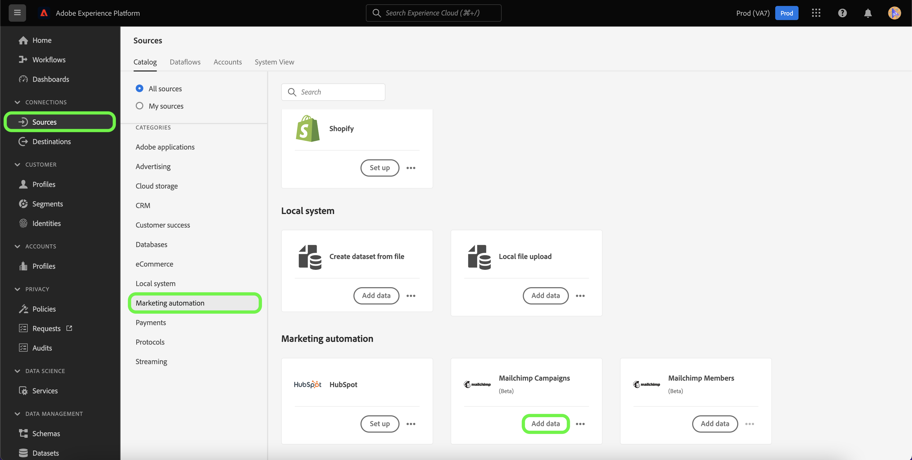
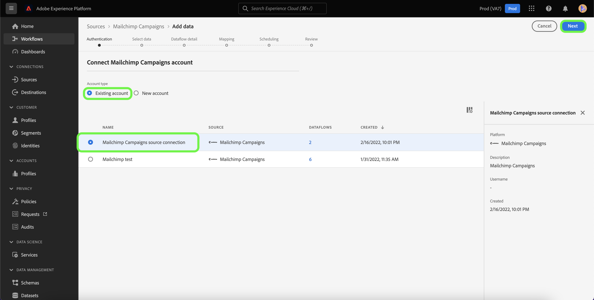
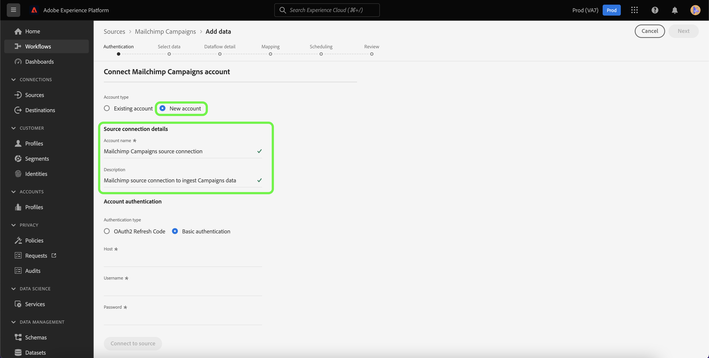
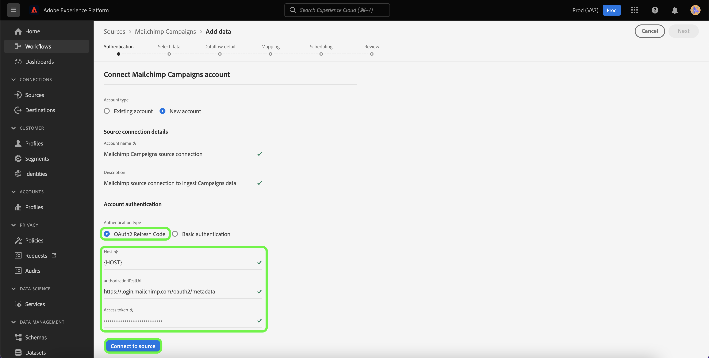
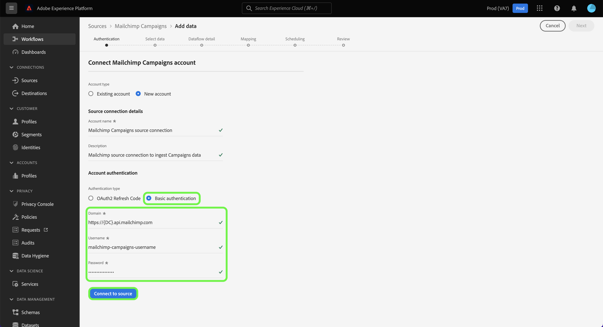
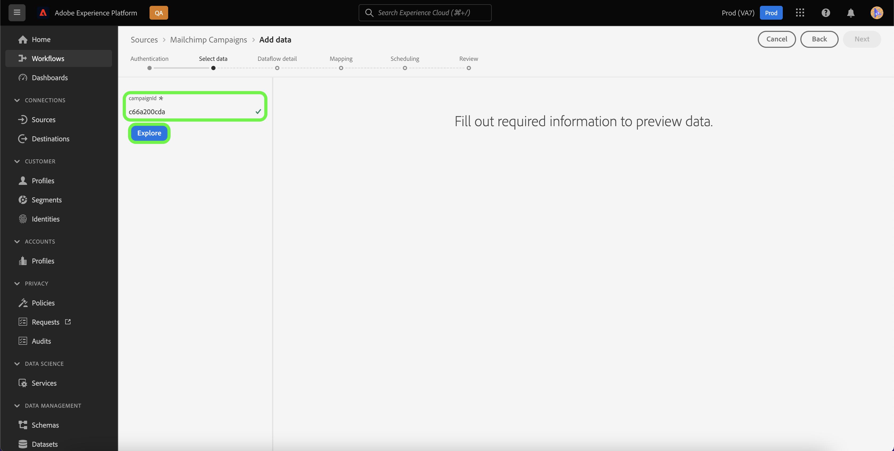
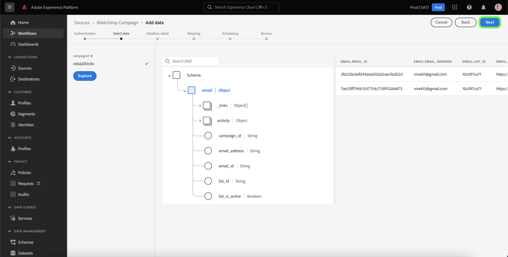

# Create a [!DNL Mailchimp Campaigns] source connection using Platform UI

This tutorial provides steps for creating a [!DNL Mailchimp] source connector to ingest [!DNL Mailchimp Campaigns] data to Adobe Experience Platform using the user interface.

## Getting started

This guide requires a working understanding of the following components of Adobe Experience Platform:

* [Sources](../../../../home.md): Platform allows data to be ingested from various sources while providing you with the ability to structure, label, and enhance incoming data using [!DNL Platform] services.
* [Sandboxes](../../../../../sandboxes/home.md): Platform provides virtual sandboxes which partition a single Platform instance into separate virtual environments to help develop and evolve digital experience applications.

## Gather required credentials

In order to bring your [!DNL Mailchimp Campaigns] data to Platform, you must first provide the appropriate authentication credentials that correspond with your [!DNL Mailchimp] account.

The [!DNL Mailchimp Campaigns] source supports both OAuth 2 Refresh Code and basic authentication, see the tables below for more information on these authentication types.

### OAuth 2 Refresh Code

| Credentials | Description |
| --- | --- |
| Domain | The root URL used to connect to MailChimp API. The format for the root URL is `https://{DC}.api.mailchimp.com`, where `{DC}` represents the data center that corresponds to your account. |
| Authorization test URL | The authorization test URL is used to validate credentials when connecting [!DNL Mailchimp] to Platform. If this is not provided, credentials are automatically checked during the source connection creation step instead. |
| Access Token | The corresponding access token used to authenticate your source. This is required for OAuth-based authentication. |

For more information on using OAuth 2 to authenticate your [!DNL Mailchimp] account to Platform, see this [[!DNL Mailchimp] document on using OAuth 2](https://mailchimp.com/developer/marketing/guides/access-user-data-oauth-2/).

### Basic authentication

| Credentials | Description |
| --- | --- |
| Domain | The root URL used to connect to MailChimp API. The format for the root URL is `https://{DC}.api.mailchimp.com`, where `{DC}` represents the data center that corresponds to your account. |
| Username | The username that corresponds with your MailChimp account. This is required for basic authentication. |
| Password | The password that corresponds with your MailChimp account. This is required for basic authentication. |

## Connect your [!DNL Mailchimp Campaigns] account to Platform

In the Platform UI, select **[!UICONTROL Sources]** from the left navigation bar to access the [!UICONTROL Sources] workspace. The [!UICONTROL Catalog] screen displays a variety of sources with which you can create an account.

You can select the appropriate category from the catalog on the left-hand side of your screen. Alternatively, you can find the specific source you wish to work with using the search option.

Under the [!UICONTROL Marketing automation] category, select **[!UICONTROL Mailchimp Campaign]**, and then select **[!UICONTROL Add data]**.

The **[!UICONTROL Connect Mailchimp Campaigns account]** page appears. On this page, you can select whether you are accessing an existing account, or opting to create a new account.

### Existing account

To use an existing account, select the [!DNL Mailchimp Campaigns] account you want to create a new dataflow with, then select **[!UICONTROL Next]** to proceed.

### New account

If you are creating a new account, select **[!UICONTROL New account]**, and then provide a name and a description for your [!DNL Mailchimp Campaigns] source connection details.

#### Authenticate using OAuth 2

To use OAuth 2, select [!UICONTROL OAuth 2 Refresh Code], provide values for your domain, authorization test URL, and access token and then select **[!UICONTROL Connect to source]**. Allow for a few moments for your credentials to validate, and then select **[!UICONTROL Next]** to proceed.

#### Authenticate using basic authentication

To use basic authentication, select [!UICONTROL Basic authentication], provide values for your domain, username, and password, and then select **[!UICONTROL Connect to source]**. Allow for a few moments for your credentials to validate, and then select **[!UICONTROL Next]** to proceed.

### Select [!DNL Mailchimp Campaigns] data

Once your source is authenticated, you must then provide the `campaignId` that corresponds with your [!DNL Mailchimp Campaigns] account.

On the [!UICONTROL Select data] page, enter your `campaignId` and then select **[!UICONTROL Explore]**.

The page updates into an interactive schema tree that allows you to explore and inspect the hierarchy of your data. Select **[!UICONTROL Next]** to proceed.

## Next steps

With your [!DNL Mailchimp] account authenticated and your [!DNL Mailchimp Campaigns] data selected, you can now start creating a dataflow to bring your data to Platform. For detailed steps on how to create a dataflow, see the documentation on [creating a dataflow to bring marketing automation data to Platform](../../dataflow/marketing-automation.md).
