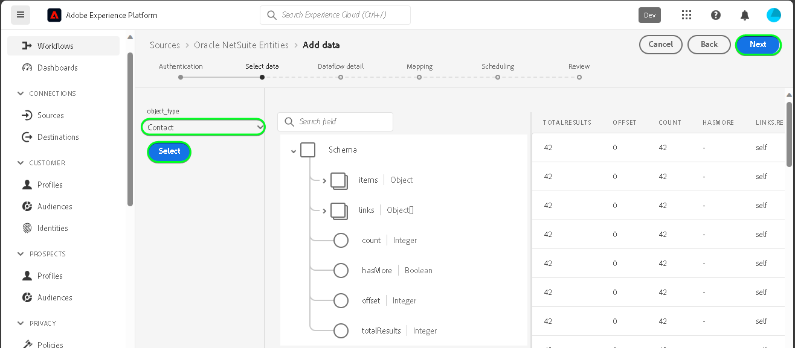

# Create a [!DNL Oracle NetSuite Entities] source connection in the UI

>[!NOTE]
>
>The [!DNL Oracle NetSuite Entities] source is in beta. See the [sources overview](../../../../home.md#terms-and-conditions) for more information on using beta-labeled sources.

Read the following tutorial to learn how to bring contacts and customers data from your [!DNL Oracle NetSuite Entities] account to Adobe Experience Platform in the UI.

## Getting started {#getting-started}

This tutorial requires a working understanding of the following components of Experience Platform:

* [[!DNL Experience Data Model (XDM)] System](../../../../../xdm/home.md): The standardized framework by which [!DNL Experience Platform] organizes customer experience data.
  * [Basics of schema composition](../../../../../xdm/schema/composition.md): Learn about the basic building blocks of XDM schemas, including key principles and best practices in schema composition.
  * [Schema Editor tutorial](../../../../../xdm/tutorials/create-schema-ui.md): Learn how to create custom schemas using the Schema Editor UI.
* [[!DNL Real-Time Customer Profile]](../../../../../profile/home.md): Provides a unified, real-time consumer profile based on aggregated data from multiple sources.

If you already have a valid [!DNL Oracle NetSuite] account, you may skip the remainder of this document and proceed to the tutorial on [configuring a dataflow](../../dataflow/marketing-automation.md).

>[!TIP]
>
>Read the [[!DNL Oracle NetSuite] overview](../../../../connectors/marketing-automation/oracle-netsuite.md) for information on how to retrieve your authentication credentials.

## Connect your [!DNL Oracle NetSuite Activities] account {#connect-account}

In the Platform UI, select **[!UICONTROL Sources]** from the left navigation to access the [!UICONTROL Sources] workspace. You can select the appropriate category from the catalog on the left-hand side of your screen. Alternatively, you can find the specific source you wish to work with using the search option.

Under the *Marketing Automation* category, select **[!DNL Oracle NetSuite Entities]**, and then select **[!UICONTROL Add data]**.

The **[!UICONTROL Connect Oracle NetSuite Entities account]** page appears. On this page, you can either use new credentials or existing credentials.

>[!IMPORTANT]
>
>The refresh token expires after seven days. Once your token expire, you must create account on Experience Platform with your updated token. If you do not create a new account with your updated token, you may see the following error message: `The request could not be processed. Error from flow provider: The request could not be processed. Rest call failed with client error, status code 401 Unauthorized, please check your activity settings.`

### Existing account {#existing-account}

To use an existing account, select the [!DNL Oracle NetSuite Entities] account you want to create a new dataflow with, then select **[!UICONTROL Next]** to proceed.

### New account {#new-account}

If you are creating a new account, select **[!UICONTROL New account]**, and then provide a name, an optional description, and your credentials. When finished, select **[!UICONTROL Connect to source]** and then allow some time for the new connection to establish.

### Select data

Next, select the object type that you want to ingest to Experience Platform.

| Entity type | Description |
| --- | --- |
| Contact | Retrieve contact names, emails, phone numbers, and any custom contact-related fields associated with customers. |
| Customer | Retrieve specific customer data, including details such as customer names, addresses, and key identifiers. |

>[!BEGINTABS]

>[!TAB Contact]

>[!TAB Customer]

>[!ENDTABS]

## Next steps {#next-steps}

By following this tutorial, you have established a connection to your [!DNL Oracle NetSuite Entities] account. You can now continue on to the next tutorial and [configure a dataflow to bring marketing automation data into Platform](../../dataflow/marketing-automation.md).

## Additional resources {#additional-resources}

The sections below provide additional resources that you can refer to when using the [!DNL Oracle NetSuite Entities] source.

### Mapping {#mapping}

Platform provides intelligent recommendations for auto-mapped fields based on the target schema or dataset that you selected. You can manually adjust mapping rules to suit your use cases. Based on your needs, you can choose to map fields directly, or use data prep functions to transform source data to derive computed or calculated values. For comprehensive steps on using the mapper interface and calculated fields, see the [Data Prep UI guide](../../../../../data-prep/ui/mapping.md).

>[!NOTE]
>
>The fields displayed are dependent on the subscriptions that your [!DNL Oracle NetSuite] account has access to. For example, if you do not have access to billing, then you will not see the billing related fields.

### Scheduling {#scheduling}

When scheduling your [!DNL Oracle NetSuite Entities] dataflow for ingestion, you must select the following frequency and interval configuration:

| Frequency | Interval |
| --- | --- |
| `Once` | 1 |

While retrieving data, the [!DNL Oracle NetSuite] responds with the last modified or created date as a date format instead of a timestamp. Hence, the scheduling is limited to one day.

Once your have provided the values for your schedule, select **[!UICONTROL Next]**.

