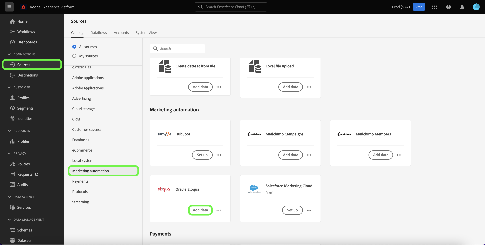
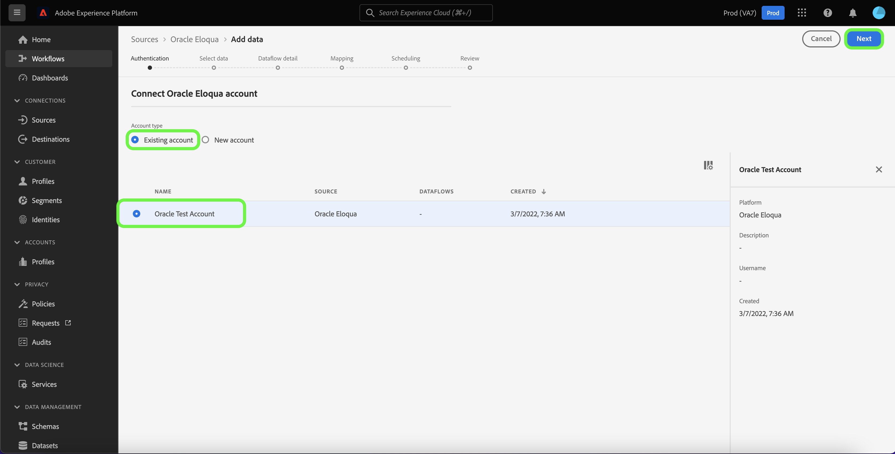
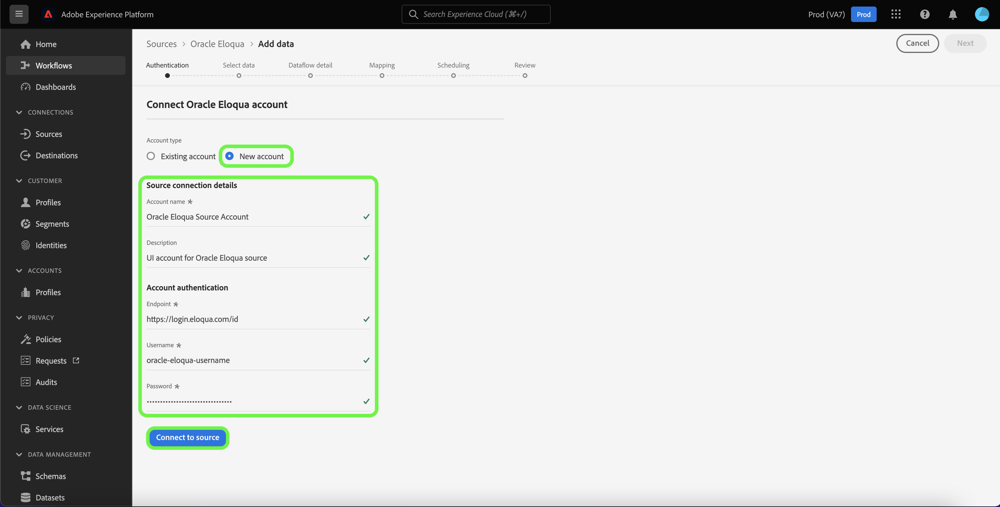

# Create an [!DNL Oracle Responsys] source connection using Platform UI

This tutorial provides steps to create an [[!DNL Oracle Responsys]](../../../../connectors/marketing-automation/oracle-responsys.md) source connection using the Adobe Experience Platform user interface.

## Getting started

This guide requires a working understanding of the following components of Platform:

* [Sources](../../../../home.md): Platform allows data to be ingested from various sources while providing you with the ability to structure, label, and enhance incoming data using Platform services.
* [Sandboxes](../../../../../sandboxes/home.md): Platform provides virtual sandboxes which partition a single Platform instance into separate virtual environments to help develop and evolve digital experience applications.

If you already have an authenticated [!DNL Oracle Responsys] account on Platform, then you may skip the remainder of this document and proceed to the tutorial on [creating a dataflow to bring marketing automation data to Platform](../../dataflow/marketing-automation.md).

### Gather required credentials

In order to connect [!DNL Oracle Responsys] to Platform, you must provide values for the following authentication properties:

| Credential | Description |
| --- | --- |
| Endpoint | The endpoint of your [!DNL Oracle Responsys]. |
| Client ID | |
| Client secret | |

For more information on authentication credentials for [!DNL Oracle Responsys], see the [[!DNL Oracle Responsys] guide on authentication](https://docs.oracle.com/en/cloud/saas/marketing/eloqua-rest-api/Authentication_Basic.html).

Once you have gathered your required credentials, you can follow the steps below to link your [!DNL Oracle Responsys] account to Platform.

## Connect your [!DNL Oracle Responsys] account

In the Platform UI, select **[!UICONTROL Sources]** from the left navigation to access the [!UICONTROL Sources] workspace. The [!UICONTROL Catalog] screen displays a variety of sources with which you can create an account.

You can select the appropriate category from the catalog on the left-hand side of your screen. Alternatively, you can find the specific source you wish to work with using the search option.

Under the [!UICONTROL Marketing automation] category, select **[!UICONTROL Oracle Responsys]**, and then select **[!UICONTROL Add data]**.

The **[!UICONTROL Connect Oracle Responsys account]** page appears. On this page, you can either use new credentials or existing credentials.

### Existing account

To use an existing account, select the [!DNL Oracle Responsys] account you want to create a new dataflow with, then select **[!UICONTROL Next]** to proceed.

### New account

If you are creating a new account, select **[!UICONTROL New account]**, and then provide a name, an optional description, and the appropriate values for your [!DNL Oracle Responsys] credentials. When finished, select **[!UICONTROL Connect to source]** and then allow some time for the new connection to establish.

## Next steps

By following this tutorial, you have authenticated and created a source connection between your [!DNL Oracle Responsys] account and Platform. You can now continue on to the next tutorial and [create a dataflow to bring marketing automation data to Platform](../../dataflow/marketing-automation.md).
