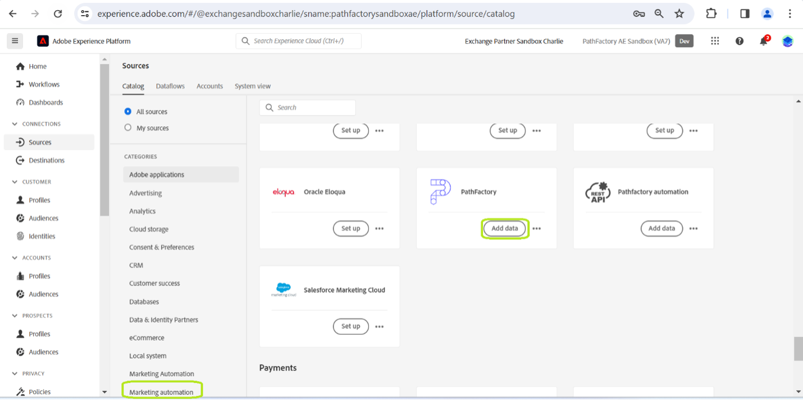
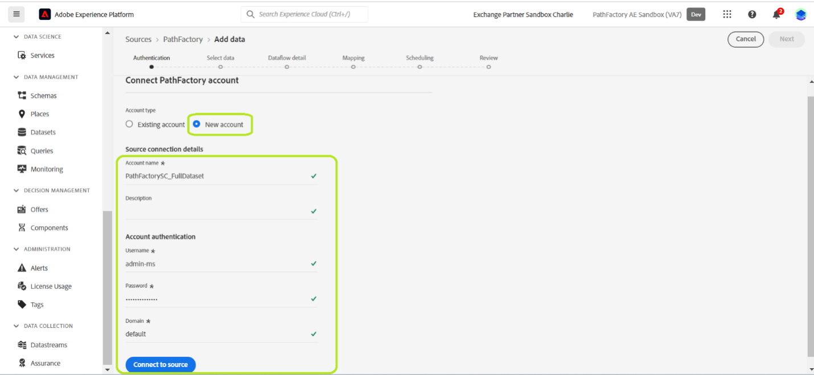
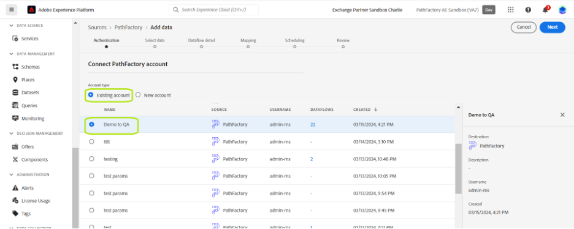

# Connect your [!DNL PathFactory] account to Experience Platform through the UI

This tutorial provides steps on how to connect your [!DNL PathFactory] Visitors, Sessions and Page Views data to Adobe Experience Platform through the UI.

## Getting started

This tutorial requires a working understanding of the following components of Experience Platform:

* [[!DNL Experience Data Model (XDM)] System](../../../../../xdm/home.md): The standardized framework by which [!DNL Experience Platform] organizes customer experience data.
  * [Basics of schema composition](../../../../../xdm/schema/composition.md): Learn about the basic building blocks of XDM schemas, including key principles and best practices in schema composition.
  * [Schema Editor tutorial](../../../../../xdm/tutorials/create-schema-ui.md): Learn how to create custom schemas using the Schema Editor UI.
* [[!DNL Real-Time Customer Profile]](../../../../../profile/home.md): Provides a unified, real-time consumer profile based on aggregated data from multiple sources.

If you already have a [!DNL PathFactory] account, you may skip the remainder of this document and proceed to the tutorial on [bringing marketing automation data to Experience Platform using the UI](../../dataflow/marketing-automation.md).

### Gather Required Credentials {#gather-credentials}

To access your PathFactory account on the Platform, you must provide the following values:

| Credential | Description |
| ---------- | ----------- |
| Username | Your PathFactory account username. This is essential for identifying your account in the system. |
| Password | The password associated with your PathFactory account. Ensure this is kept secure to prevent unauthorized access. |
| Domain | The domain associated with your PathFactory account. This typically refers to the unique identifier within your PathFactory URL. |
| Access Token | A unique token used for API authentication to ensure secure communication between your systems and PathFactory. |
| API Endpoints | Specific API endpoints for accessing data: Visitors, Sessions, and Page Views. Each endpoint corresponds to different data sets you can retrieve. **Note:** These are pre-defined by PathFactory and are specific to the data you intend to access:
  - **Visitors Endpoint**: `/api/public/v3/data_lake_apis/visitors.json`
  - **Sessions Endpoint**: `/api/public/v3/data_lake_apis/sessions.json`
  - **Page Views Endpoint**: `/api/public/v3/data_lake_apis/page_views.json`

For detailed guidance on how to secure and use your credentials, and for information about obtaining and refreshing your access token, visit the [PathFactory Support Center](https://support.pathfactory.com/categories/adobe/). This resource offers comprehensive guides on managing your credentials and ensuring effective and secure API integration.

## Connect your [!DNL PathFactory] account

In the Platform UI, select **[!UICONTROL Sources]** from the left navigation to access the [!UICONTROL Sources] workspace. The [!UICONTROL Catalog] displays a variety of sources supported by Experience Platform.

You can select the appropriate category from the list of categories. You can also use the search bar to filter for a specific source.

Under the [!UICONTROL Marketing automation] category, select **[!UICONTROL PathFactory]** and then select **[!UICONTROL Set up]**.

The **[!UICONTROL Connect to PathFactory]** page appears. On this page, you can either create a new account or use an existing account.

### New account

To create a new account, select **[!UICONTROL New account]** and provide a name for your account, an optional description, and the authentication credentials that correspond with your [!DNL PathFactory] account.

When finished, select **[!UICONTROL Connect to source]** and then allow some time for the new connection to establish.

### Existing account

If you already have an existing account, select **[!UICONTROL Existing account]** and then select the account that you would like to use from the list that appears.

## Next steps

By following this tutorial, you have established a connection between your [!DNL PathFactory] account and Experience Platform. You can now continue on to the next tutorial and [create a dataflow to bring your marketing automation data into Experience Platform](../../dataflow/marketing-automation.md).
