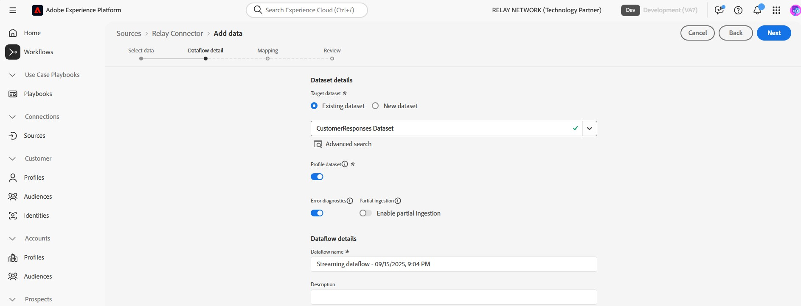
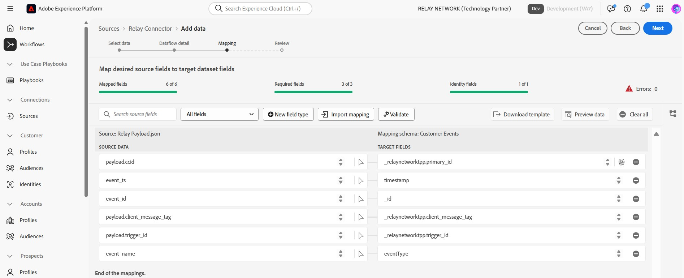
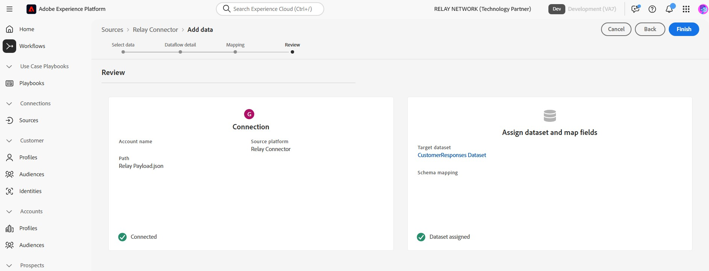

# Create a *Relay Connector* source connection in the UI

*Relay Connector helps companies create more educated, loyal, and profitable customers by delivering personalized experiences at the right points in your customers' journey.*

This tutorial provides steps for creating a *Relay Connector* source using the Platform user interface.

## Overview

*Relay Connector helps to create an inbound connection to stream Events from your Relay Network integration into Adobe Experience Platform.*

>[!IMPORTANT]
>
>This documentation page is created by the *Relay Network* team. For any inquiries or update requests, please contact them directly at *[Relay Network website](https://www.relaynetwork.com/) or [Relay email address](mailto:info@relaynetwork.com)*.

## Connect your *Relay Connector* source

In the Platform UI, select **[!UICONTROL Sources]** from the left navigation bar to access the [!UICONTROL Sources] workspace. The [!UICONTROL Catalog] screen displays a variety of sources with which you can create an account.

You can select the appropriate category from the catalog on the left-hand side of your screen. Alternatively, you can find the specific source you wish to work with using the search option.

Under the *Marketing automation* category, select *Relay Connector*, and then select **[!UICONTROL Add data]**.

The **[!UICONTROL Connect Relay Connector source]** page appears.

### Select data

Use the *Select data* interface to browse or specify the source data schema. Alternatively, you can upload a sample JSON file to define the source schema.

>[!NOTE] 
>
>Acceptable file size is up to 1GB.

After the data is uploaded, the sample is visible in the **Preview sample data** section.

### Dataflow details

Using the *Dataflow details* interface, provide a **name** and an **optional description** for your dataflow. Next, select the **target dataset** that you want to use. You can either create a new dataset or use an existing dataset.

### Mapping

You can map your source fields to XDM schema fields using auto-map functionality that matches fields based on their names, or create custom mappings for more precise control. If needed, you can also apply transformations such as concatenation, formatting, or renaming to ensure your data fits perfectly into the target schema.

Refer to the *Relay Network* [Push Events](https://docs.relaynetwork.com/docs/push-events) documentation to understand which events are available and the values that Relay will send to the Source to build your **Experience Events Schema**.

### Review

Finally, review all configurations including your **source, dataset, and mappings**. When finished, select **Finish** to create the dataflow.

### Properties

After creating the dataflow, the *streaming endpoint URL* and other related properties can be found on the right side of the page within the **Properties** section.

These values should be used to configure the webhook within **Relay console**. Please refer to the Relay's [Configuring the Push API](https://docs.relaynetwork.com/docs/configuring-the-push-api) documentation on how to configure the push.

## Additional resources

* [Create a new connection specification using the Flow Service API](https://experienceleague.adobe.com/en/docs/experience-platform/sources/sdk/streaming-sdk/create)
* [Connect to your source using the UI](https://experienceleague.adobe.com/en/docs/experience-platform/sources/sdk/streaming-sdk/submit#test-your-source-using-the-ui)
