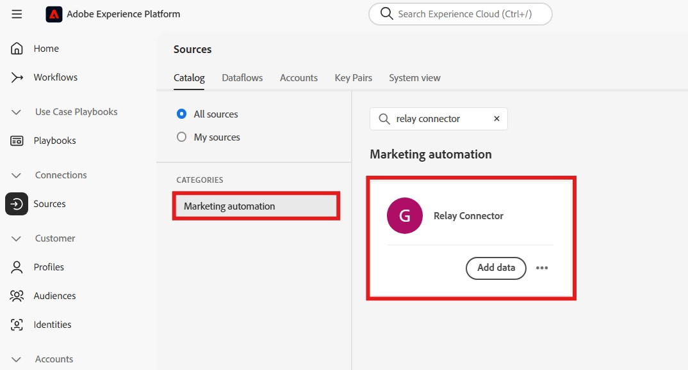
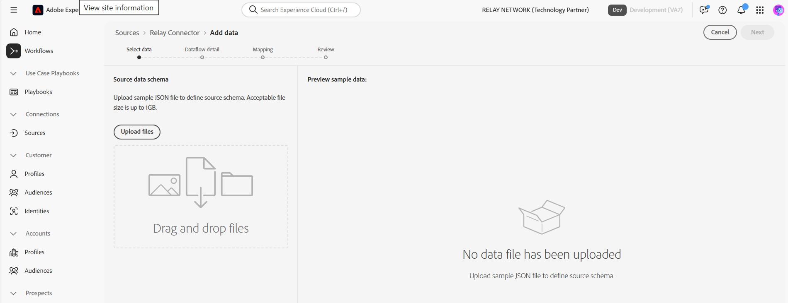
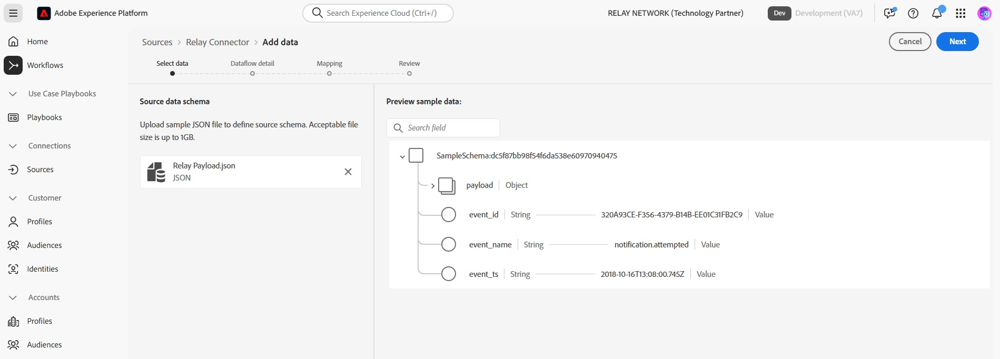

# Connect Relay to Experience Platform in the UI

>[!NOTE]
>
>The [!DNL Relay Connector] source is in beta. Please read the [sources overview](../../../../home.md#terms-and-conditions) for more information on using beta-labeled sources.

With [!DNL Relay Connector], you can deliver personalized experiences to your customers at the most meaningful moments in their journey, helping you build stronger relationships and drive greater loyalty and value by creating an inbound connection to stream Events from your [!DNL Relay Network] integration into Adobe Experience Platform.

Read this guide to learn how to use the [!DNL Relay Connector] within the sources workspace of the Experience Platform UI.

>[!IMPORTANT]
>
>This documentation page is created by the *[!DNL Relay Network]* team. For any inquiries or update requests, please contact them directly at *[[!DNL Relay Network]](https://www.relaynetwork.com/) or send an email to [info@relaynetwork.com](mailto:info@relaynetwork.com)*.

## Connect your [!DNL Relay Connector] source

In the Experience Platform UI, select **[!UICONTROL Sources]** from the left navigation bar to access the [!UICONTROL Sources] workspace. The [!UICONTROL Catalog] screen displays a variety of sources with which you can create an account. You can select the appropriate category from the catalog on the left-hand side of your screen. Alternatively, you can find the specific source you wish to work with using the search option.

Under the *[!UICONTROL Marketing automation]* category, select the [!DNL Relay Connector] source card and select **[!UICONTROL Add data]**.

>[!TIP]
>
>Sources in the sources catalog display the **[!UICONTROL Set up]** option when a given source does not yet have an authenticated account. Once an authenticated account exists, this option changes to **[!UICONTROL Add data]**.

### Select data

The **[!UICONTROL Connect Relay Connector source]** interface appears. Use the *[!UICONTROL Select data]* interface to browse or specify the source data schema. Alternatively, you can upload a sample JSON file to define the source schema.

>[!NOTE] 
>
>Acceptable file size is up to 1GB.

After the data is uploaded, you can use the [!UICONTROL Preview sample data] section to preview the data.

### Dataflow details

Next, use the *[!UICONTROL Dataflow details]* interface to provide a **name** and an **optional description** for your dataflow. Additionally, select the **[!UICONTROL Target dataset]** that you want to use. You can either create a new dataset or use an existing dataset.

### Mapping

You can map your source fields to XDM schema fields using auto-map functionality that matches fields based on their names, or create custom mappings for more precise control. If needed, you can also apply transformations such as concatenation, formatting, or renaming to ensure your data fits perfectly into the target schema. For more information on mapping, read the [Data Prep UI guide](../../../../../data-prep/ui/mapping.md).

>[!TIP]
>
>For details on the types of events and data values that Relay will send to your source, read the [[!DNL Relay Network] Push Events](https://docs.relaynetwork.com/docs/push-events) documentation. This information will help you design your **Experience Events Schema** appropriately.

### Review

Finally, review all configurations including your **source, dataset, and mappings**. When finished, select **Finish** to create the dataflow.

### Retrieve your streaming endpoint URL

Once you have created the dataflow, you will find the *streaming endpoint URL* and other related details in the **Properties** section on the right side of the dataflow page.

Use these values to set up the webhook in the **Relay console**. For detailed instructions on configuring the push, see the Relay documentation: [Configuring the Push API](https://docs.relaynetwork.com/docs/configuring-the-push-api).

## Additional resources

* [Create a new connection specification using the Flow Service API](https://experienceleague.adobe.com/en/docs/experience-platform/sources/sdk/streaming-sdk/create)
* [Connect to your source using the UI](https://experienceleague.adobe.com/en/docs/experience-platform/sources/sdk/streaming-sdk/submit#test-your-source-using-the-ui)
