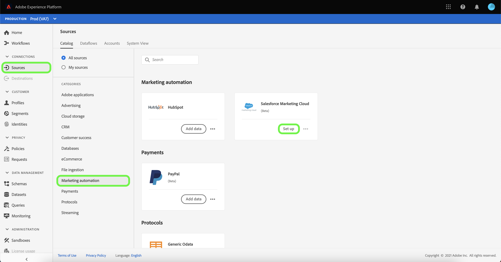
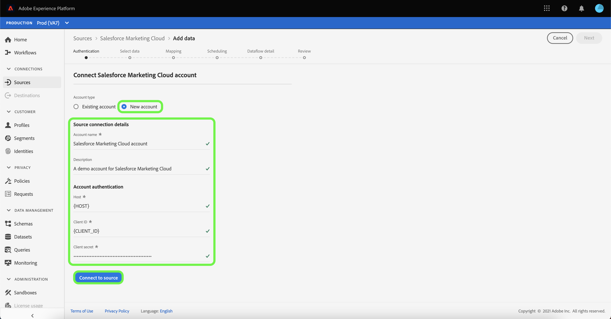
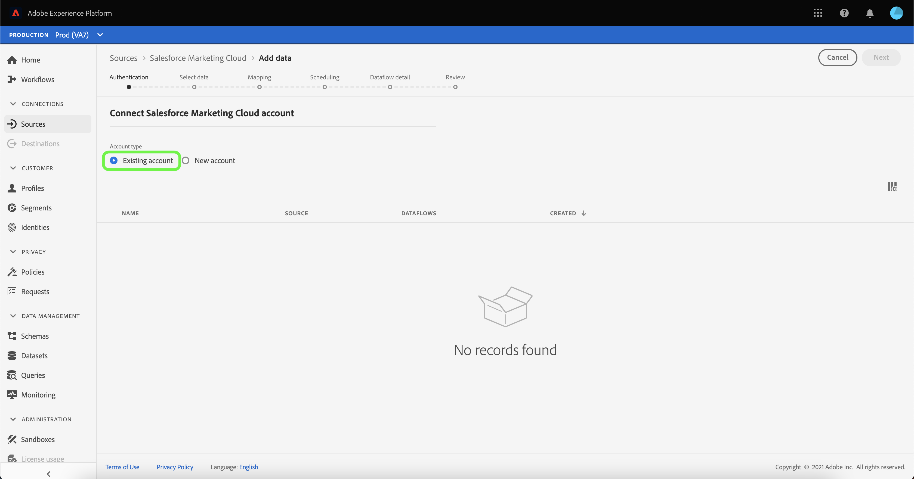

# Connect your [!DNL Salesforce Marketing Cloud] account to Experience Platform through the UI

>[!IMPORTANT]
>
>Custom object ingestion is currently not supported by the [!DNL Salesforce Marketing Cloud] source integration.

This tutorial provides steps on how to connect your [!DNL Salesforce Marketing Cloud] account to Adobe Experience Platform through the UI.

## Getting started

This tutorial requires a working understanding of the following components of Experience Platform:

* [[!DNL Experience Data Model (XDM)] System](../../../../../xdm/home.md): The standardized framework by which [!DNL Experience Platform] organizes customer experience data.
  * [Basics of schema composition](../../../../../xdm/schema/composition.md): Learn about the basic building blocks of XDM schemas, including key principles and best practices in schema composition.
  * [Schema Editor tutorial](../../../../../xdm/tutorials/create-schema-ui.md): Learn how to create custom schemas using the Schema Editor UI.
* [[!DNL Real-Time Customer Profile]](../../../../../profile/home.md): Provides a unified, real-time consumer profile based on aggregated data from multiple sources.

If you already have a [!DNL Salesforce Marketing Cloud] account, you may skip the remainder of this document and proceed to the tutorial on [bringing marketing automation data to Experience Platform using the UI](../../dataflow/marketing-automation.md).

### Gather required credentials

In order to access your [!DNL Salesforce Marketing Cloud] account on Platform, you must provide the following values:

| Credential | Description |
| ---------- | ----------- |
| Host | The host server of your application. This is often your subdomain. **Note:** When entering your `host` value, you only need to specify the subdomain and not the entire URL. For example, if your host URL is `https://abcd-ab12c3d4e5fg6hijk7lmnop8qrst.auth.marketingcloudapis.com/`, then you only need to enter `abcd-ab12c3d4e5fg6hijk7lmnop8qrst` as your host value. |
| Client ID | The client ID associated with your [!DNL Salesforce Marketing Cloud] application. |
| Client secret | The client secret associated with your [!DNL Salesforce Marketing Cloud] application. |

For more information about authentication for [!DNL Salesforce Marketing Cloud], visit the [[!DNL Salesforce] authentication documentation](https://developer.salesforce.com/docs/atlas.en-us.mc-apis.meta/mc-apis/authentication.htm).

## Connect your [!DNL Salesforce Marketing Cloud] account

In the Platform UI, select **[!UICONTROL Sources]** from the left navigation to access the [!UICONTROL Sources] workspace. The [!UICONTROL Catalog] displays a variety of sources supported by Experience Platform.

You can select the appropriate category from the list of categories. You can also use the search bar to filter for a specific source.

Under the [!UICONTROL Marketing automation] category, select **[!UICONTROL Salesforce Marketing Cloud]** and then select **[!UICONTROL Set up]**.

The **[!UICONTROL Connect to Salesforce Marketing Cloud]** page appears. On this page, you can either create a new account or use an existing account.

### New account

To create a new account, select **[!UICONTROL New account]** and provide a name for your account, an optional description, and the authentication credentials that correspond with your [!DNL Salesforce Marketing Cloud] account.

When finished, select **[!UICONTROL Connect to source]** and then allow some time for the new connection to establish.

### Existing account

If you already have an existing account, select **[!UICONTROL Existing account]** and then select the account that you would like to use from the list that appears.

## Next steps

By following this tutorial, you have established a connection between your [!DNL Salesforce Marketing Cloud] account and Experience Platform. You can now continue on to the next tutorial and [create a dataflow to bring your marketing automation data into Experience Platform](../../dataflow/marketing-automation.md).
