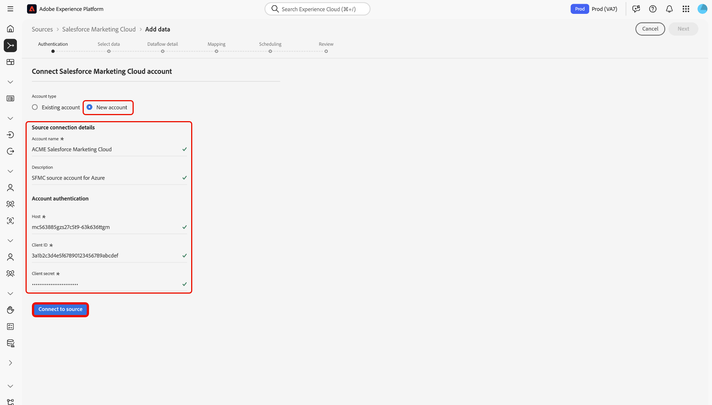

# Connect your [!DNL Salesforce Marketing Cloud] account to Experience Platform through the UI

>[!WARNING]
>
>The [!DNL Salesforce Marketing Cloud] source will be deprecated in January 2026. A new source will be released later this year as an alternative. Once the new source is released, you must plan to migrate to the new source by creating new account connections and dataflows before the end of January 2026.

Read this guide to learn how to connect your [!DNL Salesforce Marketing Cloud] account to Adobe Experience Platform using the sources workspace in the Experience Platform user interface.

## Get started

This tutorial requires a working understanding of the following components of Experience Platform:

* [[!DNL Experience Data Model (XDM)] System](../../../../../xdm/home.md): The standardized framework by which [!DNL Experience Platform] organizes customer experience data.
  * [Basics of schema composition](../../../../../xdm/schema/composition.md): Learn about the basic building blocks of XDM schemas, including key principles and best practices in schema composition.
  * [Schema Editor tutorial](../../../../../xdm/tutorials/create-schema-ui.md): Learn how to create custom schemas using the Schema Editor UI.
* [[!DNL Real-Time Customer Profile]](../../../../../profile/home.md): Provides a unified, real-time consumer profile based on aggregated data from multiple sources.

If you already have a [!DNL Salesforce Marketing Cloud] account, you may skip the remainder of this document and proceed to the tutorial on [bringing marketing automation data to Experience Platform using the UI](../../dataflow/marketing-automation.md).

### Gather required credentials

Read the [[!DNL Salesforce Marketing Cloud] overview](../../../../connectors/marketing-automation/salesforce-marketing-cloud.md#prerequisites) for information on authentication.

## Navigate the sources catalog

>[!IMPORTANT]
>
>Custom object ingestion is currently not supported by the [!DNL Salesforce Marketing Cloud] source integration.

In the Experience Platform UI, select **[!UICONTROL Sources]** from the left navigation to access the *[!UICONTROL Sources]* workspace. Choose a category or use the search bar to find your source.

To connect to [!DNL Salesforce Marketing Cloud], go to the *[!UICONTROL Marketing Automation]* category, select the **[!UICONTROL Salesforce Marketing Cloud]** source card, and then select **[!UICONTROL Set up]**.

>[!TIP]
>
>Sources in the sources catalog display the **[!UICONTROL Set up]** option when a given source does not yet have an authenticated account. Once an authenticated account is created, this option changes to **[!UICONTROL Add data]**.

## Use an existing account {#existing}

To use an existing account, select **[!UICONTROL Existing account]** and then select the [!DNL Salesforce Marketing Cloud] account that you want to use.

## Create a new account {#new}

You can use the [!DNL Salesforce Marketing Cloud] source to connect to Experience Platform on [!DNL Azure] or [!DNL Amazon Web Services] (AWS).

### Connect to Experience Platform on [!DNL Azure] {#azure}

To connect to Experience Platform on [!DNL Azure], provide an account name, an optional description, and your [account authentication credentials](../../../../connectors/marketing-automation/salesforce-marketing-cloud.md#azure). When finished, select **[!UICONTROL Connect to source]** and allow for a few moments for the connection to establish.

### Connect to Experience Platform on Amazon Web Services (AWS) {#aws}

>[!AVAILABILITY]
>
>This section applies to implementations of Experience Platform running on Amazon Web Services (AWS). Experience Platform running on AWS is currently available to a limited number of customers. To learn more about the supported Experience Platform infrastructure, see the [Experience Platform multi-cloud overview](../../../../../landing/multi-cloud.md).

To connect to Experience Platform on [!DNL AWS], ensure that you are in a VA6 sandbox and provide an account name, an optional description, and your [account authentication credentials](../../../../connectors/marketing-automation/salesforce-marketing-cloud.md#aws). When finished, select **[!UICONTROL Connect to source]** and allow for a few moments for the connection to establish.

## Create a dataflow for [!DNL Salesforce Marketing Cloud] data

Now that you have successfully connected your [!DNL Salesforce Marketing Cloud] , you can now [create a dataflow and ingest data from your marketing automation provider into Experience Platform](../../dataflow/marketing-automation.md).
