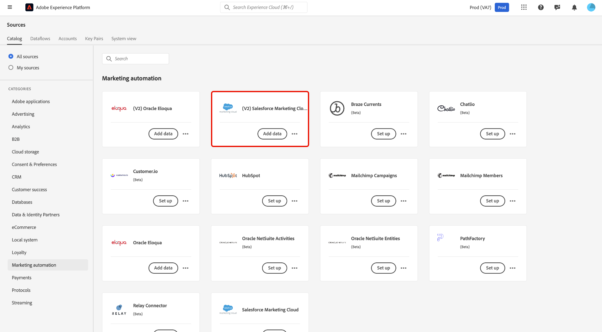
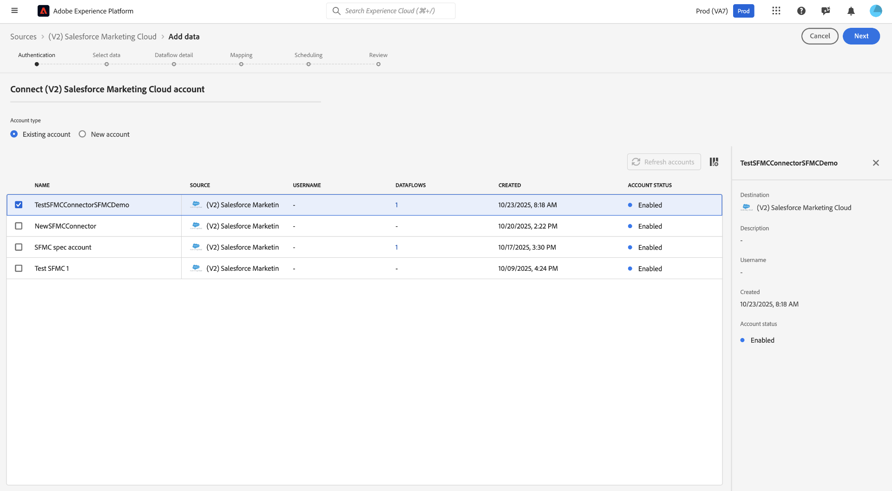
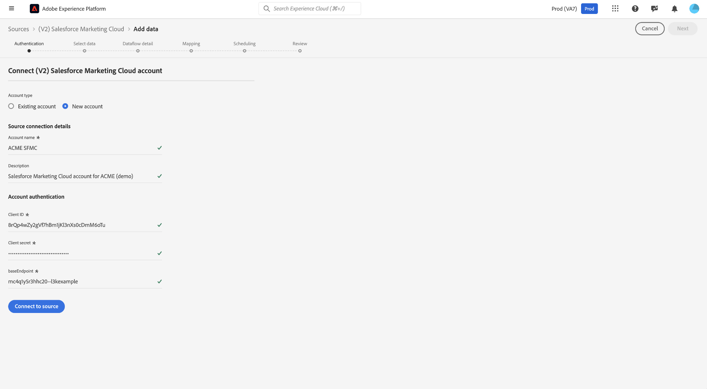
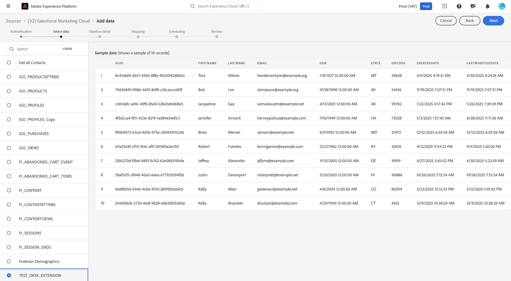
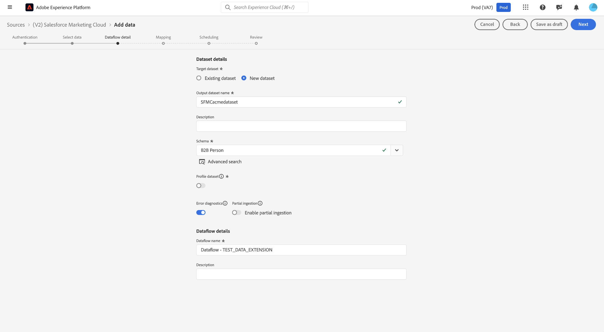
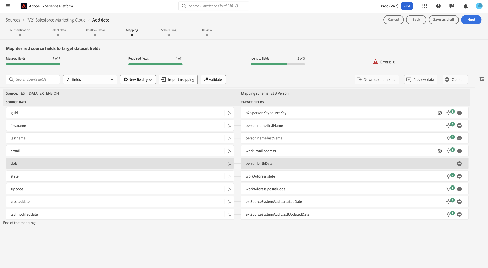
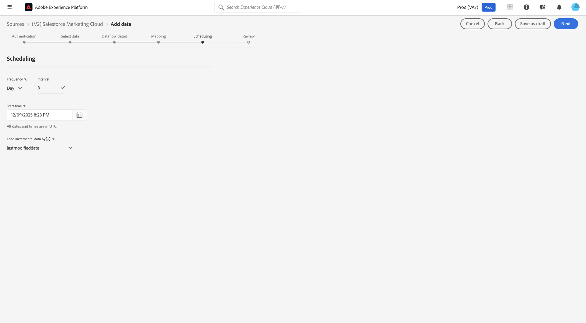
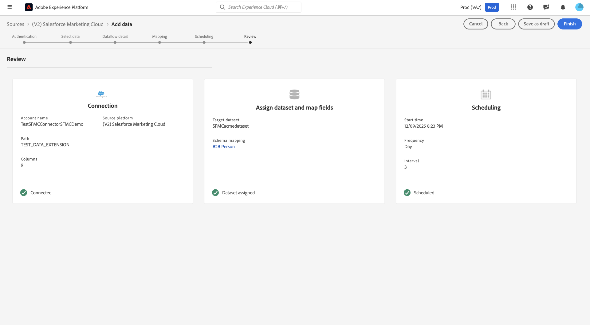

# Connect [!DNL Salesforce Marketing Cloud] to Experience Platform

Read this guide to learn how to connect your [!DNL Salesforce Marketing Cloud] account to Adobe Experience Platform using the sources workspace in the Experience Platform user interface.

## Get started

This tutorial requires a working understanding of the following components of Experience Platform:

* [[!DNL Experience Data Model (XDM)] System](../../../../../xdm/home.md): The standardized framework by which [!DNL Experience Platform] organizes customer experience data.
  * [Basics of schema composition](../../../../../xdm/schema/composition.md): Learn about the basic building blocks of XDM schemas, including key principles and best practices in schema composition.
  * [Schema Editor tutorial](../../../../../xdm/tutorials/create-schema-ui.md): Learn how to create custom schemas using the Schema Editor UI.
* [[!DNL Real-Time Customer Profile]](../../../../../profile/home.md): Provides a unified, real-time consumer profile based on aggregated data from multiple sources.

### Gather required credentials

Read the [[!DNL Salesforce Marketing Cloud] overview](../../../../connectors/marketing-automation/sfmc.md#prerequisites) for information on authentication.

## Navigate the sources catalog

In the Experience Platform UI, select **[!UICONTROL Sources]** from the left navigation to access the *[!UICONTROL Sources]* workspace. Choose a category or use the search bar to find your source.

To connect to [!DNL Salesforce Marketing Cloud], go to the *[!UICONTROL Marketing Automation]* category, select the **[!UICONTROL (V2) Salesforce Marketing Cloud]** source card, and then select **[!UICONTROL Set up]**.

>[!TIP]
>
>Sources in the sources catalog display the **[!UICONTROL Set up]** option when a given source does not yet have an authenticated account. Once an authenticated account is created, this option changes to **[!UICONTROL Add data]**.

## Use an existing account {#existing}

To use an existing account, select **[!UICONTROL Existing account]** and then select the [!DNL Salesforce Marketing Cloud] account that you want to use.

## Create a new account {#new}

To create a new account, select **[!UICONTROL New account]** and provide a name and description under your [!UICONTROL Source connection details]. Next, under [!UICONTROL Account authentication], provide values for your **Client ID**, **Client secret**, and **Base endpoint**. You can read the [authentication guide](../../../../connectors/marketing-automation/sfmc.md#gather-required-credentials) for more information on these credentials. When finished, select **[!UICONTROL Connect to source]** and allow for a few seconds for your connection to establish.

## Select data

The [!DNL Salesforce Marketing Cloud] source supports data ingestion only from [!DNL Salesforce Marketing Cloud] data extensions.

Use the [!UICONTROL Select data] interface to select the data extension that you want to ingest from your [!DNL Salesforce Marketing Cloud] instance. Once you select the data extension, you can use the preview panel to confirm that the dataset contains the expected fields before proceeding.

## Dataset and dataflow details

Next, you must provide information on your dataset and dataflow. During this step, you can either use an existing dataset or create a new dataset. Additionally, you can optionally enable your dataset for ingestion to Real-Time Customer Profile during this step.

## Mapping

In [!DNL Salesforce Marketing Cloud], data extensions are not considered as standard objects. Therefore, there are no predefined or fixed mapping fields to an Experience Platform schema. While Data Prep in Experience Platform performs a best-effort alignment between source fields from [!DNL Salesforce Marketing Cloud] and the target Experience Data Model (XDM) schema, there may still be some cases where a manual review or adjustment is required to resolve unmapped or erroneous fields.

## Schedule a dataflow

With your mapping complete, you can now configure an ingestion schedule for your dataflow. Set your [!UICONTROL Frequency] to `Once` to configure a one-time ingestion run. For incremental ingestion, you can set your [!UICONTROL Frequency] to `Hour`, `Day`, or `Week`. When using incremental ingestion, you must also configure the [!UICONTROL Interval] to define the amount of time that occurs between ingestion runs. For example, an ingestion frequency set to `Day` and  an interval set to `15` means that your dataflow is scheduled to ingest data every 15 days.

>[!TIP]
>
> Per-minute ingestion frequency is not available for the [!DNL Salesforce Marketing Cloud] source. The most frequent schedule you can choose is hourly. Select a schedule that matches your data freshness needs. Keep in mind that selecting a more frequent schedule will increase compute costs.

You must select a delta (date/time) field in your dataset to enable incremental synchronization. If your dataset does not contain a suitable delta field, you will not be able to create the dataflow.

## Review

With the ingestion schedule configured, use the [!UICONTROL Review] interface to confirm the details of your dataflow. Select **[!UICONTROL Finish]** to complete the setup and allow for a few moments for your dataflow to initiate.

## Monitor

Once the dataflow is selected it will do a one-time backfill of data and subsequent incremental sync on the schedule specified. The status of sync can be monitored by navigating to the dataflow. For more information, read the guide on [monitoring sources dataflows in the UI](../../../../../dataflows/ui/monitor-sources.md).

## Next steps

This tutorial guided you through connecting your [!DNL Salesforce Marketing Cloud] (V2) account to Experience Platform using the user interface. You learned how to select or create a source account, provide the required credentials, choose data extensions to ingest, specify dataset and dataflow details, map your data, set up a schedule for data ingestion, and monitor your dataflows. By following these steps, you successfully integrated your [!DNL Salesforce Marketing Cloud] data with Experience Platform for activation and analysis.

For additional information, read the following documentation:

* [Sources overview](../../../../home.md)
* [Real-Time CDP B2B Edition](../../../../../rtcdp/b2b-overview.md)
