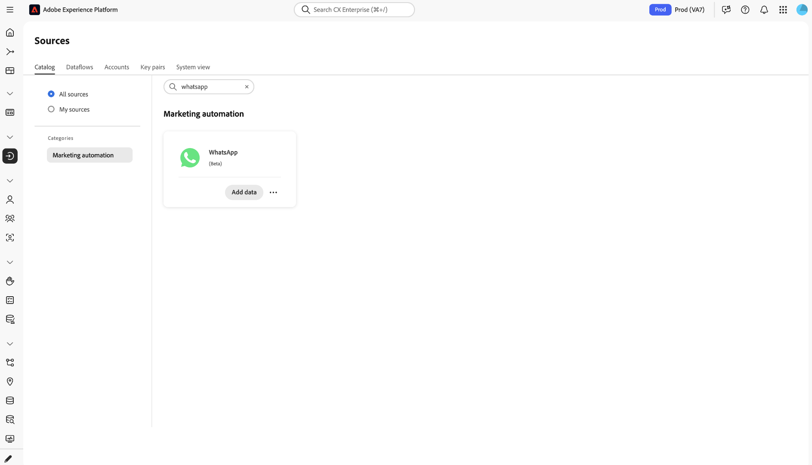
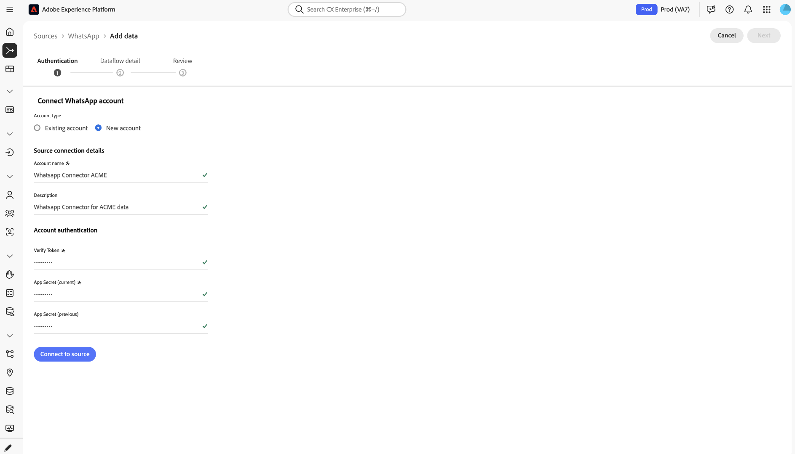
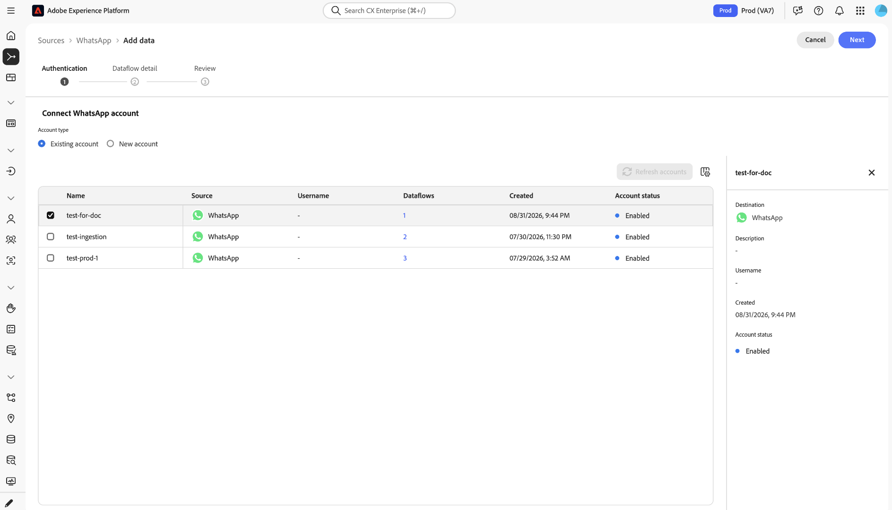
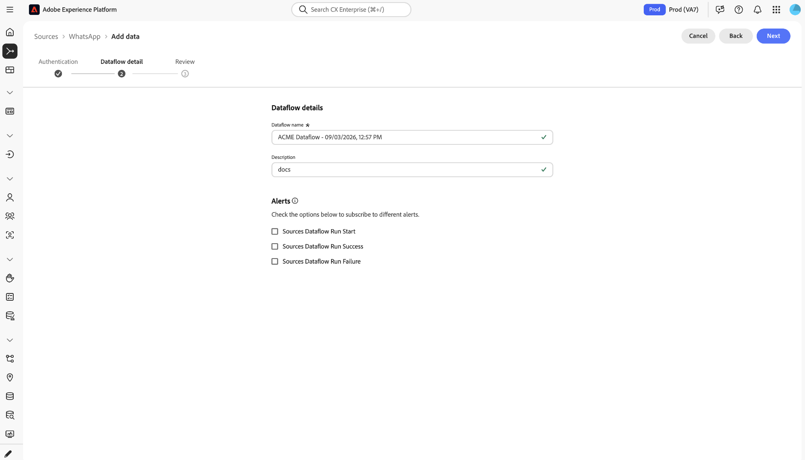
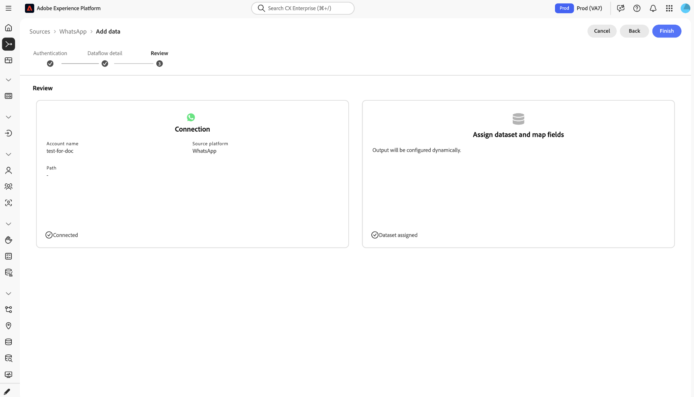
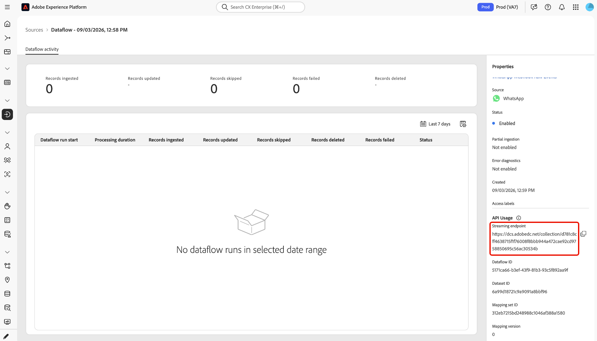

# Create a [!DNL WhatsApp] source connection in the UI

>[!NOTE]
>
>The [!DNL WhatsApp] source is in beta. Read the [Sources overview](../../../../home.md#terms-and-conditions) for more information on using beta-labeled connectors.

This tutorial provides steps for creating a [!DNL WhatsApp] source connection using the Adobe Experience Platform user interface.

## Getting started {#getting-started}

This tutorial requires a working understanding of the following components of Experience Platform:

* [[!DNL Experience Data Model (XDM)] System](../../../../../xdm/home.md): The standardized framework by which Experience Platform organizes customer experience data. The connector assigns a WhatsApp specific ExperienceEvent schema for you automatically.
* [[!DNL Real-Time Customer Profile]](../../../../../profile/home.md): Provides a unified, real-time consumer profile based on aggregated data from multiple sources.

## Prerequisites {#prerequisites}

Before you create a [!DNL WhatsApp] source connection, complete the [Prerequisites](../../../../connectors/marketing-automation/whatsapp-business.md#prerequisites) in the [!DNL WhatsApp] source overview, including subscribing your app to the WABA, and have the following ready:

* Your Meta App Secret
* Your Verify Token

## Step 1: Create an account {#create-account}

In the Experience Platform UI, select **[!UICONTROL Sources]** from the left navigation to access the [!UICONTROL Sources] workspace.

Go to the *[!UICONTROL Marketing automation]* category, select the [!DNL WhatsApp] source card, and select **[!UICONTROL Add data]**.

The **[!UICONTROL Authentication]** tab appears. On this tab, you can either use a new account or an existing account.

>[!BEGINTABS]

>[!TAB Create a new account]

Select **[!UICONTROL New account]** and provide the following information.

| Field | What to enter |
| --- | --- |
| Account name | A name for this connection. |
| Description *(optional)* | A short description of the account. |
| Verify Token | The Verify Token you chose in Prerequisites. It is the shared secret used for the one-time webhook verification handshake with Meta. |
| App Secret (current) | Your Meta App Secret from Prerequisites. Used to validate the `X-Hub-Signature-256` signature on inbound webhooks. |
| App Secret (previous) *(optional)* | A previous App Secret, used only during secret rotation, so that you can roll the App Secret without downtime. |

Select **[!UICONTROL Connect to source]** to validate and create the account, then select **[!UICONTROL Next]**. An account can be reused across multiple dataflows, so you only enter these credentials once per account.

>[!TAB Use an existing account]

Select **[!UICONTROL Existing account]**, select the account that you want to reuse, and then select **[!UICONTROL Next]**.

>[!ENDTABS]

## Step 2: Configure the dataflow {#configure-dataflow}

The **[!UICONTROL Dataflow detail]** tab appears. Enter a **[!UICONTROL Dataflow name]**, an optional **[!UICONTROL Description]**, and optionally subscribe to alerts by selecting **[!UICONTROL Sources Dataflow Run Start]**, **[!UICONTROL Sources Dataflow Run Success]**, or **[!UICONTROL Sources Dataflow Run Failure]**.

>[!NOTE]
>
>You do not select a target dataset or map fields. The connector creates and assigns the dataset, schema, and field mapping automatically.

Select **[!UICONTROL Next]**.

The **[!UICONTROL Review]** tab appears. Review the connection and dataset assignment, then select **[!UICONTROL Finish]**.

## Step 3: Retrieve the streaming endpoint {#retrieve-streaming-endpoint}

After the dataflow is created, go to its **[!UICONTROL Dataflow activity]** page and find the **[!UICONTROL API Usage]** section of the **[!UICONTROL Properties]** panel. Copy the **[!UICONTROL Streaming endpoint]** and **[!UICONTROL Dataflow ID]** values.

Combine both values to build the Callback URL that you enter in Meta: `{STREAMING_ENDPOINT}?x-adobe-flow-id={DATAFLOW_ID}`.

## Step 4: Configure the webhook in Meta {#configure-webhook}

In Meta, go to **[!DNL WhatsApp]** > **[!DNL Configuration]** and complete the following steps.

1. Enter the Callback URL you built in Step 3 and the same Verify Token from Prerequisites.
1. Select **[!DNL Verify and Save]**. Meta calls the Callback URL with a `GET` challenge, which Platform answers to complete the handshake.
1. Subscribe to the `messages` webhook field.

## Next steps {#next-steps}

By following this tutorial, you have configured a streaming dataflow to bring your [!DNL WhatsApp] data to Experience Platform. To monitor the data that is being ingested, refer to the guide on [monitoring streaming dataflows using Experience Platform UI](../../monitor-streaming.md).

If no data appears after you send a test message, see [Troubleshooting](../../../../connectors/marketing-automation/whatsapp-business.md#troubleshooting) in the [!DNL WhatsApp] source overview.
