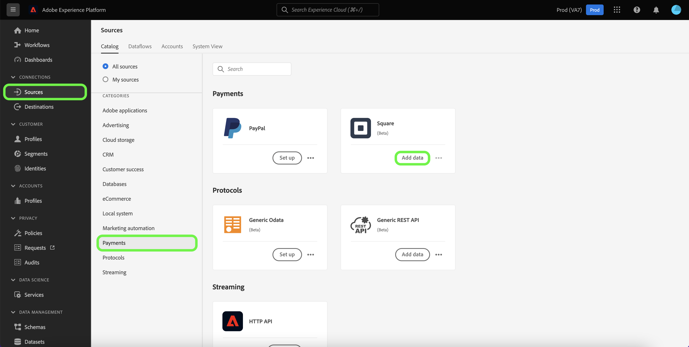
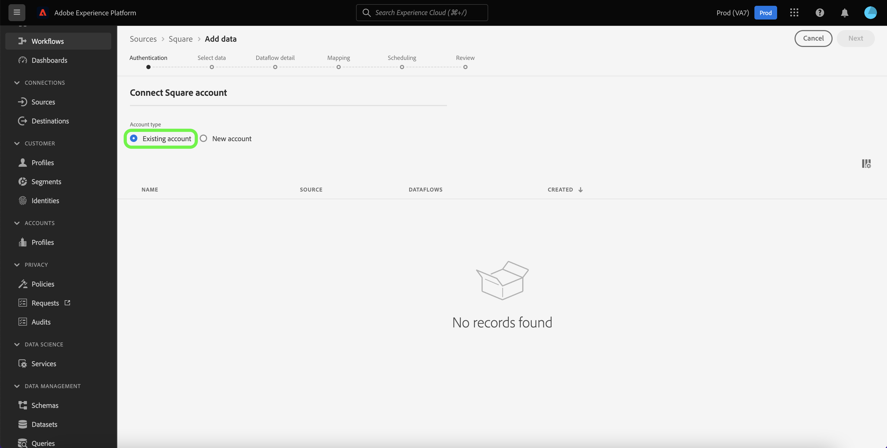
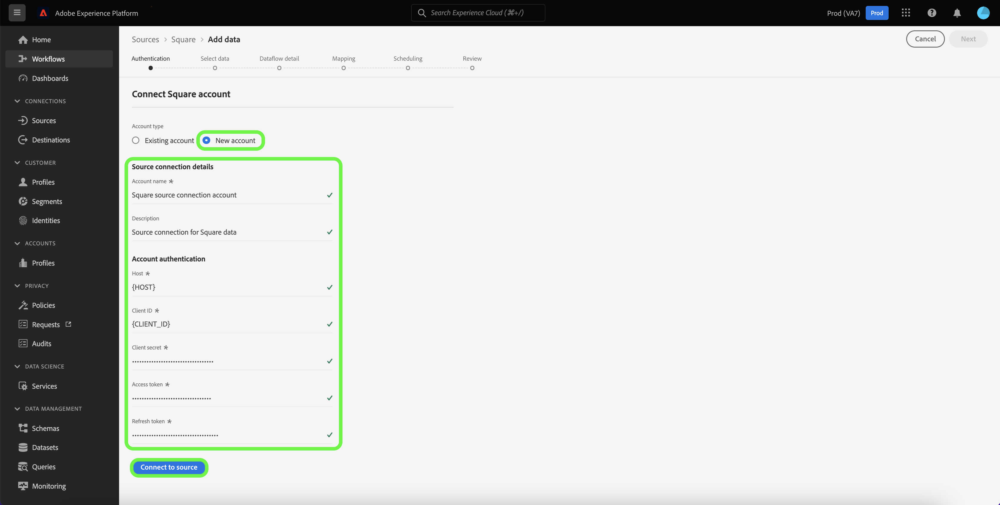

# Create a [!DNL Square] source connection in the UI

This tutorial provides steps for creating a [!DNL Square] source connector using the Platform user interface.

## Getting started

This tutorial requires a working understanding of the following components of Adobe Experience Platform:

* [[!DNL Experience Data Model (XDM)] System](../../../../../xdm/home.md): The standardized framework by which [!DNL Experience Platform] organizes customer experience data.
  * [Basics of schema composition](../../../../../xdm/schema/composition.md): Learn about the basic building blocks of XDM schemas, including key principles and best practices in schema composition.
  * [Schema Editor tutorial](../../../../../xdm/tutorials/create-schema-ui.md): Learn how to create custom schemas using the Schema Editor UI.
* [[!DNL Real-Time Customer Profile]](../../../../../profile/home.md): Provides a unified, real-time consumer profile based on aggregated data from multiple sources.

### Gather required credentials

In order to access your [!DNL Square] account Platform, you must provide the following values:

| Credential | Description |
| --- | --- |
| Host | The URL of the [!DNL Square] instance. |
| Client ID | The client ID associated with your [!DNL Square] account. |
| Client secret | The client secret associated with your [!DNL Square] account. |
| Access token | The access token is used to authenticate your [!DNL Square] account with OAuth 2.0 authentication. The access token can be obtained from [!DNL Square]. |
| Refresh token | The refresh token is used to generate new access tokens once your current access token expires. The refresh token can be obtained from [!DNL Square]. |

For more information on these credentials and how to obtain them, see the [[!DNL Square] documentation on OAuth](https://developer.squareup.com/docs/oauth-api/receive-and-manage-tokens).

Once you have gathered your required credentials, you can follow the steps below to link your [!DNL Square] account to Platform.

## Connect your [!DNL Square] account

In the Platform UI, select **[!UICONTROL Sources]** from the left navigation to access the [!UICONTROL Sources] workspace. The [!UICONTROL Catalog] screen displays a variety of sources with which you can create an account.

You can select the appropriate category from the catalog on the left-hand side of your screen. Alternatively, you can find the specific source you wish to work with using the search option.

Under the [!UICONTROL Payments] category, select **[!UICONTROL Square]**, and then select **[!UICONTROL Add data]**.

The **[!UICONTROL Connect to Square]** page appears. On this page, you can either use new credentials or existing credentials.

### Existing account

To use an existing account, select the [!DNL Square] account you want to create a new dataflow with, then select **[!UICONTROL Next]** to proceed.

### New account

If you are creating a new account, select **[!UICONTROL New account]**, and then provide a name, an optional description, and the appropriate values for your [!DNL Square] credentials. When finished, select **[!UICONTROL Connect to source]** and then allow some time for the new connection to establish.

## Next steps

By following this tutorial, you have authenticated and created a source connection between your [!DNL Square] account and Platform. You can now continue on to the next tutorial and [create a dataflow to bring payments data into Platform](../../dataflow/payments.md).
