# Ingest payments data from your [!DNL Stripe] account to Experience Platform using the user interface

>[!NOTE]
>
>The [!DNL Stripe] source is in beta. Read the [terms and conditions](../../../../home.md#terms-and-conditions) in the sources overview for more information on using beta-labeled sources.

Read the following tutorial to learn how to ingest payments data from your [!DNL Stripe] account to Adobe Experience Platform using the user interface.

## Get started

This tutorial requires a working understanding of the following components of Experience Platform:

* [[!DNL Experience Data Model (XDM)] System](../../../../../xdm/home.md): The standardized framework by which [!DNL Experience Platform] organizes customer experience data.
  * [Basics of schema composition](../../../../../xdm/schema/composition.md): Learn about the basic building blocks of XDM schemas, including key principles and best practices in schema composition.
  * [Schema Editor tutorial](../../../../../xdm/tutorials/create-schema-ui.md): Learn how to create custom schemas using the Schema Editor UI.
* [[!DNL Real-Time Customer Profile]](../../../../../profile/home.md): Provides a unified, real-time consumer profile based on aggregated data from multiple sources.

### Authentication

Read the [[!DNL Stripe] overview](../../../../connectors/payments/stripe.md) for information on how to retrieve your authentication credentials.

## Connect your [!DNL Stripe] account {#connect}

In the Platform UI, select **[!UICONTROL Sources]** from the left navigation to access the [!UICONTROL Sources] workspace. You can select the appropriate category from the catalog on the left-hand side of your screen. Alternatively, you can find the specific source you wish to work with using the search option.

Under the *Payments* category, select **[!DNL Stripe]**, and then select **[!UICONTROL Set up]**.

>[!TIP]
>
>Sources in the sources catalog display the **[!UICONTROL Set up]** option when a given source does not yet have an authenticated account. Once an authenticated account exists, this option changes to **[!UICONTROL Add data]**.

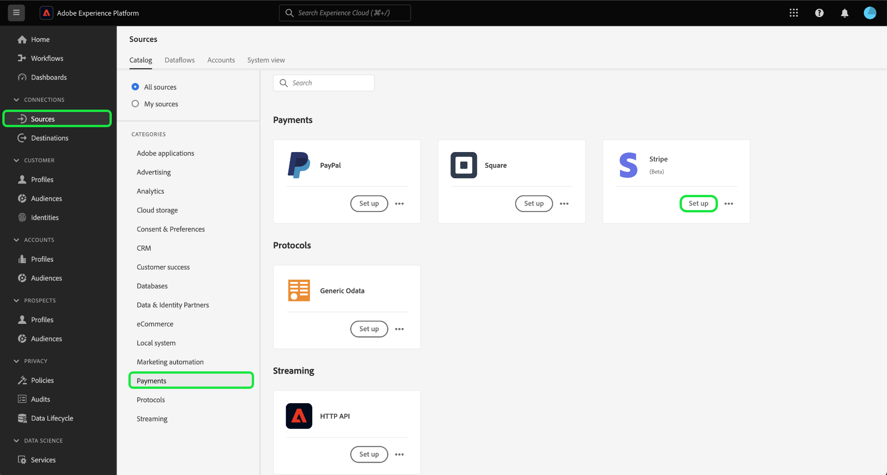

The **[!UICONTROL Connect Stripe account]** page appears. On this page, you can either use new or existing credentials.

>[!BEGINTABS]

>[!TAB Create a new account]

To create a new account, select **[!UICONTROL New account]** and provide a name, an optional description, and your credentials. 

When finished, select **[!UICONTROL Connect to source]** and then allow some time for the new connection to establish.

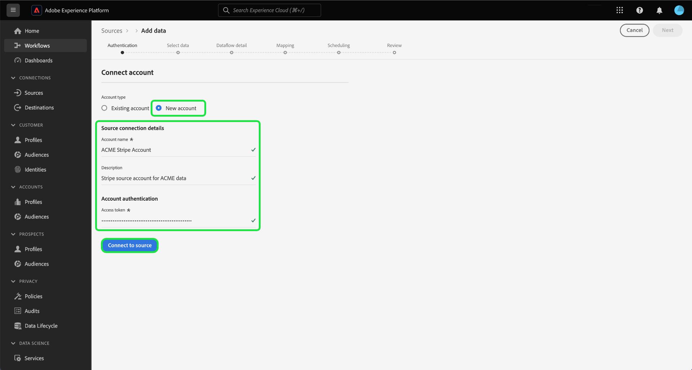

| Credential | Description |
| --- | --- |
| Access token | Your [!DNL Stripe] access token. For information on how to retrieve your access token, read the [[!DNL Stripe] authentication guide](../../../../connectors/payments/stripe.md). |

>[!TAB Use an existing account]

To use an existing account, select **[!UICONTROL Existing account]** and then select the account that you want to use from the existing account catalog.

Select **[!UICONTROL Next]** to proceed.

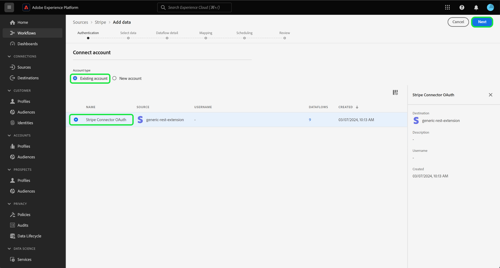

>[!ENDTABS]

## Select data {#select-data}

Now that you have access to your account, you must identify the appropriate path to the [!DNL Stripe] data that you want to ingest. Select **[!UICONTROL Resource path]** and then select the endpoint from where you want to ingest data from. The available [!DNL Stripe] endpoints are:

* Charges
* Subscriptions
* Refunds
* Balance Transactions
* Customers
* Prices

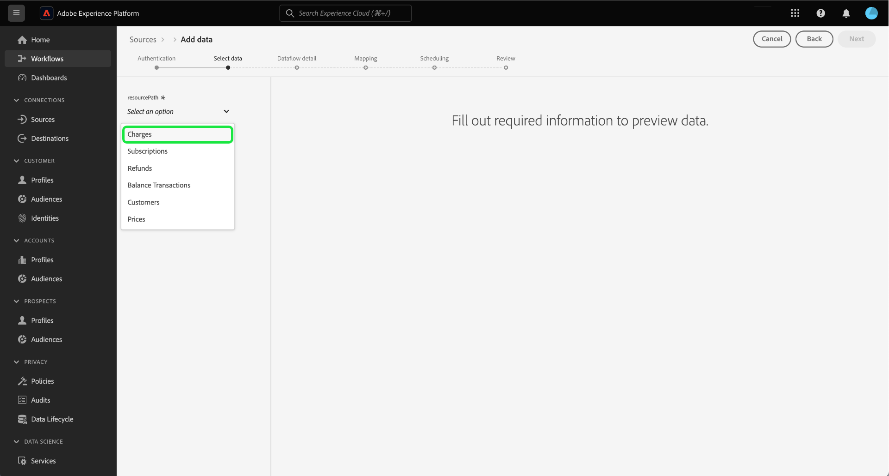

Once your endpoint is selected, the interface updates into a preview screen, displaying the data structure of the [!DNL Stripe] endpoint that you selected. Select **[!UICONTROL Next]** to proceed.

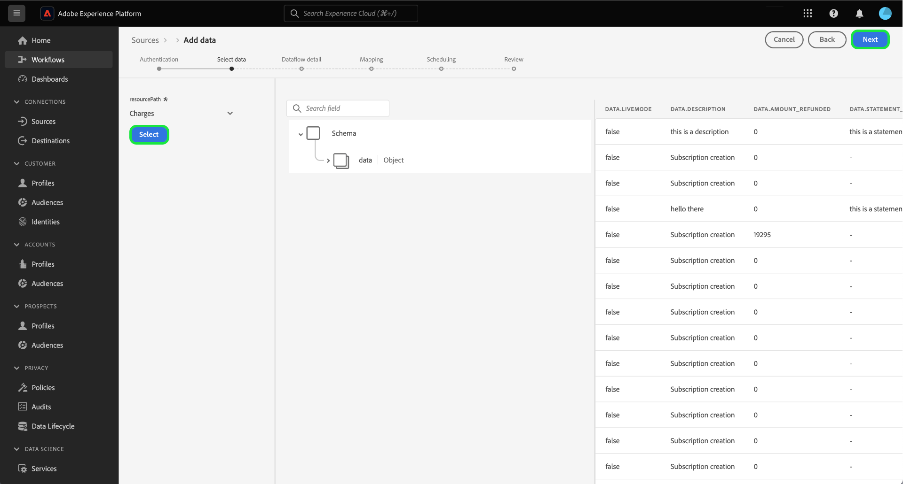

## Provide dataset and dataflow details {#provide-dataset-and-dataflow-details}

Next, you must provide information on your dataset and your dataflow. 

### Dataset details {#dataset-details}

A dataset is a storage and management construct for a collection of data, typically a table, that contains a schema (columns) and fields (rows). Data that is successfully ingested into Experience Platform is stored within the data lake as datasets. During this step, you can create a new dataset or use an existing dataset.

>[!BEGINTABS]

>[!TAB Use a new dataset]

To use a new dataset, select **[!UICONTROL New dataset]** and then provide a name, and an optional description for your dataset. You must also select an Experience Data Model (XDM) schema that your dataset adheres to.

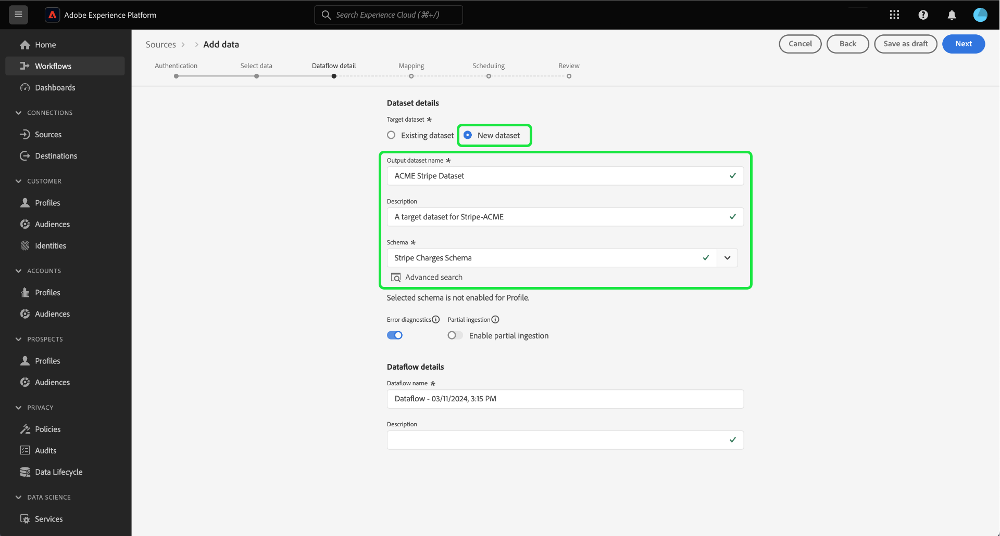

| New dataset details | Description |
| --- | --- |
| Output dataset name | The name of your new dataset. |
| Description | (Optional) A brief explanation of the new dataset. |
| Schema | A dropdown list of schemas that exist in your organization. You can also create your own schema prior to the source configuration process. For more information, read the guide on [creating an XDM schema in the UI](../../../../../xdm/tutorials/create-schema-ui.md). |

>[!TAB Use an existing dataset]

If you already have an existing dataset, select **[!UICONTROL Existing dataset]** and then use the **[!UICONTROL Advanced search]** option to view a window of all datasets in your organization, including their respective details, such as whether they are enabled for ingestion to Real-Time Customer Profile or not.

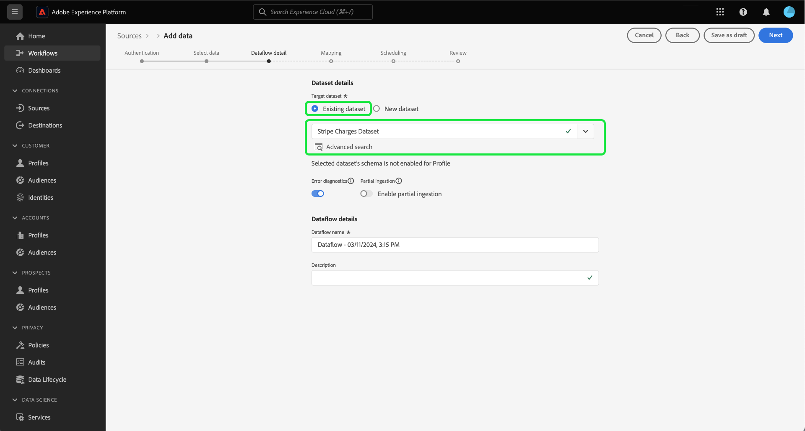

>[!ENDTABS]

+++Select for steps to enable Profile ingestion, error diagnostics, and partial ingestion.

If your dataset is enabled for Real-Time Customer Profile, then during this step, you can toggle **[!UICONTROL Profile dataset]** to enable your data for Profile-ingestion. You can also use this step to enable **[!UICONTROL Error diagnostics]** and **[!UICONTROL Partial ingestion]**.

* **[!UICONTROL Error diagnostics]**: Select **[!UICONTROL Error diagnostics]** to instruct the source to produce error diagnostics that you can later reference when monitoring your dataset activity and dataflow status.
* **[!UICONTROL Partial ingestion]**: Partial batch ingestion is the ability to ingest data containing errors, up to a certain configurable threshold. This feature allows you to successfully ingest all of your accurate data into Experience Platform, while all of your incorrect data is batched separately with information on why it is invalid.

+++

### Dataflow details {#dataflow-details}

Once your dataset is configured, you must then provide details on your dataflow, including a name, an optional description, and alert configurations.

| Dataflow configurations | Description |
| --- | --- |
| Dataflow name | The name of the dataflow.  By default, this will use the name of the file that is being imported. |
| Description | (Optional) A brief description of your dataflow. |
| Alerts | Experience Platform can produce event-based alerts that users can subscribe to. These options all require a running dataflow to trigger them.  For more information, read the [alerts overview](../../alerts.md) <ul><li>**Sources Dataflow Run Start**: Select this alert to receive a notification when your dataflow run begins.</li><li>**Sources Dataflow Run Success**: Select this alert to receive a notification if your dataflow ends without any errors.</li><li>**Sources Dataflow Run Failure**: Select this alert to receive a notification if your dataflow run ends with any errors.</li></ul> |

When finished, select **[!UICONTROL Next]** to proceed.

## Map fields to an XDM schema {#mapping}

The **[!UICONTROL Mapping]** step appears. Use the mapping interface to map your source data to the appropriate schema fields before ingesting that data into Experience Platform. For an extensive guide on how to use the mapping interface, read the [Data Prep UI guide](../../../../../data-prep/ui/mapping.md) for more information.

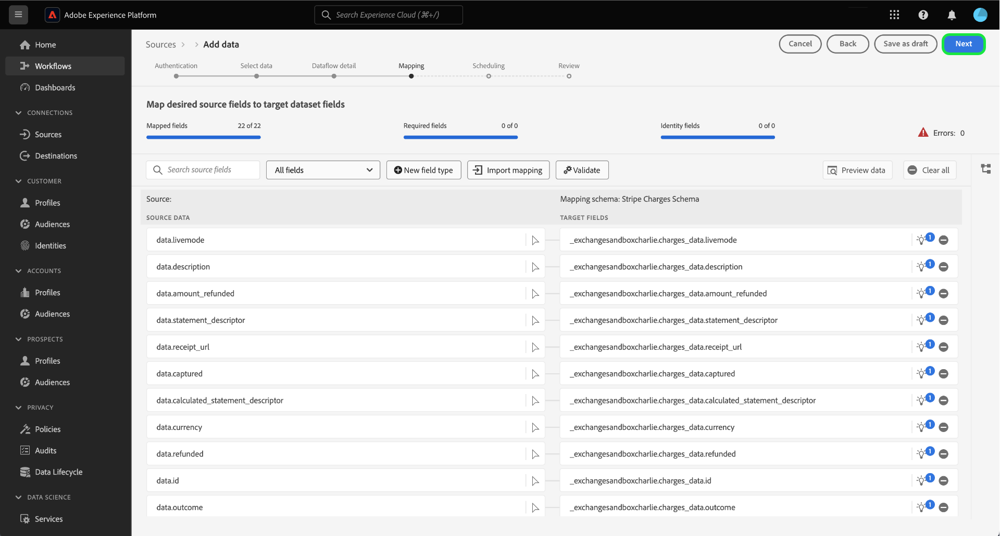

## Configure ingestion schedule {#scheduling}

Next, use the scheduling interface to create an ingestion schedule for your dataflow.

Select the frequency dropdown to configure your dataflow's ingestion frequency.

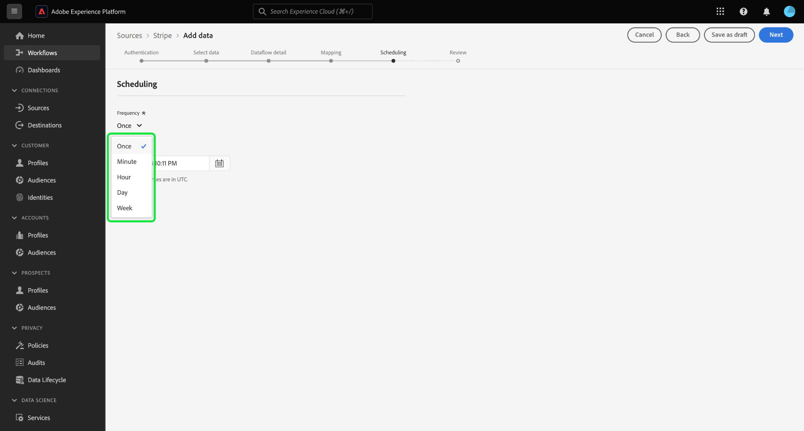

You can also select the calendar icon and use a pop-up calendar to configure your ingestion start time.

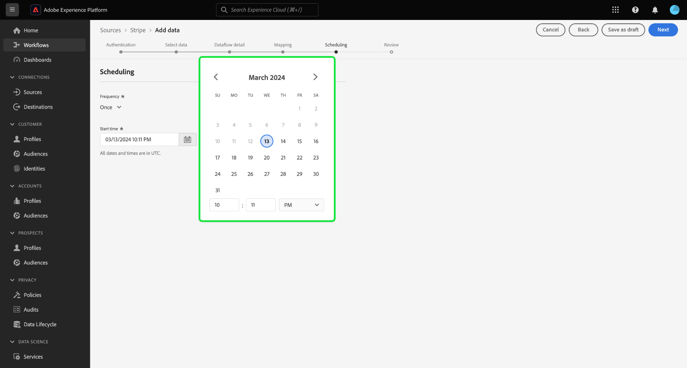

| Scheduling configuration | Description |
| --- | --- |
| Frequency | Configure frequency to indicate how often the dataflow should run. You can set your frequency to: <ul><li>**Once**: Set your frequency to `once` to create a one-time ingestion. Configurations for interval and backfill are unavailable when creating a one-time ingestion dataflow. By default, the scheduling frequency is set to once.</li><li>**Minute**: Set your frequency to `minute` to schedule your dataflow to ingest data on a per-minute basis.</li><li>**Hour**:Set your frequency to `hour` to schedule your dataflow to ingest data on a per-hour basis.</li><li>**Day**: Set your frequency to `day` to schedule your dataflow to ingest data on a per-day basis.</li><li>**Week**: Set your frequency to `week` to schedule your dataflow to ingest data on a per-week basis.</li></ul> |
| Interval |  Once you select a frequency, you can then configure the interval setting to establish the time frame between every ingestion. For example, if you set your frequency to day and configure the interval to 15, then your dataflow will run every 15 days. **Note**: You cannot set the interval to zero. |
| Start Time | The timestamp for the projected run, presented in UTC time zone. |
| Backfill | Backfill determines what data is initially ingested. If backfill is enabled, all current files in the specified path will be ingested during the first scheduled ingestion. If backfill is disabled, only the files that are loaded in between the first run of ingestion and the start time will be ingested. Files loaded prior to the start time will not be ingested. |

Once you have configured your dataflow's ingestion schedule, select **[!UICONTROL Next]**.

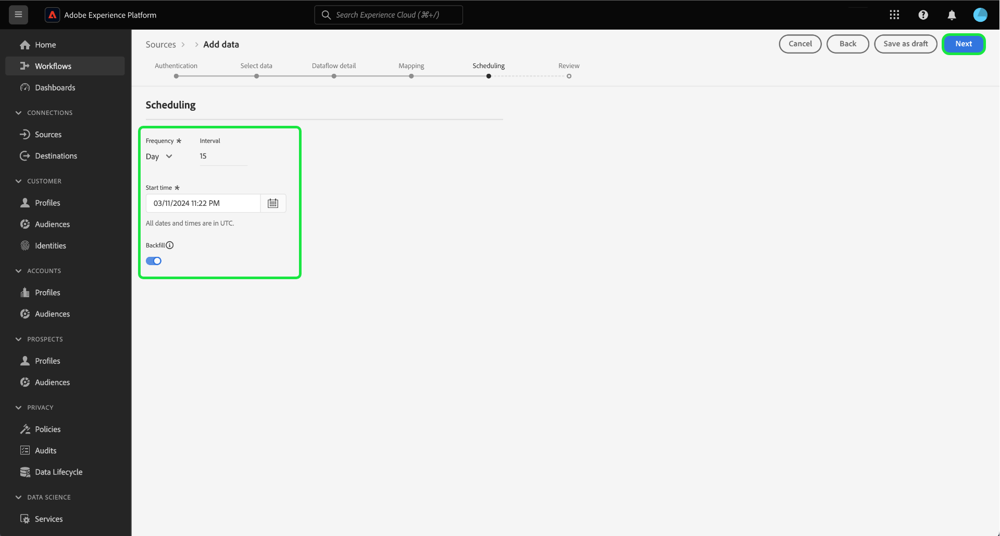

## Review your dataflow

The final step in the dataflow creation process is to review your dataflow before executing it. Use the **[!UICONTROL Review]** step to review the details of your new dataflow before it runs. Details are grouped in the following categories:

* **Connection**: Shows the source type, the relevant path of the chosen source file, and the number of columns within that source file.
* **Assign dataset & map fields**: Shows which dataset the source data is being ingested into, including the schema that the dataset adheres to.
* **Scheduling**: Shows the active period, frequency, and interval of the ingestion schedule.

Once you have reviewed your dataflow, select **[!UICONTROL Finish]** and allow some time for the dataflow to be created.

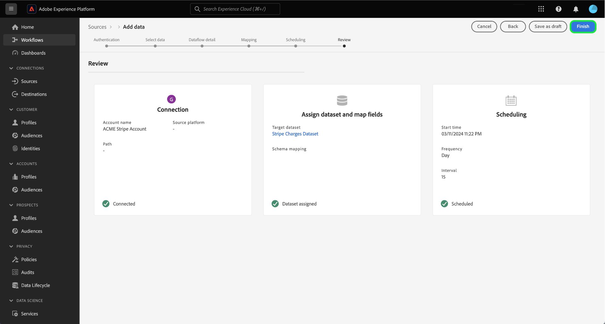

## Next steps

By following this tutorial, you have successfully created a dataflow to bring payments data from your [!DNL Stripe] source to Experience Platform. For additional resources, visit the documentation outlined below.

### Monitor your dataflow

Once your dataflow has been created, you can monitor the data that is being ingested through it to view information on ingestion rates, success, and errors. For more information on how to monitor dataflow, visit the tutorial on [monitoring accounts and dataflows in the UI](../../../../../dataflows/ui/monitor-sources.md).

### Update your dataflow

To update configurations for your dataflows scheduling, mapping, and general information, visit the tutorial on [updating sources dataflows in the UI](../../update-dataflows.md).

### Delete your dataflow

You can delete dataflows that are no longer necessary or were incorrectly created using the **[!UICONTROL Delete]** function available in the **[!UICONTROL Dataflows]** workspace. For more information on how to delete dataflows, visit the tutorial on [deleting dataflows in the UI](../../delete.md).
