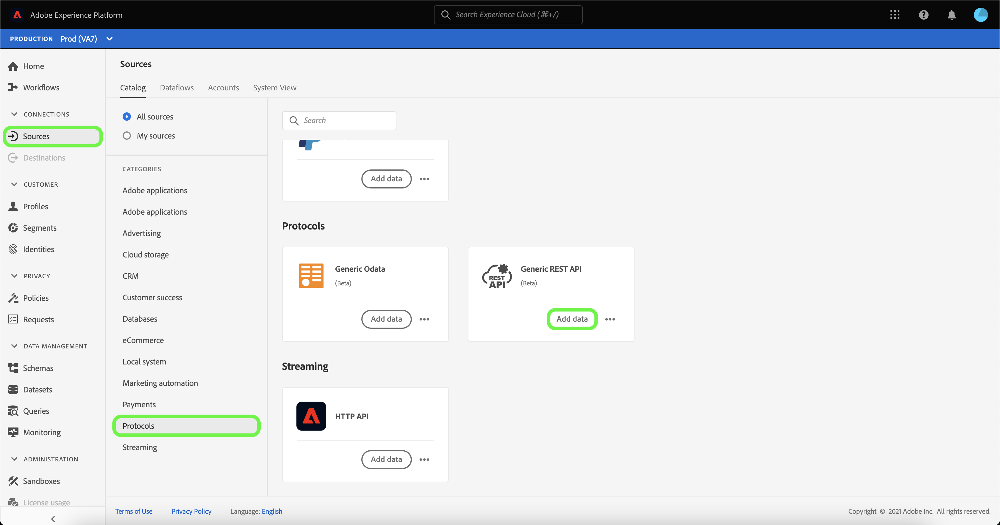
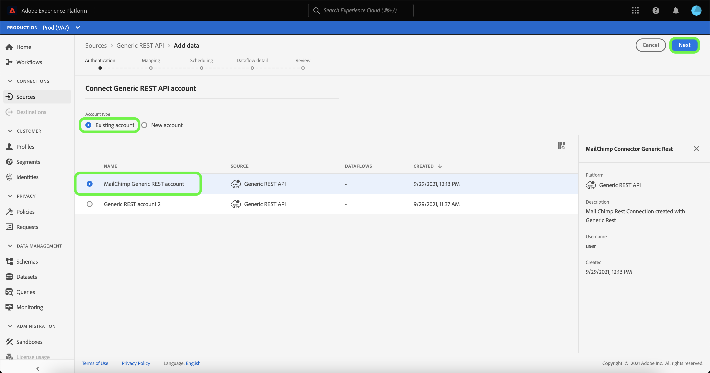
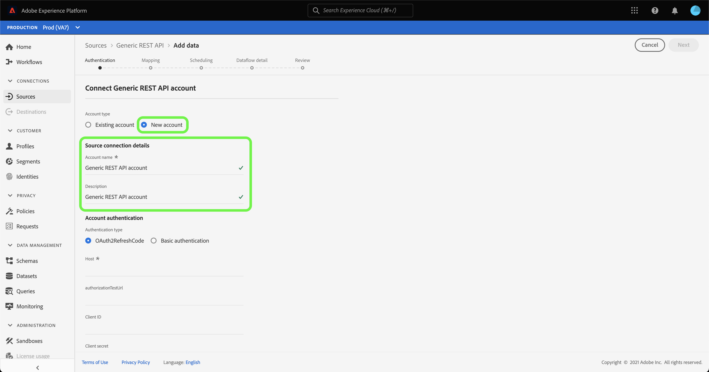
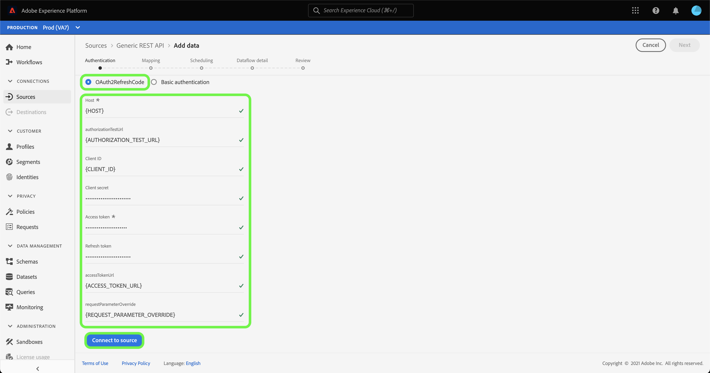
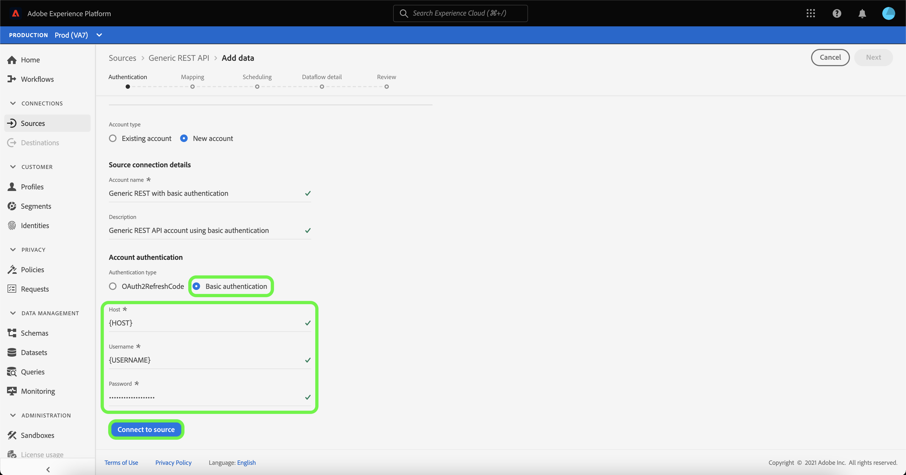

# Create a [!DNL Generic REST API] source connection in the UI

>[!NOTE]
>
> The [!DNL Generic REST API] source is in beta. See the [Sources overview](../../../../home.md#terms-and-conditions) for more information on using beta-labeled connectors.

This tutorial provides steps for creating a [!DNL Generic REST API] source connector using the Adobe Experience Platform user interface.

## Getting started

This tutorial requires a working understanding of the following components of Platform:

* [Sources](../../../../home.md): Experience Platform allows data to be ingested from various sources while providing you with the ability to structure, label, and enhance incoming data using Platform services.
* [Sandboxes](../../../../../sandboxes/home.md): Experience Platform provides virtual sandboxes which partition a single Platform instance into separate virtual environments to help develop and evolve digital experience applications.

### Gather required credentials

In order to access your [!DNL Generic REST API] account on Platform, you must provide valid credentials for the authentication type of your choice. Generic REST API supports both OAuth 2 refresh code and basic authentication. See the following tables for information on the credentials for the two supported authentication types.

#### OAuth 2 refresh code

| Credential | Description |
| --- | --- |
| Host | The host URL of the source that you are making your request to. This value is required and cannot be bypassed using request parameter override. |
| Authorization test URL | (Optional) The authorization test URL is used to validate credentials when creating a base connection. If unprovided, credentials are automatically checked during the source connection creation step instead. |
| Client ID | (Optional) The client ID associated with your user account. |
| Client secret | (Optional) The client secret associated with your user account. |
| Access token | The primary authentication credential used to access your application. The access token represents the authorization of your application, to access particular aspects of a user's data. This value is required and cannot be bypassed using request parameter override. |
| Refresh token | (Optional) A token that's used to generate a new access token, when the access token has expired. |
| Access token URL | (Optional) The URL endpoint used to fetch your access token. |
| Request parameter override | (Optional) A property that allows you to specify which credential parameters to override. |

#### Basic authentication

| Credential | Description |
| --- | --- |
| Host | The host URL of the source that you are making your request to. |
| Username | The username that corresponds with your user account. |
| Password | The password that corresponds with your user account. |

## Connect your  Generic REST API account

In the Platform UI, select **[!UICONTROL Sources]** from the left navigation to access the [!UICONTROL Sources] workspace. The [!UICONTROL Catalog] screen displays a variety of sources that you can create an account with.

You can select the appropriate category from the catalog on the left-hand side of your screen. Alternatively, you can find the specific source you wish to work with using the search bar.

Under the [!UICONTROL Protocols] category, select **[!UICONTROL Generic REST API]** and then select **[!UICONTROL Add data]**.

The **[!UICONTROL Connect to Generic REST API]** page appears. On this page, you can either use new credentials or existing credentials.

### Existing account

To connect an existing account, select the Generic REST API account you want to connect with, then select **[!UICONTROL Next]** to proceed.

### New account

If you are creating a new account, select **[!UICONTROL New account]**, and then provide a name and an option description for your new [!DNL Generic REST API] account.

#### Authenticate using OAuth 2 refresh code

[!DNL Generic REST API] supports both OAuth 2 refresh code and basic authentication. To authenticate using an OAuth2 authentication, select **[!UICONTROL OAuth2RefreshCode]**, provide your OAuth 2 credentials and then select **[!UICONTROL Connect to source]**.

#### Authenticate using basic authentication

To use basic authentication, select **[!UICONTROL Basic authentication]**, provide your host, username, and password, and then select **[!UICONTROL Connect to source]**. 

## Next steps

By following this tutorial, you have established a connection to your Generic REST API account. You can now continue on to the next tutorial and [configure a dataflow to bring data into Platform](../../dataflow/protocols.md).
