# Create an [!DNL HTTP API] streaming connection using the UI

This tutorial provides steps for creating a streaming source connection using the [!UICONTROL Sources] workspace.

## Getting started

This tutorial requires a working understanding of the following components of Adobe Experience Platform:

- [[!DNL Experience Data Model (XDM)] System](../../../../../xdm/home.md): The standardized framework by which [!DNL Experience Platform] organizes customer experience data.
  - [Basics of schema composition](../../../../../xdm/schema/composition.md): Learn about the basic building blocks of XDM schemas, including key principles and best practices in schema composition.
  - [Schema Editor tutorial](../../../../../xdm/tutorials/create-schema-ui.md): Learn how to create custom schemas using the Schema Editor UI.
- [[!DNL Real-Time Customer Profile]](../../../../../profile/home.md): Provides a unified, real-time consumer profile based on aggregated data from multiple sources.

## Create a streaming connection

In the Platform UI, select **[!UICONTROL Sources]** from the left navigation to access the [!UICONTROL Sources] workspace. The [!UICONTROL Catalog] screen displays a variety of sources that you can create an account with.

You can select the appropriate category from the catalog on the left-hand side of your screen. Alternatively, you can find the specific source you wish to work with using the search option.

Under the **[!UICONTROL Streaming]** category, select **[!UICONTROL HTTP API]** and then select **[!UICONTROL Add data]**.

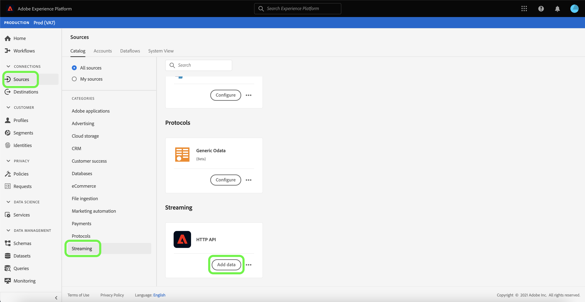

The **[!UICONTROL Connect HTTP API account]** page appears. On this page, you can either use new credentials or existing credentials.

### Existing account

To use an existing account, select the HTTP API account you want to create a new dataflow with, then select **[!UICONTROL Next]** to proceed.

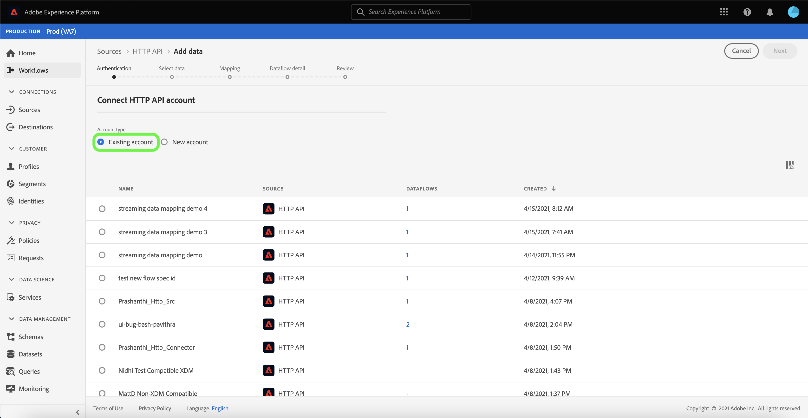

### New account

If you are creating a new account, select **[!UICONTROL New account]**. On the input form that appears, provide an account name and an optional description. You will also get the option of providing the following configuration properties:

- **[!UICONTROL Authentication]:** This property determines whether or not the streaming connection requires authentication. Authentication ensures that data is collected from trusted sources. If you're dealing with Personally Identifiable Information (PII), this property should be turned on. By default, this property is turned off.
- **[!UICONTROL XDM compatible]:** This property denotes if this streaming connection will be sending events which are compatible with XDM schemas. By default, this property is turned off.

When finished, select **[!UICONTROL Connect to source]** and then select **[!UICONTROL Next]** to proceed.

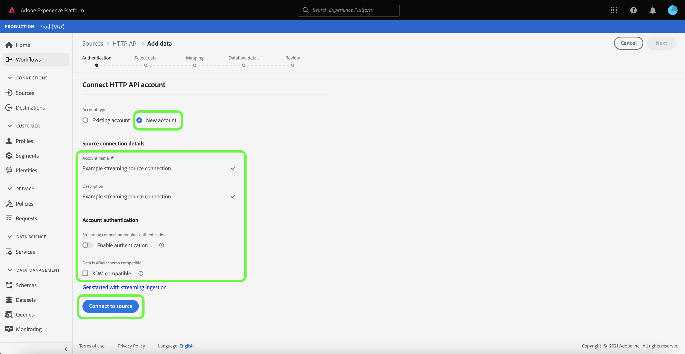

## Select data

After creating the HTTP API connection, the **[!UICONTROL Select data]** step appears, providing you with an interface to upload and preview your data.

Select **[!UICONTROL Upload files]** to upload your data. Alternatively, you can drag and drop your data into the [!UICONTROL Drag and drop files] section of the interface.

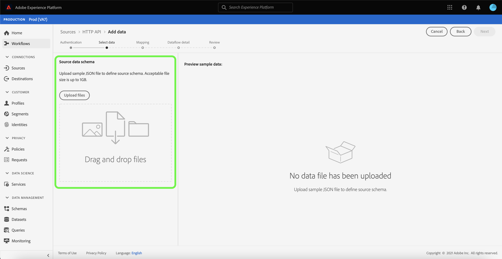

With your data uploaded, you can use the right-side of the interface to preview your file hierarchy. Select **[!UICONTROL Next]** to proceed.

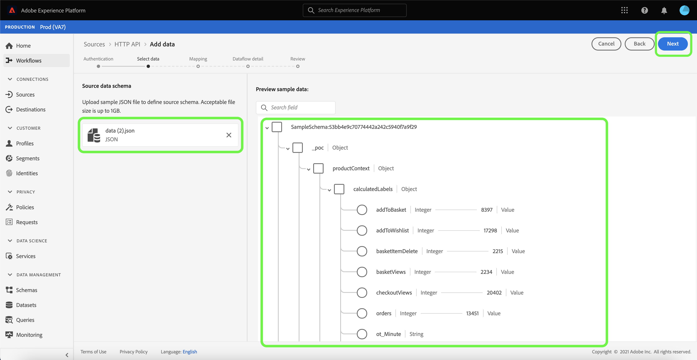

## Map data fields to an XDM schema

The [!UICONTROL Mapping] step appears, providing an interface to map the source data to a Platform dataset.

Parquet files must be XDM compliant and do not require you to manually configure the mapping, while CSV files require you to explicitly configure the mapping, but allow you to pick which source data fields to map. JSON files, if marked as XDM complaint, do not require manual configuration. However, if it is not marked as XDM compliant, it will require you to explicitly configure the mapping.

Choose a dataset for inbound data to be ingested into. You can either use an existing dataset or create a new one.

### Create a new dataset

To create a new dataset, select **[!UICONTROL New dataset]**. On the form that appears, provide the name, an optional description, as well as the target schema for the dataset. If you select a [!DNL Profile]-enabled schema, you can choose if the dataset should also be [!DNL Profile]-enabled.

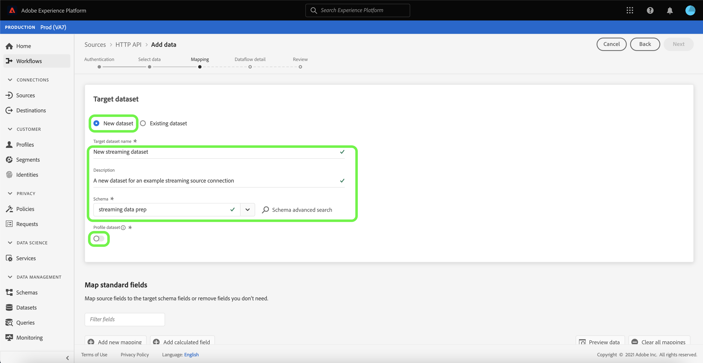

### Use an existing dataset

To use an existing dataset, select **[!UICONTROL Existing dataset]**. On the form that appears, select the dataset that you want to use. Once you select a dataset, you can choose if the dataset should be [!DNL Profile]-enabled.

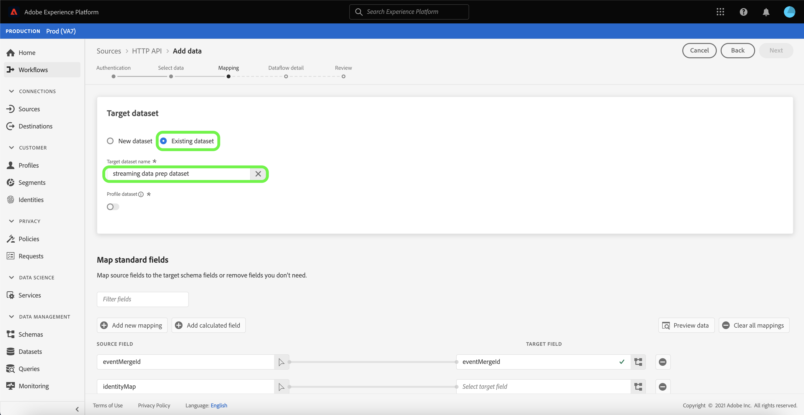

### Map standard fields

Based on your needs, you can choose to map fields directly, or use data prep functions to transform source data to derive computed or calculated values. For comprehensive steps on using the mapper interface and calculated fields, see the [Data Prep UI guide](../../../../../data-prep/ui/mapping.md).

To add a new source field, select **[!UICONTROL Add new mapping]**.

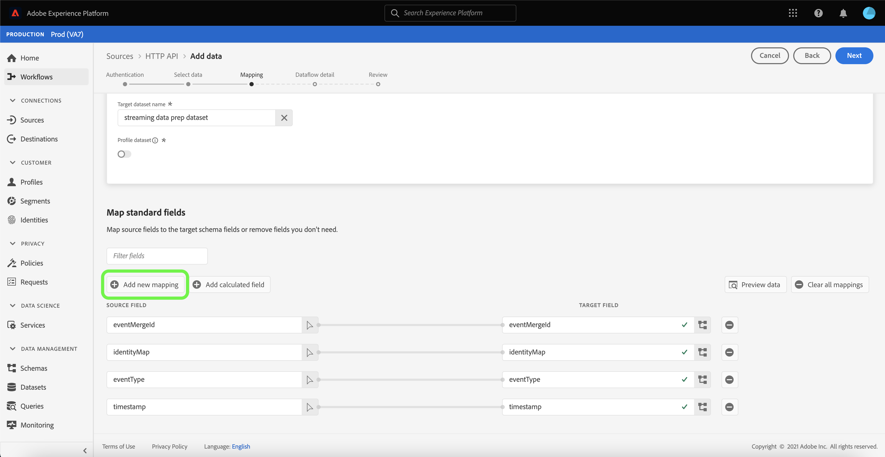

A new source field and target field pairing appears. To add a new source field, select the arrow icon beside the [!UICONTROL Select source field] input bar.

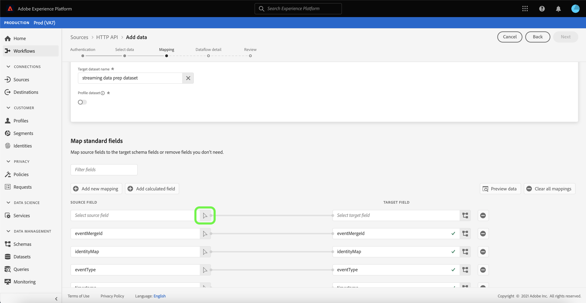

The [!UICONTROL Select attributes] panel allows you to explore your file hierarchy and select a specific source field to map to a target XDM field. Once you have selected the source field you want to map, select **[!UICONTROL Select]** to proceed.

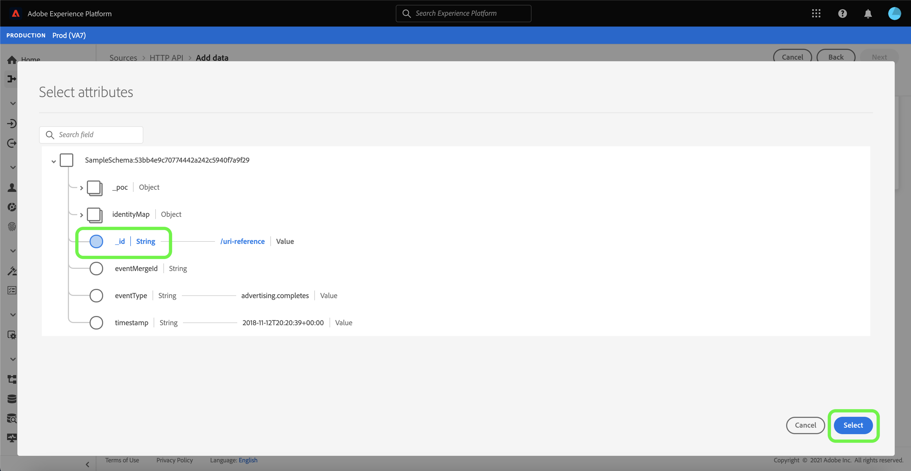

With a source field selected, you can now identify the appropriate target XDM field to map to. Select the schema icon under the target field section.

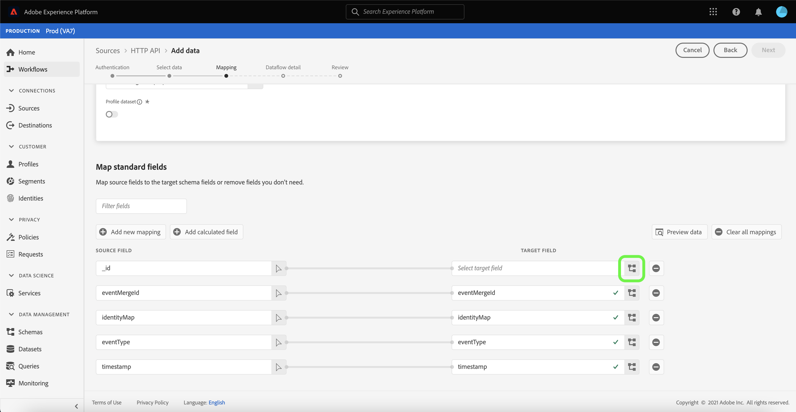

The [!UICONTROL Map source field to target field] window appears, providing you with an interface to explore the schema of your target dataset. Select the target field that matches your source field, and then select **[!UICONTROL Select]** to proceed.

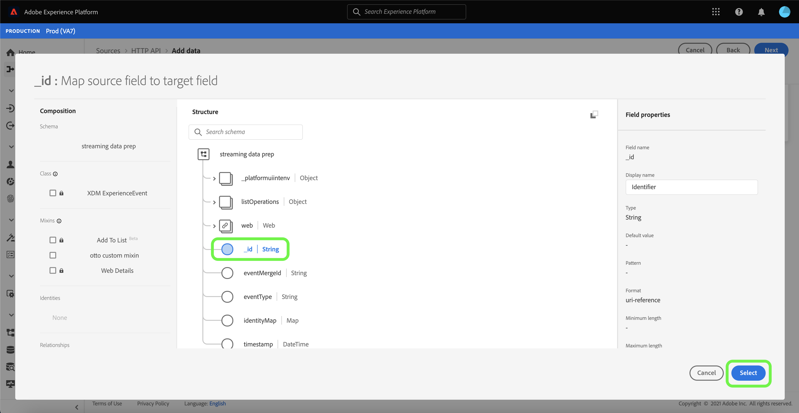

Once your source fields are all mapped to their appropriate target XDM fields, select **[!UICONTROL Next]**

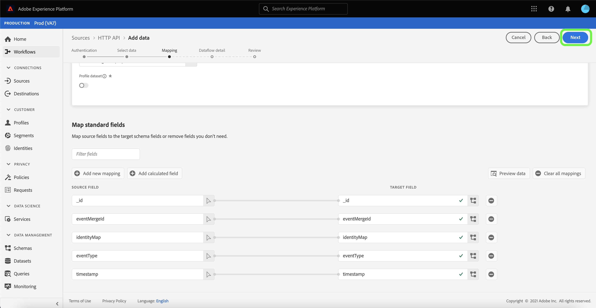

## Dataflow detail

The **[!UICONTROL Dataflow detail]** step appears. On this page, you can provide details for the created dataflow by giving a name and an optional description.

After providing details for the dataflow, select **[!UICONTROL Next]**.

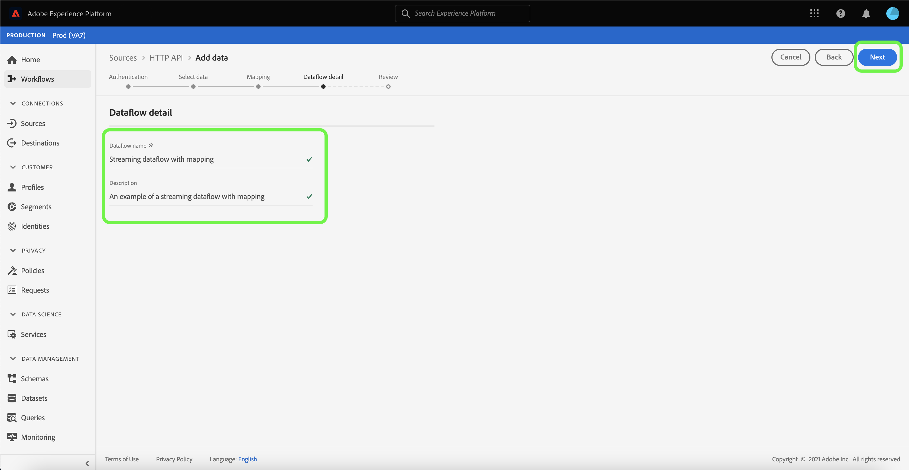

## Review

The **[!UICONTROL Review]** step appears, allowing you to review the details of your dataflow before it is created. Details are group within the following categories:

- **[!UICONTROL Connection]**: Shows the account name, source platform, and the source name.
- **[!UICONTROL Assign dataset and map fields]**: Shows the target dataset and the schema that the dataset adheres to.

After confirming the details are correct, select **[!UICONTROL Finish]**.

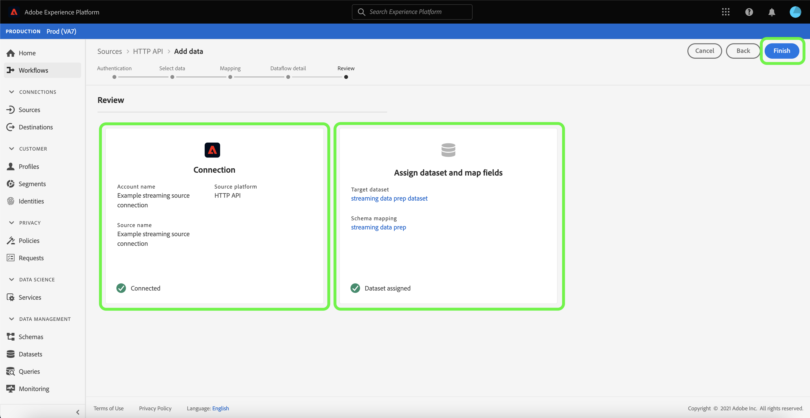

## Get streaming endpoint URL

With the connection created, the sources detail page appears. This page shows details of your newly created connection, including previously run dataflows, ID, and streaming endpoint URL.

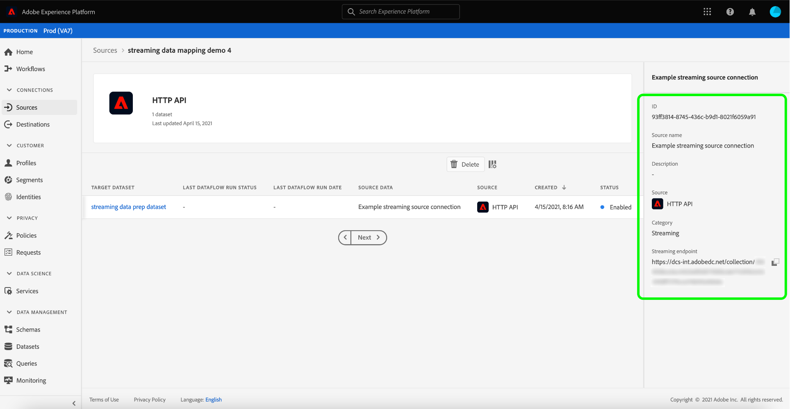

## Next steps

By following this tutorial, you have created a streaming HTTP connection, enabling you to use the streaming endpoint to access a variety of [!DNL Data Ingestion] APIs. For instructions to create a streaming connection in the API, please read the [creating a streaming connection tutorial](../../../api/create/streaming/http.md).

To learn how to stream data to Platform, please read either the tutorial on [streaming time series data](../../../../../ingestion/tutorials/streaming-time-series-data.md) or the tutorial on [streaming record data](../../../../../ingestion/tutorials/streaming-record-data.md).
