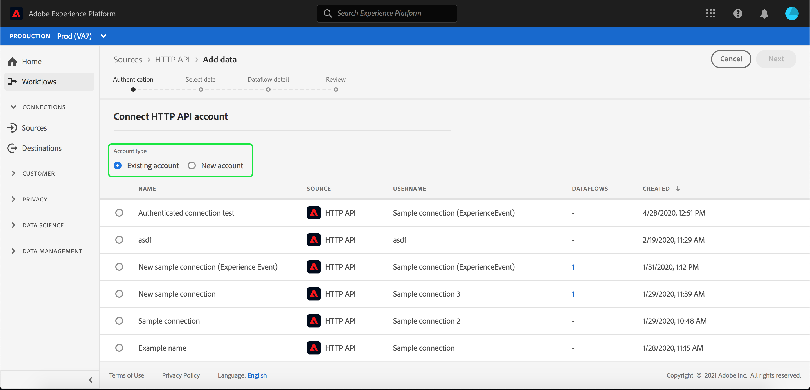

# Create a streaming connection using the UI

This UI guide will help you create a streaming connection using Adobe Experience Platform.

## Getting started

This tutorial requires a working understanding of the following components of Adobe Experience Platform:

-   [[!DNL Experience Data Model (XDM)] System](../../xdm/home.md): The standardized framework by which [!DNL Experience Platform] organizes customer experience data.
    -   [Basics of schema composition](../../xdm/schema/composition.md): Learn about the basic building blocks of XDM schemas, including key principles and best practices in schema composition.
    -   [Schema Editor tutorial](../../xdm/tutorials/create-schema-ui.md): Learn how to create custom schemas using the Schema Editor UI.
-   [[!DNL Real-time Customer Profile]](../../profile/home.md): Provides a unified, real-time consumer profile based on aggregated data from multiple sources.

## Create a streaming connection

After logging in to the [!DNL Experience Platform] UI, select **[!UICONTROL Sources]** from the left navigation bar to access the **[!UICONTROL Sources]** workspace. The **[!UICONTROL Catalog]** screen displays a variety of sources for which you can create an account with.

You can select the appropriate category from the catalog on the left-hand side of your screen. Alternatively, you can find the specific source you wish to work with using the search option.

Under the **[!UICONTROL Streaming]** category, select **[!UICONTROL HTTP API]**. If this is your first time using this connector, select **[!UICONTROL Configure]**. Otherwise, select **[!UICONTROL Add data]** to create a new HTTP streaming connector.

The **[!UICONTROL Connect HTTP API account]** page appears. On this page, you can either use new credentials or existing credentials.

### New account

If you are using new credentials, select **[!UICONTROL New account]**. On the input form that appears, provide an account name and an optional description. You will also get the option of providing the following configuration properties:

- **[!UICONTROL Authentication]:** This property determines whether or not the streaming connection requires authentication. Authentication ensures that data is collected from trusted sources. If you're dealing with Personally Identifiable Information (PII), this property should be turned on. By default, this property is turned off.
- **[!UICONTROL XDM Schema Compatibility]:** This property denotes if this streaming connection will be sending events which are compatible with XDM schemas. By default, this property is turned on.

When finished, select **[!UICONTROL Connect to source]**, followed by **[!UICONTROL Next]** to proceed.

### Existing account

To connect using existing credentials, select the HTTP API connection you want to use, then select **[!UICONTROL Next]** to proceed.

## Select data

After creating the HTTP API connection, the **[!UICONTROL Select data]** step appears, providing an interface to choose what dataset to connect with. You have the option to either create a new dataset or connect to an existing dataset.

### Create a new dataset

To create a new dataset, select **[!UICONTROL New dataset]**. On the form that appears, provide the name, an optional description, as well as the target schema for the dataset. If you select a Profile enabled schema, you can choose if the dataset should also be Profile enabled.

### Use an existing dataset

To use an existing dataset, select **[!UICONTROL Existing dataset]**. On the form that appears, select the dataset that you want to use. Once you select a dataset, you can choose if the dataset should be Profile enabled.

## Dataflow detail

The **[!UICONTROL Dataflow detail]** step appears. On this page, you can provide details for the created dataflow by giving a name and an optional description. 

After providing details for the dataflow, select **[!UICONTROL Next]**.

## Review

The **[!UICONTROL Review]** step appears, allowing you to review the details of your dataflow before it is created. Details are group within the following categories:

- **[!UICONTROL Connection]**: Shows the account name, source platform, and the source name.
- **[!UICONTROL Assign dataset and map fields]**: Shows the target dataset and the schema that the dataset adheres to.

## Next steps

By following this tutorial, you have created a streaming HTTP connection, enabling you to use the streaming endpoint to access a variety of [!DNL Data Ingestion] APIs. For instructions to create a streaming connection in the API, please read the [creating a streaming connection tutorial](../../../api/create/streaming/http.md).

To learn how to stream data to Platform, please read either the tutorial on [streaming time series data](../../../../../ingestion/tutorials/streaming-time-series-data.md) or the tutorial on [streaming record data](../../../../../ingestion/tutorials/streaming-record-data.md).
