# Configure a dataflow for an advertising connector in the UI

A dataflow is a scheduled task that retrieves and ingests data from a source to an Adobe Experience Platform dataset. This tutorial provides steps to configure a new dataflow using your advertising account.

## Getting started

This tutorial requires a working understanding of the following components of Adobe Experience Platform:

-   [[!DNL Experience Data Model] (XDM) System](../../../../xdm/home.md): The standardized framework by which [!DNL Experience Platform] organizes customer experience data.
    -   [Basics of schema composition](../../../../xdm/schema/composition.md): Learn about the basic building blocks of XDM schemas, including key principles and best practices in schema composition.
    -   [Schema Editor tutorial](../../../../xdm/tutorials/create-schema-ui.md): Learn how to create custom schemas using the Schema Editor UI.
-   [[!DNL Real-time Customer Profile]](../../../../profile/home.md): Provides a unified, real-time consumer profile based on aggregated data from multiple sources.

Additionally, this tutorial requires that you have already created a advertising account. A list of tutorials for creating different payment connectors in the UI can be found in the [source connectors overview](../../../home.md).

## Select data

After creating your advertising account, the **[!UICONTROL Select data]** step appears, providing an interactive interface for you to explore your file hierarchy.

- The left half of the interface is a directory browser, displaying your server's files and directories.
- The right half of the interface lets you preview up to 100 rows of data from a compatible file.

You can use the **[!UICONTROL Search]** option on the top of the page to quickly identify the source data you intend to use.

>[!NOTE]
>
>The search source data option is available to all tabular-based source connectors excluding the Analytics, Classifications, Event Hubs, and Kinesis connectors.

Once you find the source data, select the directory, then click **[!UICONTROL Next]**.

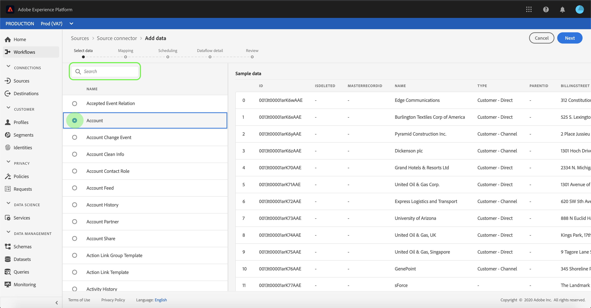

## Map data fields to an XDM schema

The **[!UICONTROL Mapping]** step appears, providing an interactive interface to map the source data to a [!DNL Platform] dataset.

Choose a dataset for inbound data to be ingested into. You can either use an existing dataset or create a new dataset.

### Use an existing dataset

To ingest data into an existing dataset, select **[!UICONTROL Use existing dataset]**, then click the dataset icon.

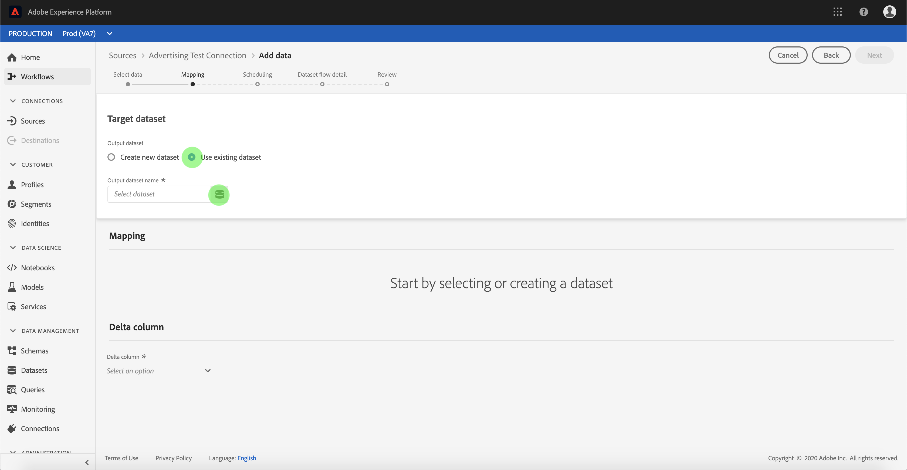

The **[!UICONTROL Select dataset]** dialog appears. Find the dataset you you wish to use, select it, then click **[!UICONTROL Continue]**.

### Use a new dataset

To ingest data into a new dataset, select **[!UICONTROL Create new dataset]** and enter a name and description for the dataset in the fields provided.

You can attach a schema field by entering a schema name in the **[!UICONTROL Select schema]** search bar. You can also select the drop down icon to see a list of existing schemas. Alternatively, you can select **[!UICONTROL Advanced search]** to access screen of existing schemas including their respective details.

During this step, you can enable your dataset for [!DNL Real-time Customer Profile] and create a holistic view of an entity's attributes and behaviors. Data from all enabled datasets will be included in [!DNL Profile] and changes are applied when you save your dataflow.

Toggle the **[!UICONTROL Profile dataset]** button to enable your target dataset for [!DNL Profile].

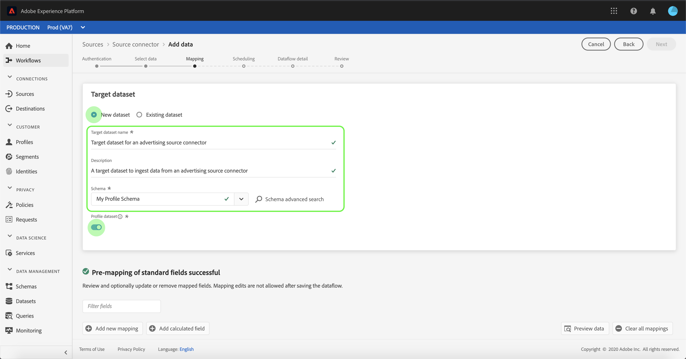

The **[!UICONTROL Select schema]** dialog appears. Select the schema you wish to apply to the new dataset, then click **[!DNL Done]**.

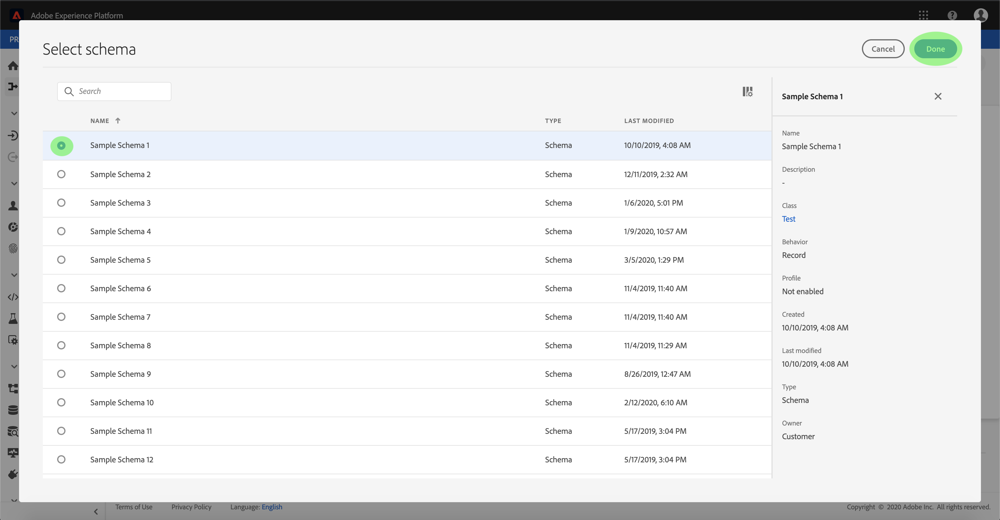

Based on your needs, you can choose to map fields directly, or use mapper functions to transform source data to derive computed or calculated values. For more information on data mapping and mapper functions, refer to the tutorial on [mapping CSV data to XDM schema fields](../../../../ingestion/tutorials/map-a-csv-file.md).

>[!TIP]
>
>[!DNL Platform] provides intelligent recommendations for auto-mapped fields based on the target schema or dataset that you selected. You can manually adjust mapping rules to suit your use cases.

Select **[!UICONTROL Preview data]** to see mapping results of up to 100 rows of sample data from the selected dataset.

During the preview, the identity column is prioritized as the first field, as it is the key information necessary when validating mapping results.

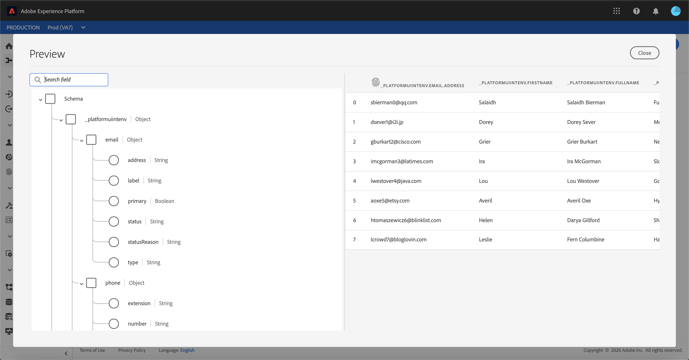

Once your source data is mapped, select **[!UICONTROL Close]**.

## Schedule ingestion runs

The **[!UICONTROL Scheduling]** step appears, allowing you to configure an ingestion schedule to automatically ingest the selected source data using the configured mappings. The following table outlines the different configurable fields for scheduling:

| Field | Description |
| --- | --- |
| Frequency | Selectable frequencies include `Once`, `Minute`, `Hour`, `Day`, and `Week`. |
| Interval | An integer that sets the interval for the selected frequency. |
| Start time | A UTC timestamp indicating when the very first ingestion is set to occur. |
| Backfill | A boolean value that determines what data is initially ingested. If **[!UICONTROL Backfill]** is enabled, all current files in the specified path will be ingested during the first scheduled ingestion. If **[!UICONTROL Backfill]** is disabled, only the files that are loaded in between the first run of ingestion and the **[!UICONTROL Start time]** will be ingested. Files loaded prior to **[!UICONTROL Start time]** will not be ingested. |
| Delta Column | An option with a filtered set of source schema fields of type, date, or time. This field is used to differentiate between new and existing data. Incremental data will be ingested based on the timestamp of selected column. |

Dataflows are designed to automatically ingest data on a scheduled basis. Start by selecting the ingestion frequency. Next, set the interval to designate the period between two flow runs. The interval's value should be a non-zero integer and should be set to greater than or equal to 15.

To set the start time for ingestion, adjust the date and time displayed in the start time box. Alternatively, you can select the calendar icon to edit the start time value. Start time must be greater than or equal to your current UTC time.

Select **[!UICONTROL Load incremental data by]** to assign the delta column. This field provides a distinction between new and existing data.

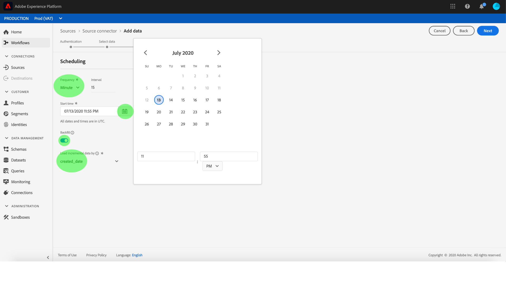

### Set up a one-time ingestion dataflow

To set up one-time ingestion, select the frequency drop down arrow and select **[!UICONTROL Once]**.

>[!TIP]
>
>**[!UICONTROL Interval]** and **[!UICONTROL Backfill]** are not visible during a one-time ingestion.

Once you have provided appropriate values to the schedule, select **[!UICONTROL Next]**.

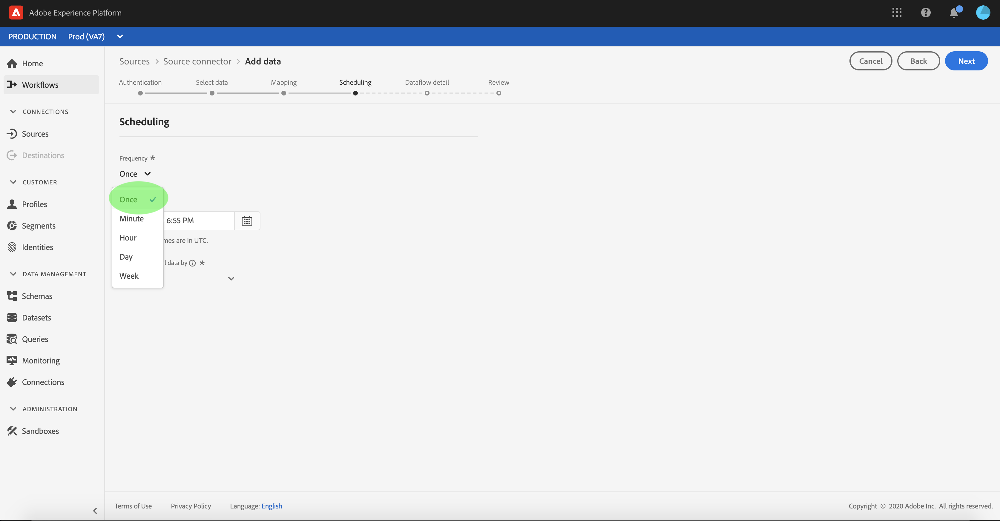

## Provide dataflow details

The **[!UICONTROL Dataflow detail]** step appears, allowing you to name and give a brief description about your new dataflow.

During this process, you can also enable **[!UICONTROL Partial ingestion]** and **[!UICONTROL Error diagnostics]**. Enabling **[!UICONTROL Partial ingestion]** provides the ability to ingest data containing errors up to a certain threshold. Once **[!UICONTROL Partial ingestion]** is enabled, drag the **[!UICONTROL Error threshold %]** dial to adjust the error threshold of the batch. Alternatively, you can manually adjust the threshold by selecting the input box. For more information, see the [partial batch ingestion overview](../../../../ingestion/batch-ingestion/partial.md).
Provide values for the dataflow and select **[!UICONTROL Next]**.

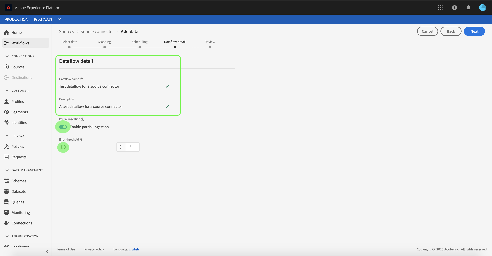

## Review your dataflow

The **[!UICONTROL Review]** step appears, allowing you to review your new dataflow before it is created. Details are grouped within the following categories:

- **[!UICONTROL Connection]**: Shows the source type, the relevant path of the chosen source file, and the amount of columns within that source file.
- **[!UICONTROL Assign dataset & map fields]**: Shows which dataset the source data is being ingested into, including the schema that the dataset adheres to.
- **[!UICONTROL Scheduling]**: Shows the active period, frequency, and interval of the ingestion schedule.

Once you have reviewed your dataflow, click **[!UICONTROL Finish]** and allow some time for the dataflow to be created.

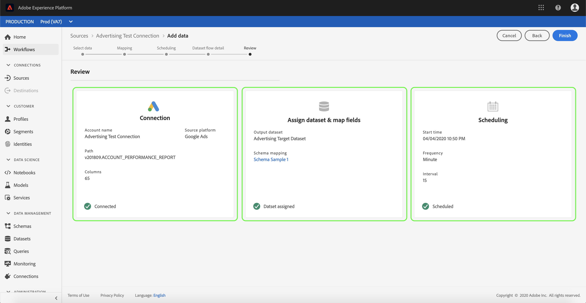

## Monitor your dataflow

Once your dataflow has been created, you can monitor the data that is being ingested through it to see information on ingestion rates, success, and errors. For more information on how to monitor dataflow, see the tutorial on [monitoring accounts and dataflows in the UI](../monitor.md).

## Delete your dataflow

You can delete dataflows that are no longer necessary or were incorrectly created using the **[!UICONTROL Delete]** function available in the **[!UICONTROL Dataflows]** workspace. For more information on how to delete dataflows, see the tutorial on [deleting dataflows in the UI](../delete.md).

## Next steps

By following this tutorial, you have successfully created a dataflow to bring in data from a marketing automation system and gained insight on monitoring datasets. Incoming data can now be used by downstream [!DNL Platform] services such as [!DNL Real-time Customer Profile] and [!DNL Data Science Workspace]. See the following documents for more details:

- [Real-time Customer Profile overview](../../../../profile/home.md)
- [Data Science Workspace overview](../../../../data-science-workspace/home.md)

## Appendix

The following sections provide additional information for working with source connectors.

### Disable a dataflow

When a dataflow is created, it immediately becomes active and ingests data according to the schedule it was given. You can disable an active dataflow at any time by following the instructions below.

Within the **[!UICONTROL Dataflows]** screen, select the name of the dataflow you wish to disable.

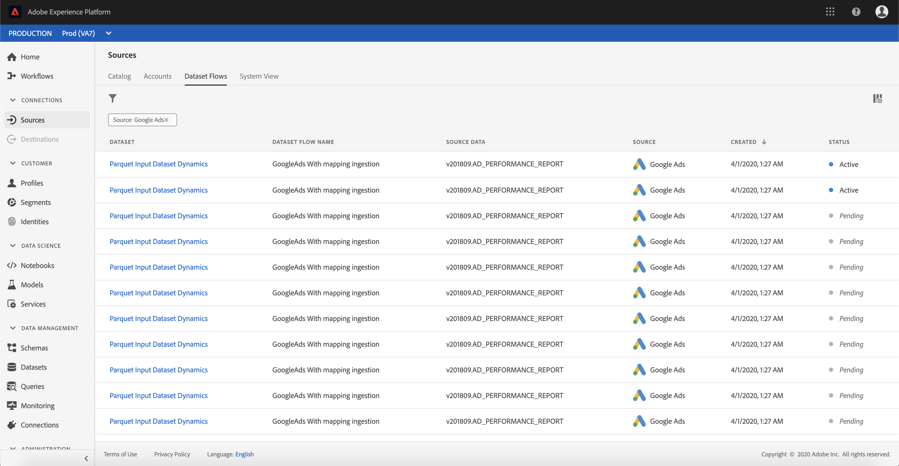

The **[!UICONTROL Properties]** column appears on the right-hand side of the screen. This panel contains an **[!UICONTROL Enabled]** toggle button. Click the toggle to disable the dataflow. The same toggle can be used to re-enable a dataflow after it has been disabled.

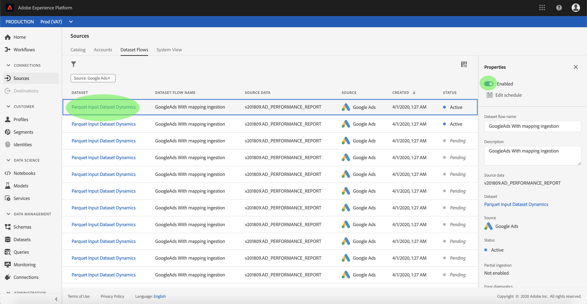

### Activate inbound data for [!DNL Profile] population

Inbound data from your source connector can be used towards enriching and populating your [!DNL Real-time Customer Profile] data. For more information on populating your [!DNL Real-time Customer Profile] data, see the tutorial on [Profile population](../profile.md).