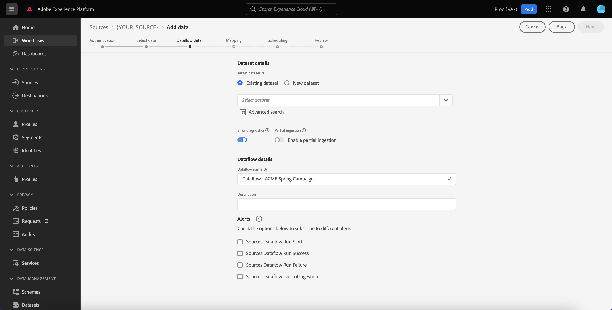
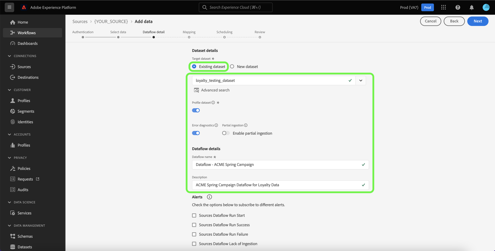
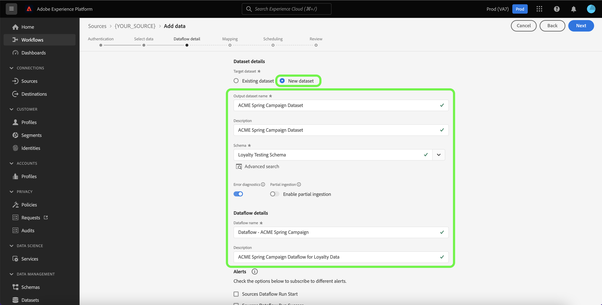
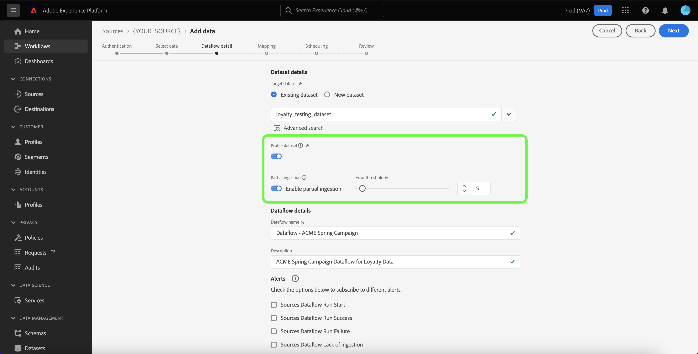
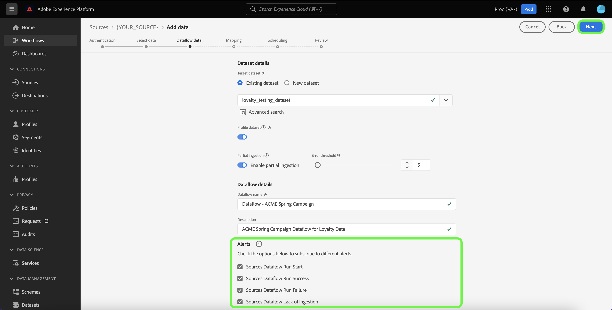
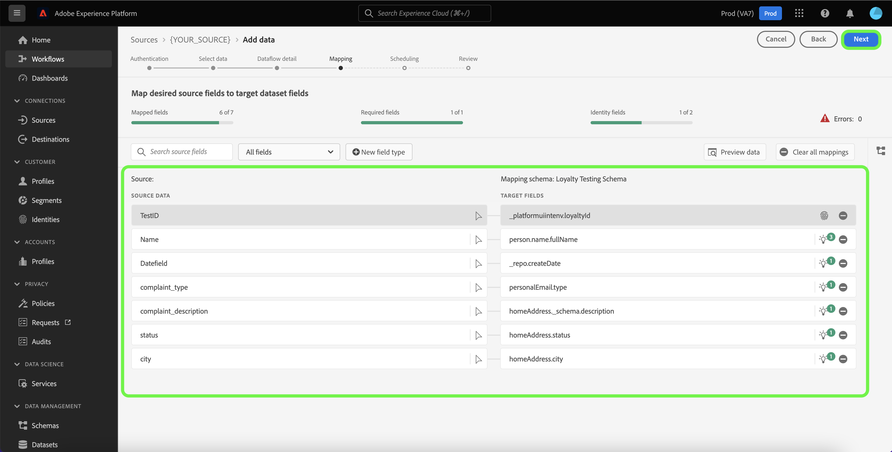
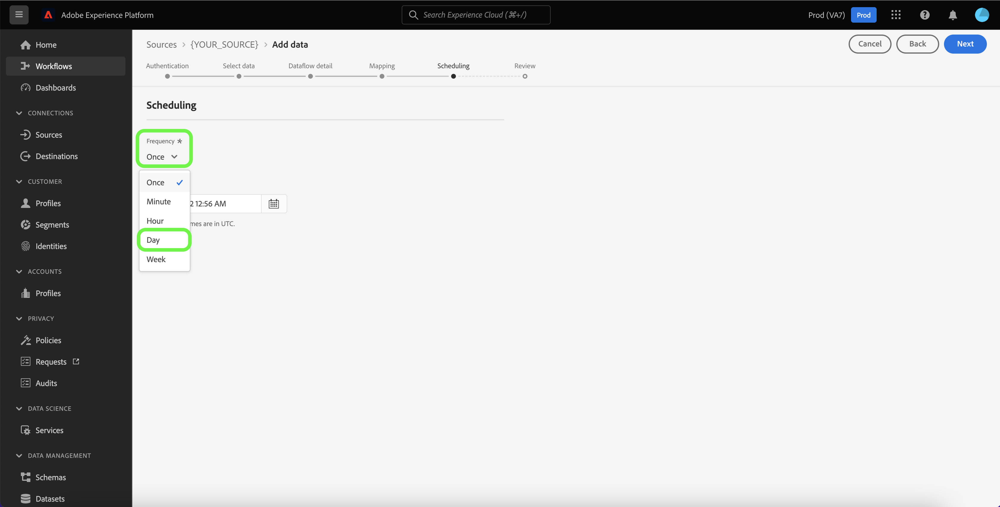
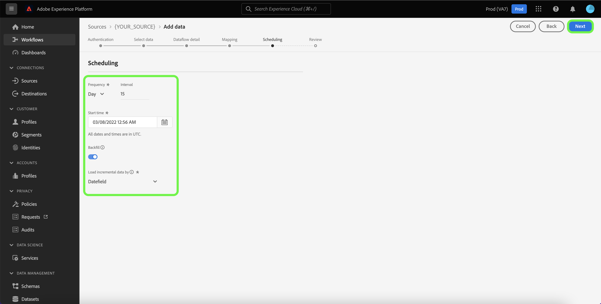
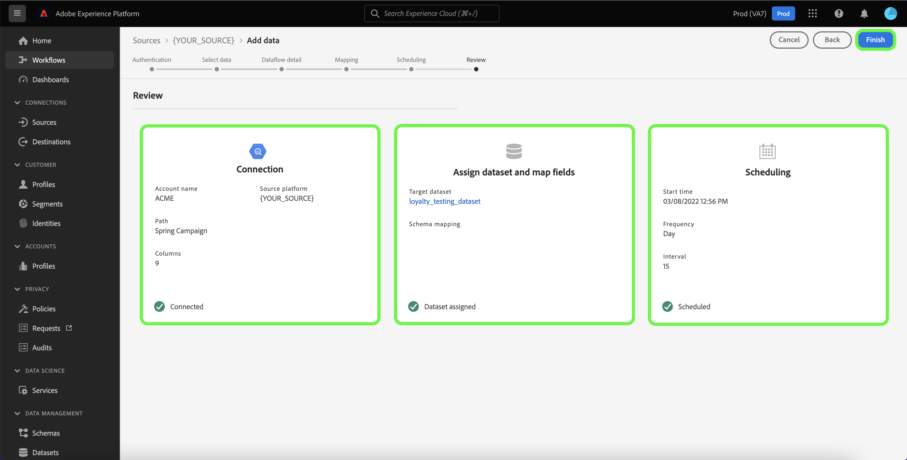

# Create a dataflow using a consent and preferences source in the UI

A dataflow is a scheduled task that retrieves and ingests data from a source to a dataset in Adobe Experience Platform. This tutorial provides steps on how to create a dataflow for a consent and preferences source using the Platform UI.

>[!NOTE]
>
>In order to create a dataflow, you must already have an authenticated account with the [!DNL OneTrust Integration] source. See the tutorial on [creating a [!DNL OneTrust Integration] source connection in the UI](../../ui/create/consent-and-preferences/onetrust.md) for more information.

## Getting started

This tutorial requires a working understanding of the following components of Platform:

* [Sources](../../../home.md): Platform allows data to be ingested from various sources while providing you with the ability to structure, label, and enhance incoming data using [!DNL Platform] services.
* [[!DNL Experience Data Model (XDM)] System](../../../../xdm/home.md): The standardized framework by which Experience Platform organizes customer experience data.
  * [Basics of schema composition](../../../../xdm/schema/composition.md): Learn about the basic building blocks of XDM schemas, including key principles and best practices in schema composition.
  * [Schema Editor tutorial](../../../../xdm/tutorials/create-schema-ui.md): Learn how to create custom schemas using the Schema Editor UI.
* [[!DNL Real-Time Customer Profile]](../../../../profile/home.md): Provides a unified, real-time consumer profile based on aggregated data from multiple sources.
* [[!DNL Data Prep]](../../../../data-prep/home.md): Allows data engineers to map, transform, and validate data to and from Experience Data Model (XDM).

## Add data

After creating your consent and preferences source account, the **[!UICONTROL Add data]** step appears, providing an interface for you to explore your consent and preferences account's table hierarchy.

* The left half of the interface is a browser, displaying a list of data tables contained in your account. The interface also includes a search option that allows you to quickly identify the source data you intend to use.
* The right half of the interface is a preview panel, allowing you to preview up to 100 rows of data.

>[!NOTE]
>
>The search source data option is available to all table-based sources excluding the Adobe Analytics, [!DNL Amazon Kinesis], and [!DNL Azure Event Hubs].

Once you find the source data, select the table, then select **[!UICONTROL Next]**.

## Provide dataflow details

The [!UICONTROL Dataflow detail] page allows you to select whether you want to use an existing dataset or a new dataset. During this process, you can also configure settings for [!UICONTROL Profile dataset], [!UICONTROL Error diagnostics], [!UICONTROL Partial ingestion], and [!UICONTROL Alerts].

### Use an existing dataset

To ingest data into an existing dataset, select **[!UICONTROL Existing dataset]**. You can either retrieve an existing dataset using the [!UICONTROL Advanced search] option or by scrolling through the list of existing datasets in the dropdown menu. Once you have selected a dataset, provide a name and a description for your dataflow.

### Use a new dataset

To ingest into a new dataset, select **[!UICONTROL New dataset]** and then provide an output dataset name and an optional description. Next, select a schema to map to using the [!UICONTROL Advanced search] option or by scrolling through the list of existing schemas in the dropdown menu. Once you have selected a schema, provide a name and a description for your dataflow.

### Enable [!DNL Profile] and error diagnostics

Next, select the **[!UICONTROL Profile dataset]** toggle to enable your dataset for [!DNL Profile]. This allows you to create a holistic view of an entity's attributes and behaviors. Data from all [!DNL Profile]-enabled datasets will be included in [!DNL Profile] and changes are applied when you save your dataflow.

[!UICONTROL Error diagnostics] enables detailed error message generation for any erroneous records that occur in your dataflow, while [!UICONTROL Partial ingestion] allows you to ingest data containing errors, up to a certain threshold that you manually define. See the [partial batch ingestion overview](../../../../ingestion/batch-ingestion/partial.md) for more information.

### Enable alerts

You can enable alerts to receive notifications on the status of your dataflow. Select an alert from the list to subscribe to receive notifications on the status of your dataflow. For more information on alerts, see the guide on [subscribing to sources alerts using the UI](../alerts.md).

When you are finished providing details to your dataflow, select **[!UICONTROL Next]**.

## Map data fields to an XDM schema

>[!IMPORTANT]
>
>You cannot map any dynamic key-pair values as an object from [!DNL OneTrust] to Platform and must specify those keys in the target schema in order to map your data during ingestion.

The [!UICONTROL Mapping] step appears, providing you with an interface to map the source fields from your source schema to their appropriate target XDM fields in the target schema.

Platform provides intelligent recommendations for auto-mapped fields based on the target schema or dataset that you selected. You can manually adjust mapping rules to suit your use cases. Based on your needs, you can choose to map fields directly, or use data prep functions to transform source data to derive computed or calculated values. For comprehensive steps on using the mapper interface and calculated fields, see the [Data Prep UI guide](../../../../data-prep/ui/mapping.md).

Once your source data is successfully mapped, select **[!UICONTROL Next]**.

## Schedule ingestion runs

The [!UICONTROL Scheduling] step appears, allowing you to configure an ingestion schedule to automatically ingest the selected source data using the configured mappings. By default, scheduling is set to `Once`. To adjust your ingestion frequency, select **[!UICONTROL Frequency]** and then select an option from the dropdown menu.

>[!TIP]
>
>Interval and backfill are not visible during a one-time ingestion.

If you set your ingestion frequency to `Minute`, `Hour`, `Day`, or `Week`, then you must set an interval to establish a set time frame between every ingestion. For example, an ingestion frequency set to `Day` and  an interval set to `15` means that your dataflow is scheduled to ingest data every 15 days.

During this step, you can also enable **backfill** and define a column for the incremental ingestion of data. Backfill is used to ingest historical data, while the column you define for incremental ingestion allows new data to be differentiated from existing data.

See the table below for more information on scheduling configurations.

| Field | Description |
| --- | --- |
| Frequency | The frequency in which an ingestion happens. Selectable frequencies include `Once`, `Minute`, `Hour`, `Day`, and `Week`. |
| Interval | An integer that sets the interval for the selected frequency. The interval's value should be a non-zero integer and should be set to greater than or equal to 15. |
| Start time | A UTC timestamp indicating when the very first ingestion is set to occur. Start time must be greater than or equal to your current UTC time. |
| Backfill | A boolean value that determines what data is initially ingested. If backfill is enabled, all current files in the specified path will be ingested during the first scheduled ingestion. If backfill is disabled, only the files that are loaded in between the first run of ingestion and the start time will be ingested. Files loaded prior to start time will not be ingested. |
| Load incremental data by | An option with a filtered set of source schema fields of type, date, or time. The field that you select for **[!UICONTROL Load incremental data by]** must have its date-time values in UTC timezone in order to correctly load incremental data. All table-based batch sources pick incremental data by comparing a delta column time stamp value to the corresponding flow run window UTC time, and then copying the data from the source, if any new data is found within the UTC time window. |

## Review your dataflow

The **[!UICONTROL Review]** step appears, allowing you to review your new dataflow before it is created. Details are grouped within the following categories:

* **[!UICONTROL Connection]**: Shows the source type, the relevant path of the chosen source file, and the amount of columns within that source file.
* **[!UICONTROL Assign dataset & map fields]**: Shows which dataset the source data is being ingested into, including the schema that the dataset adheres to.
* **[!UICONTROL Scheduling]**: Shows the active period, frequency, and interval of the ingestion schedule.

Once you have reviewed your dataflow, select **[!UICONTROL Finish]** and allow some time for the dataflow to be created.

## Monitor your dataflow

Once your dataflow has been created, you can monitor the data that is being ingested through it to see information on ingestion rates, success, and errors. For more information on how to monitor dataflow, see the tutorial on [monitoring accounts and dataflows in the UI](../monitor.md).

## Delete your dataflow

You can delete dataflows that are no longer necessary or were incorrectly created using the **[!UICONTROL Delete]** function available in the **[!UICONTROL Dataflows]** workspace. For more information on how to delete dataflows, see the tutorial on [deleting dataflows in the UI](../delete.md).

## Next steps

By following this tutorial, you have successfully created a dataflow to bring data from your consent and preferences source to Platform. Incoming data can now be used by downstream [!DNL Platform] services such as [!DNL Real-Time Customer Profile] and [!DNL Data Science Workspace]. See the following documents for more details:

* [[!DNL Real-Time Customer Profile] overview](../../../../profile/home.md)
* [[!DNL Data Science Workspace] overview](../../../../data-science-workspace/home.md)

>[!WARNING]
>
> The Platform UI shown in the following video is out-of-date. Please refer to the documentation above for the latest UI screenshots and functionality.
>
>[!VIDEO](https://video.tv.adobe.com/v/29711?quality=12&learn=on)
