# Configure a dataflow for a customer success connector in the UI

A dataflow is a scheduled task that retrieves and ingests data from a source to a Platform dataset. This tutorial provides steps to configure a new dataflow using your customer success account.

## Getting started

This tutorial requires a working understanding of the following components of Adobe Experience Platform:

-   [Experience Data Model (XDM) System](../../../../xdm/home.md): The standardized framework by which Experience Platform organizes customer experience data.
    -   [Basics of schema composition](../../../../xdm/schema/composition.md): Learn about the basic building blocks of XDM schemas, including key principles and best practices in schema composition.
    -   [Schema Editor tutorial](../../../../xdm/tutorials/create-schema-ui.md): Learn how to create custom schemas using the Schema Editor UI.
-   [Real-time Customer Profile](../../../../profile/home.md): Provides a unified, real-time consumer profile based on aggregated data from multiple sources.

Additionally, this tutorial requires that you have already created a customer success account. A list of tutorials for creating different customer success connectors in the UI can be found in the [source connectors overview](../../../home.md).

## Select data

After creating your customer success connector, the *Select data* step appears, providing an interactive interface for you to explore your file hierarchy.

- The left half of the interface is a directory browser, displaying your server's files and directories.
- The right half of the interface lets you preview up to 100 rows of data from a compatible file.

Select the directory you wish to use, then click **Next**.

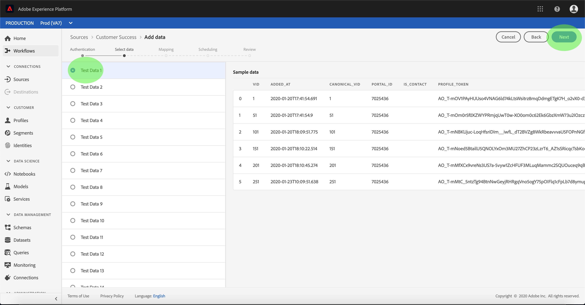

## Map data fields to an XDM schema

The *Mapping* step appears, providing an interactive interface to map the source data to a Platform dataset.

Choose a dataset for inbound data to be ingested into. You can either use an existing dataset or create a new dataset.

### Use an existing dataset

To ingest data into an existing dataset, select **Use existing dataset**, then click the dataset icon.

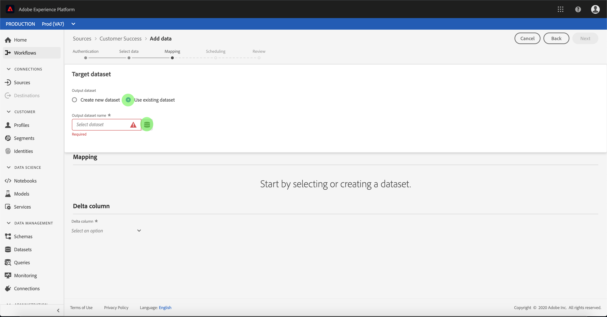

The *Select dataset* dialog appears. Find the dataset you you wish to use, select it, then click **Continue**.

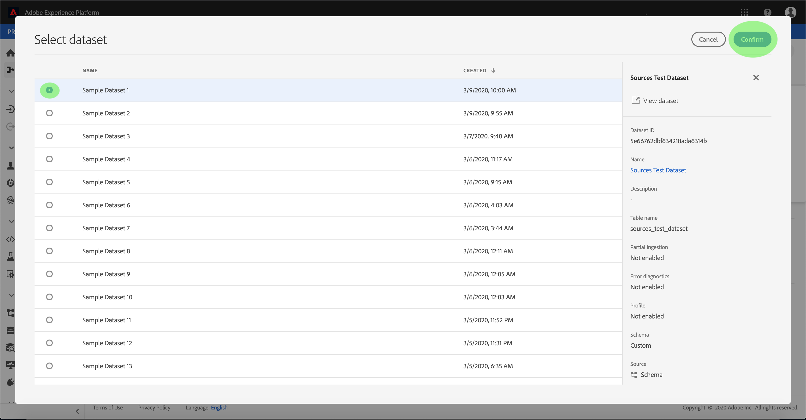

### Use a new dataset

To ingest data into a new dataset, select **Create new dataset** and enter a name and description for the dataset in the fields provided. 

During this process, you can also enable *Partial ingestion* and *Error diagnostics*. Enabling *Partial ingestion* provides the ability to ingest data containing errors, up to a certain threshold that you can set. Enabling *Error diagnostics* will provide details on any incorrect data that is batched separately. For more information, see the [partial batch ingestion overview](../../../../ingestion/batch-ingestion/partial.md).

Next, click the schema icon.

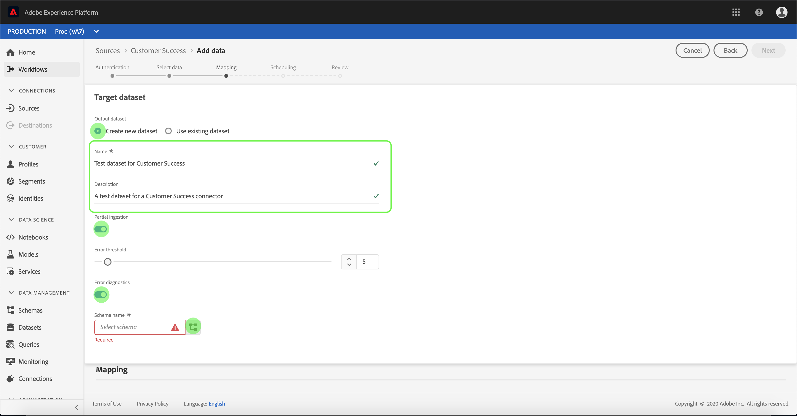

The *Select schema* dialog appears. Select the schema you wish to apply to the new dataset, then click **Done**.

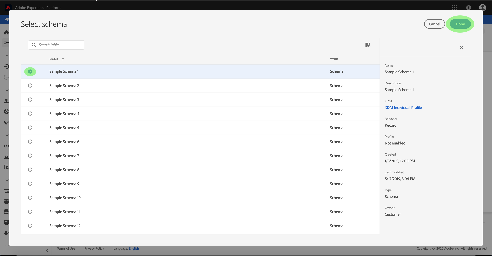

Based on your needs, you can choose to map fields directly, or use mapper functions to transform source data to derive computed or calculated values. For more information on data mapping and mapper functions, refer to the tutorial on [mapping CSV data to XDM schema fields](../../../../ingestion/tutorials/map-a-csv-file.md).

Once your source data is mapped, click **Next**.

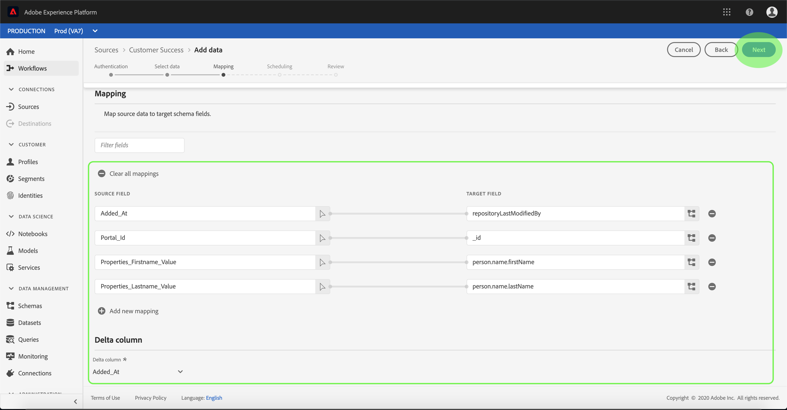

## Schedule ingestion runs

The *Scheduling* step appears, allowing you to configure an ingestion schedule to automatically ingest the selected source data using the configured mappings. The following table outlines the different configurable fields for scheduling:

| Field | Description |
| --- | --- |
| Frequency | Selectable frequencies include Minute, Hour, Day, and Week. |
| Interval | An integer that sets the interval for the selected frequency. |
| Start time | A UTC timestamp for which the very first ingestion will occur. |
| Backfill | A boolean value that determines what data is initially ingested. If *Backfill* is enabled, all current files in the specified path will be ingested during the first scheduled ingestion. If *Backfill* is disabled, only the files that are loaded in between the first run of ingestion and the *Start time* will be ingested. Files loaded prior to *Start time* will not be ingested. |

Dataflows are designed to automatically ingest data on a scheduled basis. If you wish to only ingest once through this workflow, you can do so by configuring the **Frequency** to "Day" and applying a very large number for the **Interval**, such as 10000 or similar.

Provide values for the schedule and click **Next**.

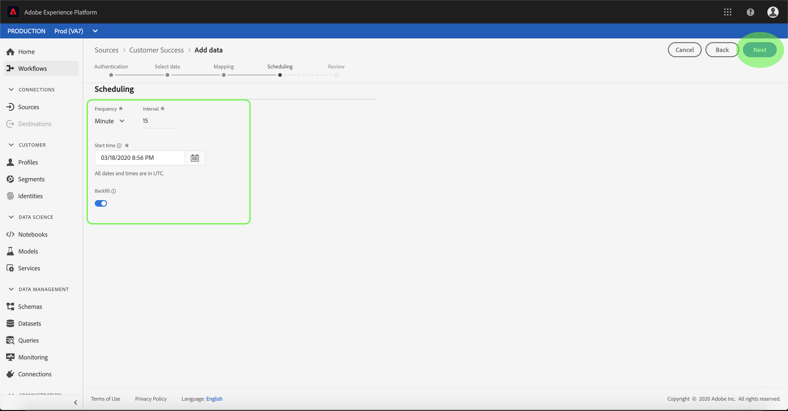

## Review your dataflow

The *Review* step appears, allowing you to review your new dataflow before it is created. Details are grouped within the following categories:

- *Connection details*: Shows the source type, the relevant path of the chosen source file, and the amount of columns within that source file.
- *Mapping details*: Shows which dataset the source data is being ingested into, including the schema that the dataset adheres to.
- *Schedule details*: Shows the active period, frequency, and interval of the ingestion schedule.

Once you have reviewed your dataflow, click **Finish** and allow some time for the dataflow to be created.

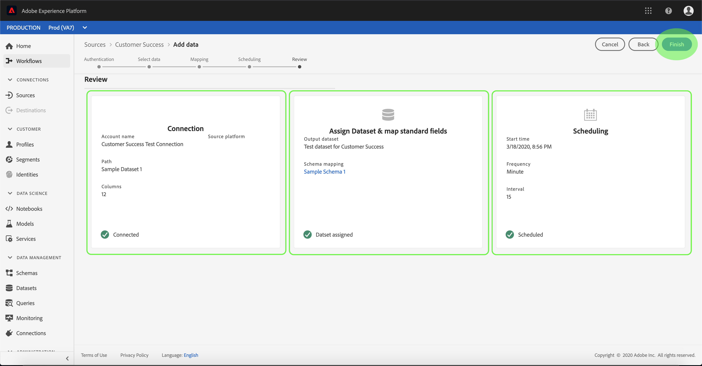

## Monitor your dataflow

Once your dataflow has been created, you can monitor the data that is being ingested through it. Follow the steps below to access a dataflow's dataset monitor.

Within the *Sources* workspace, select the customer success source you wish to view under the *Customer Success* category. Select *Connect Source* to launch the authentication interface. To view an existing dataflow, select *Existing account* and select the account you wish to access.

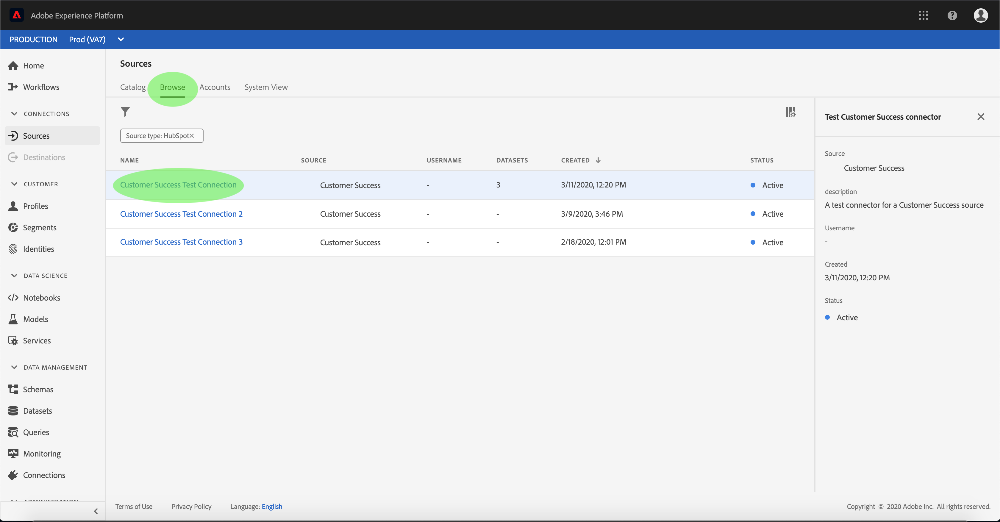

 The *Source activity* screen appears. From here, click the name of a dataset whose activity you want to monitor.

 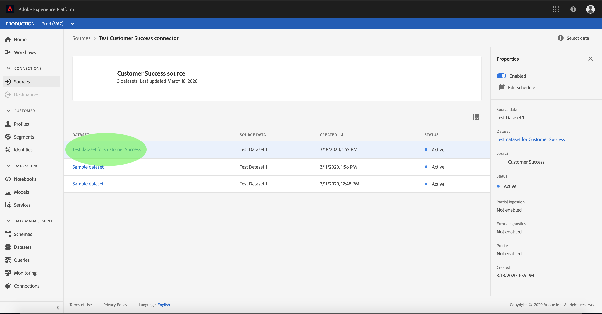

 The *Dataset activity* screen appears. This page displays the rate of messages being consumed in the form of a graph.

 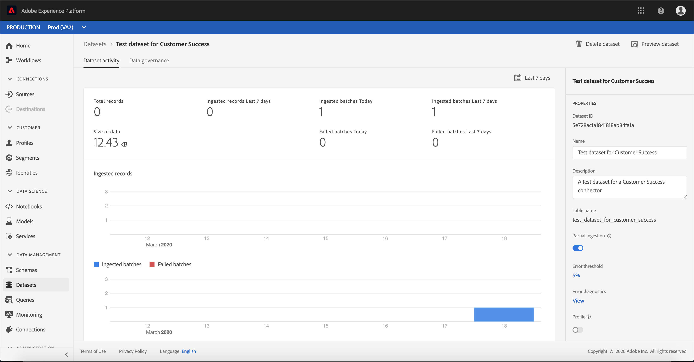

 For more information on monitoring datasets and ingestion, refer to the tutorial on [monitoring streaming dataflows](../../../../ingestion/quality/monitor-data-flows.md).

## Next steps

By following this tutorial, you have successfully created a dataflow to bring in data from a customer success source and gained insight on monitoring datasets. Incoming data can now be used by downstream Platform services such as Real-time Customer Profile and Data Science Workspace. See the following documents for more details:

-   [Real-time Customer Profile overview](../../../../profile/home.md)
-   [Data Science Workspace overview](../../../../data-science-workspace/home.md)

## Appendix

The following sections provide additional information for working with source connectors.

### Disable a dataflow

When a dataflow is created, it immediately becomes active and ingests data according to the schedule it was given. You can disable an active dataflow at any time by following the instructions below.

Within the *authenticaton* screen, select the name of the account that's associated with the dataflow you wish to disable.

The _Source activity_ page appears. Select the active dataflow from the list to open its *Properties* column on the right-hand side of the screen, which contains an **Enabled** toggle button. Click the toggle to disable the dataflow. The same toggle can be used to re-enable a dataflow after it has been disabled.

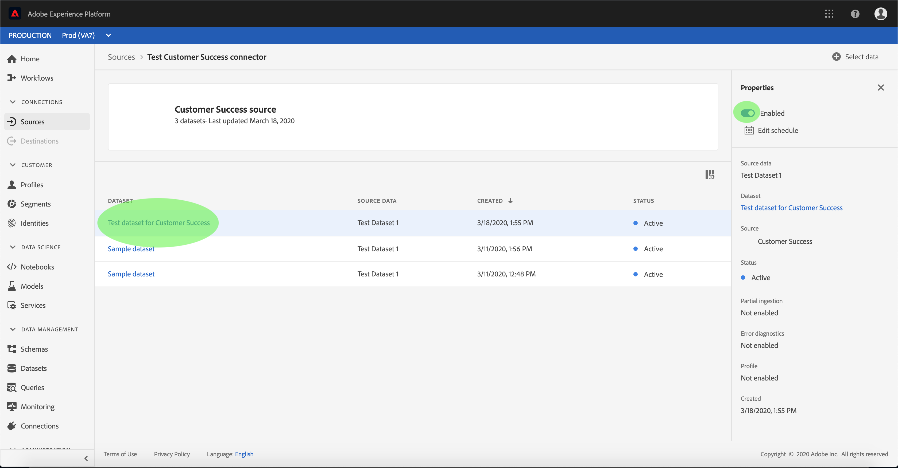

### Activate inbound data for Profile population

Inbound data from your source connector can be used towards enriching and populating your Real-time Customer Profile data. For more information on populating your Real-Customer Profile data, see the tutorial on [Profile population](../profile.md).