# Create a streaming dataflow for a cloud storage source in the UI

A dataflow is a scheduled task that retrieves and ingests data from a source to an Adobe Experience Platform dataset. This tutorial provides steps to create a streaming dataflow for a cloud storage source in the UI.

Before attempting this tutorial, you must first establish a valid and authenticated connection between your cloud storage account and Platform. If you do not already have an authenticated connection, see one of the following tutorials for information on authenticating your streaming cloud storage accounts:

- [[!DNL Amazon Kinesis]](../../../ui/create/cloud-storage/kinesis.md)
- [[!DNL Azure Event Hubs]](../../../ui/create/cloud-storage/eventhub.md)
- [[!DNL Google PubSub]](../../../ui/create/cloud-storage/google-pubsub.md)

## Getting started

This tutorial requires a working understanding of the following components of Adobe Experience Platform:

- [Dataflows](../../../../../dataflows/home.md): Dataflows are a representation of data jobs that move data across Platform. Dataflows are configured across different services, from sources, to [!DNL Identity Service], to [!DNL Profile], and to [!DNL Destinations].
- [Data Prep](../../../../../data-prep/home.md): Data Prep allows data engineers to map, transform, and validate data to and from Experience Data Model (XDM). Data Prep appears as a "Map" step in the Data Ingestion processes, including CSV Ingestion workflow.
- [[!DNL Experience Data Model (XDM)] System](../../../../../xdm/home.md): The standardized framework by which [!DNL Experience Platform] organizes customer experience data.
  - [Basics of schema composition](../../../../../xdm/schema/composition.md): Learn about the basic building blocks of XDM schemas, including key principles and best practices in schema composition.
  - [Schema Editor tutorial](../../../../../xdm/tutorials/create-schema-ui.md): Learn how to create custom schemas using the Schema Editor UI.
- [[!DNL Real-Time Customer Profile]](../../../../../profile/home.md): Provides a unified, real-time consumer profile based on aggregated data from multiple sources.

## Add data

>[!NOTE]
>
>You can only create one source dataflow per consumer group for a given Event Hub.

After creating your authenticating your streaming cloud storage account, the **[!UICONTROL Select data]** step appears, providing an interface for you to select which data stream you will bring to Platform.

- The left part of the interface is a browser that allows you to view the available data streams within your account;
- The right part of the interface lets you preview up to 100 rows of data from a JSON file.

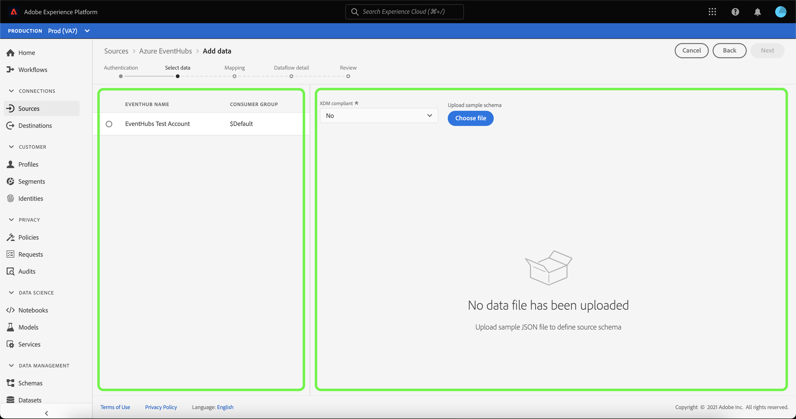

Select the data stream that you want to use, and then select **[!UICONTROL Choose file]** to upload a sample schema.

>[!TIP]
>
>If your data is XDM compliant, you can skip uploading a sample schema, and select **[!UICONTROL Next]** to proceed.

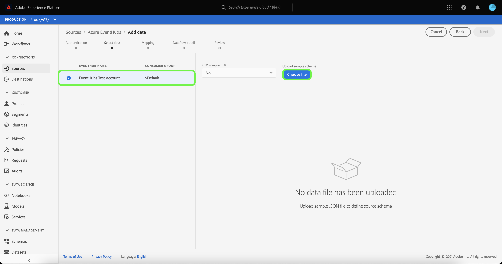

Once your schema uploads, the preview interface updates to display a preview of the schema you uploaded. The preview interface allows you to inspect the contents and structure of a file. You can also use the [!UICONTROL Search field] utility to access specific items from within your schema.

When finished, select **[!UICONTROL Next]**.

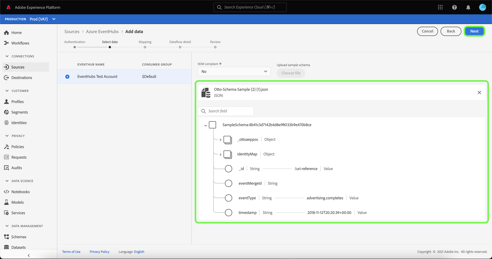

## Mapping

The **[!UICONTROL Mapping]** step appears, providing an interface to map the source data to a Platform dataset. 

Choose a dataset for inbound data to be ingested into. You can either use an existing dataset or create a new one.

### New dataset

To ingest data into a new dataset, select **[!UICONTROL New dataset]** and enter a name and description for the dataset in the fields provided. To add a schema, you can enter an existing schema name in the **[!UICONTROL Select schema]** dialog box. Alternatively, you can select **[!UICONTROL Schema advanced search]** to search for an appropriate schema.

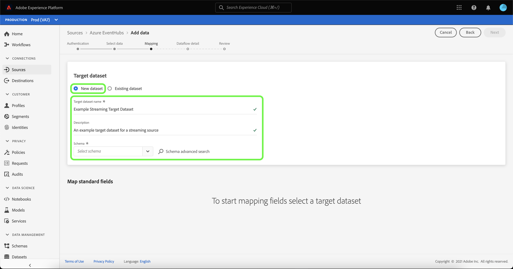

The [!UICONTROL Select schema] window appears, providing you with a list of available schemas to choose from. Select a schema from the list to update the right-rail to display details specific to the schema you selected, including information on whether the schema is enabled for [!DNL Profile]. 

Once you have identified and selected the schema you want to use, select **[!UICONTROL Done]**.

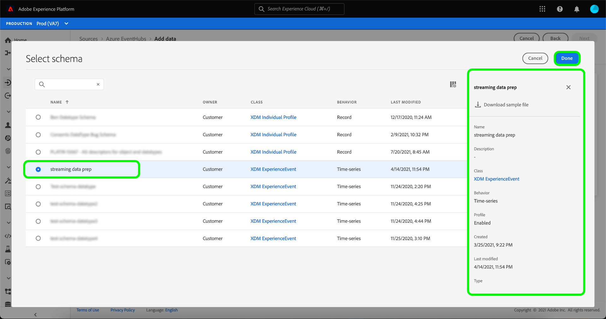

The [!UICONTROL Target dataset] page updates with your selected schema displayed as part of the dataset. During this step, you can enable your dataset for [!DNL Profile] and create a holistic view of an entity's attributes and behaviors. Data from all enabled datasets will be included in [!DNL Profile] and changes are applied when you save your dataflow.

Toggle the **[!UICONTROL Profile dataset]** button to enable your target dataset for [!DNL Profile].

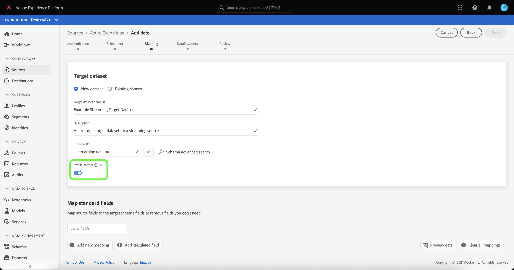

### Existing dataset

To ingest data into an existing dataset, select **[!UICONTROL Existing dataset]**, then select the dataset icon.

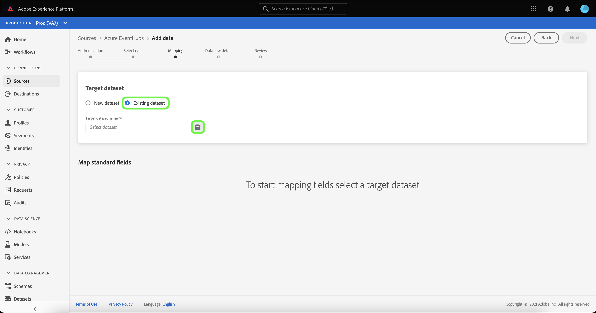

The **[!UICONTROL Select dataset]** dialog appears, providing you with a list of available datasets to choose from. Select a dataset from the list to update the right-rail to display details specific to the dataset you selected, including information on whether the dataset can be enabled for [!DNL Profile].

Once you have identified and selected the dataset you want to use, select **[!UICONTROL Done]**.

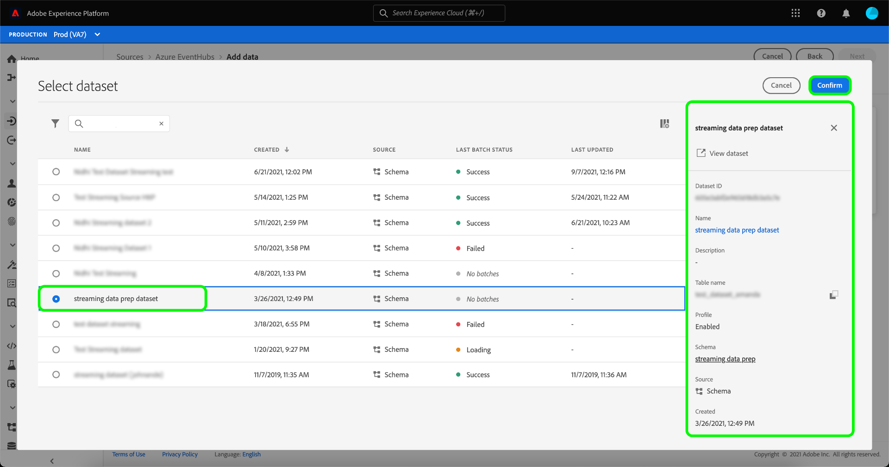

Once you select your dataset, select the [!DNL Profile] toggle to enable your dataset for [!DNL Profile].

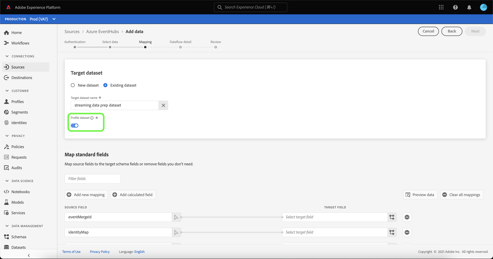

### Map standard fields

With your dataset and schema established, the **[!UICONTROL Map standard fields]** interface appears, allowing you to manually configure mapping fields for your data.

>[!TIP]
>
>Platform provides intelligent recommendations for auto-mapped fields based on the target schema or dataset that you selected. You can manually adjust mapping rules to suit your use cases.

Based on your needs, you can choose to map fields directly, or use data prep functions to transform source data to derive computed or calculated values. For comprehensive steps on using the mapper interface and calculated fields, see the [Data Prep UI guide](../../../../../data-prep/ui/mapping.md).

Once your source data is mapped, select **[!UICONTROL Next]**.

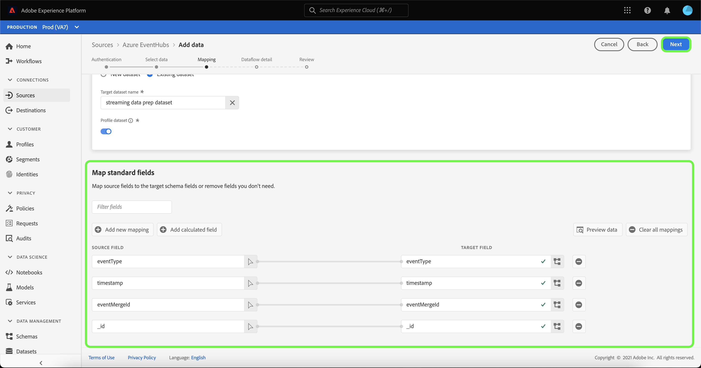

## Dataflow detail

The **[!UICONTROL Dataflow detail]** step appears, allowing you to name and give a brief description about your new dataflow.

Provide values for the dataflow and select **[!UICONTROL Next]**.

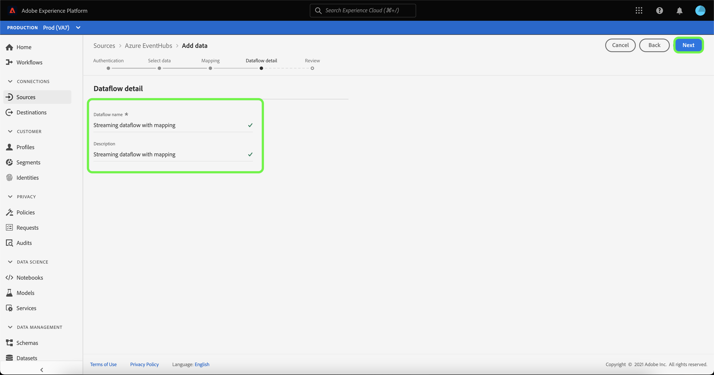

### Review

The **[!UICONTROL Review]** step appears, allowing you to review your new dataflow before it is created. Details are grouped within the following categories:

- **[!UICONTROL Connection]**: Displays your account name, type of source, and other miscellaneous information specific to the streaming cloud storage source you are using.
- **[!UICONTROL Assign dataset and map fields]**: Displays the target dataset and schema you are using for your dataflow.

Once you have reviewed your dataflow, select **[!UICONTROL Finish]** and allow some time for the dataflow to be created.

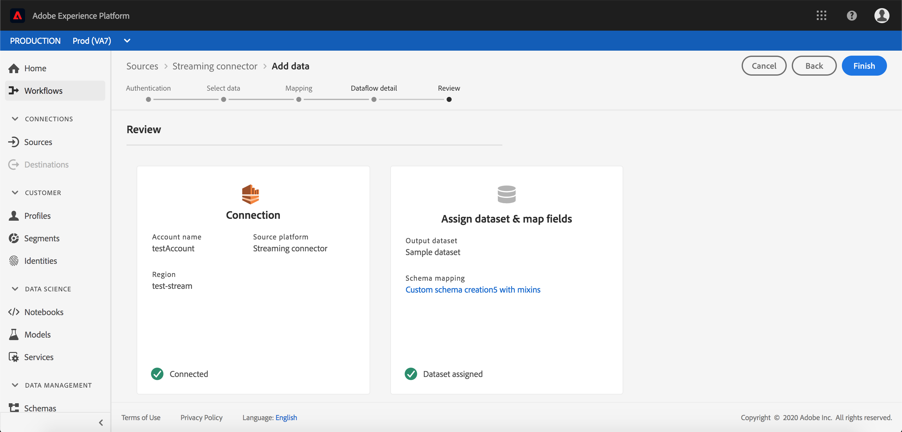

## Monitor and delete your dataflow

Once your streaming cloud storage dataflow has been created, you can monitor the data that is being ingested through it. For more information on monitoring and deleting streaming dataflows, see the tutorial on [monitoring streaming dataflows](../../monitor-streaming.md).

## Next steps

By following this tutorial, you have successfully created a dataflow to stream data from a cloud storage source. Incoming data can now be used by downstream Platform services such as [!DNL Real-Time Customer Profile] and [!DNL Data Science Workspace]. See the following documents for more details:

- [[!DNL Real-Time Customer Profile] overview](../../../../../profile/home.md)
- [[!DNL Data Science Workspace] overview](../../../../../data-science-workspace/home.md)