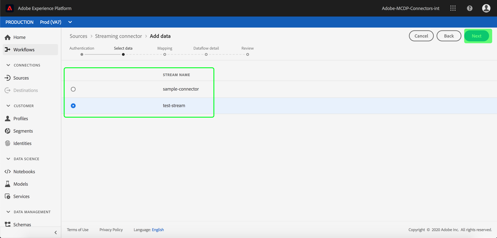
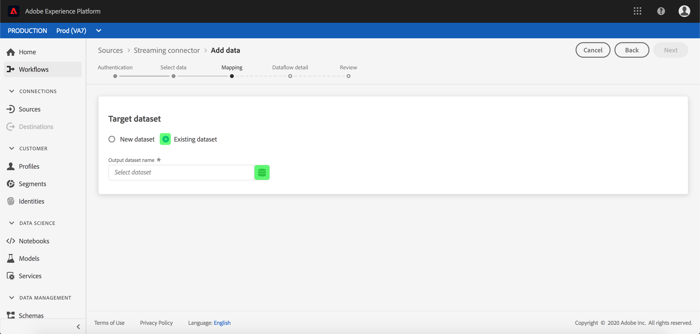
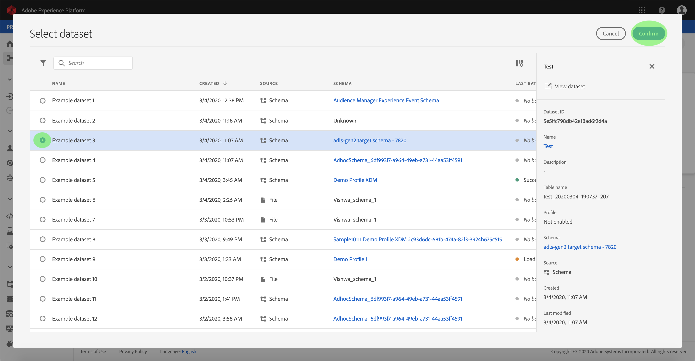
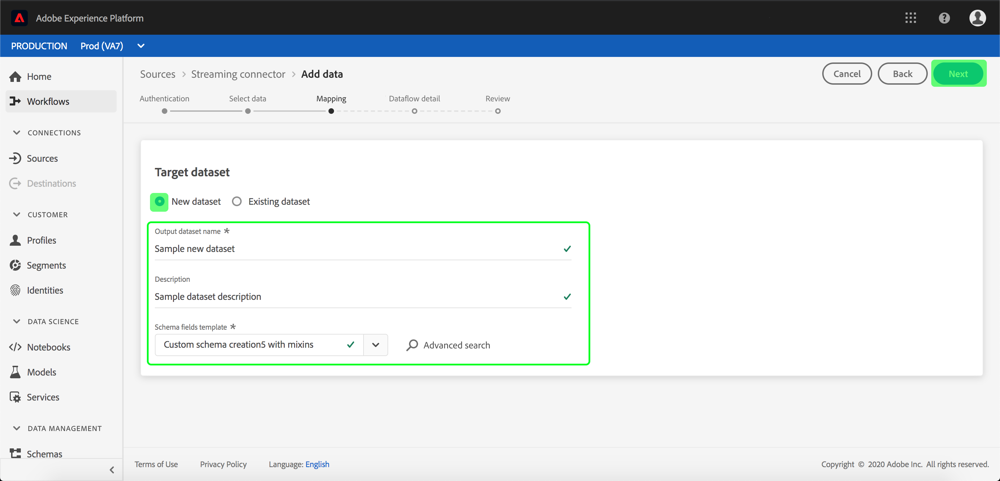
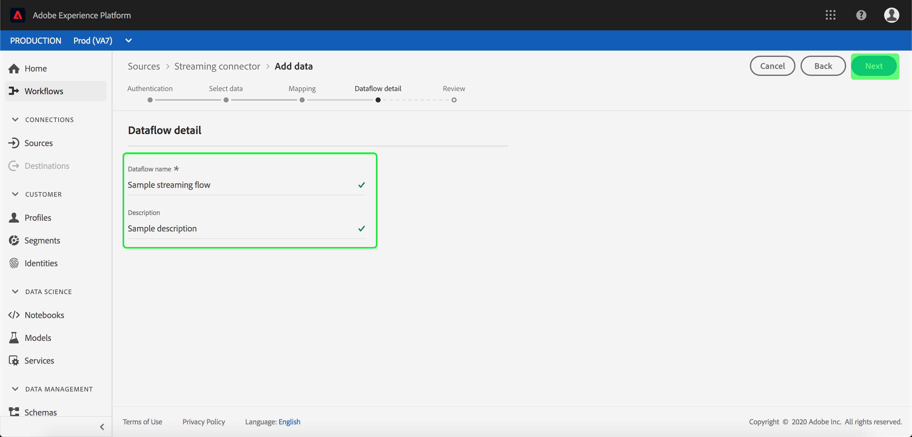

# Configure a dataflow for a cloud storage streaming connector in the UI

A dataflow is a scheduled task that retrieves and ingests data from a source to a [!DNL Platform] dataset. This tutorial provides steps to configure a new dataflow using your cloud storage base connector.

## Getting started

This tutorial requires a working understanding of the following components of Adobe Experience Platform:

-   [[!DNL Experience Data Model] (XDM) System](../../../../../xdm/home.md): The standardized framework by which [!DNL Experience Platform] organizes customer experience data.
    -   [Basics of schema composition](../../../../../xdm/schema/composition.md): Learn about the basic building blocks of XDM schemas, including key principles and best practices in schema composition.
    -   [Schema Editor tutorial](../../../../../xdm/tutorials/create-schema-ui.md): Learn how to create custom schemas using the Schema Editor UI.
-   [[!DNL Real-time Customer Profile]](../../../../../profile/home.md): Provides a unified, real-time consumer profile based on aggregated data from multiple sources.

Additionally, this tutorial requires that you have already created a cloud storage connector. A list of tutorials for creating different cloud storage connectors in the UI can be found in the [source connectors overview](../../../../home.md).

## Select data

After creating your cloud storage connector, the *Select data* step appears, providing an interface for you to select which stream you will stream data from.

## Map data fields to an XDM schema

The **[!UICONTROL Mapping]** step appears, providing an interactive interface to map the source data to a [!DNL Platform] dataset. 

Choose a dataset for inbound data to be ingested into. You can either use an existing dataset or create a new one.

**Use an existing dataset**

To ingest data into an existing dataset, select **[!UICONTROL Use existing dataset]**, then click the dataset icon.

The **[!UICONTROL Select dataset]** dialog appears. Find the dataset you you wish to use, select it, then click **[!UICONTROL Continue]**.

**Use a new dataset**

To ingest data into a new dataset, select **[!UICONTROL Create new dataset]** and enter a name and description for the dataset in the fields provided. Then, select the schema you want to use under the dropdown.

## Name your dataflow

The **[!UICONTROL Dataflow detail]** step appears, allowing you to name and give a brief description about your new dataflow.

Provide values for the dataflow and click **[!UICONTROL Next]**.

### Review your dataflow

The **[!UICONTROL Review]** step appears, allowing you to review your new dataflow before it is created. Details are grouped within the following categories:

- **[!UICONTROL Source details]**: Shows the source type and other relevant details about the source.
- **[!UICONTROL Target details]**: Shows which dataset the source data is being ingested into, including the schema that the dataset adheres to.

Once you have reviewed your dataflow, click **[!UICONTROL Finish]** and allow some time for the dataflow to be created.

## Monitor and delete your dataflow

Once your cloud storage dataflow has been created, you can monitor the data that is being ingested through it. For more information on monitoring and deleting dataflows, see the tutorial on [monitoring dataflows](../../../../../ingestion/quality/monitor-data-flows.md).

## Next steps

By following this tutorial, you have successfully created a dataflow to bring in data from an external cloud storage, and gained insight on monitoring datasets. Incoming data can now be used by downstream [!DNL Platform] services such as [!DNL Real-time Customer Profile] and [!DNL Data Science Workspace]. See the following documents for more details:

-   [[!DNL Real-time Customer Profile] overview](../../../../../profile/home.md)
-   [[!DNL Data Science Workspace] overview](../../../../../data-science-workspace/home.md)

## Appendix

The following sections provide additional information for working with source connectors.

### Disable a dataflow

When a dataflow is created, it immediately becomes active and ingests data according to the schedule it was given. You can disable an active dataflow at any time by following the instructions below.

Within the **[!UICONTROL Sources]** workspace, click the **[!UICONTROL Browse]** tab. Next, click the name of the connection that's associated the active dataflow you wish to disable.

The **[!UICONTROL Source activity]** page appears. Select the active dataflow from the list to open its **[!UICONTROL Properties]** column on the right-hand side of the screen, which contains an **[!UICONTROL Enabled]** toggle button. Click the toggle to disable the dataflow. The same toggle can be used to re-enable a dataflow after it has been disabled.

### Activate inbound data for [!DNL Profile] population

Inbound data from your source connector can be used towards enriching and populating your [!DNL Real-time Customer Profile] data. For more information on populating your [!DNL Real-time Customer Profile] data, see the tutorial on [Profile population](../../profile.md).
