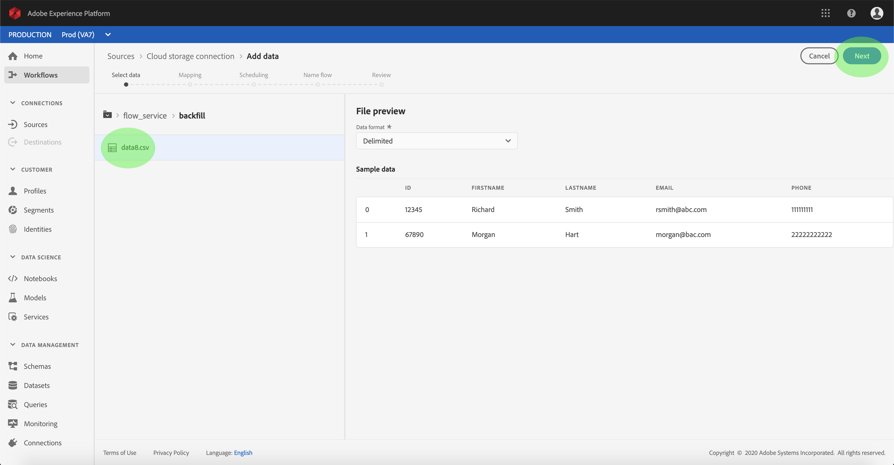
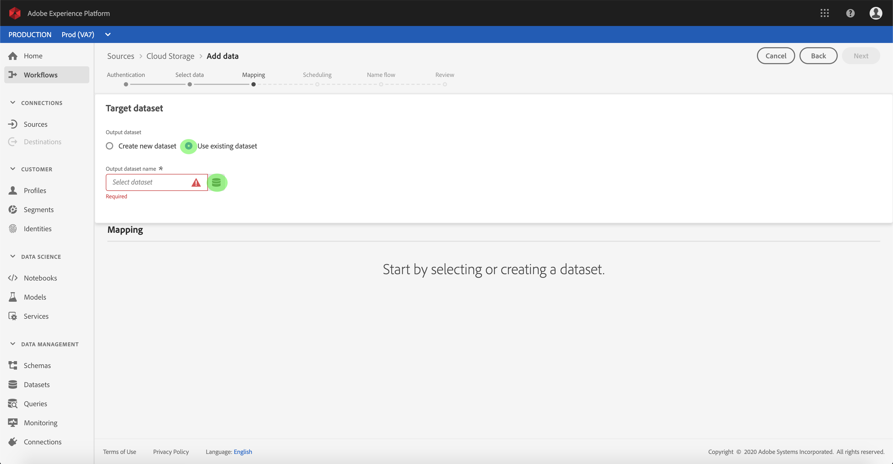
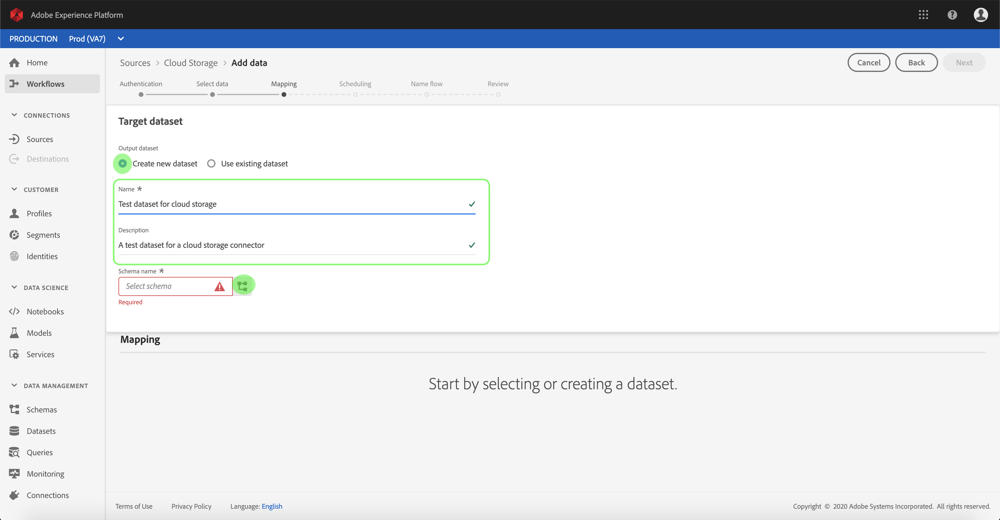
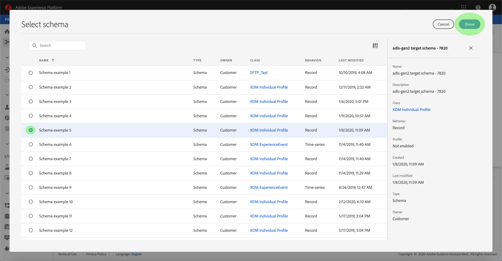
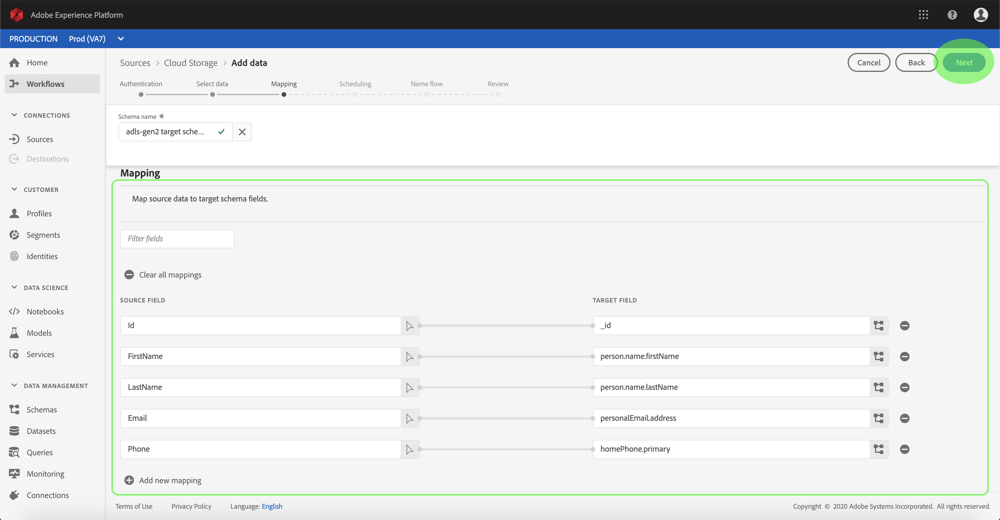

# Configure a dataflow for a cloud storage streaming connector in the UI

A dataflow is a scheduled task that retrieves and ingests data from a source to a Platform dataset. This tutorial provides steps to configure a new dataflow using your cloud storage base connector.

## Getting started

This tutorial requires a working understanding of the following components of Adobe Experience Platform:

*   [Experience Data Model (XDM) System](../../../../../xdm/home.md): The standardized framework by which Experience Platform organizes customer experience data.
    *   [Basics of schema composition](../../../../../xdm/schema/composition.md): Learn about the basic building blocks of XDM schemas, including key principles and best practices in schema composition.
    *   [Schema Editor tutorial](../../../../../xdm/tutorials/create-schema-ui.md): Learn how to create custom schemas using the Schema Editor UI.
*   [Real-time Customer Profile](../../../../../profile/home.md): Provides a unified, real-time consumer profile based on aggregated data from multiple sources.

Additionally, this tutorial requires that you have already created a cloud storage connector. A list of tutorials for creating different cloud storage connectors in the UI can be found in the [source connectors overview](../../../../home.md).

### Supported file formats

Experience Platform supports the following file formats to be ingested from external storages:

* JavaScript Object Notation (JSON): JSON-formatted data files must be XDM-compliant.

## Select data

After creating your cloud storage connector, the *Select data* step appears, providing an interactive interface for you to explore your cloud storage hierarchy.

* The left half of the interface is a directory browser, displaying your server's files and directories.
* The right half of the interface lets you preview up to 100 rows of data from a compatible file.

Clicking a listed folder allows you to traverse the folder hierarchy into deeper folders. Once you have a compatible file or folder selected, the **Select data format** dropdown appears, where you can choose a format to display the data in the preview window.

Once the preview window populates, you can click **Next** to upload all files within the selected folder. If you want to upload to a specific file, select that file from the listing before clicking **Next**.

>[!NOTE] Supported file formats include CSV, JSON, and Parquet. JSON and Parquet files must be XDM-compliant.

## Map data fields to an XDM schema

The *Mapping* step appears, providing an interactive interface to map the source data to a Platform dataset. Source files formatted in JSON or Parquet must be XDM-compliant and do not require you to manually configure the mapping. CSV files, conversely, require you to explicitly configure the mapping, but allow you to pick which source data fields to map.

Choose a dataset for inbound data to be ingested into. You can either use an existing dataset or create a new one.

**Use an existing dataset**

To ingest data into an existing dataset, select **Use existing dataset**, then click the dataset icon.

The _Select dataset_ dialog appears. Find the dataset you you wish to use, select it, then click **Continue**.

**Use a new dataset**

To ingest data into a new dataset, select **Create new dataset** and enter a name and description for the dataset in the fields provided. Next, click the schema icon.

The _Select schema_ dialog appears. Select the schema you wish to apply to the new dataset, then click **Done**.

Based on your needs, you can choose to map fields directly, or use mapper functions to transform source data to derive computed or calculated values. For more information on data mapping and mapper functions, refer to the tutorial on [mapping CSV data to XDM schema fields](../../../../../ingestion/tutorials/map-a-csv-file.md).

Once your source data is mapped, click **Next**.

## Schedule ingestion runs

The *Scheduling* step appears, allowing you to configure an ingestion schedule to automatically ingest the selected source data using the configured mappings. The following table outlines the different configurable fields for scheduling:

| Field | Description |
| --- | --- |
| Frequency | Selectable frequencies include Minute, Hour, Day, and Week. |
| Interval | An integer that sets the interval for the selected frequency. |
| Start time | A UTC timestamp for which the very first ingestion will occur. |
| Backfill | A boolean value that determines what data is initially ingested. If *Backfill* is enabled, all current files in the specified path will be ingested during the first scheduled ingestion. If *Backfill* is disabled, only the files that are loaded in between the first run of ingestion and the *Start time* will be ingested. Files loaded prior to *Start time* will not be ingested. |

Dataflows are designed to automatically ingest data on a scheduled basis. If you wish to only ingest once through this workflow, you can do so by configuring the **Frequency** to "Day" and applying a very large number for the **Interval**, such as 10000 or similar.

Provide values for the schedule and click **Next**.

## Name your dataflow

The *Name flow* step appears, allowing you to name and give a brief description about your new dataflow.

Provide values for the dataflow and click **Next**.

### Review your dataflow

The *Review* step appears, allowing you to review your new dataflow before it is created. Details are grouped within the following categories:

* *Source details*: Shows the source type, the relevant path of the chosen source file, and the amount of columns within that source file.
* *Target details*: Shows which dataset the source data is being ingested into, including the schema that the dataset adheres to.
* *Schedule details*: Shows the active period, frequency, and interval of the ingestion schedule.

Once you have reviewed your dataflow, click **Finish** and allow some time for the dataflow to be created.

## Monitor your dataflow

Once your cloud storage dataflow has been created, you can monitor the data that is being ingested through it. Follow the steps below to access a dataflow's dataset monitor.

Within the *Sources* workspace, click the **Browse** tab to list your base connections. In the displayed list, find the connection that contains the dataflow you wish to monitor by clicking its name.

 The *Source activity* screen appears. From here, click the name of a dataset whose activity you want to monitor.

The *Dataset activity* screen appears. This page displays the rate of messages being consumed in the form of a graph.

Below the graph is a list of batches that were ingested into the dataset, showing their status (successful or failed) and the number of records ingested. If a batch is ingested into a Profile-enabled dataset, the number of ingested profiles and identities are displayed.

You can view more details about a listed batch by clicking its ID.

For more information on monitoring datasets and ingestion, refer to the tutorial on [monitoring streaming dataflows](../../../../../ingestion/quality/monitor-data-flows.md).

## Next steps

By following this tutorial, you have successfully created a dataflow to bring in data from an external cloud storage, and gained insight on monitoring datasets. Incoming data can now be used by downstream Platform services such as Real-time Customer Profile and Data Science Workspace. See the following documents for more details:

*   [Real-time Customer Profile overview](../../../../../profile/home.md)
*   [Data Science Workspace overview](../../../../../data-science-workspace/home.md)

## Appendix

The following sections provide additional information for working with source connectors.

### Disable a dataflow

When a dataflow is created, it immediately becomes active and ingests data according to the schedule it was given. You can disable an active dataflow at any time by following the instructions below.

Within the *Sources* workspace, click the **Browse** tab. Next, click the name of the base connection that's associated the active dataflow you wish to disable.

The *Source activity* page appears. Select the active dataflow from the list to open its *Properties* column on the right-hand side of the screen, which contains an **Enabled** toggle button. Click the toggle to disable the dataflow. The same toggle can be used to re-enable a dataflow after it has been disabled.

### Activate inbound data for Profile population

Inbound data from your source connector can be used towards enriching and populating your Real-time Customer Profile data. For more information on populating your Real-Customer Profile data, see the tutorial on [Profile population](../../profile.md).
