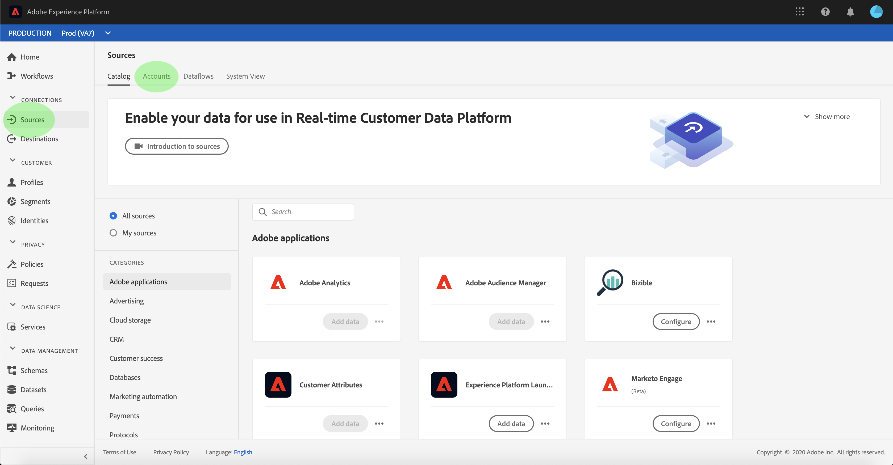
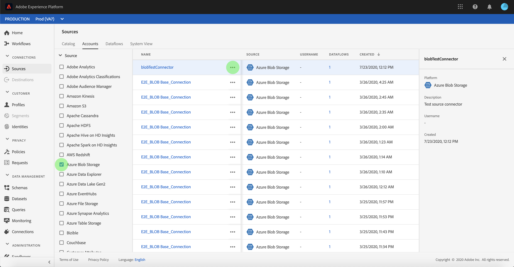
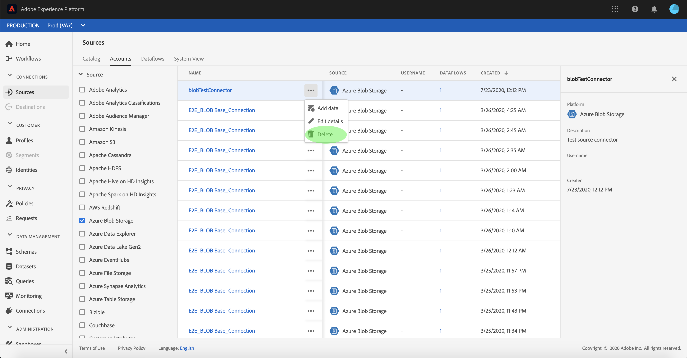
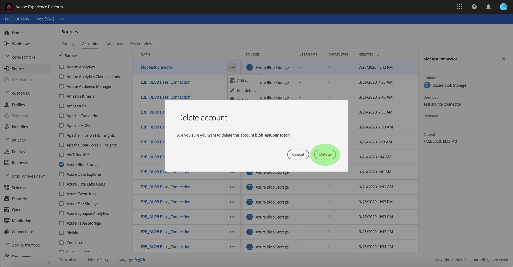

# Delete source connection accounts

Source connectors in Adobe Experience Platform provide the ability to ingest externally sourced data on a scheduled basis. This tutorial provides steps for deleting accounts from the **[!UICONTROL Sources]** workspace.

## Getting started

This tutorial requires a working understanding of the following components of Adobe Experience Platform:

- [[!DNL Experience Data Model (XDM)] System](../../../xdm/home.md): The standardized framework by which [!DNL Experience Platform] organizes customer experience data.
  - [Basics of schema composition](../../../xdm/schema/composition.md): Learn about the basic building blocks of XDM schemas, including key principles and best practices in schema composition.
  - [Schema Editor tutorial](../../../xdm/tutorials/create-schema-ui.md): Learn how to create custom schemas using the Schema Editor UI.
- [[!DNL Real-Time Customer Profile]](../../../profile/home.md): Provides a unified, real-time consumer profile based on aggregated data from multiple sources.

## Delete accounts using the UI

>[!TIP]
>
>Before deleting the source account, you must first delete any existing dataflows associated with the source account. To delete existing dataflows, refer to the tutorial on [deleting sources dataflows in the UI](./delete.md).

Log in to [Adobe Experience Platform](https://platform.adobe.com) and then select **[!UICONTROL Sources]** from the left navigation bar to access the **[!UICONTROL Sources]** workspace. The **[!UICONTROL Catalog]** screen displays a variety of sources for which you can create accounts and dataflows with. Each source shows the number of existing accounts and dataflows associated to them.

Select **[!UICONTROL Accounts]** to access the **[!UICONTROL Accounts]** page.

A list of existing accounts appears. On this page is a list of sortable information for existing accounts such as source, username, associated dataflows, and created date. Select the **funnel icon** on the top left to sort.

The sorting panel appears on the left side of the screen, containing a list of available sources. You can select more than one source using the sorting function.

Select the source you wish to access and locate the account you intend to delete from the list of accounts in the main interface. In the example, the source selected is **[!DNL Azure Blob Storage]** and the account name is **[!UICONTROL blobTestConnector]**. When selecting multiple sources from the sorting panel, your most recently created accounts appear first because the list is sorted by created date.

Select the account you intend to delete.

The **[!UICONTROL Properties]** panel appears on the right side of the screen, containing information regarding the selected account.

Select the ellipses (`...`) beside the name of the account you intend to delete. A pop-up panel appears, providing options to **[!UICONTROL Add data]**, **[!UICONTROL Edit details]**, and **[!UICONTROL Delete]**. Select **[!UICONTROL Delete]** to delete the account.

A final confirmation dialog box appears, select **[!UICONTROL Delete]** to complete the process.

## Next steps

By following this tutorial, you have successfully used the **[!UICONTROL Sources]** workspace to delete existing accounts.

For steps on how to perform these operations programmatically using the [!DNL Flow Service] API, please refer to the tutorial on [deleting connections using the Flow Service API](../../tutorials/api/delete.md)
