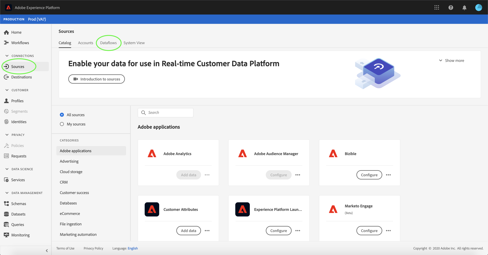
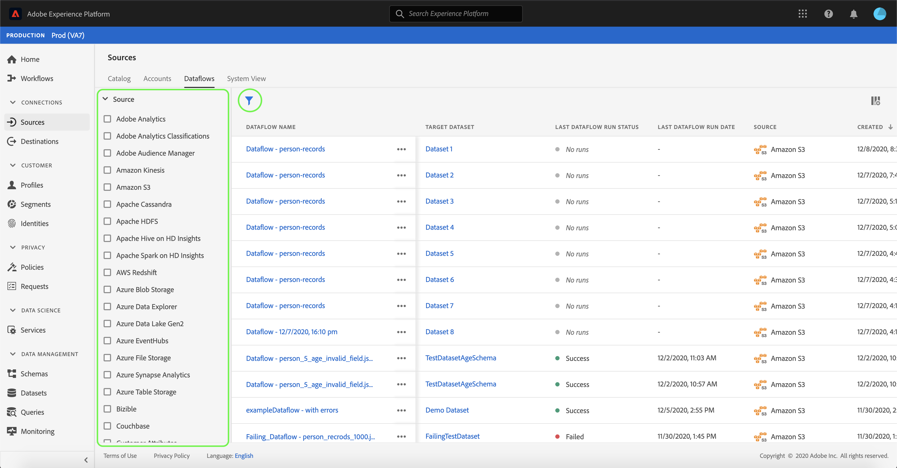
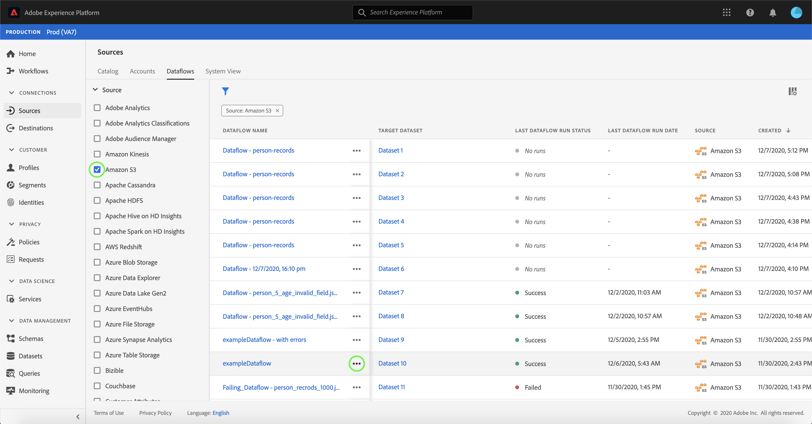
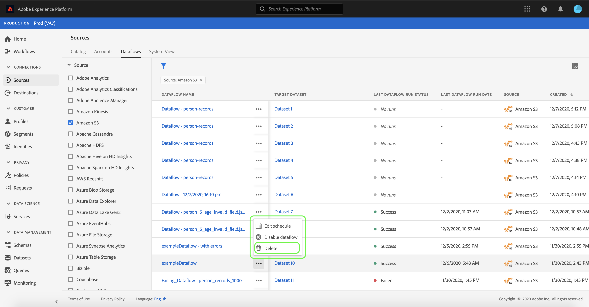
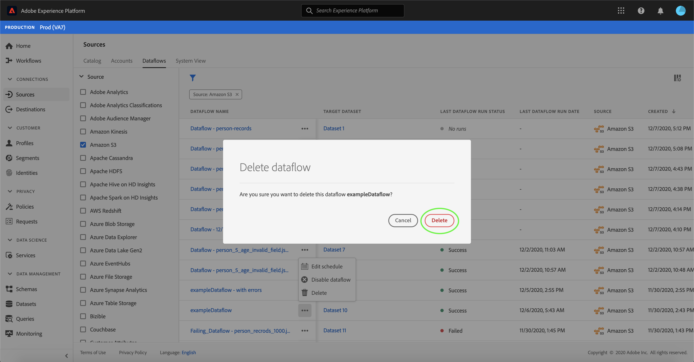
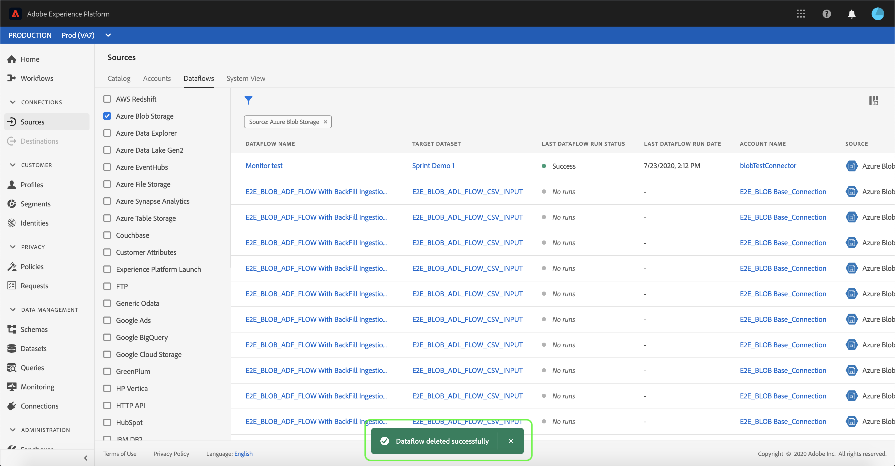

# Delete dataflows in the UI

The [!UICONTROL Sources] workspace allows you to delete existing batch and streaming dataflows that contain errors or have become obsolete.

This tutorial provides steps for deleting dataflows using the [!UICONTROL Sources] workspace.

## Getting started

This tutorial requires a working understanding of the following components of Adobe Experience Platform:

- [Sources](../../home.md): [!DNL Experience Platform] allows data to be ingested from various sources while providing you with the ability to structure, label, and enhance incoming data using [!DNL Platform] services.
- [Sandboxes](../../../sandboxes/home.md): [!DNL Experience Platform] provides virtual sandboxes which partition a single [!DNL Platform] instance into separate virtual environments to help develop and evolve digital experience applications.

## Delete dataflows

In the [Experience Platform UI](https://platform.adobe.com), select **[!UICONTROL Sources]** from the left navigation to access the [!UICONTROL Sources] workspace, and then select **[!UICONTROL Dataflows]** from the top header.

The **[!UICONTROL Dataflows]** page appears. On this page is a list of viewable dataflows, including information about their target dataset, source, account name, and date of creation.

Select the filter icon () on the top left to launch the sort panel.

The sort panel provides a list of all sources. You can select more than one source from the list to access a filtered selection of dataflows associated with the particular sources you selected.

Select the source you wish to work with to see a list of its existing dataflows. Once you have identified the dataflow you want to delete, select the ellipses (`...`) beside the dataflow name.

A dropdown menu appears, providing you with options to edit your dataflow's schedule, disable the dataflow, or delete it entirely.

Select **[!UICONTROL Delete]** to delete the dataflow.

A final confirmation dialog box appears. Select **[!UICONTROL Delete]** to complete the process.

After a few moments, a confirmation box appears on the bottom of the screen to confirm a successful deletion.

## Next steps

By following this tutorial, you have successfully used the [!UICONTROL Sources] workspace to delete an existing dataflow.

See the tutorial on [deleting dataflows using the Flow Service API](../../tutorials/api/delete-dataflows.md) for steps on how to perform these operations programmatically using API calls.
