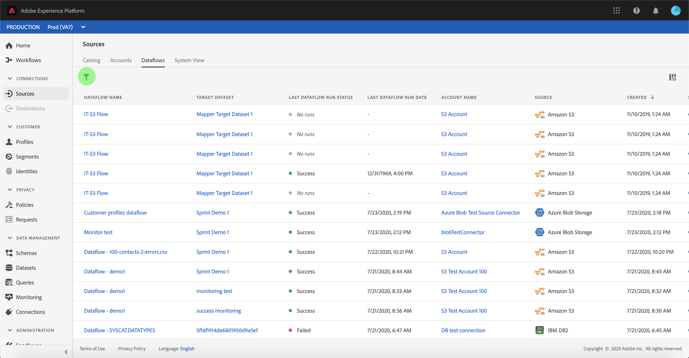
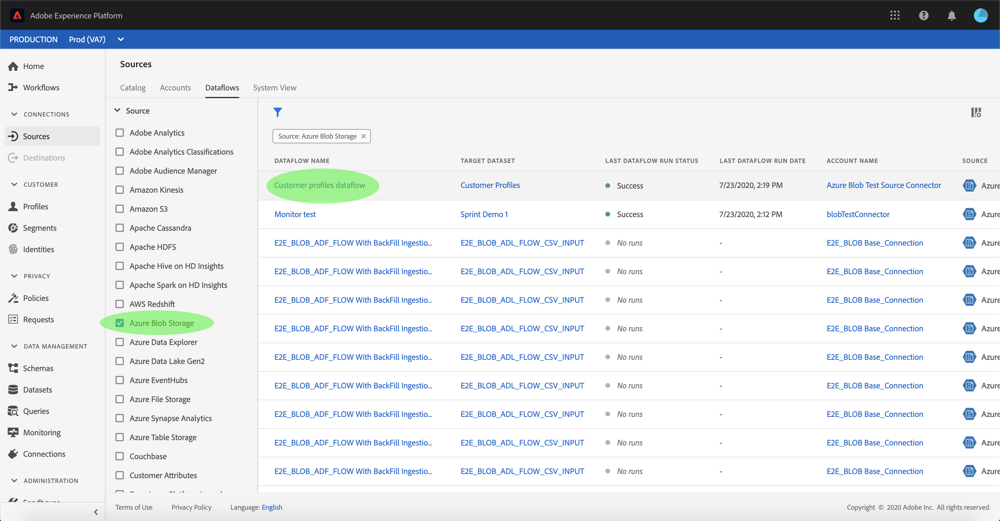
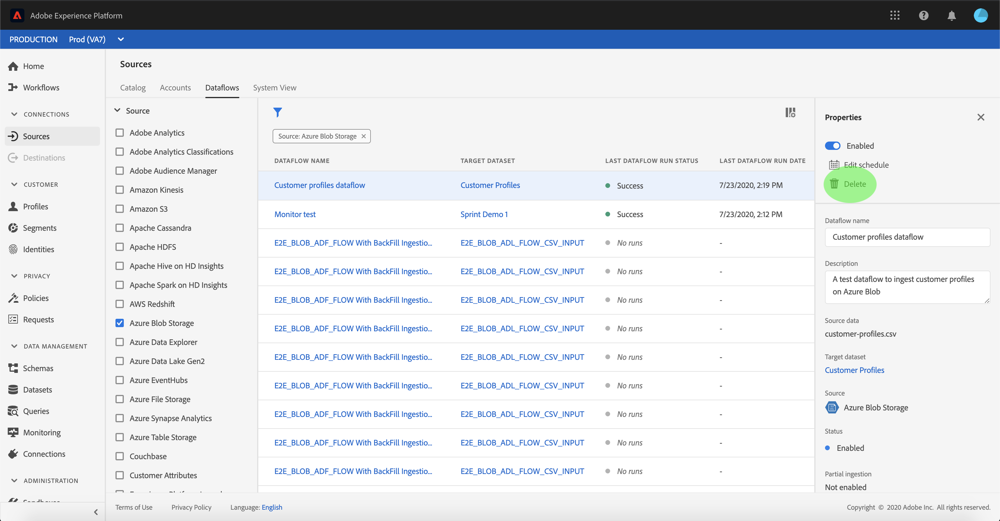

# Delete dataflows in the UI

The [!UICONTROL Sources] workspace provides you with the ability to delete existing batch and streaming dataflows that contain errors or have become obsolete.

This tutorial provides steps for deleting dataflows from the [!UICONTROL Sources] workspace.

## Getting started

This tutorial requires a working understanding of the following components of Adobe Experience Platform:

- [Sources](../../home.md): [!DNL Experience Platform] allows data to be ingested from various sources while providing you with the ability to structure, label, and enhance incoming data using [!DNL Platform] services.
- [Sandboxes](../../../sandboxes/home.md): [!DNL Experience Platform] provides virtual sandboxes which partition a single [!DNL Platform] instance into separate virtual environments to help develop and evolve digital experience applications.

## Delete dataflows using the UI

Log in to [Adobe Experience Platform](https://platform.adobe.com) and then select **[!UICONTROL Sources]** from the left navigation bar to access the **[!UICONTROL Sources]** workspace. The **[!UICONTROL Catalog]** screen displays a variety of sources for which you can create accounts and dataflows with. Each source shows the number of existing accounts and dataflows associated to them.

Select **[!UICONTROL Dataflows]** to access the **[!UICONTROL Dataflows]** page.

A list of existing dataflows appears. On this page is a list of sortable information for existing dataflows such as source, username, run status, and last run date. Select the **funnel icon** on the top left to sort.

The sorting panel appears on the left side of the screen, containing a list of available sources.
You can select more than one source using the sorting function.

Select the source you wish to access and locate the dataflow you intend to delete from the list of dataflows in the main interface. In the example, the source selected is **[!DNL Azure Blob Storage]** and the dataflow name is **[!UICONTROL Customer profiles dataflow]**. When selecting multiple sources from the sorting panel, your most recently created dataflows appear first because the list is sorted by created date.

Select the dataflow you intend to delete.

The **[!UICONTROL Properties]** panel appears on the right side of the screen, containing information regarding the selected dataflow as well as an option to **[!UICONTROL Edit schedule]**.

To delete the dataflow, select **[!UICONTROL Delete]**.

A final confirmation dialog box appears, select **[!UICONTROL Delete]** to complete the process.

After a few moments, a green confirmation box appears on the bottom of the screen to confirm a successful deletion.

## Next steps

By following this tutorial, you have successfully used the **[!UICONTROL Sources]** workspace to delete existing dataflows.

For steps on how to perform these operations programmatically using the [!DNL Flow Service] API, please refer to the tutorial on [deleting dataflows using the Flow Service API](../../tutorials/api/delete-dataflows.md)