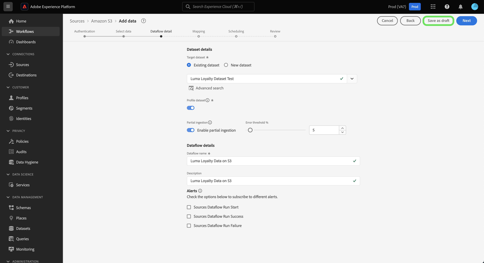
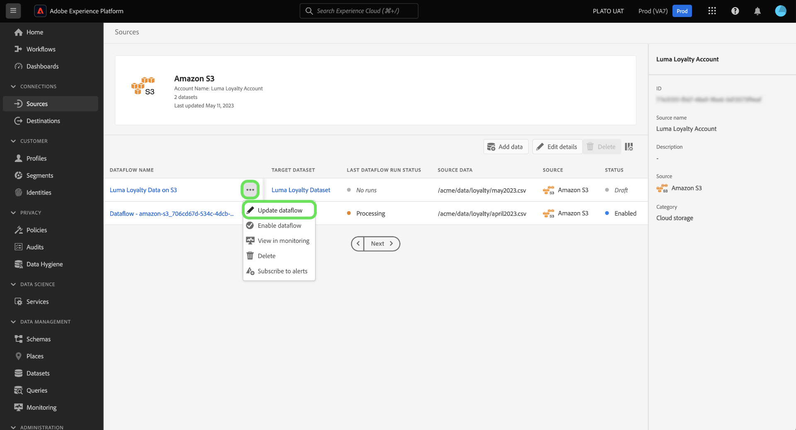
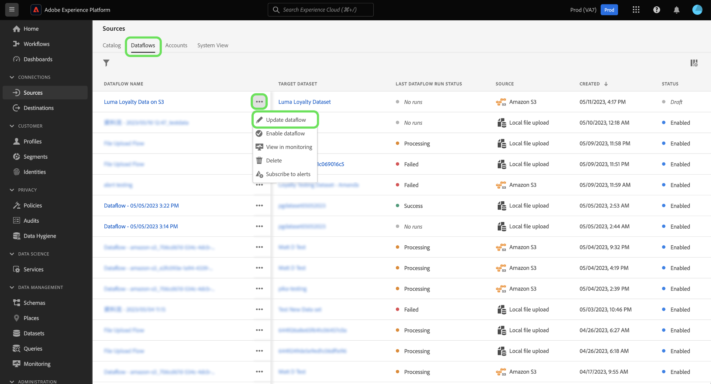

# Draft dataflows in the UI

Save your unfinished data ingestion workflow progress by setting your dataflow to a draft status. You can resume and complete your drafted dataflows at a later time.

This document provides steps on how to save your dataflows when using the sources workspace in the Adobe Experience Platform UI.

## Getting started

This document requires a working understanding of the following components of Adobe Experience Platform:

* [Sources](../../home.md): Experience Platform allows data to be ingested from various sources while providing you with the ability to structure, label, and enhance incoming data using Platform services.

## Save a dataflow as a draft

You can pause your dataflow creation progress at any time after you select the data that you'll be bringing into Platform.

For example, if you want to save your progress during the dataflow detail step, select **[!UICONTROL Save as draft]**.

Once you save your draft, you will be taken to your account's page where you can see a list of your existing dataflows, including your drafts.

>[!TIP
>
>Drafted dataflows will not be enabled and will have their status set to `draft`.

To continue on your draft, select the ellipses (`...`) beside your dataflow's name and then select **[!UICONTROL Update dataflow]**.

>[!TIP]
>
>If your draft includes scheduling information, then the dropdown window will also give you the option to **[!UICONTROL Edit schedule]**.

You are then brought back to the [!UICONTROL Add data] step of the sources workflow, where you can re-confirm the format of your data, and continue progressing on your dataflow.

## Access your drafts from the source catalog

You can also access your draft dataflows through the dataflows catalog. Select **[!UICONTROL Dataflows]** from the top header to access the dataflows catalog. From here, find your draft from the list of existing dataflows in your organization, select the ellipses (`...`) beside its name, and then select **[!UICONTROL Update dataflow]**.

After you save and publish a draft, the dataflow will be enabled and you will no longer be able to reset it as a draft.

## Next steps

By following this tutorial, you have learned how to save your progress and set a dataflow as a draft. For more information sources, visit the [sources overview](../../home.md).