# Ingest encrypted data in the sources UI

>[!AVAILABILITY]
>
>Support for encrypted data ingestion in the sources UI is in beta. The feature and documentation are subject to change.

You can ingest encrypted data files and folders to Adobe Experience Platform using cloud storage batch sources. With encrypted data ingestion, you can leverage asymmetric encryption mechanisms to securely transfer batch data into Experience Platform. The supported asymmetric encryption mechanisms are PGP and GPG.

Read this guide to learn how you can ingest encrypted data with cloud storage batch sources using the UI.

## Get started

Before continuing with this tutorial, please read the following documents to better understand the following Experience Platform features and concepts.

* [Sources](../../home.md): Use sources in Experience Platform to ingest data from an Adobe Application or a third-party data source.
* [Dataflows](../../../dataflows/home.md): Dataflows are representations of data jobs that move data across Experience Platform. You can use the sources workspace to create dataflows that ingest data from a given source to Experience Platform.
* [Sandboxes](../../../sandboxes/home.md): Use sandboxes in Experience Platform to create virtual partitions between your Experience Platform instances and create environments dedicated to development or production.

### High-level outline

* Create an encryption key pair using the sources workspace in the Experience Platform UI. 
  * Optionally, you may also create your own sign verification key pair to provide an additional layer of security to your encrypted data.
* Use the public key from your encryption key pair to encrypt your data.
* Place your encrypted data in your cloud storage. During this step, you must also ensure that you have a sample file of your data in your cloud storage that can be used as a reference to map your source data to an Experience Data Model (XDM) schema.
* Use your cloud storage batch source and begin the data ingestion process in the sources workspace in the Experience Platform UI.
* During the source connection creation process, provide the key ID that corresponds with the public key that you used to encrypt your data.
  * If you also used the sign verification key pair mechanism, then you must also provide the sign verification key ID that corresponds to your encrypted data.
* Proceed to the dataflow creation steps.

## Create an encryption key pair {#create-an-encryption-key-pair}

>[!CONTEXTUALHELP]
>id="platform_sources_encrypted_encryptionKeyId"
>title="Encryption Key ID"
>abstract="Provide the encryption key ID that corresponds with your encryption key that was used to encrypt your source data."

>[!BEGINSHADEBOX]

**What is an encryption key pair?**

An encryption key pair is an asymmetric cryptography mechanism that consists of a public key and a private key. The public key is used to encrypt data and the private key is then used to decrypt said data. 

You can create your encryption key pair through the Experience Platform UI. When generated, you will receive a public key and a corresponding key ID. Use the public key to encrypt your data and then use the key ID to confirm your identity, when you are in the process of ingesting your encrypted data. The private key automatically goes to Experience Platform, where it is stored in a secure vault, and will only be used once your data is ready for decryption.

>[!ENDSHADEBOX]

In the Experience Platform UI, navigate to the sources workspace and then select [!UICONTROL Key Pairs] from the top header.

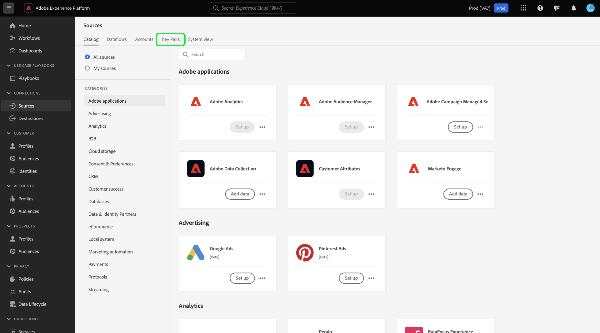

You are taken to a page that displays a list of existing encryption key pairs in your organization. This page provides information on a given key's title, ID, type, encryption algorithm, expiry, and status. To create a new key pair, select **[!UICONTROL Create Key]**.

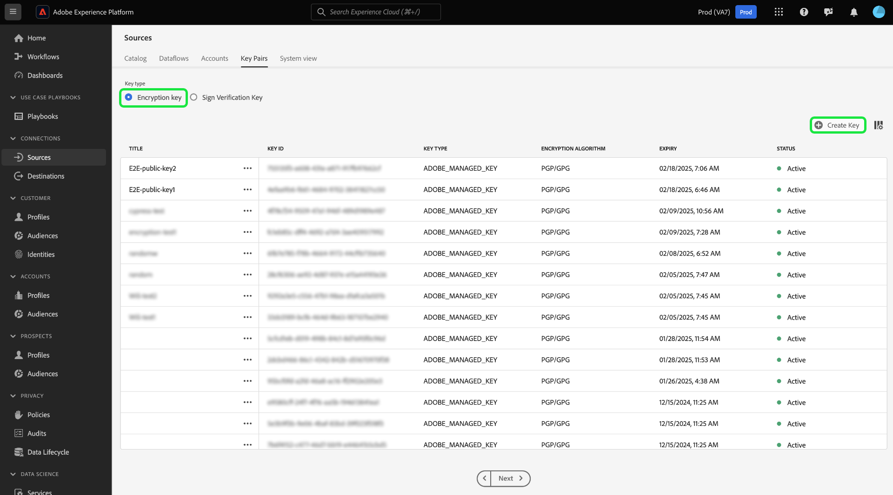

Next, choose the key type that you want to make. To create an encryption key, select **[!UICONTROL Encryption Key]** and then select **[!UICONTROL Continue]**. 

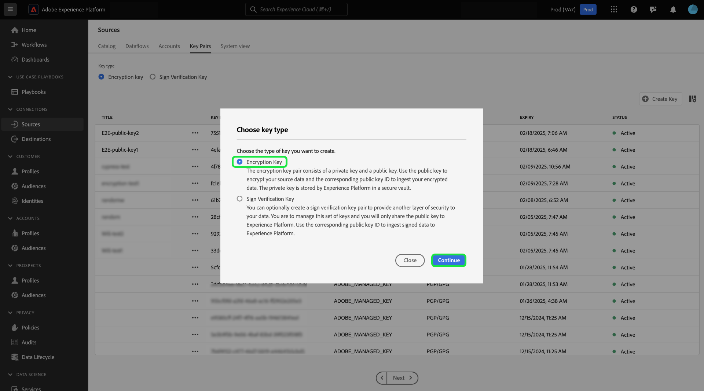

Provide a title and a passphrase for your encryption key. The passphrase is an additional layer of protection for your encryption keys. Upon creation, Experience Platform stores the passphrase in a different secure vault from the public key. You must provide a non-empty string as a passphrase. When finished, select **[!UICONTROL Create]**.

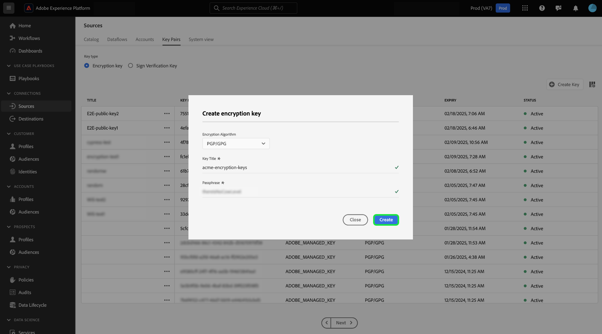

If successful, a new window appears, displaying your new encryption key, including its title, public key, and key ID. Use the public key value to encrypt your data. You will use the key ID in a later step to prove your identity when ingesting your encrypted data during the dataflow creation process.

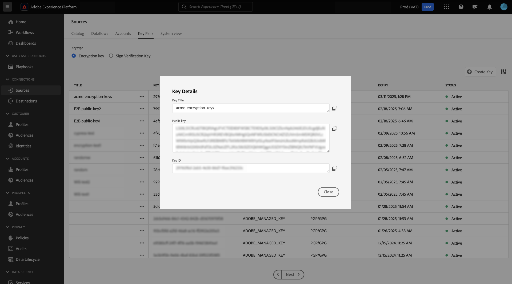

To view information on an existing encryption key, select the ellipses (`...`) beside the key title. Select **[!UICONTROL Key details]** to view the public key and key ID. Alternatively, if you want to delete your encryption key, select **[!UICONTROL Delete]**.

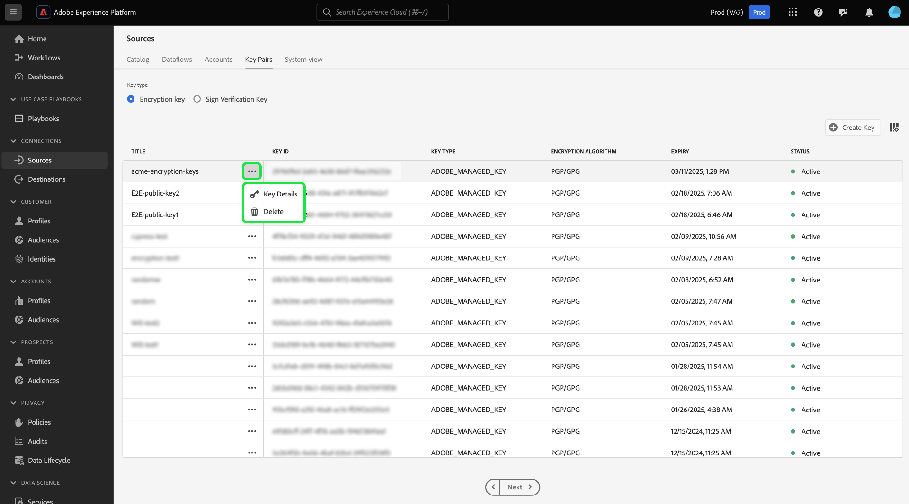

### Create a sign verification key {#create-a-sign-verification-key}

>[!CONTEXTUALHELP]
>id="platform_sources_encrypted_signVerificationKeyId"
>title="Sign Verification Key ID"
>abstract="Provide the sign verification key ID that corresponds with your signed, encrypted source data."

>[!BEGINSHADEBOX]

**What is a sign verification key?**

A sign verification key is another encryption mechanism that involves a private key and a public key. In this case, you can create your sign verification key pair and use the private key to sign and provide an additional layer of encryption to your data. You will then share the corresponding public key to Experience Platform. During ingestion, Experience Platform will use the public key to verify the signature associated with your private key.

>[!ENDSHADEBOX]

To create a sign verification key, select **[!UICONTROL Sign Verification Key]** from the key type selection window and then select **[!UICONTROL Continue]**.

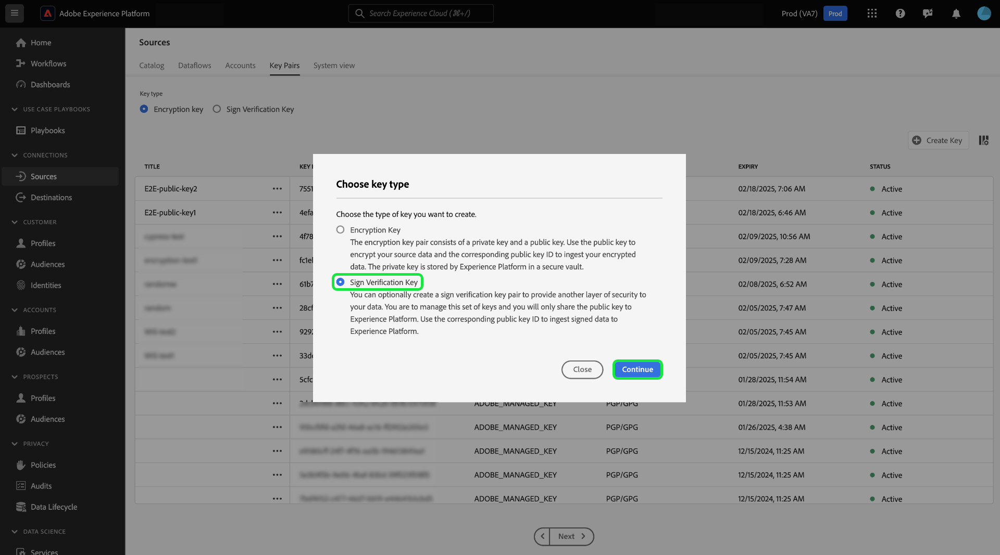

Next, provide a title and a [!DNL Base64]-encoded PGP key as your public key and then select **[!UICONTROL Create]**.

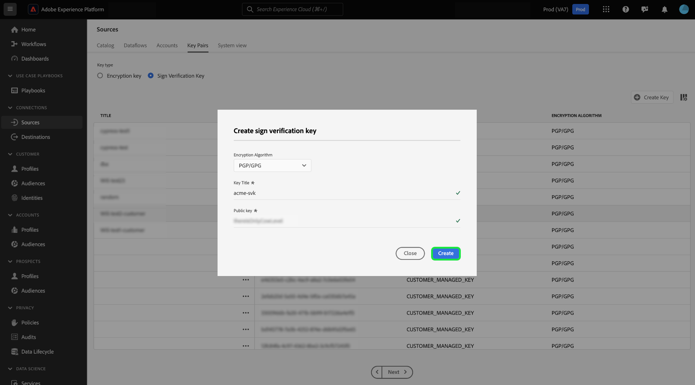

If successful, a new window appears, displaying your new sign verification key, including its title and key ID.

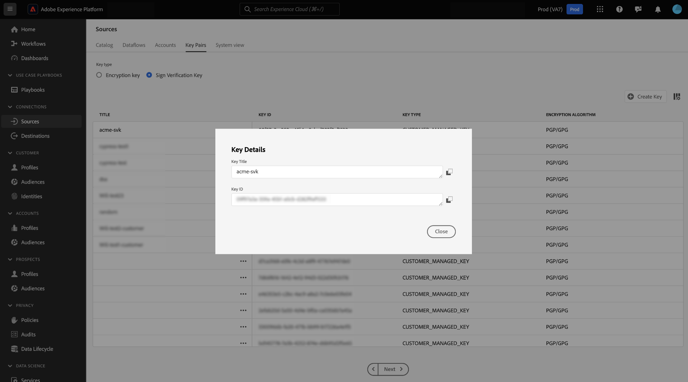

## Ingest encrypted data {#ingest-encrypted-data}

>[!CONTEXTUALHELP]
>id="platform_sources_encrypted_isFileEncrypted"
>title="Is the file encrypted?"
>abstract="Select this toggle if you are ingesting file that is already encrypted."

>[!CONTEXTUALHELP]
>id="platform_sources_encrypted_sampleFile"
>title="Select sample file"
>abstract="You must ingest a sample file when ingesting encrypted data in order to create a mapping."

You can ingest encrypted data using the following cloud storage batch sources:

* [[!DNL Amazon S3]](../ui/create/cloud-storage/s3.md)
* [[!DNL Azure Blob]](../ui/create/cloud-storage/blob.md)
* [[!DNL Azure Data Lake Storage Gen2]](../ui/create/cloud-storage/adls-gen2.md)
* [[!DNL Azure File Storage]](../ui/create/cloud-storage/azure-file-storage.md)
* [[!DNL Data Landing Zone]](../ui/create/cloud-storage/data-landing-zone.md)
* [[!DNL FTP]](../ui/create/cloud-storage/ftp.md)
* [[!DNL Google Cloud Storage]](../ui/create/cloud-storage/google-cloud-storage.md)
* [[!DNL HDFS]](../ui/create/cloud-storage/hdfs.md)
* [[!DNL Oracle Object Storage]](../ui/create/cloud-storage/oracle-object-storage.md)
* [[!DNL SFTP]](../ui/create/cloud-storage/sftp.md)

Authenticate with the cloud storage source of your choice. During the data selection step of the workflow, select the encrypted file or folder that you want to ingest and then enable the **[!UICONTROL Is the file encrypted]** toggle.

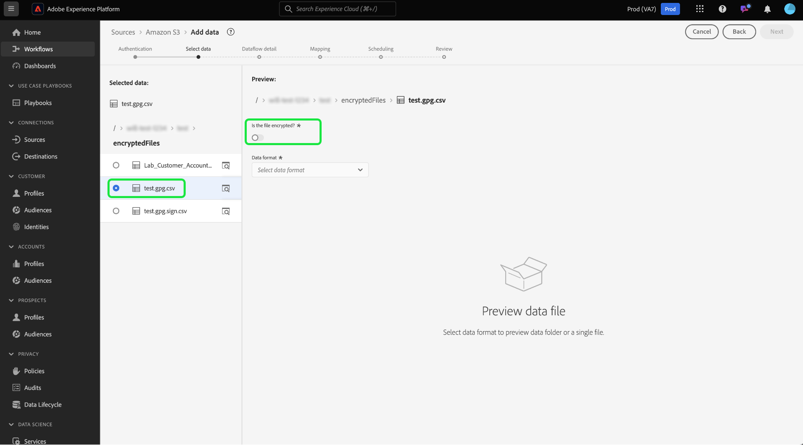

Next, select a sample file from your source data. Since your data is encrypted, Experience Platform will require a sample file in order to create an XDM schema that can be mapped to your source data.

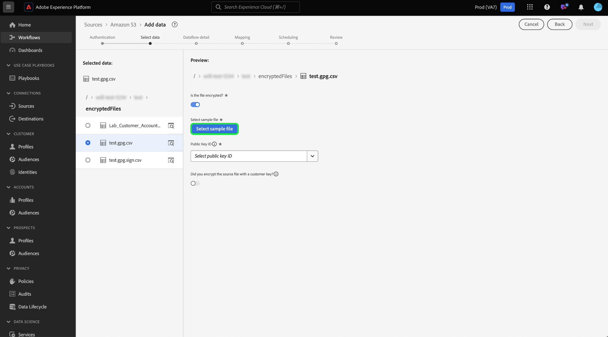

Once you have selected your sample file, configure settings of your data, such as its corresponding data format, delimiter, and compression type. Allow some time for the preview interface to fully render, and then select **[!UICONTROL Save]**.

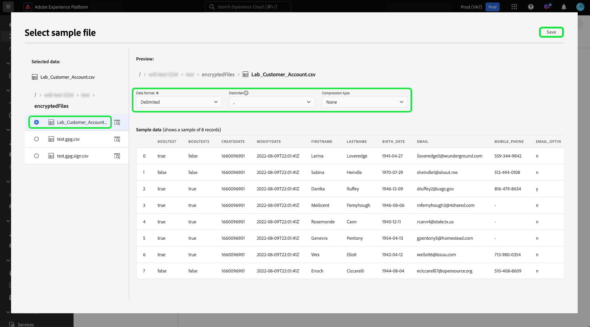

From here, use the dropdown menu to select the public key title of public key ID that corresponds with the public key that you used to encrypt your data.

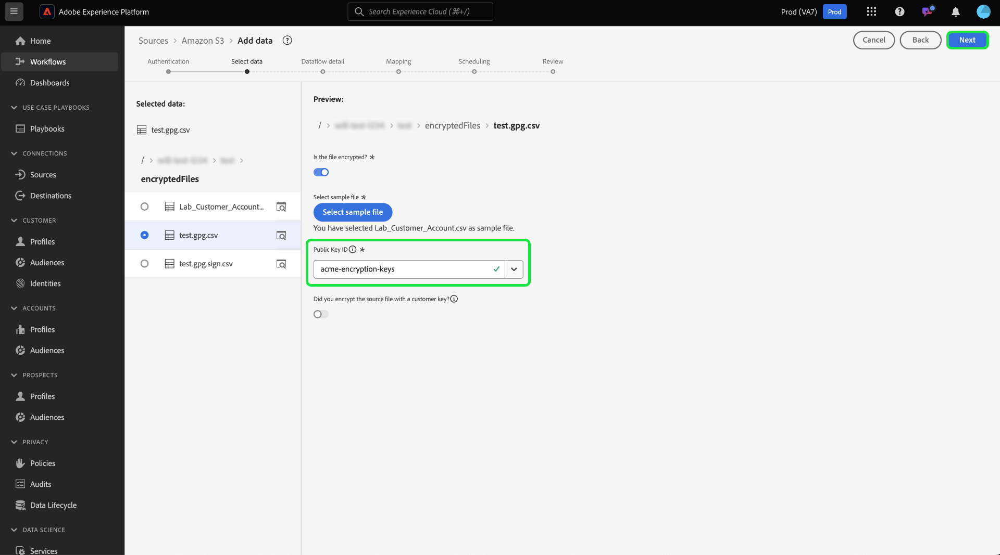

If you also used the sign verification key pair to provide and additional layer of encryption, then enable the sign verification key toggle and then similarly, use the dropdown to select the sign verification key ID that corresponds with the key that you used to encrypt your data.

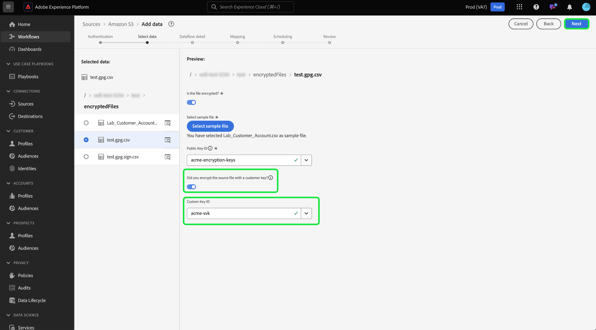

When finished select **[!UICONTROL Next]**.

Complete the remaining steps in the sources workflow to finish creating your dataflow.

* [Provide dataflow and dataset details](../ui/dataflow/batch/cloud-storage.md#provide-dataflow-details)
* [Map your source data to an XDM schema](../ui/dataflow/batch/cloud-storage.md#map-data-fields-to-an-xdm-schema)
* [Configure an ingestion schedule for your dataflow](../ui/dataflow/batch/cloud-storage.md#schedule-ingestion-runs)
* [Review your dataflow](../ui/dataflow/batch/cloud-storage.md#review-your-dataflow)

You can continue to [make updates to your dataflow](../ui/update-dataflows.md) once it has been successfully created. 

## Next steps

By reading this document, you can now ingest encrypted data from your cloud storage batch source to Experience Platform. For information on how to ingest encrypted data using the APIs, read the guide on [ingesting encrypted data using the [!DNL Flow Service] API](../api/encrypt-data.md). For general information about sources on Experience Platform, read the [sources overview](../../home.md).
