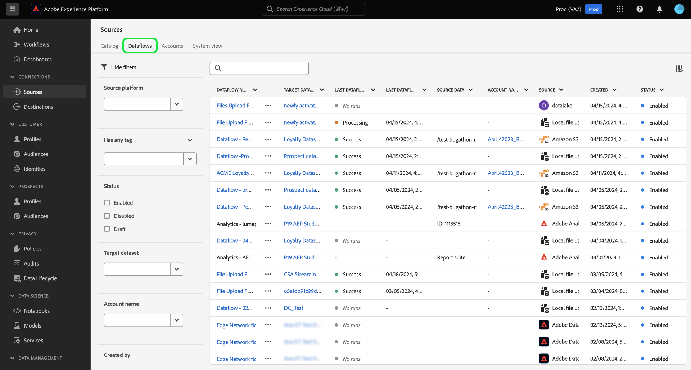
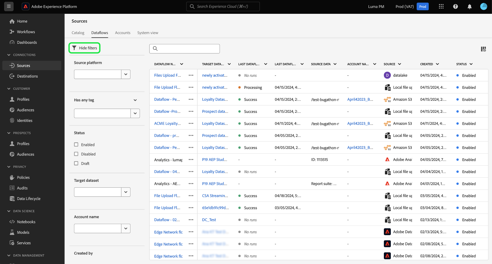
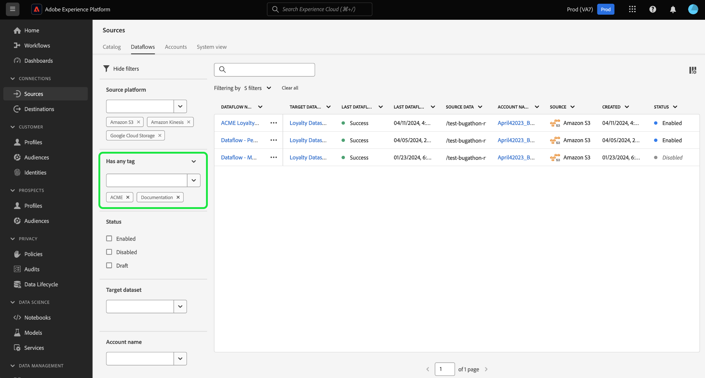
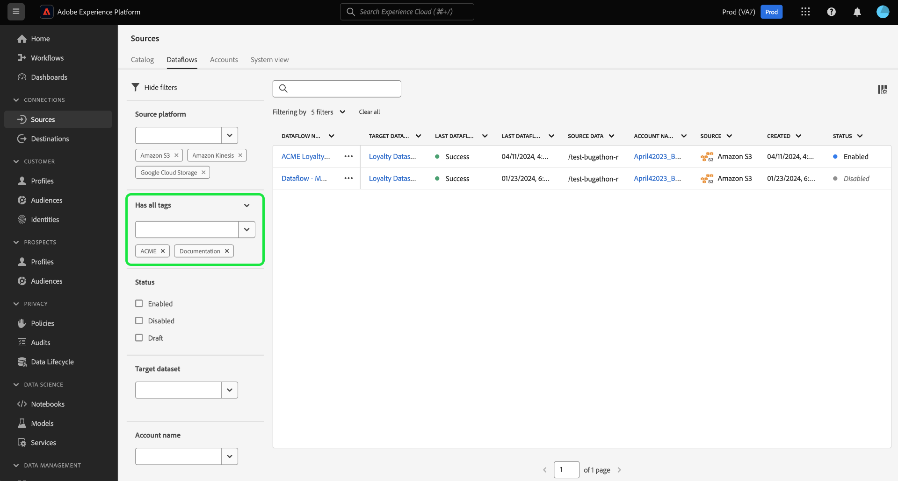
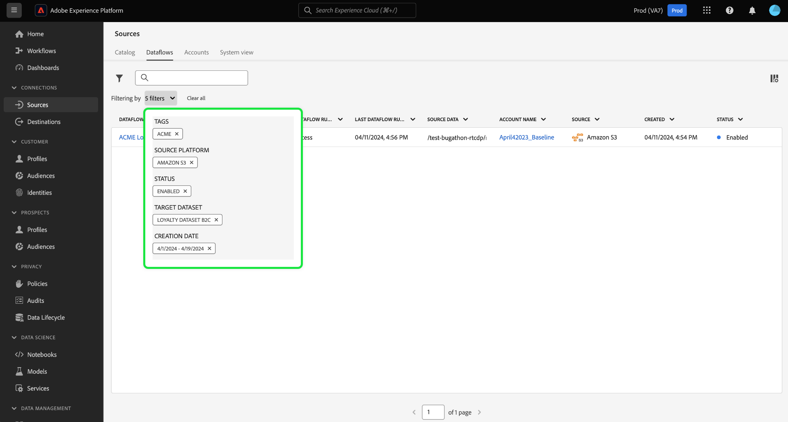
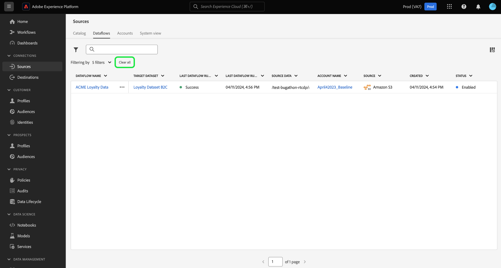
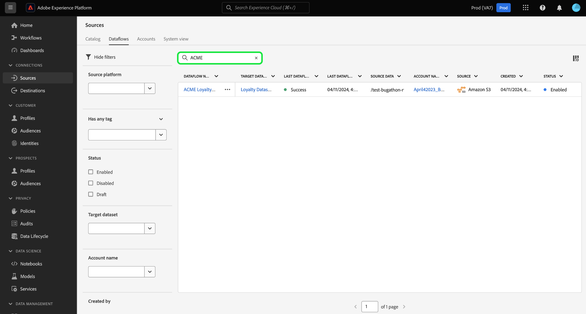
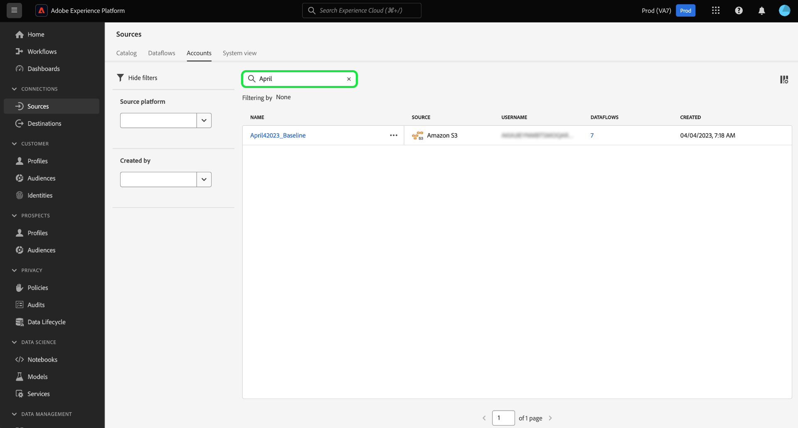
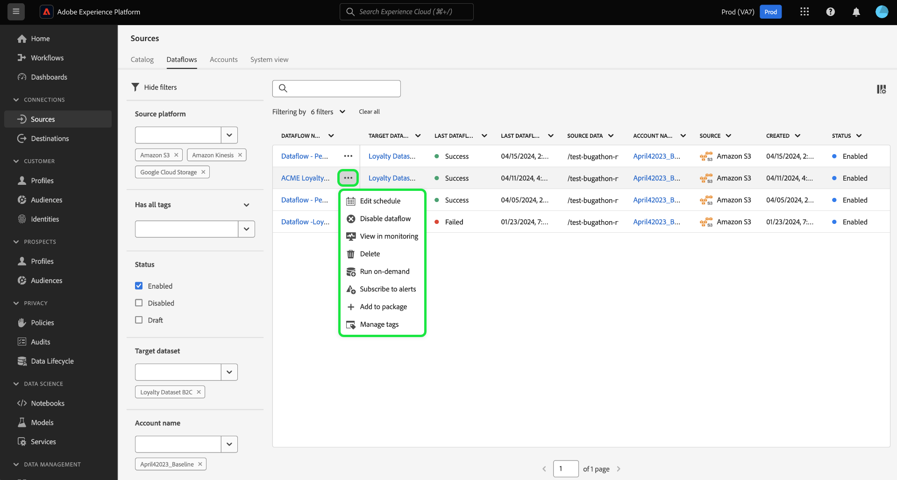

# Filter sources objects in the UI

Use the filtering, search, and inline action tools in the Adobe Experience Platform user interface to streamline your workflow in the [!UICONTROL Sources] workspace

* Use filtering and search capabilities to navigate your way through sources accounts and dataflows in your organization.
* Use inline actions to modify configuration settings applied to your dataflows and improve organizational workflows. You can use inline actions to apply tags, set up alerts, or create ingestion jobs on demand.

## Get started

It is helpful to have an understanding of the following Experience Platform features and concepts before working with the object navigation tools in the sources workspace:

* [Sources](../../home.md): Use sources in Experience Platform to ingest data from an Adobe Application or a third-party data source.
* [Administrative Tags](../../../administrative-tags/overview.md): Use administrative tags to apply metadata keywords to your objects and enable search to find that object within the Experience Platform ecosystem.
* [Alerts](../../../observability/home.md): Use alerts to receive notifications that provide an update on the status of objects such as your sources dataflows.
* [Dataflows](../../../dataflows/home.md): Dataflows are representations of data jobs that move data across Experience Platform. You can use the sources workspace to create dataflows that ingest data from a given source to Experience Platform.
* [Datasets](../../../catalog/datasets/user-guide.md): A dataset is a storage and management construct for a collection of data, typically a table, that contains a schema (columns) and fields (rows).
* [Sandboxes](../../../sandboxes/home.md): Use sandboxes in Experience Platform to create virtual partitions between your Experience Platform instances and create environments dedicated to development or production.

## Filter sources dataflows {#filter-sources-dataflows}

In the Experience Platform UI, select **[!UICONTROL Sources]** in the left navigation and then select **[!UICONTROL Dataflows]** from the top header.

By default, the filter menu is displayed on the left of the interface. To hide the menu, select **[!UICONTROL Hide filters]**.

You can filter your sources dataflows by the following parameters:

| Filter | Description |
| --- | --- |
| [Source platform](#filter-dataflows-by-source-platform) | Filter your dataflows based on the source that they were created with. |
| [Tags](#filter-dataflows-by-tags) | Filter your dataflows based on the tags applied to them. | 
| [Status](#filter-dataflows-by-status) | Filter your dataflows based on their current status. |
| [Target dataset](#filter-dataflows-by-target-dataset) | Filter your dataflows based on the target dataset they were created with. |
| [Account name](#filter-dataflows-by-account-name) | Filter your dataflows based on the name of the account that they correspond with. | 
| [Created by](#filter-dataflows-by-user) | Filter your dataflows based on who created them. |
| [Creation date](#filter-dataflows-by-creation-date) | Filter your dataflows based on the date they were created. |
| [Modified date](#filter-dataflows-by-modification-date) | Filter your dataflows based on the date they were last updated. |

### Filter dataflows by source platform {#filter-dataflows-by-source-platform}

Use the [!UICONTROL Source platform] panel to filter your dataflows by type of source. You can either type in a particular source or use the dropdown menu to see a list of sources in the catalog. You can also filter for several different sources for a given query. For example, you can select [!DNL Amazon S3], [!DNL Azure Data Lake Storage Gen2], and [!DNL Google Cloud Storage] to update the catalog and display only the dataflows that were created with the selected sources.

### Filter dataflows by tags {#filter-dataflows-by-tags}

Use the tags panel to filter your dataflows by their respective tags.

Select **[!UICONTROL Has any tag]** and then select the tags that you want to filter by using the dropdown menu. Use this setting to filter for dataflows that have any of the tags that you selected.

Select **[!UICONTROL Has all tags]** and then select the tags that you want to filter by using the dropdown menu. Usee this setting to filter for dataflows that have all of the tags that you selected.

### Filter dataflows by status {#filter-dataflows-by-status}

You can filter by status using the [!UICONTROL Status] panel.

| Status | Description |
| --- | --- |
| Enabled | Select **[!UICONTROL Enabled]** to filter your view and display only active dataflows. | 
| Disabled | Select **[!UICONTROL Disabled]** to filter your view and display only deactivated dataflows. |
| Draft | Select **[!UICONTROL Draft]** to filter your view and display only dataflows that are in draft mode. |

### Filter dataflows by target dataset {#filter-dataflows-by-target-dataset}

Select **[!UICONTROL Target dataset]** to access a dropdown menu of all target datasets. Then, select a target dataset to filter your view and display only the dataflows that were created using your specified target datasets.

### Filter dataflows by account name {#filter-dataflows-by-account-name}

Select **[!UICONTROL Account name]** to access a dropdown menu of all accounts. Then, select an account to filter your view and display dataflows created by your selected account.

### Filter dataflows by user {#filter-dataflows-by-user}

Use the [!UICONTROL Created by] panel to filter dataflows by the user who created or last updated the dataflows. Select the dropdown and then select the username to filter your dataflows by.

### Filter dataflows by creation date {#filter-dataflows-by-creation-date}

You can filter your dataflows by their creation dates. In the [!UICONTROL Created date] panel, configure a start date and end date to create a time frame window and filter your view to display only dataflows created within that window.

You can configure your time frame by inputting your start and end date. Alternatively, select the calendar icon and use the calendar to configure your dates.

You can also follow the same steps, but filter dataflows by their last modification date, as opposed to their creation date.

### Filter dataflows by modification date {#filter-dataflows-by-modification-date}

Similarly, you can apply the same principles and filter your dataflow by their dates of modification. Use the **[!UICONTROL Modified date]** to configure a particular time frame and filter your view to display only dataflows that have been modified during that period.

### Combine filters {#combine-filters}

You can combine different filters to widen or narrow down your search. In the example below, a filter is applied to search for:

* Dataflows that were created using the [!DNL Amazon S3] source.
* Dataflows that contain the **[!DNL ACME]** tag.
* Datalfows that are currently enabled.
* Dataflows that were created using the [!DNL Loyalty Dataset B2C] dataset.
* Dataflows that were created between 4/1/2024 and 4/19/2024.

To remove all filters, select **[!UICONTROL Clear all]**.

## Filter sources accounts {#filter-sources-accounts}

In the Experience Platform UI, select [!UICONTROL Sources] in the left navigation and then select **[!UICONTROL Accounts]** from the top header. You can filter your sources accounts based on the source that they were created with or the user that created them.

## Search for accounts and dataflows {#search-for-accounts-and-dataflows}

You can accelerate efficiency by using the search bar to immediately navigate to a particular account or dataflow.

>[!BEGINTABS]

>[!TAB Search for dataflows]

Use the search bar in the [!UICONTROL Dataflows] page to find a specific dataflow. You can search for a dataflow using its name or description.

>[!TAB Search for accounts]

Use the search bar in the [!UICONTROL Accounts] page to find a specific account. You can search for an account using its name or description.

>[!ENDTABS]

## Inline actions for sources dataflows {#inline-actions-for-sources-dataflows}

Select the ellipses (`...`) beside a dataflow name for a list of inline actions that you can use to make modifications to your dataflow.

| Inline actions | Description |
| --- | --- |
| [!UICONTROL Edit schedule] | Select **[!UICONTROL Edit schedule]** to update the ingestion schedule of your dataflow. A dataflow that has been set to one-time ingestion cannot be edited. |
| [!UICONTROL Disable dataflow] | Select **[!UICONTROL Disable dataflow]** to deactivate a dataflow run. This option does not delete your dataflow. |
| [!UICONTROL View in monitoring] | Select **[!UICONTROL View in monitoring]** to view the metrics and status of your dataflow in the monitoring dashboard. For more information, read the guide on [monitoring sources dataflows](../../../dataflows/ui/monitor-sources.md). |
| [!UICONTROL Delete] | Select **[!UICONTROL Delete]** to delete your dataflow. |
| [!UICONTROL Run on-demand] | Select **[!UICONTROL Run on-demand]** to trigger a single iteration of a dataflow run. For more information, read the guide on [creating an on-demand dataflow run](../ui/on-demand-ingestion.md). |
| [!UICONTROL Subscribe to alerts] | Select **[!UICONTROL Subscribe to alerts]** to view a pop-up window of alerts that you can subscribe to: <ul><li>Sources Dataflow Run Start: Select this alert to receive a notification when your on-demand dataflow run begins.</li><li>Sources Dataflow Run Success: Select this alert to receive a notification when your on-demand dataflow run finishes successfully.</li><li>Sources Dataflow Run Failure: Select this alert when your on-demand dataflow run fails due to errors.</li></ul> For more information, read the guide on [subscribing to alerts for sources dataflows](../ui/alerts.md).  |
| [!UICONTROL Add to package] | Select **[!UICONTROL Add to package]** to add your dataflow to a package and export it for use in a different sandbox. During this step, you can either create a new package or add your dataflow to an existing package. For information, read the guide on [sandbox tooling](../../../sandboxes/ui/sandbox-tooling.md).|
| [!UICONTROL Manage tags] | Select **[!UICONTROL Manage tags]** to add or remove tags from your dataflow. Use tags to manage metadata taxonomies and classify business objects for easier discovery and categorization. For more information, read the guide on [managing tags](../../../administrative-tags/ui/managing-tags.md).|

## Next steps

By reading this document, you have learned how to navigate your way through the sources accounts and dataflows pages. For more information on sources, read the [sources overview](../../home.md).
