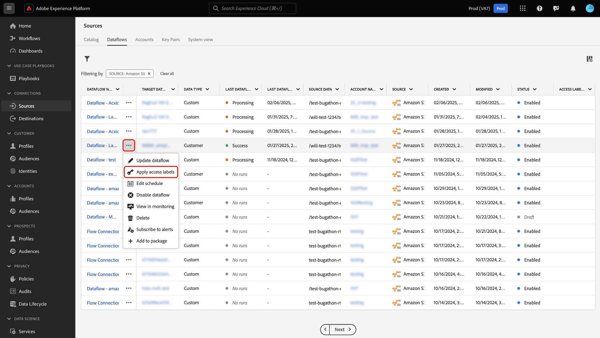
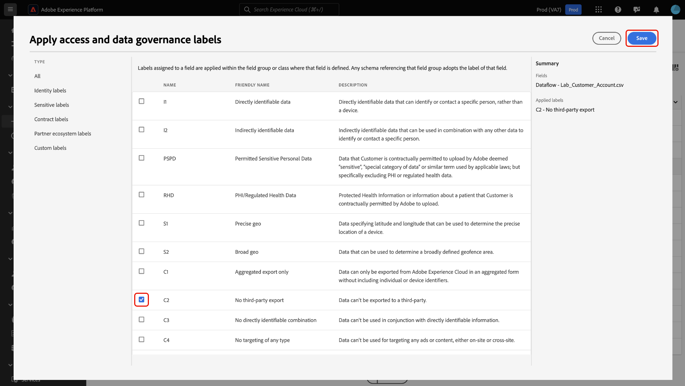

# Apply access labels to manage user access to sources dataflows in the UI

You can use the functionalities provided by [attribute-based access control](../../../access-control/abac/overview.md) in Real-Time CDP to apply labels to your sources dataflows. With this feature, you can ensure that only a subset of users in your organization get access to specific sources dataflows.

When you add an access label to a particular dataflow, only users who have access to a role that is assigned that label are able to view and edit that dataflow. If a sources dataflow is not marked with any labels, it is visible to all users belonging to your organization. For example, if you apply the C12 label to a dataflow, users assigned to a role that does not have the C12 label, will not be able to view and edit the dataflow with the C12 label.

Read this guide for information on how to apply access labels to your sources dataflows using the Adobe Experience Platform user interface.

## Get started

Before working with access control labels, ensure that you first familiarize yourself with the capabilities of attribute-based access control. For more information, read the following documentation:

* [Attribute-based access control overview](../../../access-control/abac/overview.md)
* [Attribute-based access control end-to-end guide](../../../access-control/abac/end-to-end-guide.md)
* [Manage labels using the Permissions UI](../../../access-control/abac/ui/labels.md)
* [Data usage labels glossary](../../../data-governance/labels/reference.md)

## Apply access labels to sources dataflows

>[!NOTE]
>
>* You cannot apply labels to a flow run. However, flow runs inherit any labels that you apply to the parent dataflow.
>
>* If you do not have view access to a dataflow, then you will also be unable to view it's corresponding flow runs.

To apply access labels to your sources dataflows, navigate to **[!UICONTROL Sources]** > **[!UICONTROL Dataflows]** and then locate the dataflow that you want to update and limit user access to.

Next, select the ellipsis (`...`) in the [!UICONTROL Name] column and then select **[!UICONTROL Apply access labels]** to add and manage labels for the selected dataflow.

The [!UICONTROL Apply access and data governance labels] window appears. Use this window to select the labels that you want to apply to  your dataflow. You can also filter labels by their type. When finished, select **[!UICONTROL Save]**.

Once you have successfully configured access labels to your dataflow, any user that does not have access to that label is no longer be able to retrieve the dataflow. You can also use the [!UICONTROL Access Labels] column to view the labels that are applied to a given dataflow.

## Next steps

You now know how to apply access labels to your sources dataflows. You can now ensure that only a specific group of users in your organization can access certain sources dataflows. Read the following documentation for additional information:

* [Apply access labels to sources dataflows in the API](../api/labels.md)
* [Access control overview](../../../access-control/home.md)
