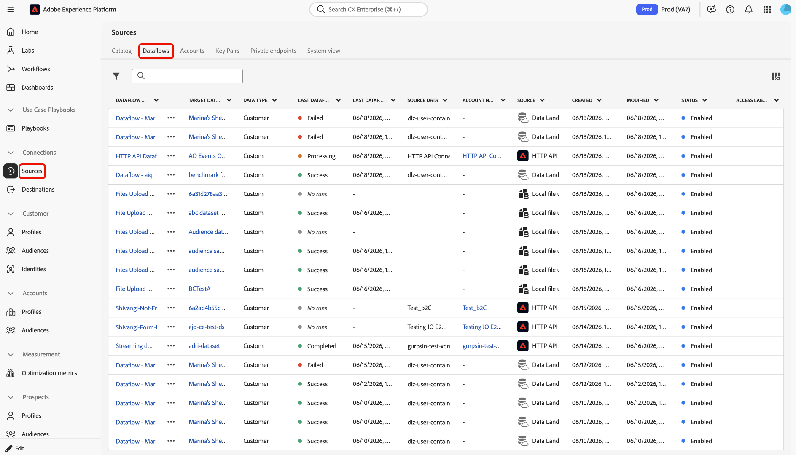
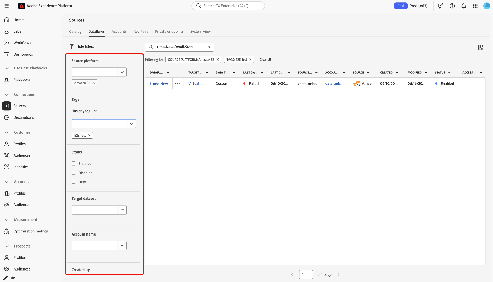
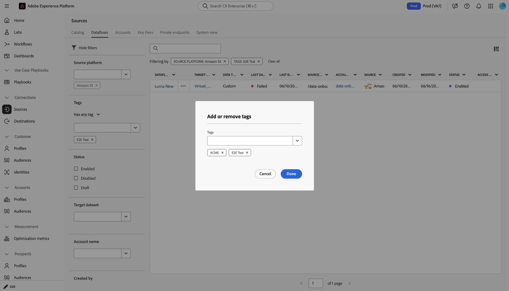
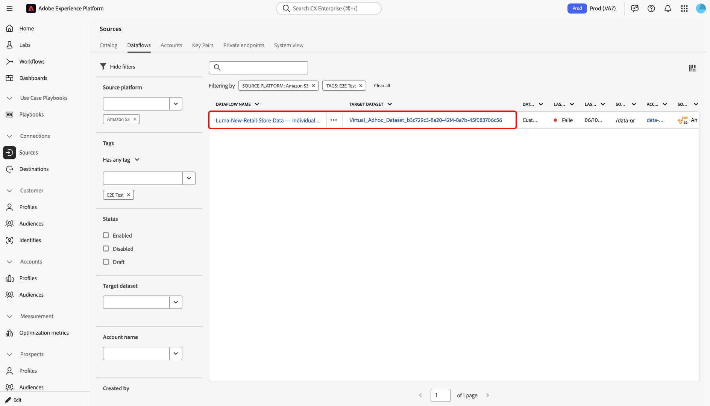
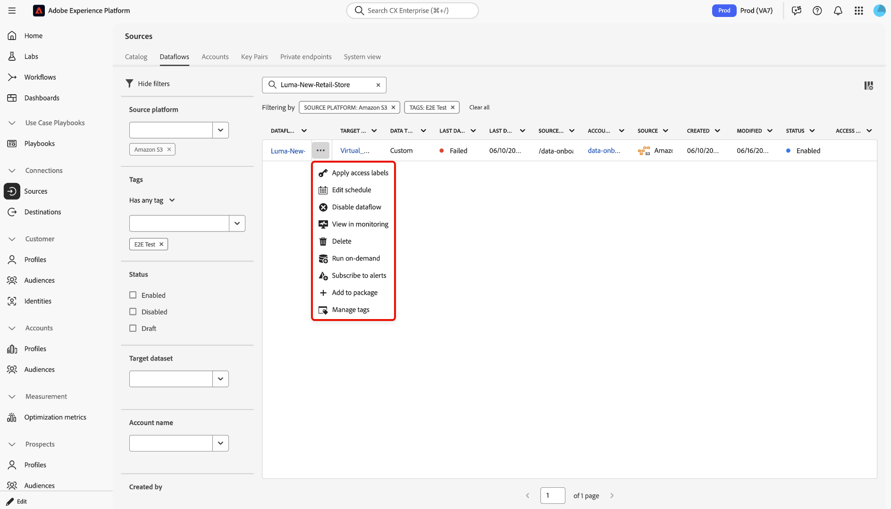

# Manage sources dataflows in the UI

You can use the *Sources workspace* in the Adobe Experience Platform user interface to manage your existing sources dataflows. 

- Use the [!UICONTROL Dataflows] page to access a centralized view of your organization's existing dataflows and search, filter, organize, and take actions on individual flows.
- Use filtering and search capabilities to navigate your way through sources accounts and dataflows in your organization.
- Use inline actions to modify configuration settings applied to your dataflows and improve organizational workflows. You can use inline actions to apply tags, set up alerts, or create ingestion jobs on demand.

## Get started

Before you begin, ensure that you have the following:

- Access to Adobe Experience Platform.
- Both **[!UICONTROL View Sources]** and **[!UICONTROL Manage Sources]** permissions.

It is helpful to have an understanding of the following Experience Platform features and concepts before working with the object navigation tools in the sources workspace:

- [Sources](../../home.md): Learn how to connect, manage, and monitor external data sources in Experience Platform.
- [Sandboxes](../../../sandboxes/home.md): Discover how sandboxes let you develop and test different projects in isolated environments.
- [Administrative tags](../../../administrative-tags/overview.md): Use administrative tags to apply metadata keywords to your objects and enable search to find that object within the Experience Platform ecosystem.
- [Datasets](../../../catalog/datasets/user-guide.md): A dataset is a management construct for a collection of data, typically a table, that contains a schema (columns) and fields (rows).

## Access your source dataflows

In the Experience Platform UI, select **[!UICONTROL Sources]** from the left navigation to access the Sources workspace. Next, **[!UICONTROL Dataflows]** from the top header. The *[!UICONTROL Dataflows]* page displays a list of existing dataflows in your organization. From this page, you can search for specific dataflows, apply filters to narrow results, organize dataflows with tags, inspect metadata in the table, and continue to related actions such as updating or deleting a dataflow.

## Search and filter dataflows

Use the Dataflows page to quickly locate a specific dataflow or narrow the list to a smaller set of results.

### Search for a dataflow

Use the search field on the **[!UICONTROL Dataflows]** page to find a dataflow from the current inventory view. After you enter a search term, the table updates to show matching results.

### Filter your dataflows

Use the filter control to refine the list of available dataflows. You can apply one or more filters to narrow the results based on the metadata associated with each dataflow.

Available filter categories include:

| Filter | Description |
| --- | --- |
| Source platform | Filter your dataflows based on the source that they were created with. |
| Tags | Filter your dataflows based on the tags applied to them. |
| Status | Filter your dataflows based on their current status. |
| Target dataset | Filter your dataflows based on the target dataset they were created with. |
| Account name | Filter your dataflows based on the name of the account that they correspond with. |
| Created by | Filter your dataflows based on who created them. |
| Creation date | Filter your dataflows based on the date they were created. |
| Modified date | Filter your dataflows based on the date they were last updated. |

{style="table-layout:auto"}

To filter your dataflows:

1. Select the filter control to open the filter panel.
2. Select one or more filter criteria.
3. Review the updated results in the dataflows table.
4. Clear individual filters or reset the full filter set to return to the full inventory view.

Use filters when you want to find dataflows by source, identify dataflows with a particular status, or narrow the table to dataflows associated with a specific dataset or account.

## Organize dataflows with tags

You can use tags to organize your dataflows and improve discoverability from the **[!UICONTROL Dataflows]** page. Tags are especially useful when you want to group related dataflows and then use filtering to return to them later.

To organize a dataflow with tags:

1. Locate the dataflow that you want to update.
2. Open the action menu for that dataflow.
3. Select the tag-related action.
4. Add or remove tags as needed.
5. Save your changes.
6. Use the **Tags** filter to find similarly tagged dataflows.

Use tags to create an organizational layer for browsing and filtering workflows. Additionally, you can use tags to manage larger numbers of dataflows more efficiently.

## Resize table columns

You can resize table columns on the **[!UICONTROL Dataflows]** page to display more metadata when values are truncated in the default table view. This is useful when you want to inspect longer values such as dataflow names, account details, or target dataset information.

To resize a column, hover over the edge of a column header and drag the column boundary to increase or decrease the width of the column.

Resize columns as needed to make it easier to review dataflow details before you take action.

## Take action on a dataflow

After you locate the dataflow that you want to work with, select the action menu beside the dataflow name to continue with additional tasks.

Depending on the dataflow and workflow, available actions can include updating a dataflow, editing a schedule, disabling a dataflow, or deleting a dataflow.

Select the ellipses (`...`) beside a dataflow name for a list of inline actions that you can use to make modifications to your dataflow.

| Inline actions | Description |
| --- | --- |
| [!UICONTROL Edit schedule] | Select **[!UICONTROL Edit schedule]** to update the ingestion schedule of your dataflow. A dataflow that has been set to one-time ingestion cannot be edited. |
| [!UICONTROL Disable dataflow] | Select **[!UICONTROL Disable dataflow]** to deactivate a dataflow run. This option does not delete your dataflow. |
| [!UICONTROL View in monitoring] | Select **[!UICONTROL View in monitoring]** to view the metrics and status of your dataflow in the monitoring dashboard. For more information, read the guide on [monitoring sources dataflows](../../../dataflows/ui/monitor-sources.md). |
| [!UICONTROL Delete] | Select **[!UICONTROL Delete]** to delete your dataflow. |
| [!UICONTROL Run on-demand] | Select **[!UICONTROL Run on-demand]** to trigger a single iteration of a dataflow run. For more information, read the guide on [creating an on-demand dataflow run](../ui/on-demand-ingestion.md). |
| [!UICONTROL Subscribe to alerts] | Select **[!UICONTROL Subscribe to alerts]** to view a pop-up window of alerts that you can subscribe to: <ul><li>Sources Dataflow Run Start: Select this alert to receive a notification when your on-demand dataflow run begins.</li><li>Sources Dataflow Run Success: Select this alert to receive a notification when your on-demand dataflow run finishes successfully.</li><li>Sources Dataflow Run Failure: Select this alert when your on-demand dataflow run fails due to errors.</li></ul> For more information, read the guide on [subscribing to alerts for sources dataflows](../ui/alerts.md).  |
| [!UICONTROL Add to package] | Select **[!UICONTROL Add to package]** to add your dataflow to a package and export it for use in a different sandbox. During this step, you can either create a new package or add your dataflow to an existing package. For information, read the guide on [sandbox tooling](../../../sandboxes/ui/sandbox-tooling.md).|
| [!UICONTROL Manage tags] | Select **[!UICONTROL Manage tags]** to add or remove tags from your dataflow. Use tags to manage metadata taxonomies and classify business objects for easier discovery and categorization. For more information, read the guide on [managing tags](../../../administrative-tags/ui/managing-tags.md).|

## Next steps

By reading this document, you have learned how to navigate your way through the sources accounts and dataflows pages. For more information on sources, read the [sources overview](../../home.md).

