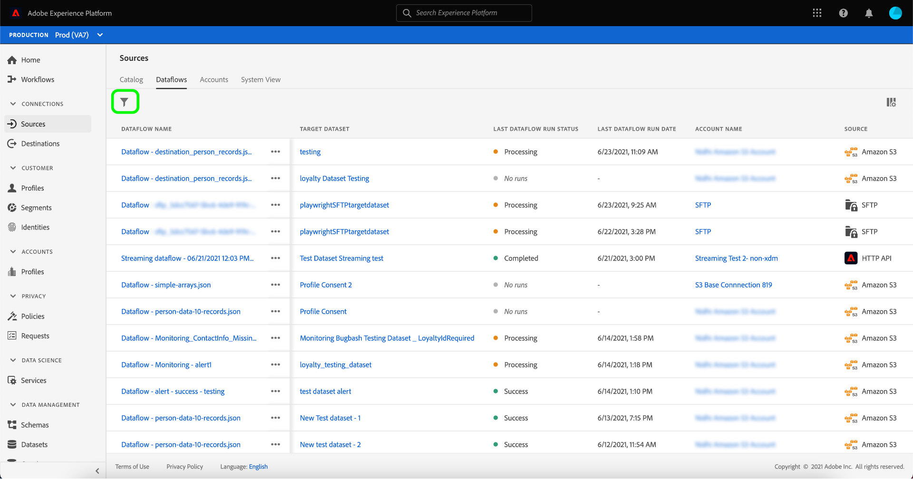
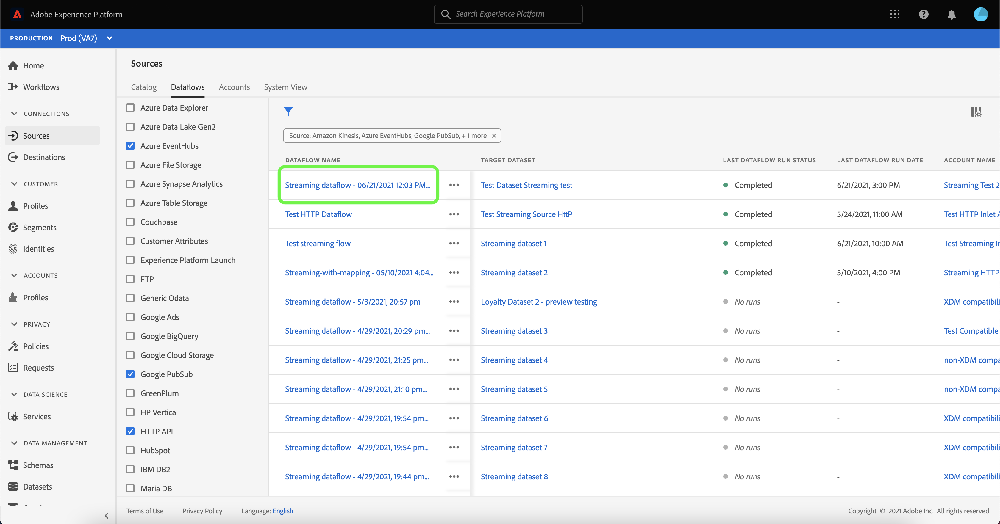

# Monitor Dataflows for Streaming Sources in the UI

This tutorial covers the steps for monitoring dataflows for streaming sources using the PLatform UI.

## Getting started

This tutorial requires a working understanding of the following components of Adobe Experience Platform:

* [Dataflows](../../../dataflows/home.md): Dataflows are a representation of data jobs that move data across Platform. Dataflows are configured across different services, helping move data from source connectors to target datasets, to [!DNL Identity] and [!DNL Profile], and to [!DNL Destinations].
  * [Dataflow runs](../../notifications.md): Dataflow runs are the recurring scheduled jobs based on the frequency configuration of selected dataflows.
* [Sources](../../home.md): Experience Platform allows data to be ingested from various sources while providing you with the ability to structure, label, and enhance incoming data using Platform services.

## Monitor dataflows for streaming sources

In the Platform UI, select **[!UICONTROL Sources]** from the left navigation bar to access the [!UICONTROL Sources] workspace. The [!UICONTROL Catalog] screen displays a variety of sources for which you can create an account with.

To view existing dataflows for streaming sources, select **[!UICONTROL Dataflows]**.

The [!UICONTROL Dataflows] page contains a list of all existing dataflows in your organization, including information about their last run status and date, source data, and account name.

Select the filter icon  on the top left to launch the sort panel.

The sort panel provides a list of all available sources. You can select more than one source from the list to access a filtered selection of dataflows belonging to different sources.

Select the streaming source you wish to work with to see a list of its existing dataflows, and then select the dataflow that you want to monitor from the list.

The [!UICONTROL Dataflow Activity] screens displays specific run information on your dataflow, including details on the number of records received, ingested, and failed. Select the calendar icon to expand the monitoring time frame.

The calendar appears, providing you with the option to expand the date range to the last 30 days. Alternatively, you can use the calendar to manually apply a custom date range for your dataflow.

Select **[!UICONTROL Last 30 days]** and then select **[!UICONTROL Apply]**.

* The list of flow run expands*
* Select the flow run you want to inspect
* The table will display any errors

The dataflow run overview page contains...

