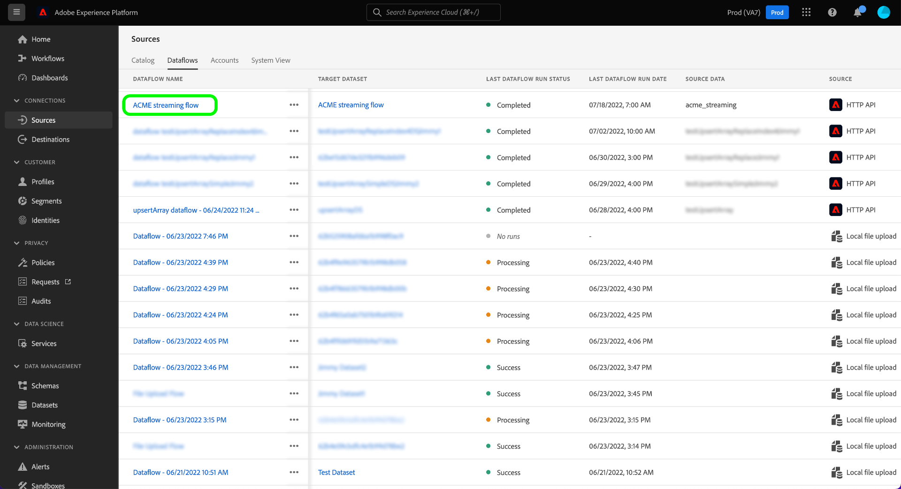

# Monitor Dataflows for Streaming Sources in the UI

This tutorial covers the steps for monitoring dataflows for streaming sources using the [!UICONTROL Sources] workspace.

## Getting started

This tutorial requires a working understanding of the following components of Adobe Experience Platform:

* [Dataflows](../../../dataflows/home.md): Dataflows are a representation of data jobs that move data across Platform. Dataflows are configured across different services, helping move data from source connectors to target datasets, to [!DNL Identity] and [!DNL Profile], and to [!DNL Destinations].
  * [Dataflow runs](../../notifications.md): Dataflow runs are the recurring scheduled jobs based on the frequency configuration of selected dataflows.
* [Sources](../../home.md): Experience Platform allows data to be ingested from various sources while providing you with the ability to structure, label, and enhance incoming data using Platform services.
* [Sandboxes](../../../sandboxes/home.md): Experience Platform provides virtual sandboxes which partition a single Platform instance into separate virtual environments to help develop and evolve digital experience applications.

## Monitor dataflows for streaming sources

In the Platform UI, select **[!UICONTROL Sources]** from the left navigation bar to access the [!UICONTROL Sources] workspace. The [!UICONTROL Catalog] screen displays a variety of sources for which you can create an account with.

To view existing dataflows for streaming sources, select **[!UICONTROL Dataflows]** from the top header.

The [!UICONTROL Dataflows] page contains a list of all existing dataflows in your organization, including information about their source data, account name, and dataflow run status.

Select the name of the dataflow you want to view.

The following table contains more information on dataflow run statuses:

| Status | Description |
| ------ | ----------- |
| Completed | The `Completed` status indicates that all records for the corresponding dataflow run were processed within the one-hour period. A `Completed` status can still contain errors in dataflow runs. |
| Success | The `Success` status indicates that all records for the corresponding dataflow run were processed within the one-hour period and that there were no errors encountered during the course of the dataflow run. |
| Processing | The `Processing` status indicates that a dataflow is not yet active. This status is often encountered immediately after a new dataflow is created. |
| Error | The `Error` status indicates that the activation process of a dataflow has been disrupted. |
| No runs | The `No runs` status indicates that the dataflow was created but no dataflow runs were started. |

The [!UICONTROL Dataflow Activity] page displays specific information on your streaming dataflow. The top banner contains the cumulative number of records ingested and records failed for all of your streaming dataflow runs in your selected date range.

By default, the data displayed contains ingestion rates from the last seven days. Select **[!UICONTROL Last 7 days]** to adjust the time frame of records displayed.

A calendar pop-up window appears, providing you options for alternative ingestion time frames. You can configure the dataflow run time frame to view flow runs from the previous seven days or the last 30 days. Alternatively, you configure the interactive calendar to set a custom time frame of your choice. When finished, select **[!UICONTROL Apply]**.

The lower half of the page displays information on the number of records received, ingested, and failed, per flow run. Each flow run is recorded within an hourly window.

### Dataflow run metrics {#dataflow-run-metrics}

>[!CONTEXTUALHELP]
>id="platform_sources_dataflow_records_received"
>title="Records received"
>abstract="The Records Received metric indicates the total count of records received in the dataflow."
>text="Learn more in documentation"

>[!CONTEXTUALHELP]
>id="platform_sources_dataflow_records_ingested"
>title="Records ingested"
>abstract="The Records Ingested metric indicates the total count of records ingested into data lake."
>text="Learn more in documentation"

>[!CONTEXTUALHELP]
>id="platform_sources_dataflow_records_failed"
>title="Records failed"
>abstract="The Records Failed metric indicates the total count of records that were not ingested to the data lake because of  errors in the data."
>text="Learn more in documentation"

>[!CONTEXTUALHELP]
>id="platform_sources_dataflow_records_warnings"
>title="Records with warnings"
>abstract="The Records with Warnings indicates the total count of records ingested with mapper transformation warnings. All mapper transformation errors are reported as warnings and rows that are partially ingested are considered successful with a warning"
>text="Learn more in documentation"

Each individual dataflow run shows the following details:

* **[!UICONTROL Dataflow run start]**: The time that the dataflow run started at.
* **[!UICONTROL Processing time]**: The amount of time that it took for the dataflow to process.
* **[!UICONTROL Records Received]**: The total number of records received in the dataflow from a source connector.
* **[!UICONTROL Records Ingested]**: The total count of records ingested into [!DNL Data Lake].
* **[!UICONTROL Records with Warnings]**: The total count of records with warnings that were ingested. All mapper transformation errors are reported as warnings and rows that are partially ingested are labelled as `success` with a warning. **Note**: Support for ingesting records with warnings is only available to streaming sources.
* **[!UICONTROL Records Failed]**: The number of records that were not ingested into [!DNL Data Lake] due to errors in the data.
* **[!UICONTROL Ingestion Rate]**: The success rate of records ingested into [!DNL Data Lake]. This metric is applicable when [!UICONTROL Partial Ingestion] is enabled.
* **[!UICONTROL Status]**: Represents the state the dataflow is in: either [!UICONTROL Completed] or [!UICONTROL Processing]. [!UICONTROL Completed] means that all records for the corresponding dataflow run were processed within the one-hour period. [!UICONTROL Processing] means that the dataflow run has not yet finished.

The [!UICONTROL Dataflow run overview] page contains additional information on your dataflow, such as its corresponding dataflow run ID, target dataset, and organization ID.

A flow run with errors also contains the [!UICONTROL Dataflow run errors] panel, which displays the particular error that led to the failure of the run, as well as the total count of records that failed.

### View records with warnings {#warnings}

[!UICONTROL Records with warnings] displays a list of mapper transformation warnings that occurred during your flow run. Rows that are partially ingested are considered successful and are appended with warnings if any mapper transformation errors are found. 

By default, all mapper transformation errors are considered as warnings, except if they are any of the following:

* Syntax errors
* References to attributes that do not exist
* A mismatch of XDM data types

To view error diagnostics, select **[!UICONTROL Preview error diagnostics]**.

The [!UICONTROL Error diagnostics preview] window allows you to preview up to 100 errors and/or warnings regarding your dataflow run. From here, you can also download the ingestion failure manifest for more information, using the [!DNL Data Access] API.

## Next steps

By following this tutorial, you have successfully used the [!UICONTROL Sources] workspace to monitor your streaming dataflows and identify the errors that led to any failed dataflows. See the following documents for more information:

* [Sources overview](../../home.md)
* [Dataflows overview](../../../dataflows/home.md)
