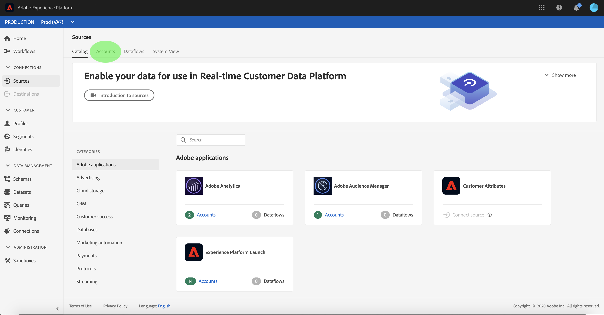

# Monitor accounts and dataflows

Source connectors in Adobe Experience Platform provide the ability to ingest externally sourced data on a scheduled basis. This tutorial provides steps for viewing existing accounts and dataflows from the *[!UICONTROL Sources]* workspace.

## Getting started

This tutorial requires a working understanding of the following components of Adobe Experience Platform:

-   [Experience Data Model (XDM) System](../../../xdm/home.md): The standardized framework by which [!DNL Experience Platform] organizes customer experience data.
    -   [Basics of schema composition](../../../xdm/schema/composition.md): Learn about the basic building blocks of XDM schemas, including key principles and best practices in schema composition.
    -   [Schema Editor tutorial](../../../xdm/tutorials/create-schema-ui.md): Learn how to create custom schemas using the Schema Editor UI.
-   [Real-time Customer Profile](../../../profile/home.md): Provides a unified, real-time consumer profile based on aggregated data from multiple sources.

## Monitor accounts

Log in to [Adobe Experience Platform](https://platform.adobe.com) and then select **[!UICONTROL Sources]** from the left navigation bar to access the *[!UICONTROL Sources]* workspace. The *[!UICONTROL Catalog]* screen displays a variety of sources for which you can create accounts and dataflows with. Each source shows the number of existing accounts and dataflows associated to them.

Select *[!UICONTROL Accounts]* from the top header to view existing accounts.

The *[!UICONTROL Accounts]* pages appears. On this page is a list of viewable accounts, including information about their source, username, number of dataflows, and date of creation.

Select the icon on the top left to launch the sort window.

The sorting panel allows you to access accounts from a specific source. Select the source you wish to work with and select the account from the list on the right.

From the *[!UICONTROL Accounts]* page, you can view a list of existing dataflows associated with the account you accessed. Select the dataflow you wish to view.

 The *[!UICONTROL Dataflow activity]* screen appears. This page displays the rate of messages being consumed in the form of a graph.

 

## Monitor dataflows

Dataflows can be accessed directly from the *[!UICONTROL Catalog]* page without viewing *[!UICONTROL Accounts]*. Select *[!UICONTROL Dataflows]* from the top header to view a list of existing dataset flows.

A list of existing dataflows appears. On this page is a list of viewable dataflows, including information about their source, username, number of dataflows, and status. Select the funnel icon on the top left to sort.

The sorting panel appears. Select the source you wish to access from the scroll menu and select the dataflow from the list on the right.

The *[!UICONTROL Dataflow activity]* screen appears. This page displays the rate of messages being consumed in the form of a graph.

For more information on monitoring dataflows and ingestion, refer to the tutorial on [monitoring streaming dataflows](../../../ingestion/quality/monitor-data-flows.md).

## Delete a dataflow

## Next steps

By following this tutorial, you have successfully accessed existing accounts and dataset flows from the *[!UICONTROL Sources]* workspace. Incoming data can now be used by downstream [!DNL Platform] services such as [!DNL Real-time Customer Profile] and [!DNL Data Science Workspace]. See the following documents for more details:

- [Real-time Customer Profile overview](../../../profile/home.md)
- [Data Science Workspace overview](../../../data-science-workspace/home.md)