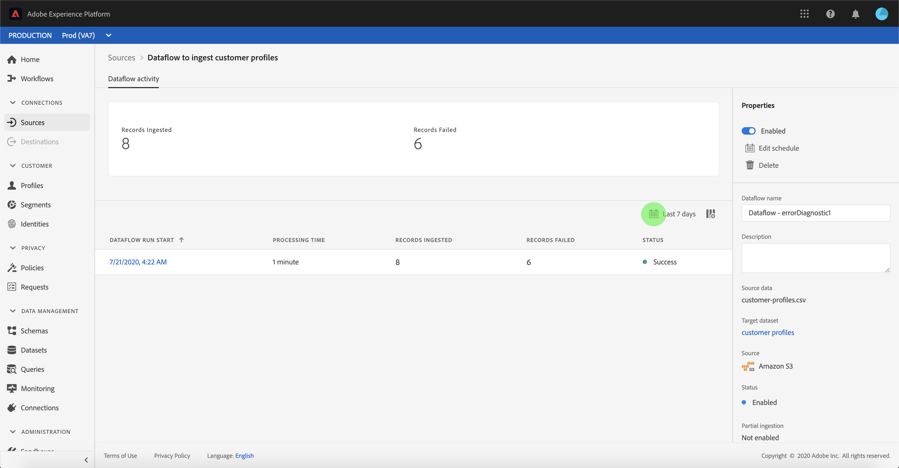
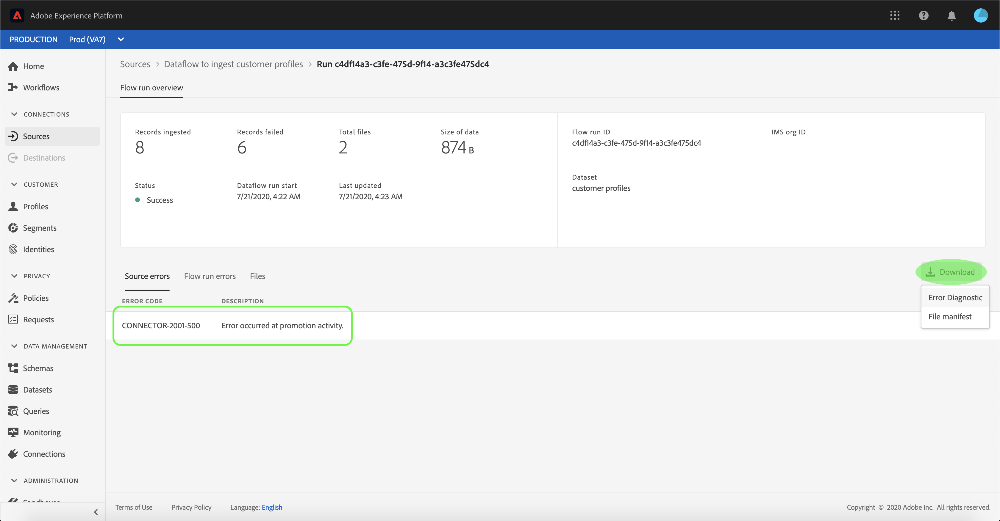
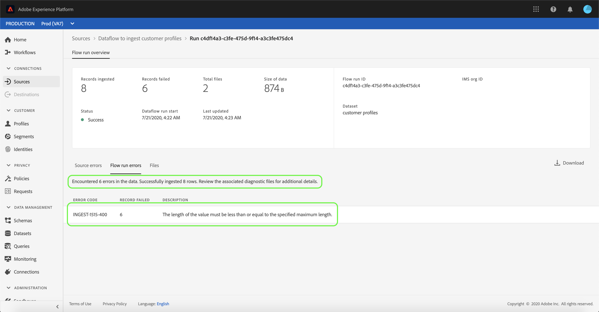
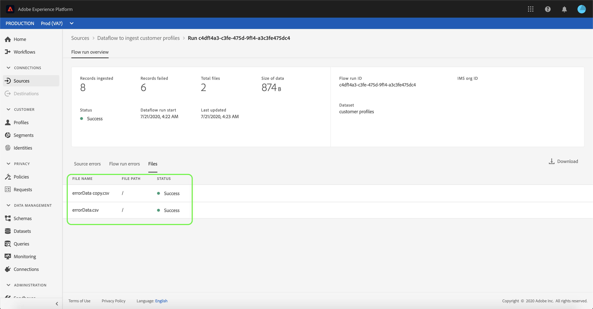

# Monitor accounts and dataflows

Source connectors in Adobe Experience Platform provide the ability to ingest externally sourced data on a scheduled basis. This tutorial provides steps for viewing existing accounts and dataflows from the *[!UICONTROL Sources]* workspace.

## Getting started

This tutorial requires a working understanding of the following components of Adobe Experience Platform:

-   [Experience Data Model (XDM) System](../../../xdm/home.md): The standardized framework by which [!DNL Experience Platform] organizes customer experience data.
    -   [Basics of schema composition](../../../xdm/schema/composition.md): Learn about the basic building blocks of XDM schemas, including key principles and best practices in schema composition.
    -   [Schema Editor tutorial](../../../xdm/tutorials/create-schema-ui.md): Learn how to create custom schemas using the Schema Editor UI.
-   [Real-time Customer Profile](../../../profile/home.md): Provides a unified, real-time consumer profile based on aggregated data from multiple sources.

## Monitor accounts

Log in to [Adobe Experience Platform](https://platform.adobe.com) and then select **[!UICONTROL Sources]** from the left navigation bar to access the *[!UICONTROL Sources]* workspace. The *[!UICONTROL Catalog]* screen displays a variety of sources for which you can create accounts and dataflows with. Each source shows the number of existing accounts and dataflows associated to them.

Select *[!UICONTROL Accounts]* from the top header to view existing accounts.

The *[!UICONTROL Accounts]* pages appears. On this page is a list of viewable accounts, including information about their source, username, number of dataflows, and date of creation.

Select the funnel icon on the top left to launch the sort window.

The sorting panel allows you to access accounts from a specific source. Select the source you wish to work with and select the account from the list on the right.

From the *[!UICONTROL Accounts]* page, you can view a list of existing dataflows associated with the account you accessed. Select the dataflow you wish to view.

 The *[!UICONTROL Dataflow activity]* screen appears. This page displays the rate of messages being consumed in the form of a graph.

 

## Monitor dataflows

Dataflows can be accessed directly from the *[!UICONTROL Catalog]* page without viewing *[!UICONTROL Accounts]*. Select *[!UICONTROL Dataflows]* from the top header to view a list of existing dataflows.

A list of existing dataflows appears. On this page is a list of viewable dataflows, including information about their source, username, number of dataflows, and status. Select the funnel icon on the top left to sort.

The sorting panel appears. Select the source you wish to access from the scroll menu and select the dataflow from the list on the right.

The *[!UICONTROL Dataflow activity]* page contains details on number of records ingested and records failed, as well as information regarding dataflow status and processing time. Select the calendar icon above the dataflow to view a different time frames of ingestion records.

The calendar allows you to view different time frames of records ingested. You can select from the pre-set of options of *[!UICONTROL Last 7 days]* or *[!UICONTROL Last 30 days]*. Alternatively, you can set a custom time frame using the calendar. Select **[!UICONTROL Apply]** to continue.

By default, the *[!UICONTROL Dataflow activity]* displays the *[!UICONTROL Properties]* panel associated with the dataflow. Select the the flow run from the list to see its associated meta data, including information about its unique run ID.

Select **[!UICONTROL Dataflow run start]** to see the *[!UICONTROL Flow run overview]*.

The *[!UICONTROL Flow run overview]* screen displays metadata information regarding the dataflow including its run ID and IMS organization ID. The lower half of the *[!UICONTROL Flow run overview]* screen contains information on any errors that occur during the ingestion process, divided into three tabs: *[!UICONTROL Source errors]*, *[!UICONTROL Flow run errors]*, and *[!UICONTROL Files]*.

| Tab | Description |
| --- | ----------- |
| Source errors | Source errors displays information on errors that occur at the source point during ingestion. |
| Flow run errors | Flow run errors displays information on errors that occur during the flow run. |
| Files | Files displays information on the files being ingested. |

Select **[!UICONTROL Flow run errors]** to see information on errors that occur during the flow run.

The **[!UICONTROL Flow run errors]** tab displays the number of errors encountered during the ingestion of the source data as well as the number of successfully ingested rows. The **[!UICONTROL Flow run errors]** tab also contains the specific error code associated with the failed records and a description for the error.

The **[!UICONTROL Files]** tab provides an overview of the files ingested, including the file name, their destination path, as well as the ingestion status.

For more information on monitoring dataflows and ingestion, refer to the tutorial on [monitoring streaming dataflows](../../../ingestion/quality/monitor-data-flows.md).

## Next steps

By following this tutorial, you have successfully accessed existing accounts and dataflows from the *[!UICONTROL Sources]* workspace. Incoming data can now be used by downstream [!DNL Platform] services such as [!DNL Real-time Customer Profile] and [!DNL Data Science Workspace]. See the following documents for more details:

- [Real-time Customer Profile overview](../../../profile/home.md)
- [Data Science Workspace overview](../../../data-science-workspace/home.md)