# Monitor accounts and dataflows in the UI

Source connectors in Adobe Experience Platform provide the ability to ingest externally sourced data on a scheduled basis. This tutorial provides steps for viewing existing accounts and dataflows from the [!UICONTROL Sources] workspace.

## Getting started

This tutorial requires a working understanding of the following components of Adobe Experience Platform:

-   [[!DNL Experience Data Model] (XDM) System](../../../xdm/home.md): The standardized framework by which [!DNL Experience Platform] organizes customer experience data.
    -   [Basics of schema composition](../../../xdm/schema/composition.md): Learn about the basic building blocks of XDM schemas, including key principles and best practices in schema composition.
    -   [Schema Editor tutorial](../../../xdm/tutorials/create-schema-ui.md): Learn how to create custom schemas using the Schema Editor UI.
-   [[!DNL Real-time Customer Profile]](../../../profile/home.md): Provides a unified, real-time consumer profile based on aggregated data from multiple sources.

## Monitor accounts

Log in to [Adobe Experience Platform](https://platform.adobe.com) and then select **[!UICONTROL Sources]** from the left navigation bar to access the **[!UICONTROL Sources]** workspace. The **[!UICONTROL Catalog]** screen displays a variety of sources for which you can create accounts and dataflows with. Each source shows the number of existing accounts and dataflows associated to them.

Select **[!UICONTROL Accounts]** from the top header to view existing accounts.

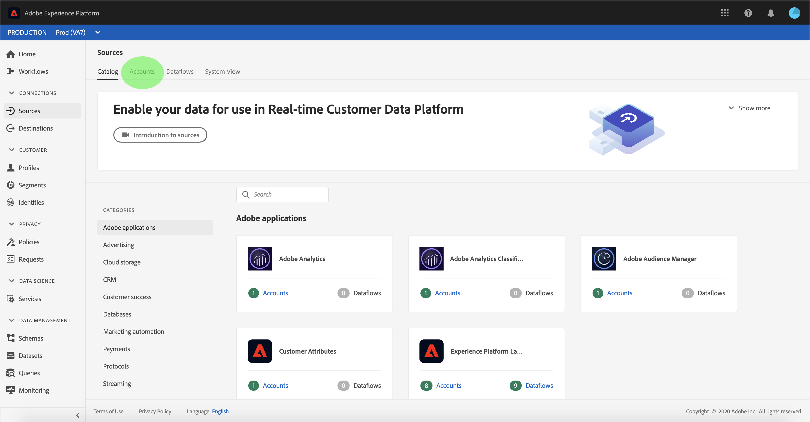

The **[!UICONTROL Accounts]** pages appears. On this page is a list of viewable accounts, including information about their source, username, number of dataflows, and date of creation.

Select the funnel icon on the top left to launch the sort window.

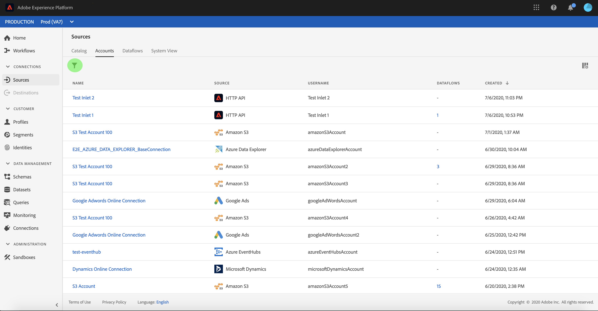

The sorting panel allows you to access accounts from a specific source. Select the source you wish to work with and select the account from the list on the right.

From the **[!UICONTROL Accounts]** page, you can view a list of existing dataflows or target datasets associated with the account you accessed.

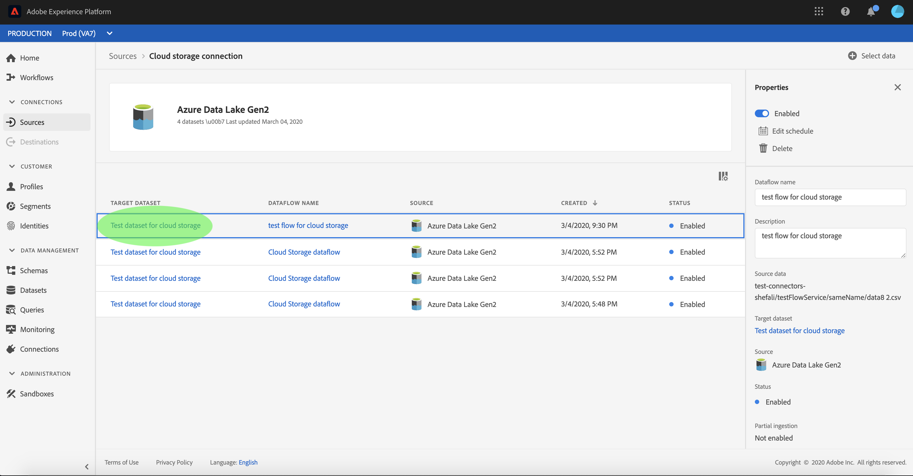

## Monitor dataflows

Dataflows can be accessed directly from the **[!UICONTROL Catalog]** page without viewing **[!UICONTROL Accounts]**. Select **[!UICONTROL Dataflows]** from the top header to view a list of existing dataflows.

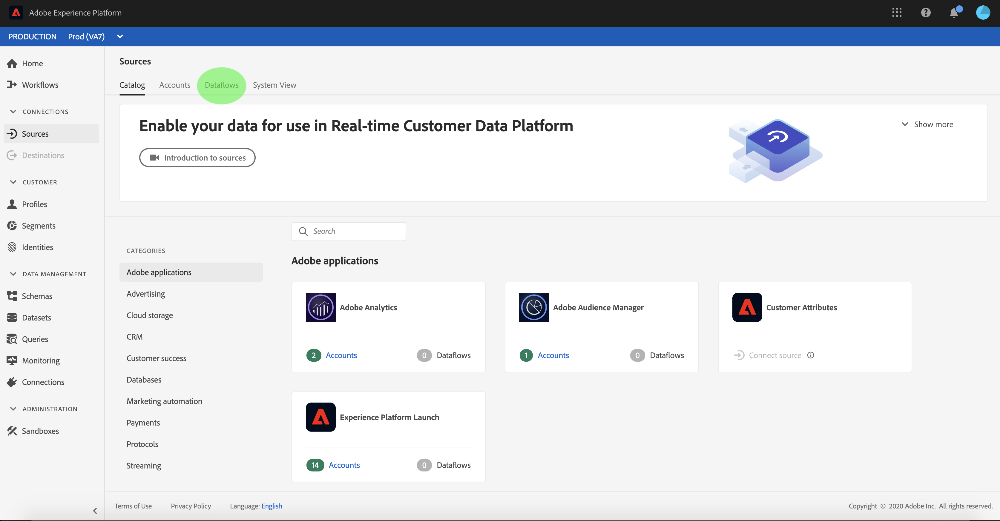

A list of existing dataflows appears. On this page is a list of viewable dataflows, including information about their source, username, number of dataflows, and status. Select the funnel icon on the top left to sort.

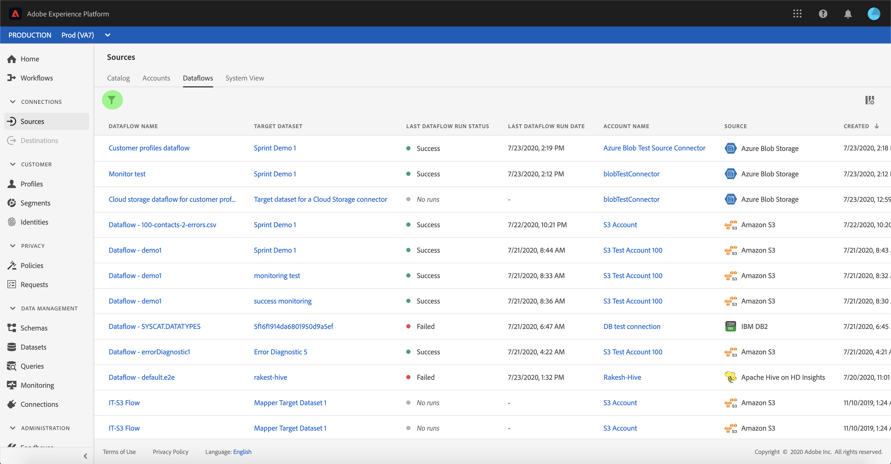

The sorting panel appears. Select the source you wish to access from the scroll menu and select the dataflow from the list on the right.

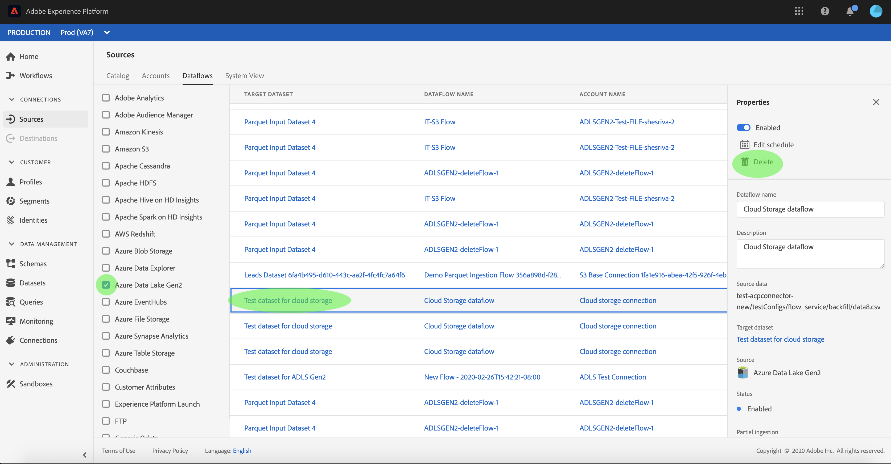

The **[!UICONTROL Dataflow activity]** page contains details on the number of records ingested  and records failed, as well as information regarding dataflow status and processing time. Select the calendar icon above the dataflow to adjust the time frame of your ingestion records.

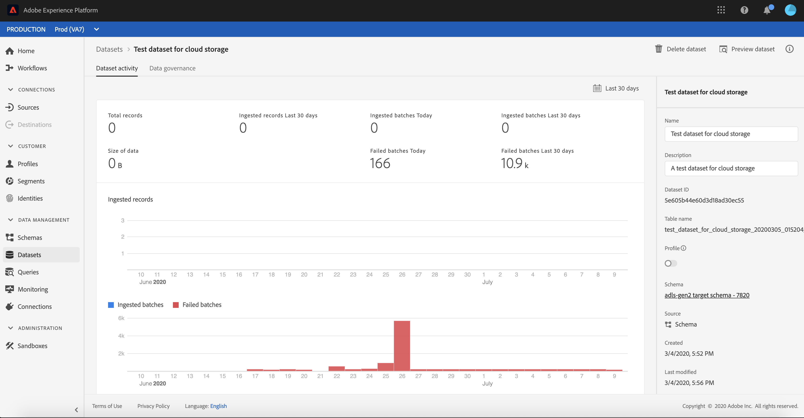

The calendar allows you to view the different time frames for ingested records. You can choose to select one of the two pre-set options **[!UICONTROL Last 7 days]** or **[!UICONTROL Last 30 days]**. Alternatively, you can set a custom time frame using the calendar. Select your time frame of choice and select **[!UICONTROL Apply]** to continue.

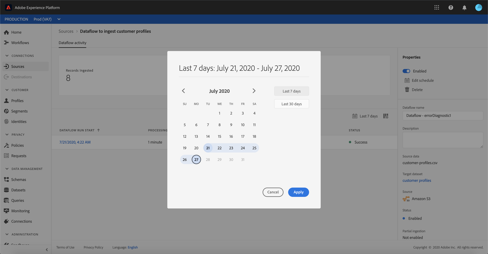

By default, the **[!UICONTROL Dataflow activity]** displays the **[!UICONTROL Properties]** panel associated with the dataflow. Select the flow run from the list to see its associated meta data, including information about its unique run ID.

Select **[!UICONTROL Dataflow run start]** to access the **[!UICONTROL Dataflow run overview]**.

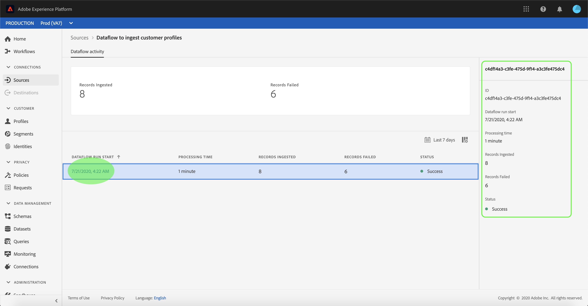

The **[!UICONTROL Dataflow run overview]** displays information on the dataflow including its metadata, **[!UICONTROL Partial ingestion]** status, and assigned **[!UICONTROL Error threshold]**. The upper header also includes an **[!UICONTROL Error summary]**. The **[!UICONTROL Error summary]** contains the specific top-level error that shows at which step the ingestion process encountered an error.

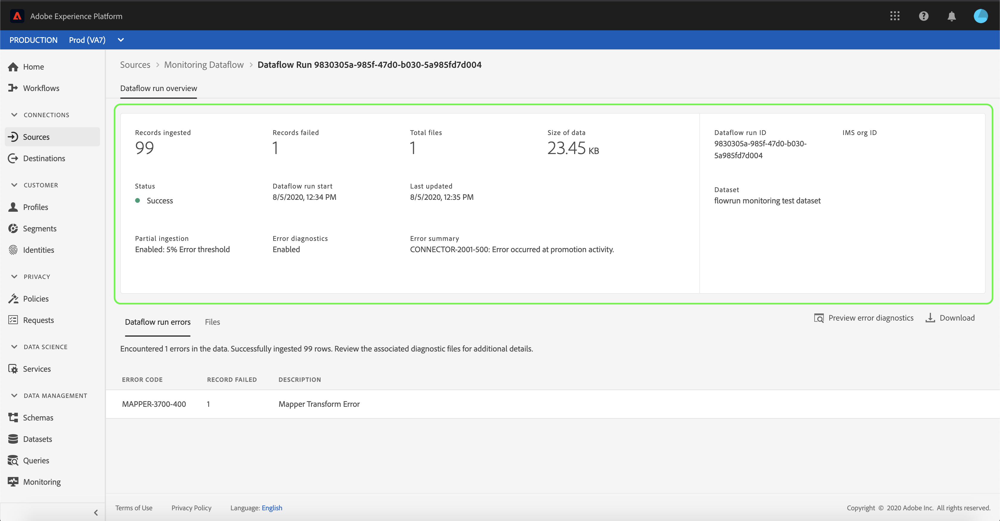

Refer to the following table for error codes that can be seen in the **[!UICONTROL Error summary]**.

| Error code | Error Message |
| ---------- | ----------- |
| `CONNECTOR-1001-500` | "A problem occurred with the copy activity." |
| `CONNECTOR-2001-500` | "There was a problem copying from the Experience Platform source to the dataset." |
| `CONNECTOR-3001-500` | "A problem occurred with the flow provider while creating batch using bulk ingest API." |

The lower half of the screen contains information on **[!UICONTROL Dataflow run errors]**. From here, you can also view the files ingested, preview and download error diagnostics, or download the file manifest.

The **[!UICONTROL Dataflow run errors]** section displays the **[!UICONTROL Error code]**, the number of records failed, and information describing the error.

Select **[!UICONTROL Preview error diagnostics]** to see more information on the ingestion error.

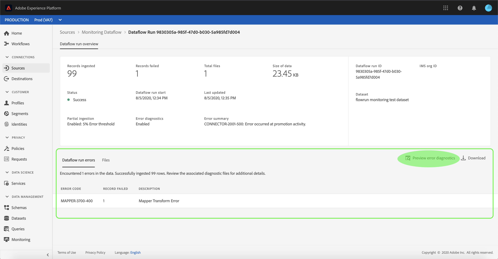

The **[!UICONTROL Error diagnostics preview]** panel appears. This screen displays specific information regarding the ingestion failure, including the **[!UICONTROL File name]**, **[!UICONTROL Error code]**, the name of the column in which the error occurred, and a description of the error.

This section also includes a preview of the column that contains the error.

>[!IMPORTANT]
>
>To enable **[!UICONTROL Error diagnostics preview]** you must activate **[!UICONTROL Partial ingestion]** and **[!UICONTROL Error diagnostics]** when configuring a dataflow. Doing so will allow the system to scan all of the records ingested during the flow run.

After previewing the errors, you can select **[!UICONTROL Download]** from within the **[!UICONTROL dataflow runs overview]** panel to access full error diagnostics and download the file manifest. See the documents on [error diagnostics](../../../ingestion/batch-ingestion/partial.md#retrieve-errors) and [downloading metadata](../../../ingestion/batch-ingestion/partial.md#download-metadata) for more information.

For more information on monitoring dataflows and ingestion, refer to the tutorial on [monitoring streaming dataflows](../../../ingestion/quality/monitor-data-flows.md).

## Next steps

By following this tutorial, you have successfully accessed existing accounts and dataflows from the **[!UICONTROL Sources]** workspace. Incoming data can now be used by downstream [!DNL Platform] services such as [!DNL Real-time Customer Profile] and [!DNL Data Science Workspace]. See the following documents for more details:

- [Real-time Customer Profile overview](../../../profile/home.md)
- [Data Science Workspace overview](../../../data-science-workspace/home.md)
