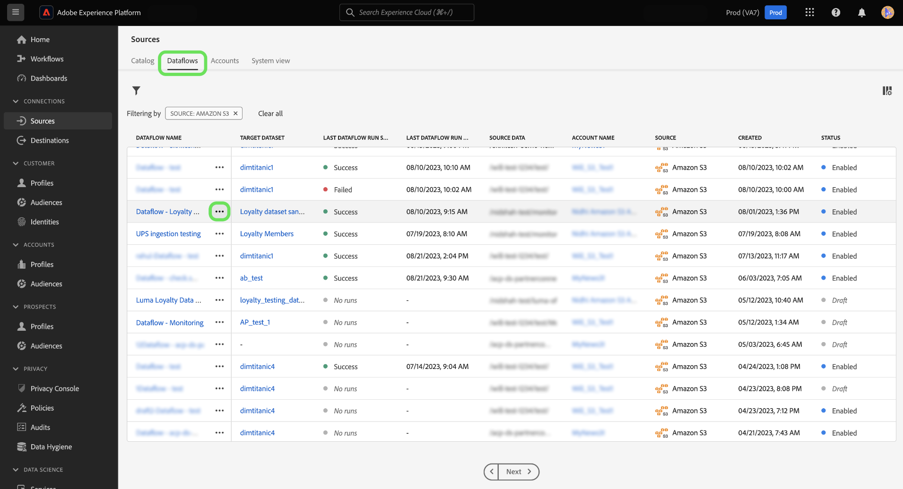
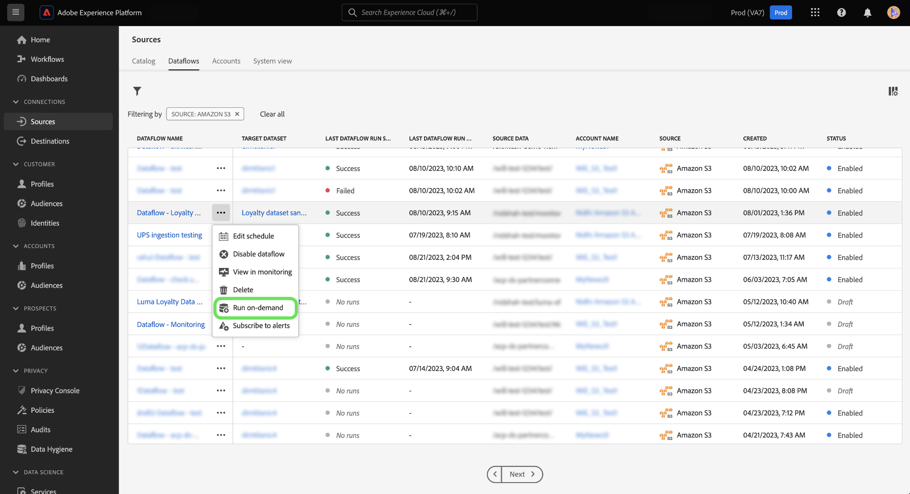
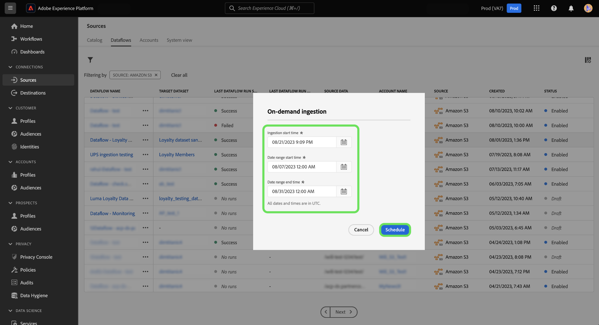
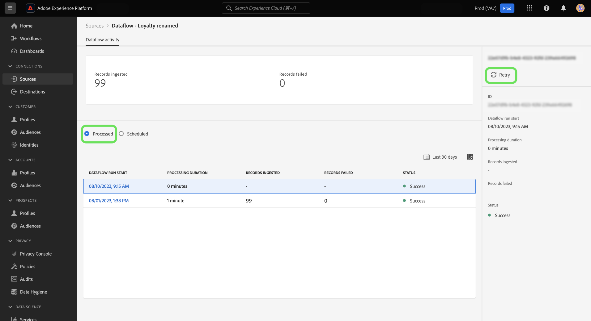
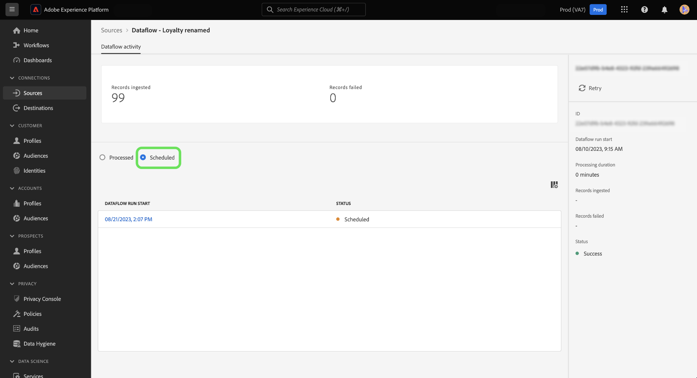

# On-demand ingestion for sources dataflows in the UI

You can use on-demand ingestion to trigger a flow run iteration of an existing dataflow using the sources workspace in the Adobe Experience Platform user interface.

This document provides you with steps on how to create dataflows on demand for sources, as well as how to retry flow runs that have been processed or have failed.

>[!BEGINSHADEBOX]

**What is a flow run?**

Flow runs represent an instance of dataflow execution. For example, if a dataflow is scheduled to run hourly at 9:00 AM, 10:00 AM, and 11:00 AM, then you would have three instances of a flow run. Flow runs are specific to your particular organization.

>[!ENDSHADEBOX]

## Getting started

This document requires a working understanding of the following components of Experience Platform:

* [Sources](../../home.md): Experience Platform allows data to be ingested from various sources while providing you with the ability to structure, label, and enhance incoming data using Platform services.
* [Dataflows](../../../dataflows/home.md): A dataflow is a representation of data jobs that move data across Platform. Dataflows are configured across different services, helping move data from source connectors to target datasets, to Identity Service and Real-Time Customer Profile, and to Destinations.
* [Sandboxes](../../../sandboxes/home.md): Experience Platform provides virtual sandboxes that partition a single Platform instance into separate virtual environments to help develop and evolve digital experience applications.

## Create a dataflow on demand {#create-a-dataflow-on-demand}

Navigate to the *[!UICONTROL Dataflows]* tab of the sources workspace. From here, find the dataflow that you want to run on demand, and then select the ellipses (**`...`**) beside your dataflow name.

Next, select **[!UICONTROL Run on-demand]** from the dropdown menu that appears.

Configure the schedule of your on-demand ingestion. Select the **[!UICONTROL Ingestion start time]**, the **[!UICONTROL Date range start time]**, and the **[!UICONTROL Date range end time]**.

| Scheduling configuration | Description |
| --- | --- |
| [!UICONTROL Ingestion start time] | The scheduled start time in UTC of when the on-demand dataflow will start. |
| [!UICONTROL Date range start time] | The starting date and time from which data will be pulled from. |
| [!UICONTROL Date range end time] | The ending date and time from which data will be pulled until. |

Select **[!UICONTROL Schedule]** and allow a few moments for your on-demand dataflow to trigger.

Select your dataflow name to view your dataflow activity. Here you will see a list of your dataflow runs that have been processed. Select a dataflow run, then select **[!UICONTROL Retry]** from the right rail to retry ingestion for a selected dataflow run iteration.

Select **[!UICONTROL Scheduled]** to see a list of dataflow runs that are scheduled for future ingestion.

## Next steps

By reading this document, you have learned how to create flow runs on demand for existing sources dataflows. For more information on sources, read the [sources overview](../../home.md)