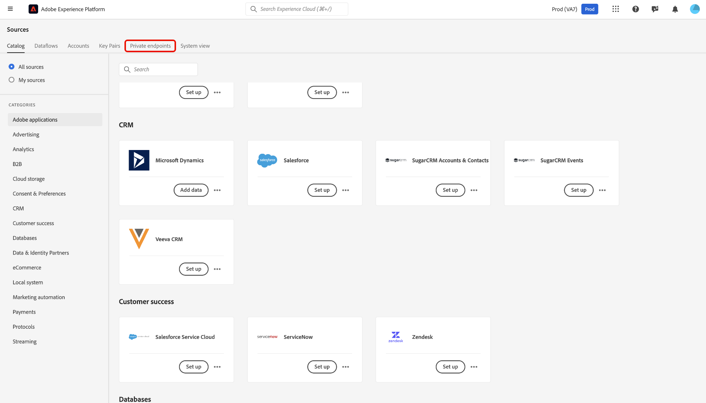
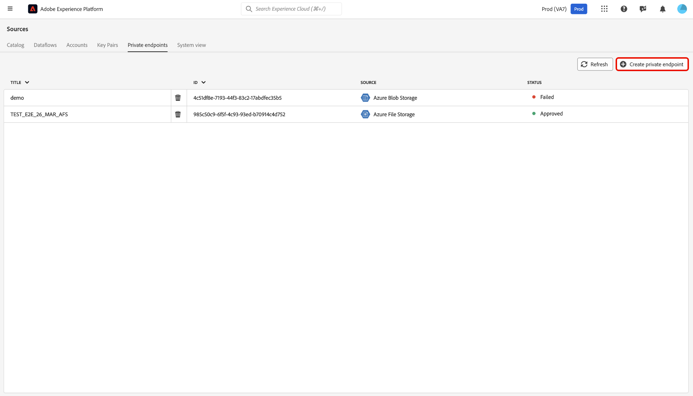
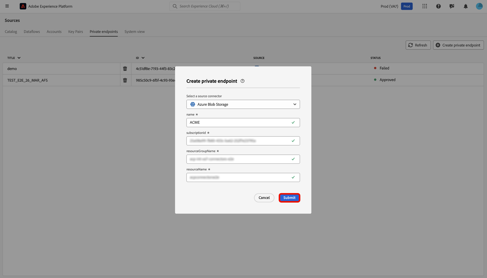
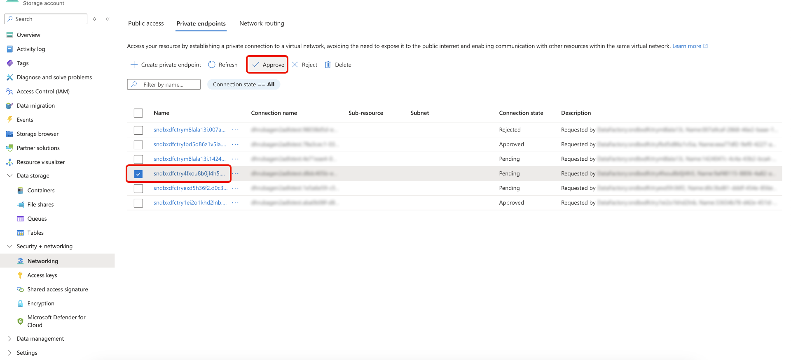
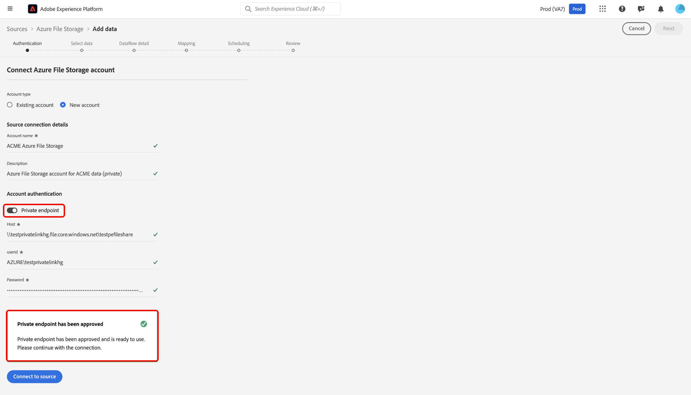
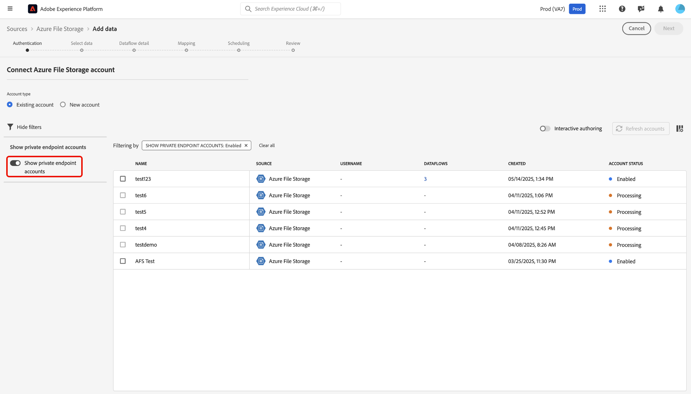
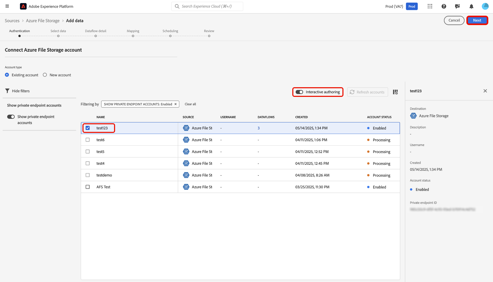

# Private Link Support for Sources in the UI

>[!AVAILABILITY]
>
>This feature is supported by the following sources:
>
>* [[!DNL Azure Blob Storage]](../../connectors/cloud-storage/blob.md)
>* [[!DNL ADLS Gen2]](../../connectors/cloud-storage/adls-gen2.md)
>* [[!DNL Azure File Storage]](../../connectors/cloud-storage/azure-file-storage.md)

You can use the Private Links feature to create private endpoints for your Adobe Experience Platform sources to connect to. Securely connect your sources to  a virtual network using private IP addresses, eliminating the need for public IPs and reduce your attack surface. Simplify your network setup by removing the need for complex firewall or Network Address Translation configurations, while ensuring data traffic only reaches approved services.

Read this guide to learn how you can use the sources workspace in the Experience Platform UI to create and use a private endpoint.

>[!NOTE]
>
>You can only have one private endpoint per source account for all development sandboxes in your organization.

## Create a private endpoint

To get started with Private Links, navigate to the *[!UICONTROL Sources]* catalog of the Experience Platform UI and select **[!UICONTROL Private endpoints]** from the menu of tabs in the sources workspace.

Use the interface to view information about existing private endpoints, such as their ID, associated source, and current status. To create a new private endpoint, select **[!UICONTROL Create private endpoint]**.

Next, choose your desired source, and then enter values for the following properties:

| Property | Description |
| --- | --- |
| `name` | The name of your private endpoint. |
| `subscriptionId` | The ID associated with your [!DNL Azure] subscription. For more information, read the [!DNL Azure] guide on [retrieving your subscription and tenant IDs from the [!DNL Azure Portal]](https://learn.microsoft.com/en-us/azure/azure-portal/get-subscription-tenant-id). |
| `resourceGroupName` | The name of your resource group on [!DNL Azure]. A resource group contains related resources for an [!DNL Azure] solution. For more information, read the [!DNL Azure] guide on [managing resource groups](https://learn.microsoft.com/en-us/azure/azure-resource-manager/management/manage-resource-groups-portal). | 
| `resourceGroup` | The name of your resource. In [!DNL Azure], a resource refers to instances like virtual machines, web apps, and databases. For more information, read the [!DNL Azure] guide on [understanding the [!DNL Azure] resource manager](https://learn.microsoft.com/en-us/azure/azure-resource-manager/management/overview). |

{style="table-layout:auto"}

When finished, select **[!UICONTROL Submit]**.

### Approve a private endpoint

A newly created endpoint remains in a pending state until it is approved by an administrator.

To approve a private endpoint request for the [!DNL Azure Blob] and [!DNL Azure Data Lake Gen2] sources, log in to the [!DNL Azure Portal]. In the left navigation, select **[!DNL Data storage]**, then go to the **[!DNL Security + networking]** tab and choose **[!DNL Networking]**. Next, select **[!DNL Private endpoints]** to see a list of private endpoints associated with your account and their current connection states. To approve a pending request, select the desired endpoint and click **[!DNL Approve]**.

## Create an account with a private endpoint

Navigate to the sources catalog and select a source that supports private endpoints. Next, create a new account with your source and during account authentication, select the **[!UICONTROL Private endpoint]** toggle. Provide your source's authentication credentials and then select **[!UICONTROL Connect to source]** Allow a few minutes for the connection to be established.

>[!NOTE]
>
>If the [!UICONTROL Private endpoint] option is enabled, Experience Platform checks whether an approved private endpoint exists for the selected source. If no approved endpoint is found, you will not be able to establish a connection.

Next, navigate to the [!UICONTROL Existing account] interface of your source. Use this interface to view a list of your existing accounts and their corresponding statuses. You can select the filter icon  to display only the accounts that have been enabled to connect with a private endpoint.

Select the account you want to use, then enable **[!UICONTROL Interactive Authoring]**. This toggle activates [!UICONTROL Interactive Authoring], an [!DNL Azure] feature that allows you to test connections, browse folder lists, and preview data. Enabling [!UICONTROL Interactive Authoring] is required for private endpoint connections. Note that you cannot manually turn off this toggle; it automatically disables after 60 minutes.

[!UICONTROL Interactive Authoring] takes a few minutes to enable. Once the setting is enabled, select **[!UICONTROL Next]** to proceed to the next step and select the data that you want to ingest.

## Next steps

Now that you have successfully created a private endpoint, you can create source connections and dataflows, and ingest data using private endpoints. Read the following guides for information on how to create dataflows in the UI:

* [Create a dataflow for a cloud storage source](../ui/dataflow/batch/cloud-storage.md)
* [Create a dataflow for a database source](../ui/dataflow/databases.md)
