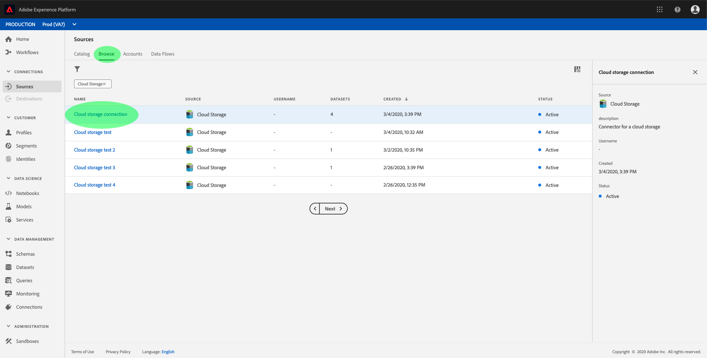
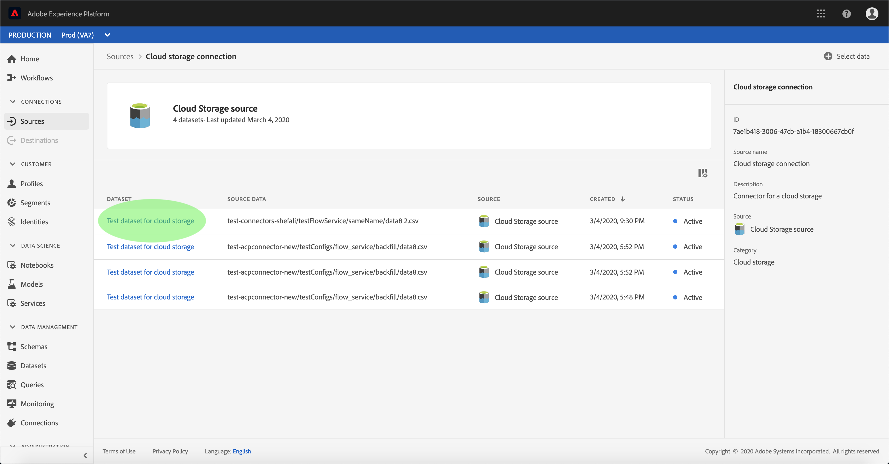
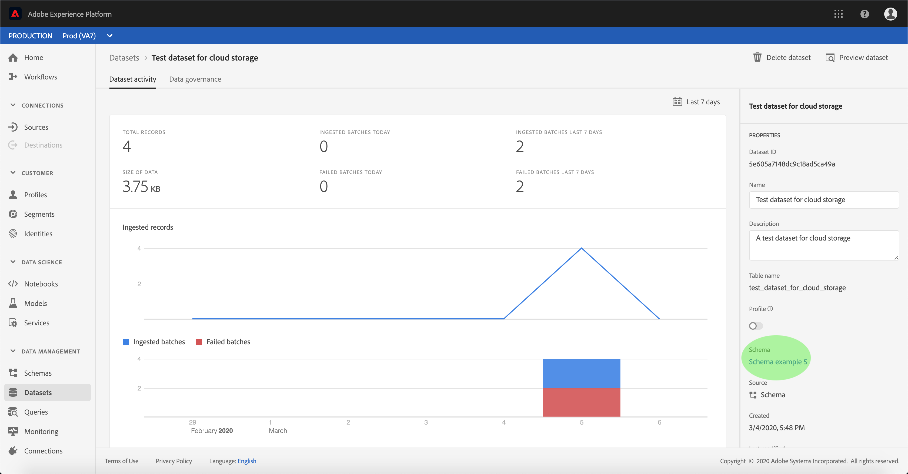
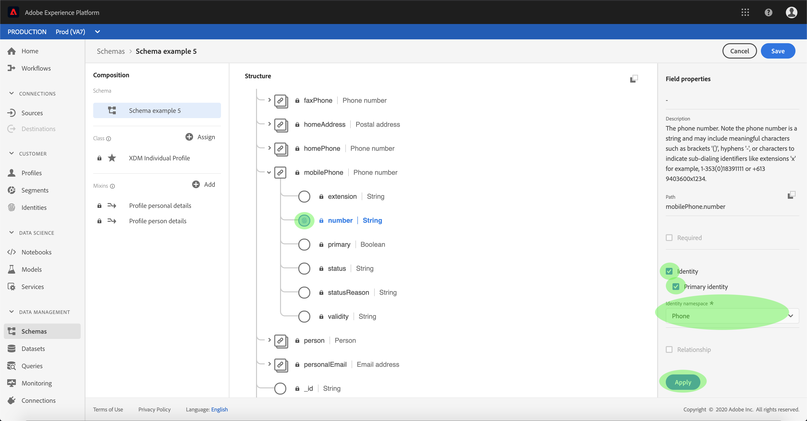
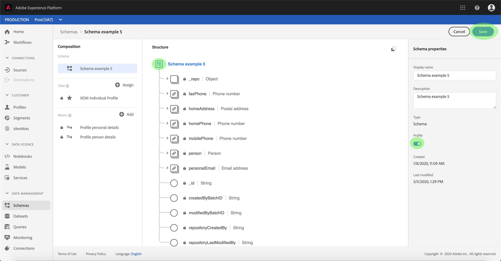
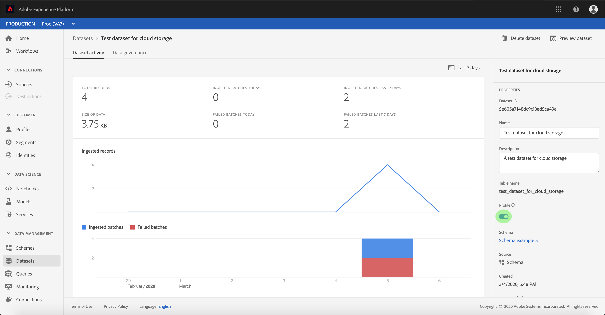

# Activate inbound source data to populate customer profiles

Inbound data from your source connector can be used towards enriching and populating your [!DNL Real-Time Customer Profile] data.

## Getting started

This tutorial requires a working understanding of the following components of Adobe Experience Platform:

-   [[!DNL Experience Data Model (XDM)] System](../../../xdm/home.md): The standardized framework by which [!DNL Experience Platform] organizes customer experience data.
    -   [Basics of schema composition](../../../xdm/schema/composition.md): Learn about the basic building blocks of XDM schemas, including key principles and best practices in schema composition.
    -   [Schema Editor tutorial](../../../xdm/tutorials/create-schema-ui.md): Learn how to create custom schemas using the Schema Editor UI.
-   [[!DNL Real-Time Customer Profile]](../../../profile/home.md): Provides a unified, real-time consumer profile based on aggregated data from multiple sources.

Additionally, this tutorial requires that you have already created and configured a source connector.  A list of tutorials for creating different connectors in the UI can be found in the [source connectors overview](../../home.md).

## Populate your [!DNL Real-Time Customer Profile] data

In order to enrich customer profiles, the target dataset's source schema must be compatible for use in [!DNL Real-Time Customer Profile]. A compatible schema satisfies the following requirements:

- The schema has at least one attribute specified as an identity property.
- The schema has an identity property defined as the primary identity.
- A mapping within the dataflow exists wherein the primary identity is a target attribute.

Within the Sources workspace, click the **[!UICONTROL Browse]** tab to list your base connections. In the displayed list, find the connection that contains the dataflow you wish to populate profiles with. Click the connection's name to access its details.

The connection's **[!UICONTROL Source activity]** screen appears, displaying the datasets that the connection is ingesting source data into. Click the name of the dataset you wish to enable for [!DNL Profile].

The **[!UICONTROL Dataset activity]** screen appears. The **[!UICONTROL Properties]** column on the right-hand side of the screen displays the details of the dataset, and includes a **[!UICONTROL Profile]** switch and a link to the schema the dataset adheres to. Click the name of the schema to view its composition.

The **[!UICONTROL Schema Editor]** appears, showing the structure of the schema in the center canvas. Within the canvas, select the field to be set as the primary identity. Under the **[!UICONTROL Field properties]** tab that appears, select the **[!UICONTROL Identity]** checkbox, then **[!UICONTROL Primary identity]**. Finally, select an appropriate **[!UICONTROL Identity namespace]**, then click **[!UICONTROL Apply]**.

Click the top-level object of the schema's structure and the **[!UICONTROL Schema properties]** column appears. Enable the schema for [!DNL Profile] by toggling the **[!UICONTROL Profile]** switch. Click **[!UICONTROL Save]** to finalize your changes.

Now that the schema is enabled for [!DNL Profile], return to the **[!UICONTROL Dataset activity]** screen and enable the dataset for [!DNL Profile] by clicking the **[!UICONTROL Profile]** toggle within the **[!UICONTROL Properties]** column.

With both the schema and dataset enabled for [!DNL Profile], data ingested into that dataset will now also populate customer profiles.

>[!NOTE]
>
>Existing data within a recently enabled dataset is not consumed by [!DNL Profile].

## Next steps

By following this tutorial, you have successfully activated inbound data for [!DNL Profile] population. For more information, see the [[!DNL Real-Time Customer Profile] overview](../../../profile/home.md).
