# (Beta) Create a sources dataflow using templates in the UI

>[!IMPORTANT]
>
>Templates are in beta and are supported by the following sources:
>
>* [[!DNL Marketo Engage]](../../connectors/adobe-applications/marketo/marketo.md)
>* [[!DNL Microsoft Dynamics]](../../connectors/crm/ms-dynamics.md)
>* [[!DNL Salesforce]](../../connectors/crm/salesforce.md)
>
>The documentation and functionalities are subject to change.

Adobe Experience Platform provides pre-configured templates that you can use to accelerate your data ingestion process. Templates include auto-generated assets such as schemas, datasets, identities, mapping rules, identity namespaces, and dataflows that you can use when bringing in data from a source to Experience Platform.

With templates, you can:

* Reduce time-to-value of ingestion through acceleration of templatized asset creation.
* Minimize errors that can occur during the manual data ingestion process.
* Update auto-generated assets at any point to suit your use cases.

The following tutorial provides steps on how to use templates in the Platform UI.

## Getting Started

This tutorial requires a working understanding of the following components of Experience Platform:

* [Sources](../../home.md): Experience Platform allows data to be ingested from various sources while providing you with the ability to structure, label, and enhance incoming data using Platform services.
* [[!DNL Experience Data Model (XDM)] System](../../../xdm/home.md): The standardized framework by which Experience Platform organizes customer experience data.
* [Sandboxes](../../../sandboxes/home.md): Experience Platform provides virtual sandboxes which partition a single Platform instance into separate virtual environments to help develop and evolve digital experience applications.

## Use templates in the Platform UI {#use-templates-in-the-platform-ui}

>[!CONTEXTUALHELP]
>id="platform_sources_templates_accounttype"
>title="Select business type"
>abstract="Select the appropriate business type for your use case. Your access may vary depending on your Real-Time Customer Data Platform subscription account."
>additional-url="https://experienceleague.adobe.com/docs/experience-platform/rtcdp/overview.html" text="Real-Time CDP overview"

In the Platform UI, select **[!UICONTROL Sources]** from the left navigation to access the [!UICONTROL Sources] workspace and see a catalog of sources available in Experience Platform.

Use the *[!UICONTROL Categories]* menu to filter sources by category. Alternatively, enter a source name in the search bar to find a specific source from the catalog.

Go to the [!UICONTROL Adobe applications] category to see the [!DNL Marketo Engage] source card and then, select [!UICONTROL Add data] to begin.

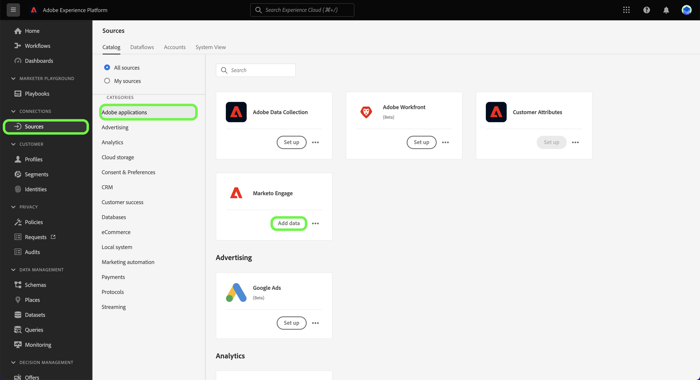

A pop-up window appears presenting you with the option to browse templates or use existing schemas and datasets. 

* **Browse templates**: Sources templates auto-creates schemas, identities, datasets, and dataflows with mapping rules for you. You can customize these assets as needed.
* **Use my existing assets**: Ingest your data using existing datasets and schemas that you created. You can also create new datasets and schemas if needed.

To use auto-generated assets, select **[!UICONTROL Browse templates]** and then select **[!UICONTROL Select]**.

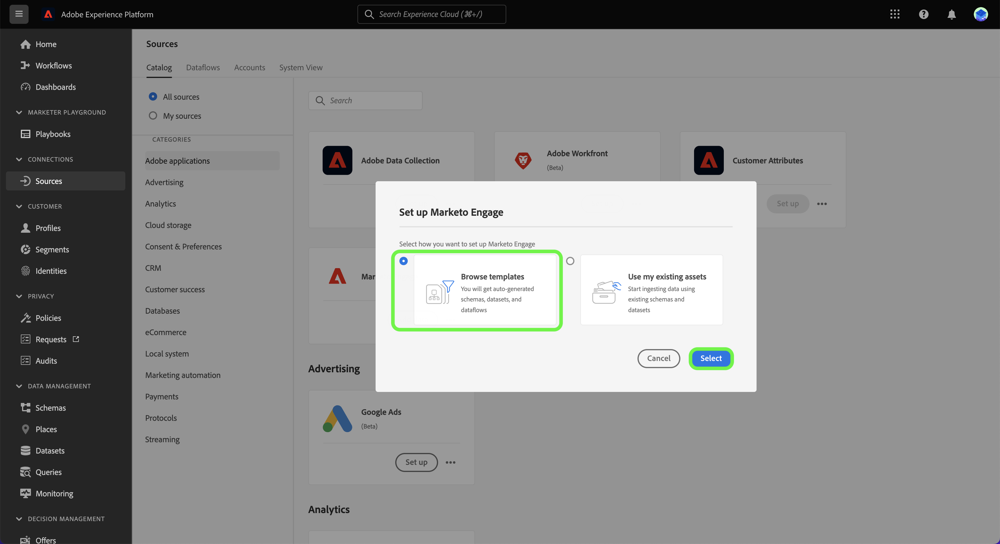

### Authentication

The authentication step appears, prompting you to either create a new account or use an existing account.

>[!BEGINTABS]

>[!TAB Use an existing account]

To use an existing account, select [!UICONTROL Existing account] and then select the account that you want to use from the list that appears.

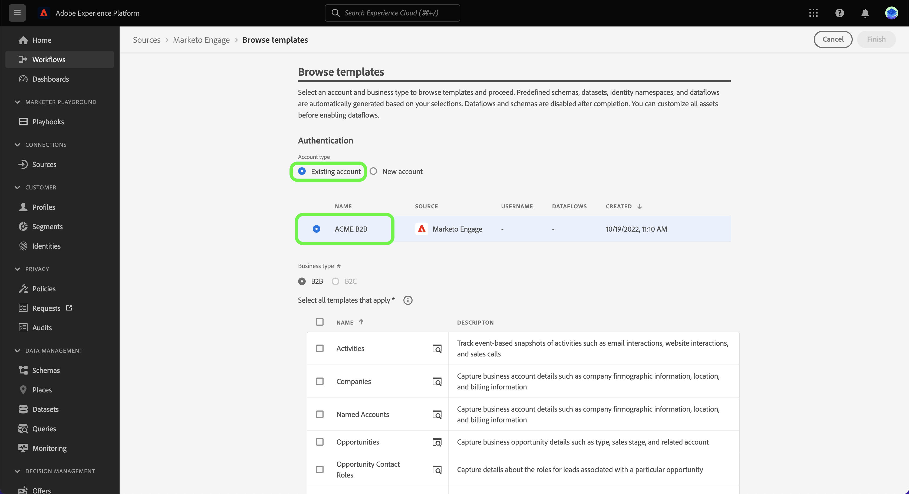

>[!TAB Create a new account]

To create a new account, select **[!UICONTROL New account]**, and then provide your source connection details and account authentication credentials. When finished, select **[!UICONTROL Connect to source]** and allow some time for the new connection to establish.

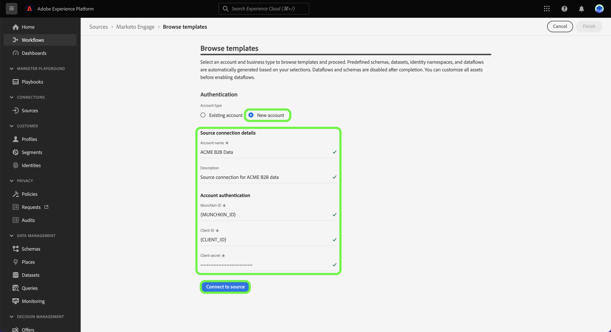

>[!ENDTABS]

### Select templates

Depending on the business type that you selected, a list of templates appears. Select the preview icon  beside a template name to preview sample data from the template.

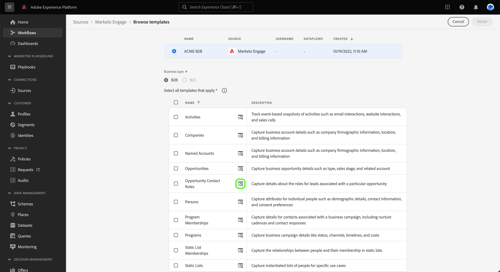

The preview window appears allowing you to explore and inspect sample data from your template. When finished, select **[!UICONTROL Got it]**.

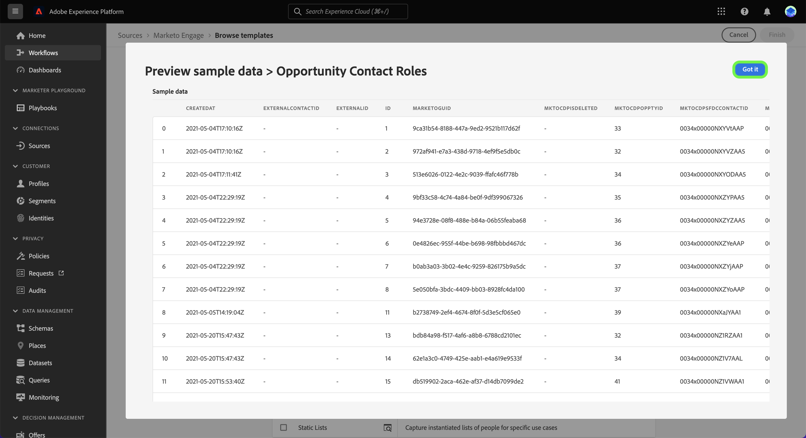

Next, select the template that you would like to use from the list. You can select multiple templates and create multiple dataflows at once. However, a template can only be used once per account. Once you have selected your templates, select **[!UICONTROL Finish]** and allow a few moments for the assets to generate.

If you select one or partial items from the list of available templates, all B2B schemas and identity namespaces will still be generated to ensure that B2B relationships across schemas are configured correctly.

>[!NOTE]
>
>Templates that have already been used will be disabled from selection.

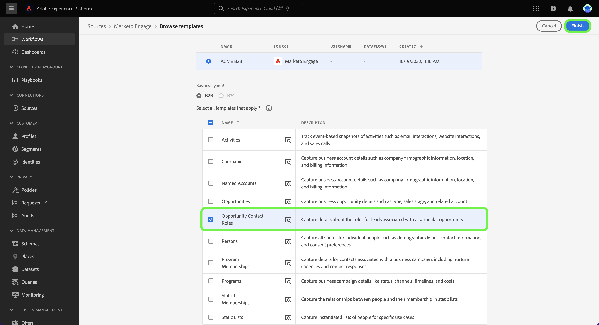

### Set a schedule

The [!DNL Microsoft Dynamics] and the [!DNL Salesforce] sources both support scheduling dataflows. 

Use the scheduling interface to configure an ingestion schedule for your dataflows. Set your ingestion frequency to **Once** to create a one-time ingestion. 

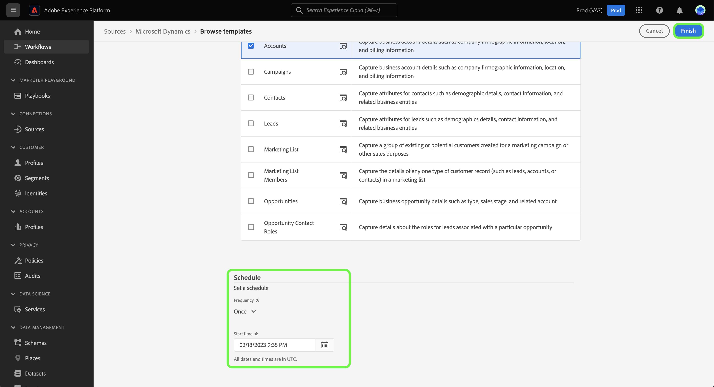

Alternatively, you can set your ingestion frequency to **Minute**, **Hour**, **Day**, or **Week**. If schedule your dataflow for multiple ingestions, then you must set an interval to establish a time frame between every ingestion. For example, an ingestion frequency set to **Hour** and an interval set to **15** means that your dataflow is scheduled to ingest data every **15 hours**.

During this step, you can also enable **backfill** and define a column for the incremental ingestion of data. Backfill is used to ingest historical data, while the column you define for incremental ingestion allows new data to be differentiated from existing data.

Once you have completed configuring your ingestion schedule, select **[!UICONTROL Finish]**.

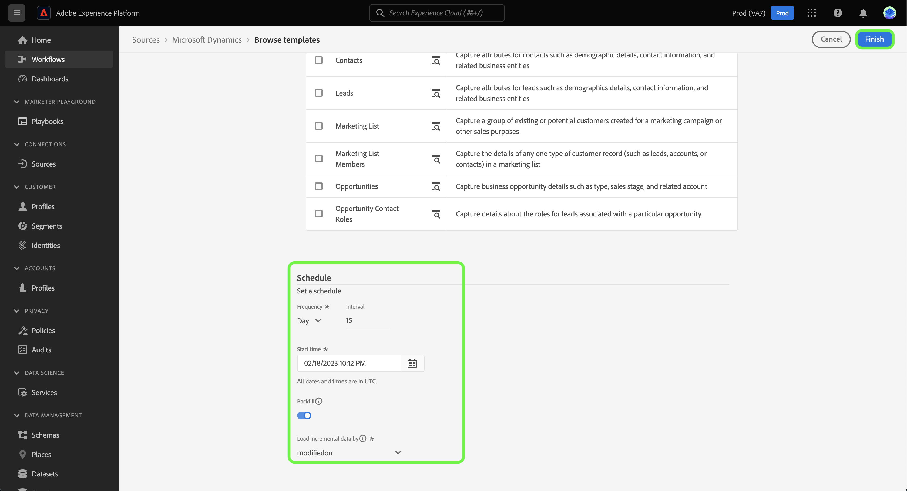
 
### Review assets {#review-assets}

>[!CONTEXTUALHELP]
>id="platform_sources_templates_review"
>title="Review your auto-generated assets"
>abstract="It can take up to five minutes to generate all assets. If you choose to leave the page, you will get a notification to return once the assets are completed. You can review the assets once they are generated and make additional configurations to your dataflow at any time."

The [!UICONTROL Review template assets] page displays the assets auto-generated as part of your template. In this page, you can view the auto-generated schemas, datasets, identity namespaces, and dataflows associated with your source connection. It can take up to five minutes to generate all assets. If you choose to leave the page, you will get a notification to return once the assets are completed. You can review the assets once they are generated and make additional configurations to your dataflow at any time.

By default, auto-generated dataflows are **set to a draft state**. Select the ellipses (`...`) beside the dataflow name and then select **[!UICONTROL Preview mappings]** to see the mapping sets created for your draft dataflow. 

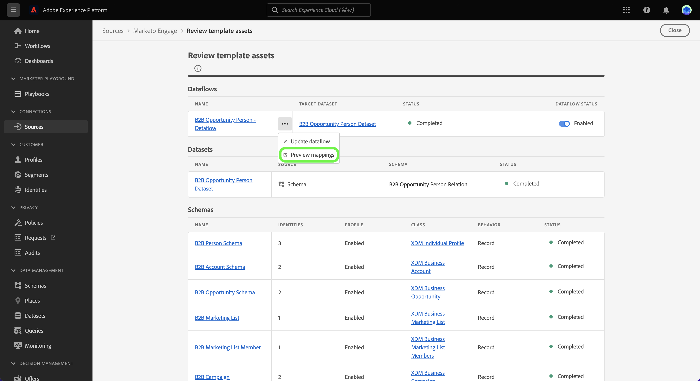

A preview page appears allowing you to inspect the mapping relationship between your source data fields and your target schema fields. Once you have viewed your dataflow's mappings. Select **[!UICONTROL Got it.]**

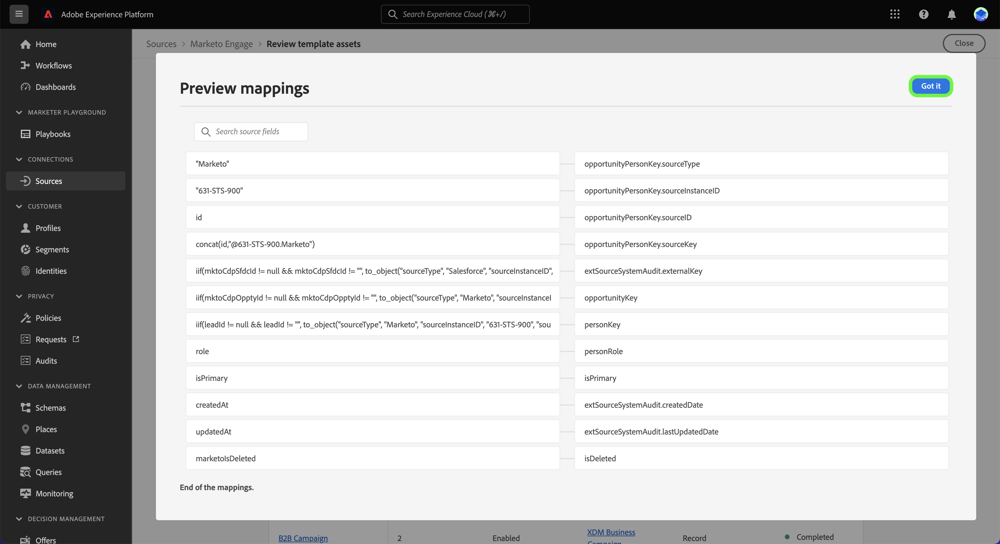

You can update your dataflows at any time after execution. Select the ellipses (`...`) beside the dataflow name and then select **[!UICONTROL Update dataflow]**. You are taken to the sources workflow page where you can update your dataflow details, including settings for partial ingestion, error diagnostics, and alert notifications, as well as your dataflow's mapping.

You can use the schema editor view to make updates to your auto-generated schema. Visit the guide on [using the schema editor](../../../xdm/tutorials/create-schema-ui.md) for more information.

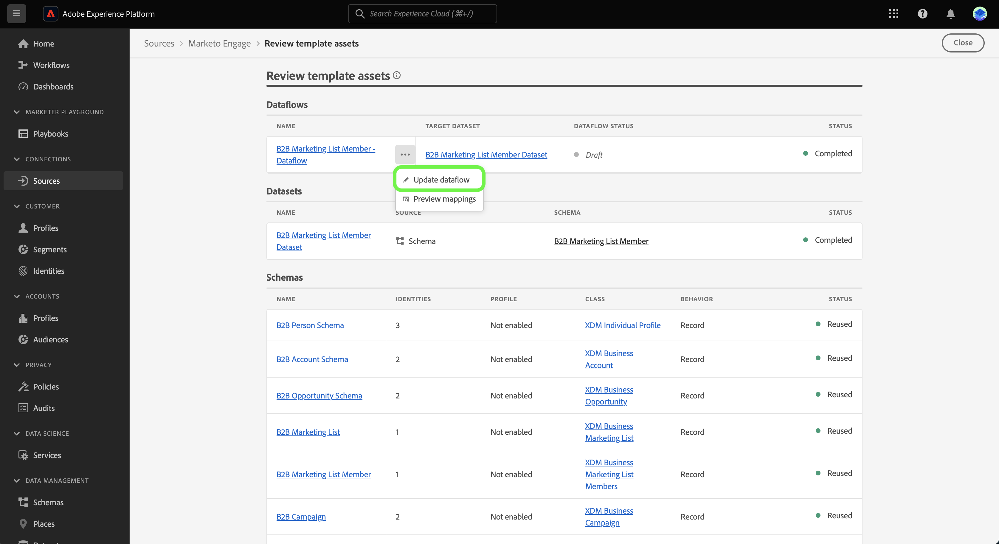

>[!TIP]
>
>You can access your draft dataflow through the [!UICONTROL Dataflows] catalog page in the sources workspace. Select **[!UICONTROL Dataflows]** from the top header and then select the dataflow that you want to update from the list. 
>
>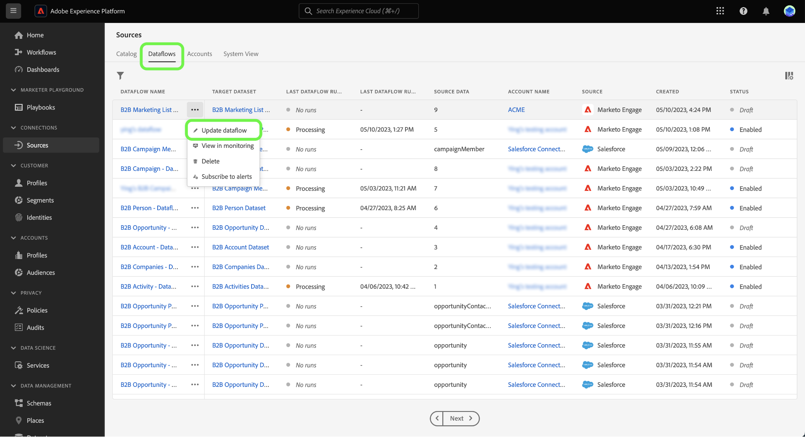

### Publish your dataflow

Begin the publishing process by going through the sources workflow. After you select [!UICONTROL Update dataflow], you are taken to the *[!UICONTROL Add data]* step of the workflow. Select **[!UICONTROL Next]** to proceed.

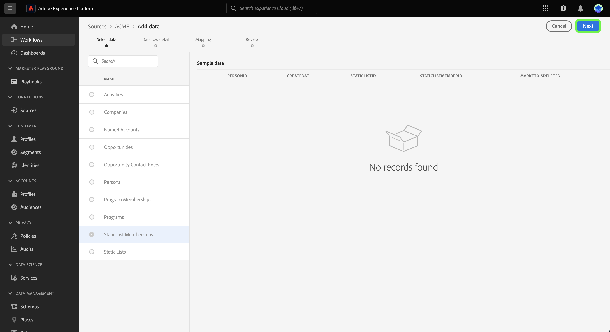

Next, confirm your dataflow details and configure settings for error diagnostics, partial ingestion, and alert notifications. When finished, select **[!UICONTROL Next]**.

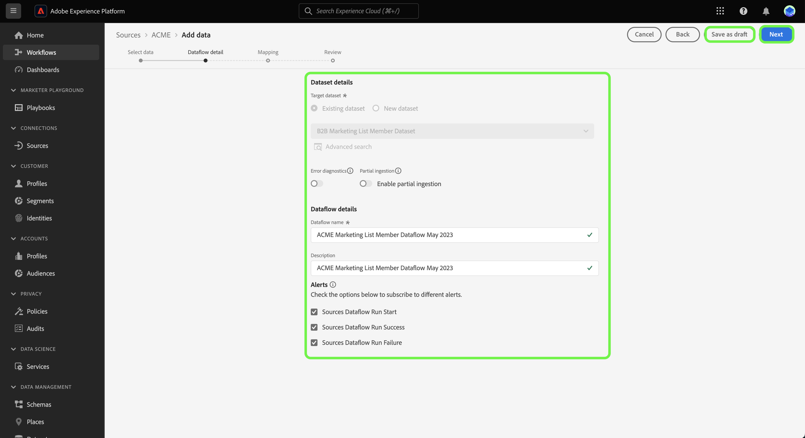

>[!NOTE]
>
>You can select **[!UICONTROL Save as draft]** at any point to stop and save the changes you have made to your dataflow.

The mapping step appears. During this step, you can reconfigure the mapping configurations of your dataflow. For a comprehensive guide on the data prep functions used for mapping, visit the [data prep UI guide](../../../data-prep/ui/mapping.md).

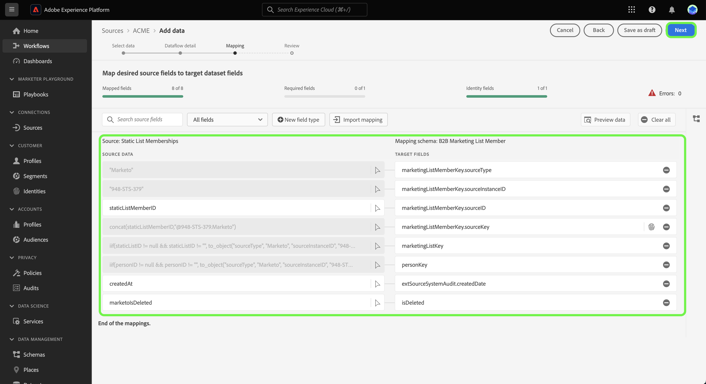

Finally, review the details of your dataflow and then select **[!UICONTROL Save & ingest]** to publish your draft.

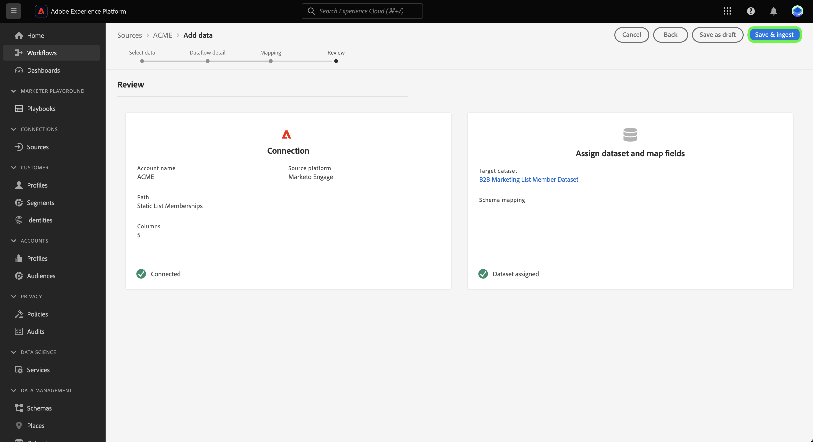

## Next steps

By following this tutorial, you have now created dataflows, as well as assets like schemas, datasets, and identity namespaces using templates. For general information on sources, visit the [sources overview](../../home.md).

## Appendix

The following section provides additional information regarding templates.

### Use the notifications panel to return to the review page

Templates are supported by Adobe Experience Platform alerts and you can use the notifications panel to receive updates on the status of your assets and also to navigate back to the review page. 

Select the notification icon the top header of Platform UI and then select the status alert to see the assets that you want to review.

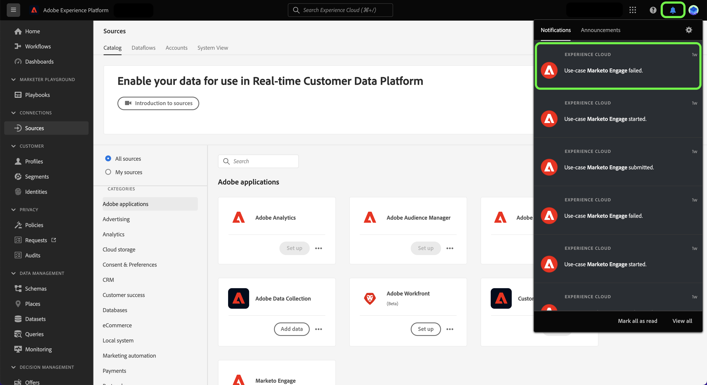
