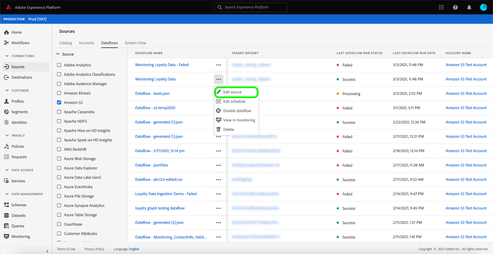
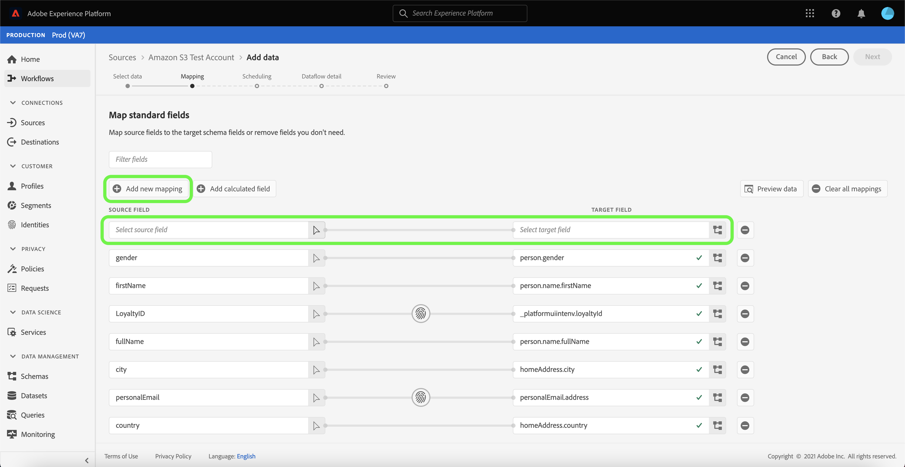
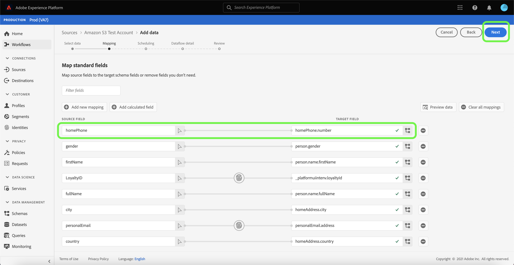
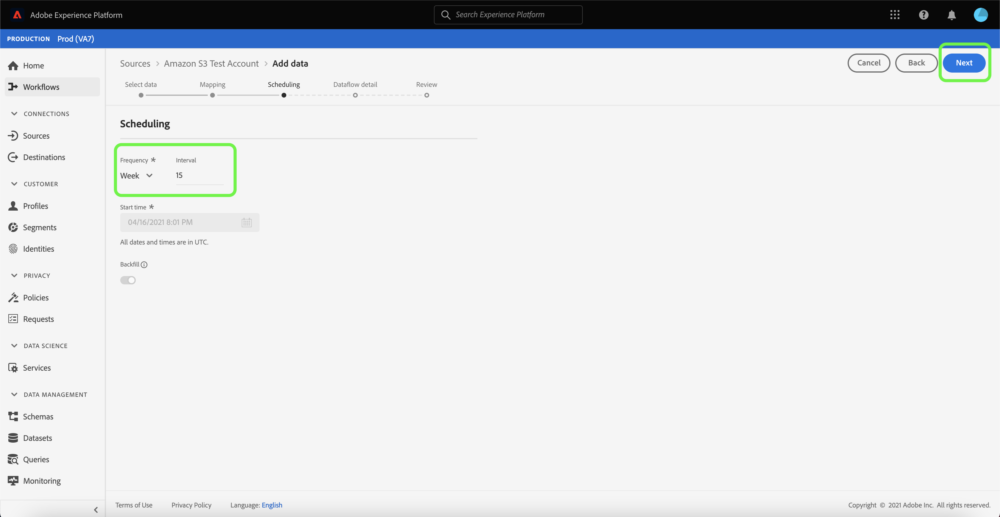
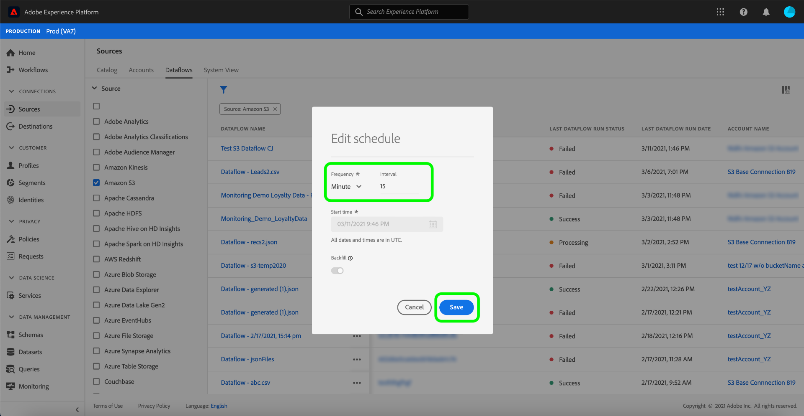

# Update dataflows in the UI

This tutorial provides you with steps on how to update an existing sources dataflow, including information on editing a dataflow schedule and mapping, using the [!UICONTROL Sources] workspace.

## Getting started

This tutorial requires a working understanding of the following components of Adobe Experience Platform:

- [Sources](../../home.md): Experience Platform allows data to be ingested from various sources while providing you with the ability to structure, label, and enhance incoming data using Platform services.
- [Sandboxes](../../../sandboxes/home.md): Experience Platform provides virtual sandboxes which partition a single Platform instance into separate virtual environments to help develop and evolve digital experience applications.

## Edit mapping

>[!NOTE]
>
>The edit mapping feature is currently not supported for the following sources: Adobe Analytics, Adobe Audience Manager, HTTP API, and [!DNL Marketo Engage].

In the Platform UI, select **[!UICONTROL Sources]** from the left navigation to access the [!UICONTROL Sources] workspace. Select **[!UICONTROL Dataflows]** from the top header to view a list of existing dataflows.

The [!UICONTROL Dataflows] page contains a list of all existing dataflows, including information about their run status, last run date, and account name.

Select the filter icon  on the top left to launch the sort panel.

The sort panel provides a list of all available sources. You can select more than one source from the list to access a filtered selection of dataflows belonging to different sources.

Select the source you wish to work with to see a list of its existing dataflows. Once you have identified the dataflow you want to update, select the ellipses (`...`) beside the account name.

A dropdown menu appears, providing you with options to update the dataflow you selected. From here, you can choose to update a dataflow's mapping sets and ingestion schedule. You can also select options to inspect the dataflow in the monitoring dashboard, as well as disable or delete the dataflow.

Select **[!UICONTROL Edit source]** to update its mapping.

The [!UICONTROL Add data] step appears. Select the appropriate data format to review the contents of your selected data and then select **[!UICONTROL Next]** to proceed.

The [!UICONTROL Mapping] page provides you with an interface where you can add and remove mapping sets associated with your dataset.

>[!TIP]
>
>Mapping updates are only applied to dataflow runs scheduled in the future.

Select **[!UICONTROL Add new mapping]** to add a new mapping set.

Next, enter the appropriate source field attribute and target XDM field values to complete your additional mapping set. Select **[!UICONTROL Next]** to proceed.

The [!UICONTROL Scheduling] step appears, allowing you to update your dataflow's ingestion schedule and automatically ingest the selected source data with the updated mappings.

>[!NOTE]
>
>You can't update mapping sets for dataflows that were scheduled for one-time ingestion and start time is in the past.

In the [!UICONTROL Dataflow detail] page, you can provide an updated name and description for your dataflow as well as reconfigure your dataflow's error threshold.

Once you have provided your updated values, select **[!UICONTROL Next]**.

The **[!UICONTROL Review]** step appears, allowing you to review your dataflow before it is updated.

Once you have reviewed your dataflow, select **[!UICONTROL Finish]** and allow some time for the dataflow with the new mapping sets to be created.

## Edit schedule

To edit the ingestion schedule of an existing dataflow, select the ellipses (`...`) beside a dataflow name and then select **[!UICONTROL Edit schedule]** from the dropdown menu.

The **[!UICONTROL Edit schedule]** dialog box provides you with options to update your dataflow's ingestion frequency and interval rate. Once you set your updated frequency and interval values, select **[!UICONTROL Save]**.

>[!NOTE]
>
>You cannot reschedule a dataflow that was scheduled for one-time ingestion.

| Scheduling | Description |
| ---------- | ----------- |
| Frequency | The frequency at which the dataflow will collect data. Acceptable values for editing frequency schedule for an already existing dataflow include: `minute`, `hour`, `day`, or `week`. |
| Interval | The interval designates the period between two consecutive flow runs. The interval's value should be a non-zero integer and must be greater than or equal to `15`. |

After a few moments, a confirmation box appears on the bottom of the screen to confirm a successful update.

## Next steps

By following this tutorial, you have successfully used the [!UICONTROL Sources] workspace to update the ingestion schedule and mapping sets of your dataflow.

For steps on how to perform these operations programmatically using the [!DNL Flow Service] API, please refer to the tutorial on [updating dataflows using the Flow Service API](../../tutorials/api/update-dataflows.md).
