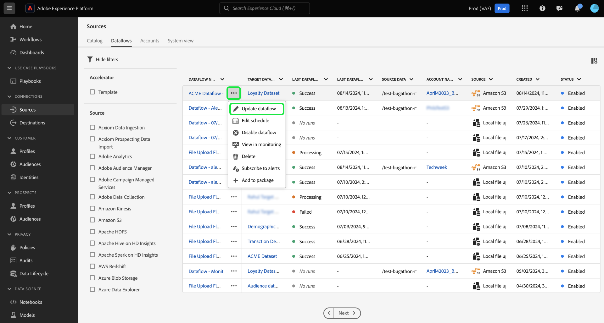
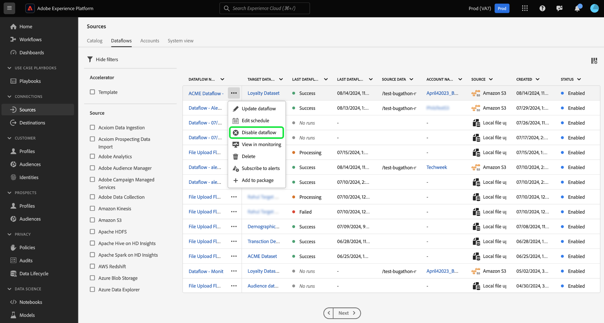
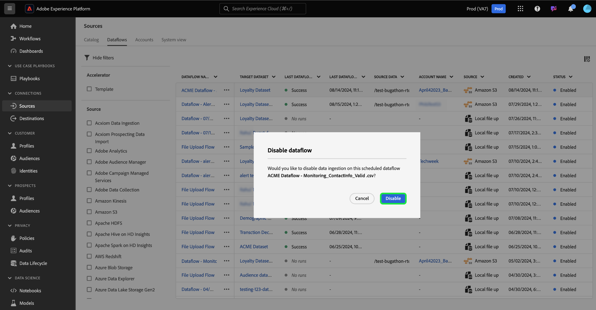

# Update dataflows in the UI

Read this tutorial for steps on how to update an existing dataflow, including its schedule and mapping configurations, using the sources workspace in the Adobe Experience Platform user interface.

## Get started

This tutorial requires a working understanding of the following components of Experience Platform:

* [Sources](../../home.md): Experience Platform allows data to be ingested from various sources while providing you with the ability to structure, label, and enhance incoming data using Experience Platform services.
* [Sandboxes](../../../sandboxes/home.md): Experience Platform provides virtual sandboxes which partition a single Experience Platform instance into separate virtual environments to help develop and evolve digital experience applications.

## Update dataflows {#update-dataflows}

>[!CONTEXTUALHELP]
>id="platform_sources_dataflows_daysRemaining"
>title="Dataset expiration"
>abstract="This column indicates the number of days that the target dataset has left before it automatically expires. A dataflow will fail if the target dataset is expired. To prevent a dataflow from failing, ensure that a target dataset is set to expire on the correct date. See the documentation to learn how to update expiration dates."

In the Experience Platform UI, select **[!UICONTROL Sources]** from the left navigation and then select **[!UICONTROL Dataflows]** from the top header.

>[!TIP]
>
>You can sort and filter through your dataflows using filtering capabilities. Read the guide on [filtering sources objects in the UI](./filter.md) for more information.

The [!UICONTROL Dataflows] page displays a list of all existing dataflows in your organization. Locate the dataflow that you want to update and then select the ellipses (`...`) beside it. A dropdown menu appears, displaying a list of options that you can choose from, to make additional configurations to your existing dataflow.

To update your dataflow, select **[!UICONTROL Update dataflow]**.

You are taken to the sources workflow where you can proceed to update aspects of your dataflow, including its details in the [!UICONTROL Provide dataflow details] step.

### Update mapping {#update-mapping}

>[!NOTE]
>
>The edit mapping feature is currently not supported for the following sources: Adobe Analytics, Adobe Audience Manager, HTTP API, and [!DNL Marketo Engage].

During this process, you can also update the mapping sets associated with your dataflow.  The mapping interface displays your dataflow's existing mapping and not a new recommended mapping set. Mapping updates are only applied to dataflow runs scheduled in the future. A dataflow that was scheduled for one-time ingestion cannot have its mapping sets updated.

Use the mapping interface to modify the mapping sets applied to your dataflow. For comprehensive steps on how to use the mapping interface, see the [data prep UI guide](../../../data-prep/ui/mapping.md) for more information.

### Update schedule

Once you have updated your dataflow's mappings, you can then proceed to update your ingestion schedule to ingest your dataflow with its new mapping data. You can only update the ingestion schedule of dataflows that were configured to ingestion on a recurring schedule. You cannot reschedule a dataflow that was configured for one-time ingestion.

You can also update the ingestion schedule of your dataflow using the in-line update option provided in the dataflows page.

From the dataflows page, select the ellipses (`...`) beside the dataflow name and then select **[!UICONTROL Edit schedule]** from the dropdown menu that appears.

The **[!UICONTROL Edit schedule]** dialog box provides you with options to update your dataflow's ingestion frequency and interval rate. Once you set your updated frequency and interval values, select **[!UICONTROL Save]**.

### Disable dataflow

You can disable your dataflow by using the same dropdown menu. To disable your dataflow, select **[!UICONTROL Disable dataflow]**. 

Next, select [!UICONTROL Disable] from the pop-up window that appears.

If and when you later re-enable this dataflow, Experience Platform will automatically schedule backfill runs to cover the period during which the dataflow was disabled. For example, if the dataflow was configured to run hourly and was disabled for 48 hours, upon re-enabling this dataflow, Experience Platform will create 48 backfill runs to processed the missed intervals.

## Next steps

By following this tutorial, you have successfully used the [!UICONTROL Sources] workspace to update the ingestion schedule and mapping sets of your dataflow.

For steps on how to perform these operations programmatically using the [!DNL Flow Service] API, please refer to the tutorial on [updating dataflows using the Flow Service API](../../tutorials/api/update-dataflows.md).
