# Update dataflows in the UI

This tutorial provides you with steps on how to update an existing dataflow, including its schedule and mapping, using the sources workspace.

## Getting started

This tutorial requires a working understanding of the following components of Adobe Experience Platform:

* [Sources](../../home.md): Experience Platform allows data to be ingested from various sources while providing you with the ability to structure, label, and enhance incoming data using Platform services.
* [Sandboxes](../../../sandboxes/home.md): Experience Platform provides virtual sandboxes which partition a single Platform instance into separate virtual environments to help develop and evolve digital experience applications.

## Update dataflows

In the Platform UI, select **[!UICONTROL Sources]** from the left navigation to access the [!UICONTROL Sources] workspace. Select **[!UICONTROL Dataflows]** from the top header to view a list of existing dataflows.

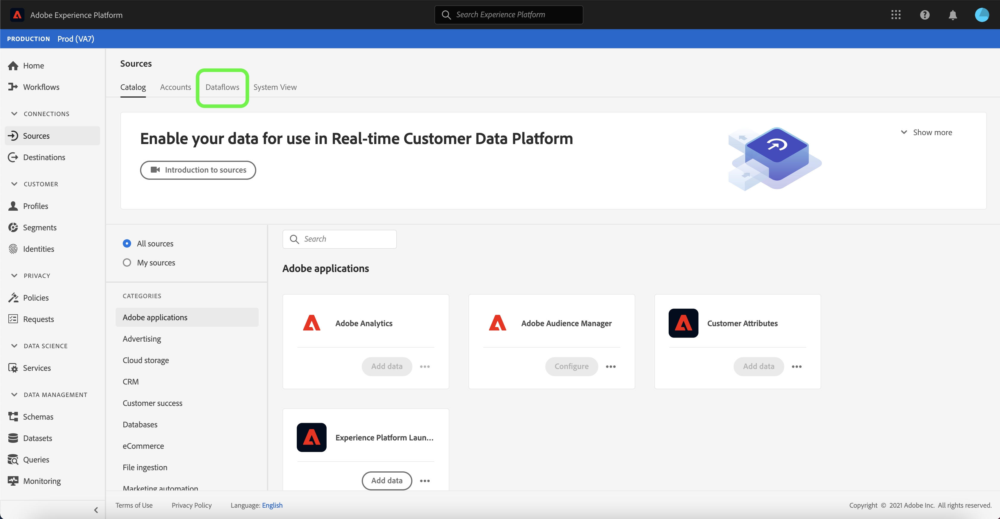

The [!UICONTROL Dataflows] page contains a list of all existing dataflows, including information about their corresponding target dataset, source, and account name.

To sort through the list, select the filter icon  on the top left to use the sort panel.

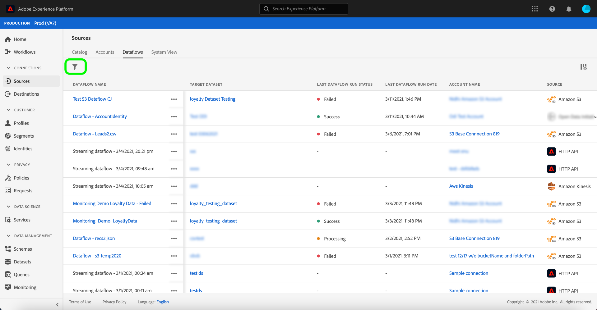

The sort panel provides a list of all available sources. You can select more than one source from the list to access a filtered selection of dataflows belonging to different sources.

Select the source you wish to work with to see a list of its existing dataflows. Once you have identified the dataflow you want to update, select the ellipses (`...`) beside the dataflow name.

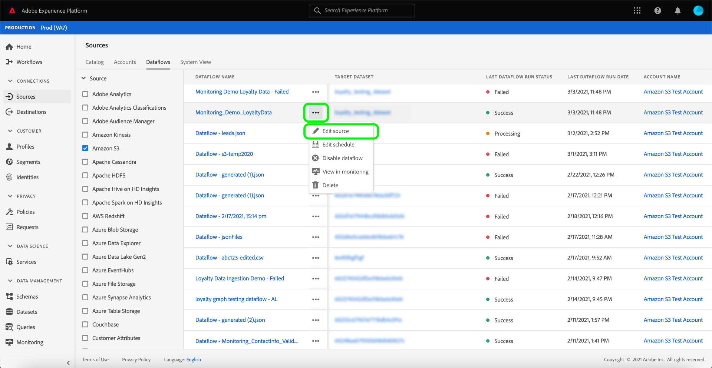

A dropdown menu appears, providing you with options to update the dataflow you selected. From here, you can choose to update a dataflow's mapping sets and ingestion schedule. You can also select options to inspect the dataflow in the monitoring dashboard, subscribe to alerts, as well as disable or delete the dataflow.

To update your dataflow's information, select **[!UICONTROL Update dataflow]**.

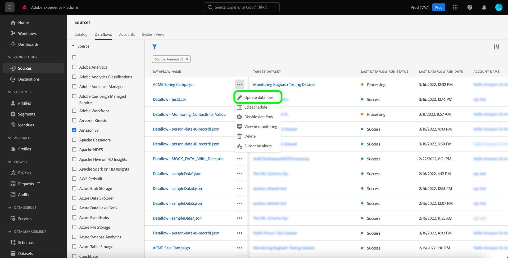

### Add data

The [!UICONTROL Add data] step appears. Select the appropriate data format to review the contents of your selected data and then select **[!UICONTROL Next]** to proceed.

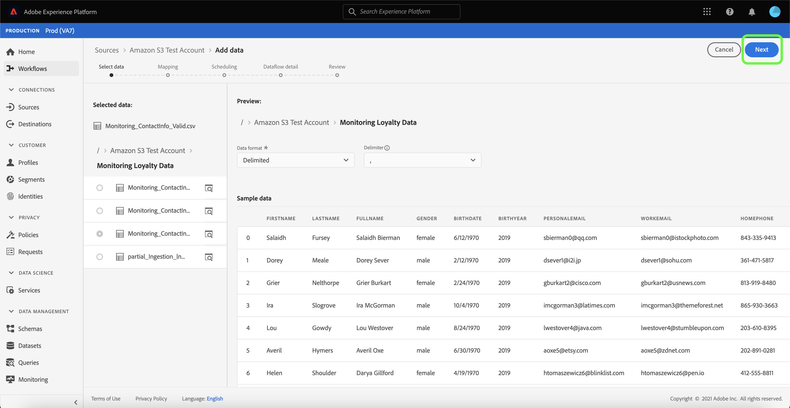

### Dataflow detail

In the [!UICONTROL Dataflow detail] page, you can provide an updated name and description for your dataflow as well as reconfigure your dataflow's error threshold. During this step, you can also configure or modify settings for your alert subscription.

Once you have provided your updated values, select **[!UICONTROL Next]**.

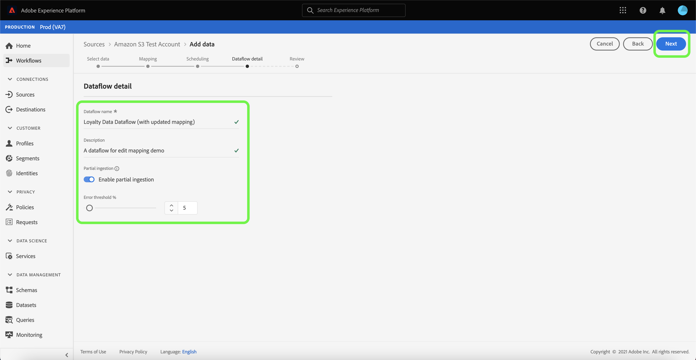

### Mapping

>[!NOTE]
>
>The edit mapping feature is currently not supported for the following sources: Adobe Analytics, Adobe Audience Manager, HTTP API, and [!DNL Marketo Engage].

The [!UICONTROL Mapping] page provides you with an interface where you can add and remove mapping sets associated with your dataflow.

The mapping interface displays your dataflow's existing mapping set and not a new recommended mapping set. Mapping updates are only applied to dataflow runs scheduled in the future. A dataflow that was scheduled for one-time ingestion cannot have its mapping sets updated.

From here, you can use the mapping interface to modify the mapping sets applied to your dataflow. For comprehensive steps on how to use the mapping interface, see the [data prep UI guide](../../../data-prep/ui/mapping.md) for more information.

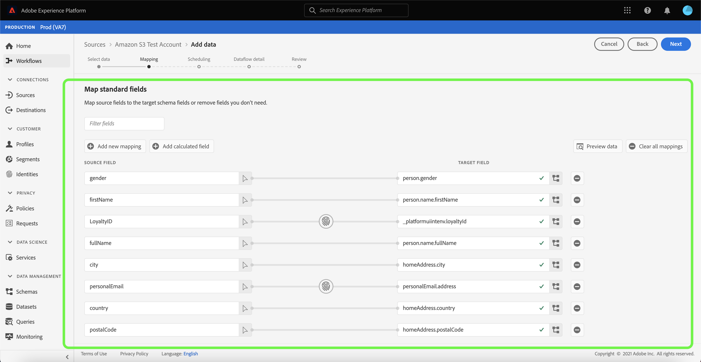

### Scheduling

The [!UICONTROL Scheduling] step appears, allowing you to update your dataflow's ingestion schedule and automatically ingest the selected source data with the updated mappings.

>[!NOTE]
>
>You cannot reschedule a dataflow that was scheduled for one-time ingestion.

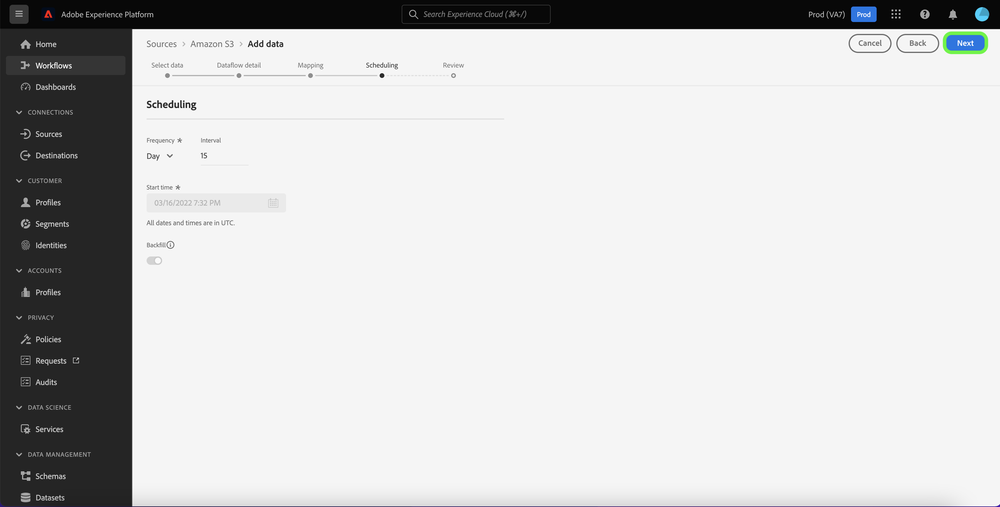

You can also update the ingestion schedule of your dataflow using the in-line update option provided in the dataflows page.

From the dataflows page, select the ellipses (`...`) beside the dataflow name and then select **[!UICONTROL Edit schedule]** from the dropdown menu that appears.

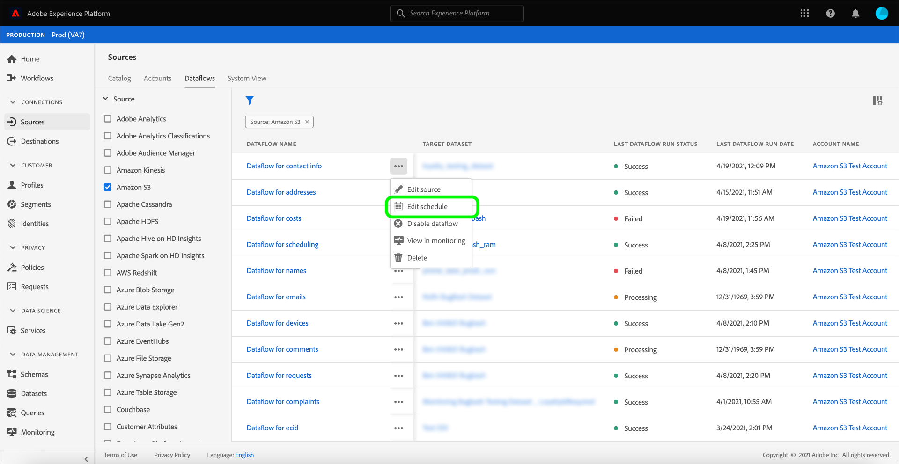

The **[!UICONTROL Edit schedule]** dialog box provides you with options to update your dataflow's ingestion frequency and interval rate. Once you set your updated frequency and interval values, select **[!UICONTROL Save]**.

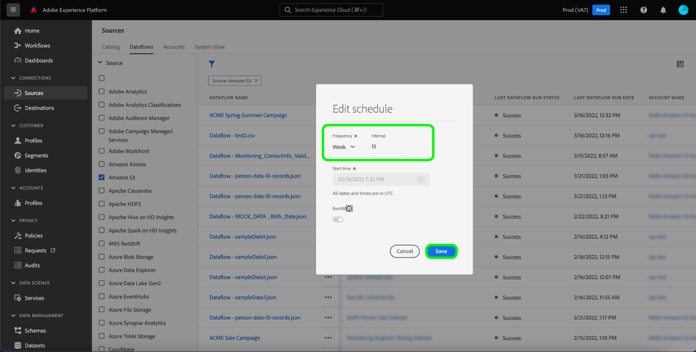

### Review

The **[!UICONTROL Review]** step appears, allowing you to review your dataflow before it is updated.

Once you have reviewed your dataflow, select **[!UICONTROL Finish]** and allow some time for the dataflow with the new mapping sets to be created.

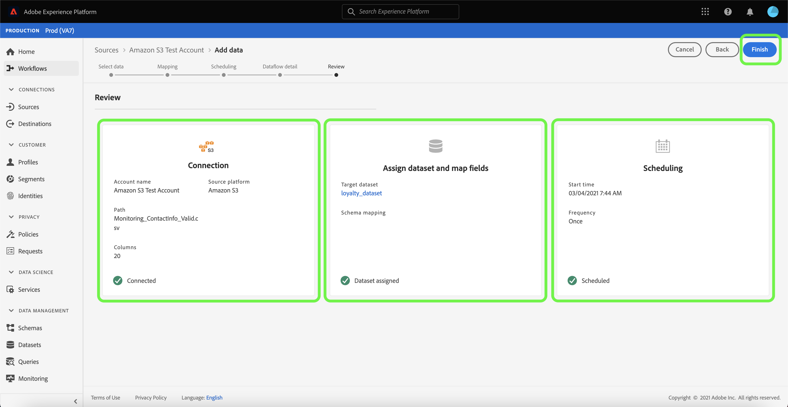

## Next steps

By following this tutorial, you have successfully used the [!UICONTROL Sources] workspace to update the ingestion schedule and mapping sets of your dataflow.

For steps on how to perform these operations programmatically using the [!DNL Flow Service] API, please refer to the tutorial on [updating dataflows using the Flow Service API](../../tutorials/api/update-dataflows.md).
