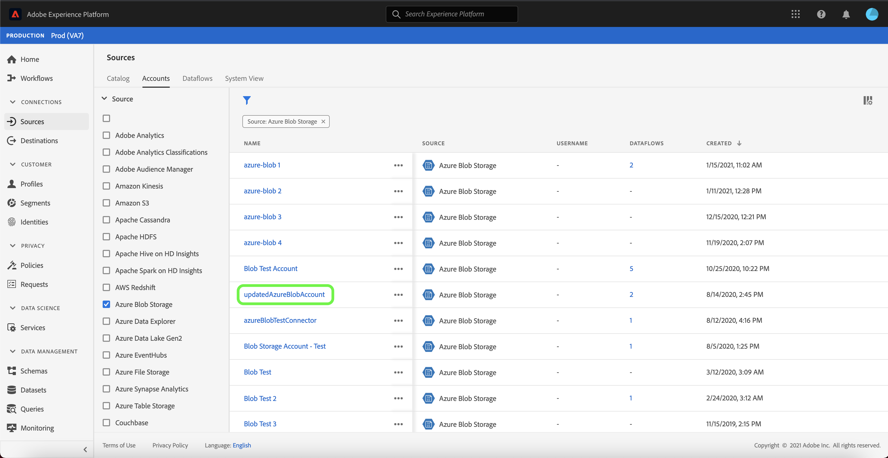
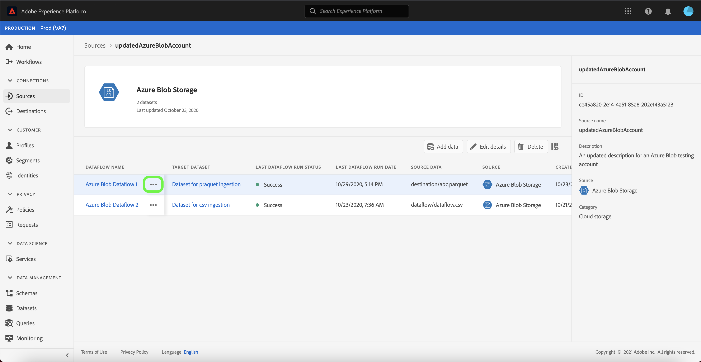
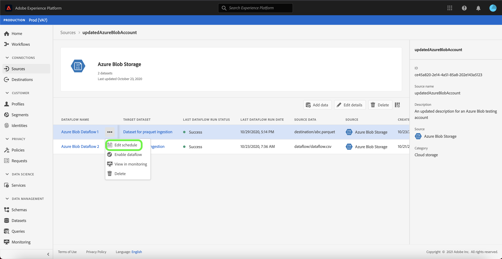
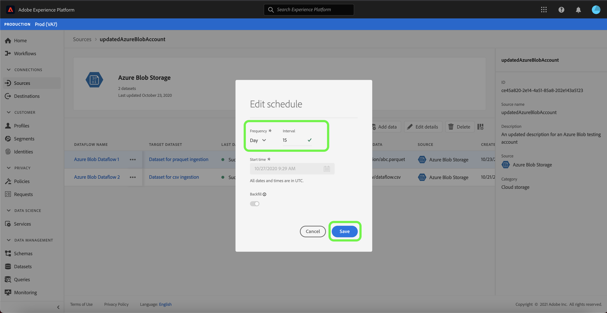
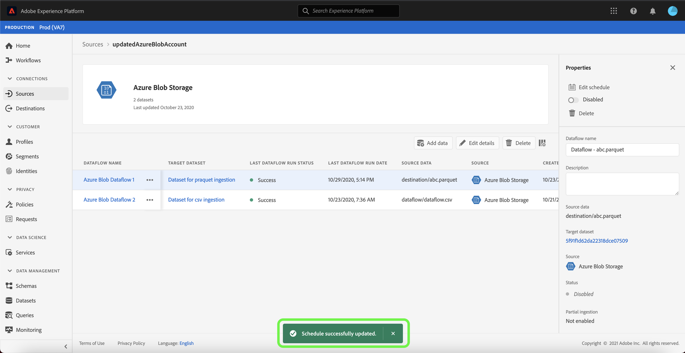

# Update account details in the UI

In some circumstances, it may be required to update the details of an existing sources account. The [!UICONTROL Sources] workspace provides you with the ability to add, edit, and delete details of an existing batch or streaming connection, including its name, description, and credentials.

The [!UICONTROL Sources] workspace also provides you with the ability to edit the schedule of batch dataflows, allowing you to update its ingestion frequency and interval rate.

This tutorial provides steps for updating the details and credentials of an existing account from the [!UICONTROL Sources] workspace, as well as updating the ingestion schedule of a dataflow.

## Getting started

This tutorial requires a working understanding of the following components of Adobe Experience Platform:

- [Sources](../../home.md): DNL Experience Platform allows data to be ingested from various sources while providing you with the ability to structure, label, and enhance incoming data using Platform services.
- [Sandboxes](../../../sandboxes/home.md): DNL Experience Platform provides virtual sandboxes which partition a single Platform instance into separate virtual environments to help develop and evolve digital experience applications.

## Update accounts

Log in to the [Experience Platform UI](https://platform.adobe.com) and then select **[!UICONTROL Sources]** from the left navigation to access the [!UICONTROL Sources] workspace. Select **[!UICONTROL Accounts]** from the top header to view existing accounts.

The **[!UICONTROL Accounts]** page appears. On this page is a list of viewable accounts, including information about their source, username, number of dataflows, and date of creation.

Select the filter icon  on the top left to launch the sort panel.

The sort panel provides a list of all sources. You can select more than one source from the list to access a filtered selection of accounts associated with different sources.

Select the source you wish to work with to see a list of its existing accounts. Once you have identified the account you want to update, select the ellipses (`...`) beside the account name.

A dropdown menu appears, providing you with options to **[!UICONTROL Add data]**, **[!UICONTROL Edit details]**, and **[!UICONTROL Delete]**. Select **[!UICONTROL Edit details]** from the menu to update your account.

The **[!UICONTROL Edit account details]** dialog box allows you to update an account's name, description, and authentication credentials. Once you have updated the desired information, select **[!UICONTROL Save]**.

After a few moments, a confirmation box appears on the bottom of the screen to confirm a successful update.

## Edit schedule

You can edit the ingestion schedule of a dataflow from the **[!UICONTROL Accounts]** page. From the list of accounts, select the account that contains the dataflow that you want to reschedule.

The dataflows page appears. This page contains a list of existing dataflows associated with the account you selected. Select the ellipses (`...`) beside the dataflow that you want to reschedule.

A dropdown menu appears, providing you with options to **[!UICONTROL edit schedule]**, **[!UICONTROL Enable dataflow]**, **[!UICONTROL View in monitoring]**, and **[!UICONTROL Delete]**. Select **[!UICONTROL Edit schedule]** from the menu.

The **[!UICONTROL Edit schedule]** dialog box provides you with options to update your dataflow's ingestion frequency and interval rate. Once you set your updated frequency and interval values, select **[!UICONTROL Save]**.

| Scheduling | Description |
| ---------- | ----------- |
| Frequency | The frequency at which the dataflow will collect data. Acceptable values for editing frequency schedule for an already existing dataflow include: `minute`, `hour`, `day`, or `week`. |
| Interval | The interval designates the period between two consecutive flow runs. The interval's value should be a non-zero integer and must be greater than or equal to `15`. |

After a few moments, a confirmation box appears on the bottom of the screen to confirm a successful update.

## Next steps

By following this tutorial, you have successfully used the [!UICONTROL Sources] workspace to update account information and edit your dataflow schedule.

For steps on how to perform these operations programmatically using the [!DNL Flow Service] API, please refer to the tutorial on [updating connection information using the Flow Service API](../../tutorials/api/update.md).