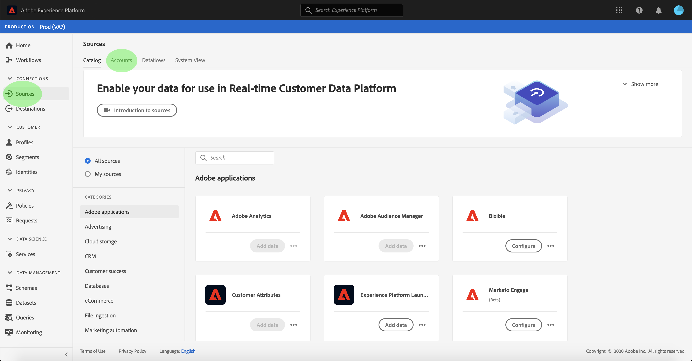
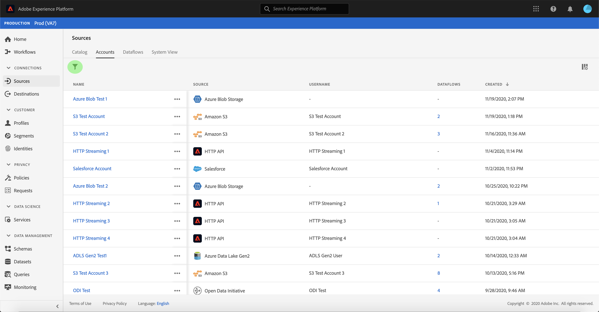
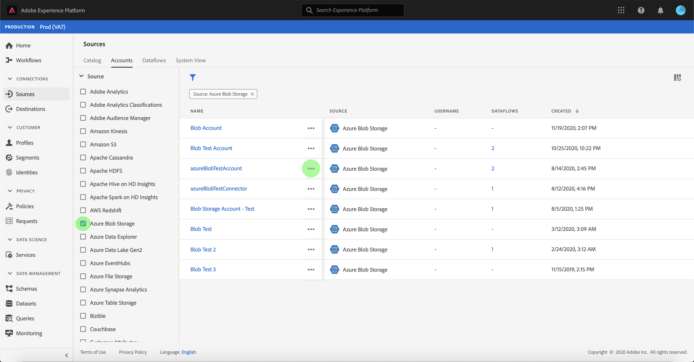
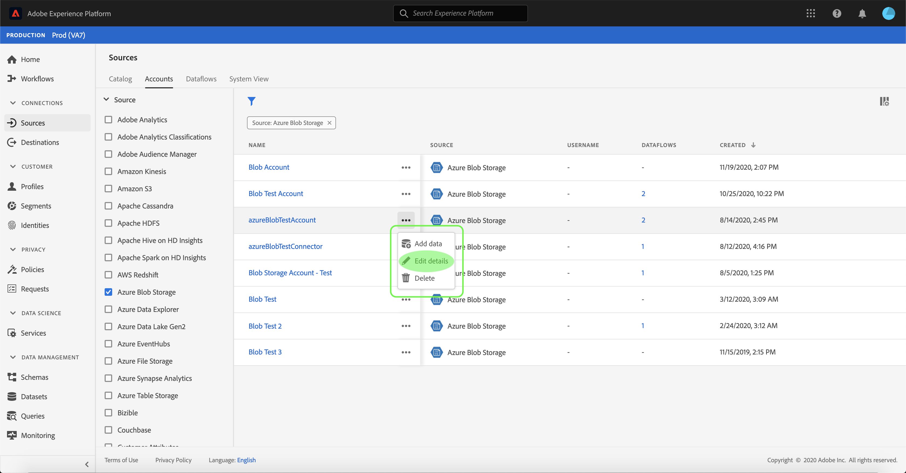
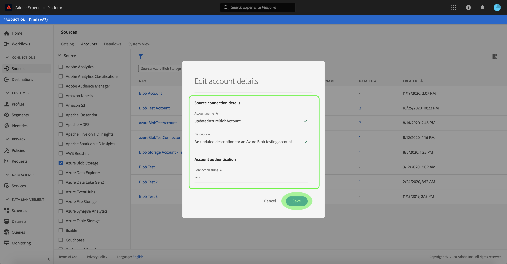
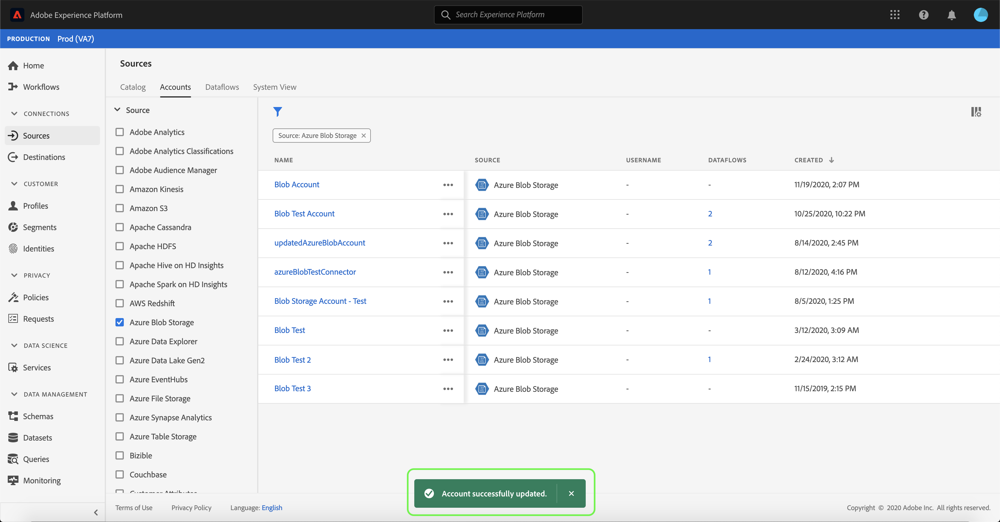

# Update account details in the UI

In some circumstances, it may be required to update the details of an existing sources account. The [!UICONTROL Sources] workspace provides you with the ability to add, edit, and delete details of an existing batch or streaming connection, including its name, description, and credentials.

This tutorial provides steps for updating the details and credentials of an existing account from the [!UICONTROL Sources] workspace.

## Getting started

This tutorial requires a working understanding of the following components of Adobe Experience Platform:

- [Sources](../../home.md): Experience Platform allows data to be ingested from various sources while providing you with the ability to structure, label, and enhance incoming data using Platform services.
- [Sandboxes](../../../sandboxes/home.md): Experience Platform provides virtual sandboxes which partition a single Platform instance into separate virtual environments to help develop and evolve digital experience applications.

## Update accounts

Log in to the [Experience Platform UI](https://platform.adobe.com) and then select **[!UICONTROL Sources]** from the left navigation to access the [!UICONTROL Sources] workspace. Select **[!UICONTROL Accounts]** from the top header to view existing accounts.

The **[!UICONTROL Accounts]** page appears. On this page is a list of viewable accounts, including information about their source, username, number of dataflows, and date of creation.

Select the filter icon  on the top left to launch the sort panel.

The sort panel provides a list of all sources. You can select more than one source from the list to access a filtered selection of accounts associated with different sources.

Select the source you wish to work with to see a list of its existing accounts. Once you have identified the account you want to update, select the ellipses (`...`) beside the account name.

A dropdown menu appears, providing you with options to **[!UICONTROL Add data]**, **[!UICONTROL Edit details]**, and **[!UICONTROL Delete]**. Select **[!UICONTROL Edit details]** from the menu to update your account.

The **[!UICONTROL Edit account details]** dialog box allows you to update an account's name, description, and authentication credentials. Once you have updated the desired information, select **[!UICONTROL Save]**.

After a few moments, a confirmation box appears on the bottom of the screen to confirm a successful update.

## Next steps

By following this tutorial, you have successfully used the [!UICONTROL Sources] workspace to update the information of an existing source account.

For steps on how to perform these operations programmatically using the [!DNL Flow Service] API, please refer to the tutorial on [updating connection information using the Flow Service API](../../tutorials/api/update.md).
