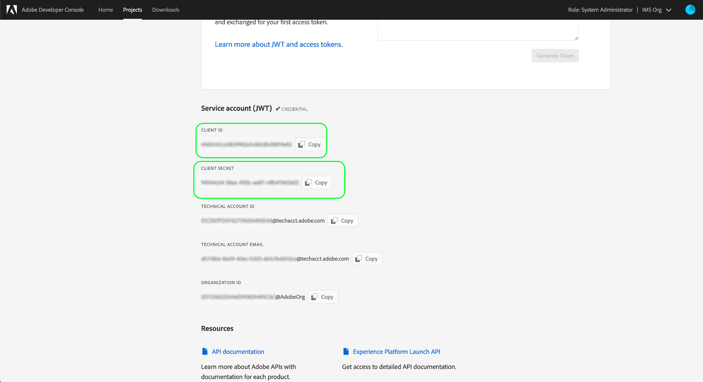

# Getting started with the Reactor API

In order to use the [Reactor API](https://www.adobe.io/experience-platform-apis/references/reactor/) to create and manage Tags extensions, each request must include the following authentication headers:

* `Authorization: Bearer {ACCESS_TOKEN}`
* `x-api-key: {API_KEY}`
* `x-gw-ims-org-id: {ORG_ID}`

This guide covers how to use the Adobe Developer Console to gather the values for each of these headers so you can start making calls to the Reactor API.

## Gain developer access to Adobe Experience Platform

Before you can generate authentication values for the Reactor API, you must have developer access to Experience Platform. To gain developer access, follow the beginning steps in the [Experience Platform authentication tutorial](/help/landing/api-authentication.md). Once you have completed the [Gain User Access](//help/landing/api-authentication.md#gain-user-access) step, return to this tutorial to generate the credentials specific to the Reactor API.

## Generate access credentials

Using Adobe Developer Console, you must generate the following three access credentials:

* `{ORG_ID}`
* `{API_KEY}`
* `{ACCESS_TOKEN}`

Your organization's ID (`{ORG_ID}`) and API key (`{API_KEY}`) can be reused in future API calls after they have been initially generated. However, your access token (`{ACCESS_TOKEN}`) is temporary and must be regenerated every 24 hours.

The steps for generating these values are covered in detail below.

### One-time setup

Go to [Adobe Developer Console](https://www.adobe.com/go/devs_console_ui) and sign in with your Adobe ID. Next, follow the steps outlined in the tutorial on [creating an empty project](https://developer.adobe.com/developer-console/docs/guides/projects/projects-empty/) in the Developer Console documentation.

Once you have created a project, select **Add API** on the **Project Overview** screen.


The **Add an API** screen appears. Select **Experience Platform Launch API** from the list of available APIs before selecting **Next**.


On the next screen, you are prompted to create a JSON Web Token (JWT) credential be either generating a new keypair or uploading your own public key. For this tutorial, select the **Generate a key pair** option, then select **Generate keypair** in the bottom-right corner.


The next screen confirms that the keypair has successfully generated, and a compressed folder containing a public certificate and a private key is automatically downloaded to your machine. This private key is required in a later step to generate an access token.

Select **Next** to continue.


The next screen prompts you to select one or more product profiles to associate with the API integration.

>[!NOTE]
>
>Product profiles are managed by your organization through the Adobe Admin Console, and contain specific sets of permissions for granular features. Product profiles and their permissions can only be managed by users with administrator privileges within your organization. If you are unsure which product profiles to select for the API, contact your administrator.

Select the desired product profiles from the list, then select **Save configured API** to complete the API registration.


Once the API has been added to the project, the project page reappears on the Experience Platform Reactor API page. From here, scroll down to the **Service Account (JWT)** section, which provides the following access credentials that are required in all calls to the Reactor API:

* **CLIENT ID**: The Client ID is the required `{API_KEY}` which must be provided in the `x-api-key` header.
* **ORGANIZATION ID**: The Organization ID is the `{ORG_ID}` value that must be used in the `x-gw-ims-org-id` header.


### Authentication for each session

Now that you have your `{API_KEY}` and `{ORG_ID}` values, the final step is generating a `{ACCESS_TOKEN}` value.

>[!NOTE]
>
>These tokens expire after 24 hours. If you are using this integration for an application, it is a good idea to obtain your bearer token programmatically from within your application.

You have two options to generate your access tokens, depending on your use case:

* [Generate tokens manually](#manual)
* [Generate tokens programmatically](#program)

#### Generate access tokens manually {#manual}

Open the private key you downloaded earlier in a text editor or browser and copy its contents. Then, navigate back to the Developer Console and paste the private key in the **Generate access token** section on the Reactor API page for your project before selecting **Generate Token**.


A new access token is generated, and a button to copy the token to your clipboard is provided. This value is used for the required `Authorization` header, and must be provided in the format `Bearer {ACCESS_TOKEN}`.


#### Generate access tokens programmatically {#program}

If you are using your integration for an application, you can programmatically generate access tokens through API requests. In order to accomplish this, you must obtain the following values:

* Client ID (`{API_KEY}`)
* Client secret (`{SECRET}`)
* A JSON Web Token (`{JWT}`)

Your client ID and secret can be obtained from the main page for your project, as seen in the [previous step](#one-time-setup).



To obtain your JWT credential, navigate to **Service Account (JWT)** in the left navigation, then select the **Generate JWT** tab. On this page, under **Generate custom JWT**, paste the contents of your private key into the provided textbox, then select **Generate Token**.


The generated JWT appears below once it has finished processing, along with a sample cURL command that you can use to test the token if you wish. Use the **Copy** button to copy the token to your clipboard.


Once you've gathered your credentials, you can integrate the API call below into your application in order to programmatically generate access tokens.

**Request**

The request must send a `multipart/form-data` payload, providing your authentication credentials as shown below:

```shell
curl -X POST \
  https://ims-na1.adobelogin.com/ims/exchange/jwt/ \
  -H 'Content-Type: multipart/form-data' \
  -F 'client_id={API_KEY}' \
  -F 'client_secret={SECRET}' \
  -F 'jwt_token={JWT}'
```

**Response**

A successful response returns a new access token, as well as the number of seconds left until it expires.

```json
{
  "token_type": "bearer",
  "access_token": "{ACCESS_TOKEN}",
  "expires_in": 86399999
}
```

| Property | Description |
| :-- | :-- |
| `access_token`   | The newly generated access token value. This value is used for the required `Authorization` header, and must be provided in the format `Bearer {ACCESS_TOKEN}`. |
| `expires_in`   | The remaining time until the token expires, in milliseconds. Once a token expires, a new one must be generated. |

{style="table-layout:auto"}

## Next steps

By following the steps in this tutorial, you should have a valid values for `{ORG_ID}`, `{API_KEY}`, and `{ACCESS_TOKEN}`. You can now test these values by using them in a simple cURL request to the Reactor API.

Start by attempting to make an API call to [list all companies](./endpoints/companies.md#list). 

>[!NOTE]
>
>You may not have any companies in your organization, in which case the response will be HTTP status 404 (Not Found). As long as you do not get a 403 (Forbidden) error, your access credentials are valid and working.

Once you confirm that your access credentials are working, continue to explore the other API reference documentation to learn the API's many capabilities.

## Additional Resources

JWT Libraries and SDKs: [https://jwt.io/](https://jwt.io/)

Postman API development: [https://www.postman.com/](https://www.postman.com/)
