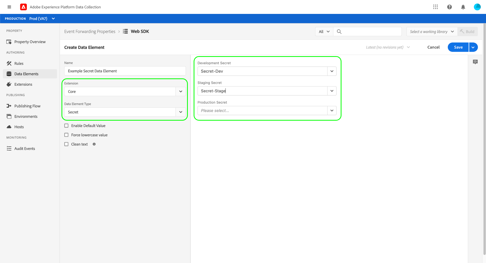

# Secrets in the Reactor API

In the Reactor API, a secret is a resource that represents an authentication credential. Secrets are used in event forwarding to authenticate to another system for secure data exchange. Therefore, secrets can only be created within event forwarding properties (properties whose `platform` attribute is set to `edge`).

There are currently three supported secret types denoted in the `type_of` attribute:

| Secret type | Description |
| --- | --- |
| `token` | A single string of characters representing an authentication token value that is known and understood by both systems. |
| `simple-http` | Contains two string attributes for a username and password, respectively. |
| `oauth2-client_credentials` | Contains several attributes to support the [OAuth](https://datatracker.ietf.org/doc/html/rfc6749) authentication spec. Event forwarding asks you for the required information, then handles the renewal of these tokens for you on a specified interval. |

{style="table-layout:auto"}

This guide provides a high-level overview of how to configure secrets for use in event forwarding. For detailed guidance on how to manage secrets in the Reactor API, including example JSON of a secret's structure, refer to the [secrets endpoint guide](../endpoints/secrets.md).

## Credentials

Each secret contains a `credentials` attribute that holds its respective credential values. When [creating a secret in the API](../endpoints/secrets.md#create), each type of secret has different required attributes as shown in the sections below:

* [`token`](#token)
* [`simple-http`](#simple-http)
* [`oauth2-client_credentials`](#oauth2-client_credentials)
* [`oauth2-google`](#oauth2-google)

### `token` {#token}

Secrets with a `type_of` value of `token` only require a single attribute under `credentials`:

| Credential attribute | Data type | Description |
| --- | --- | --- |
| `token` | String | A secret token that is understood by the destination system. |

{style="table-layout:auto"}

The token is stored as a static value, and therefore the secret's `expires_at` and `refresh_at` properties are set to `null` when the secret is created.

### `simple-http` {#simple-http}

Secrets with a `type_of` value of `simple-http` require the following attributes under `credentials`:

| Credential attribute | Data type | Description |
| --- | --- | --- |
| `username` | String | A username. |
| `password` | String | A password. This value is not included in the API response. |

{style="table-layout:auto"}

When the secret is created, the two attributes are exchanged with a BASE64 encoding of `username:password`. After the exchange, the secret's `expires_at` and `refresh_at` properties are set to `null`.

### `oauth2-client_credentials` {#oauth2-client_credentials}

Secrets with a `type_of` value of `oauth2-client_credentials` require the following attributes under `credentials`:

| Credential attribute | Data type | Description |
| --- | --- | --- |
| `client_id` | String | The client ID for the OAuth integration. |
| `client_secret` | String | The client secret for the OAuth integration. This value is not included in the API response. |
| `token_url` | String | The authorization URL for the OAuth integration. |
| `refresh_offset` | Integer | *(Optional)* The value, in seconds, to offset the refresh operation by. If this attribute is omitted when creating the secret, the value is set to `14400` (four hours) by default. |
| `options` | Object | *(Optional)* Specifies additional options for the OAuth integration:<ul><li>`scope`: A string that represents the [OAuth 2.0 scope](https://oauth.net/2/scope/) for the credentials.</li><li>`audience`: A string that represents an [Auth0 access token](https://auth0.com/docs/protocols/protocol-oauth2).</li></ul> |

When an `oauth2-client_credentials` secret is created or updated, the `client_id` and `client_secret` (and possibly `options`) are exchanged in a POST request to the `token_url`, according to the Client Credentials flow of the OAuth protocol.

>[!NOTE]
>
>It is expected that the authorization service response body is compatible with the OAuth protocol.

If the authorization service responds with `200 OK` and a JSON response body, the body is parsed and the `access_token` is pushed to the edge environment and `expires_in` is used to calculate the `expires_at` and `refresh_at` attributes for the secret. If there is no environment association on the secret, `access_token` is discarded.

A credentials exchange is considered successful under the following conditions:

* `expires_in` is greater than `28800` (eight hours).
* `refresh_offset` is less than the value of `expires_in` minus `14400` (four hours). For example, if `expires_in` is `36000` (ten hours), and the `refresh_offset` is `28800` (eight hours), the exchange is considered failed because `28800` is greater than `36000` - `14400` (`21600`).

If the exchange is successful, the secret's status attribute is set to `succeeded` and values for `expires_at` and `refresh_at` are set:

* `expires_at` is the current UTC time plus the value of `expires_in`.
* `refresh_at` is the current UTC time plus the value of `expires_in`, minus the value of `refresh_offset`. For example, if `expires_in` is `43200` (twelve hours) and the `refresh_offset` is `14400` (four hours), the `refresh_at` property would be set to `28800` (eight hours) after the current UTC time.

If the exchange fails for any reason, the `status_details` attribute in the `meta` object updates with relevant information.

#### Refreshing an `oauth2-client_credentials` secret

If an `oauth2-client_credentials` secret has been assigned to an environment and its status is `succeeded` (the credentials were exchanged successfully), a new exchange is performed automatically on `refresh_at`.

If the exchange is successful, the `refresh_status` attribute in the `meta` object is set to `succeeded` while `expires_at`, `refresh_at`, and `activated_at` are updated accordingly.

If the exchange fails, the operation is attempted three more times with the last attempt no more than two hours before the access token expires. If all attempts fail, the `refresh_status_details` attribute from the `meta` object updates with relevant details.

### `oauth2-google` {#oauth2-google}

Secrets with a `type_of` value of `oauth2-google` requires the following attribute under `credentials`:

| Credential attribute | Data type | Description |
| --- | --- | --- |
| `scopes` | Array | Lists the Google product scopes for authentication. The following scopes are supported:<ul><li>[Google Ads](https://developers.google.com/google-ads/api/docs/oauth/overview): `https://www.googleapis.com/auth/adwords`</li><li>[Google Pub/Sub](https://cloud.google.com/pubsub/docs/reference/service_apis_overview): `https://www.googleapis.com/auth/pubsub`</li></ul> |

After creating the `oauth2-google` secret, the response includes a `meta.authorization_url` property. You must copy and paste this URL into a browser to complete the Google authentication flow.

#### Reauthorize an `oauth2-google` secret

The authorization URL for an `oauth2-google` secret expires one hour after the secret is created (as indicated by `meta.authorization_url_expires_at`). After this time, the secret must be reauthorized in order to renew the authentication process.

Refer to the [secrets endpoint guide](../endpoints/secrets.md#reauthorize) for details on how reauthorize an `oauth2-google` secret by making a PATCH request to the Reactor API.

## Environment relationship

When you create a secret, you must specify the [environment](../endpoints/environments.md) in which it will exist. Secrets are immediately deployed to the environment in which they are created.

A secret can only be associated with one environment. Once the relationship between a secret and an environment is established, the secret cannot be cleared from the environment, and the secret cannot be associated with a different environment.

>[!NOTE]
>
>The only exception to this rule is if the environment in question is deleted. In this case, the relationship is cleared and the secret can be assigned to a different environment.  

After a secret's credentials have been successfully exchanged, for a secret to be associated with an environment, the exchange artifact (the token string for `token`, the Base64 encoded string for `simple-http`, or the access token for `oauth2-client_credentials`) is securely saved on the environment.

After the exchange artifact is successfully saved on the environment, the secret's `activated_at` attribute is set to the current UTC time, and can now be referenced using a data element. See the [next section](#referencing-secrets) for more information on referencing secrets.

## Referencing secrets {#referencing-secrets}

In order to reference a secret, you must create a data element of type "[!UICONTROL Secret]" (provided by the [[!UICONTROL Core] extension](../../extensions/client/core/overview.md)) on an event forwarding property. When configuring this data element, you are prompted to indicate which secret to use for each environment. You can then create rules that reference a secret data element, such as within the header for an HTTP call.

>[!NOTE]
>
>In order to add a secret data element to a library, you must have at least one `succeeded` secret associated with the environment on which the library is being built. For example, if a library has a secret data element that does not have a `succeeded` secret configured for the [!UICONTROL Staging Secret] section, attempting to build that library in the staging environment will result in an error.

At runtime, the secret data element is replaced with the corresponding secret exchange artifact saved on the environment.

## Next steps

This guide covered the fundamentals of working with secrets in the Reactor API. For details on how to manage secrets using API calls, see the [secrets endpoint guide](../endpoints/secrets.md).
