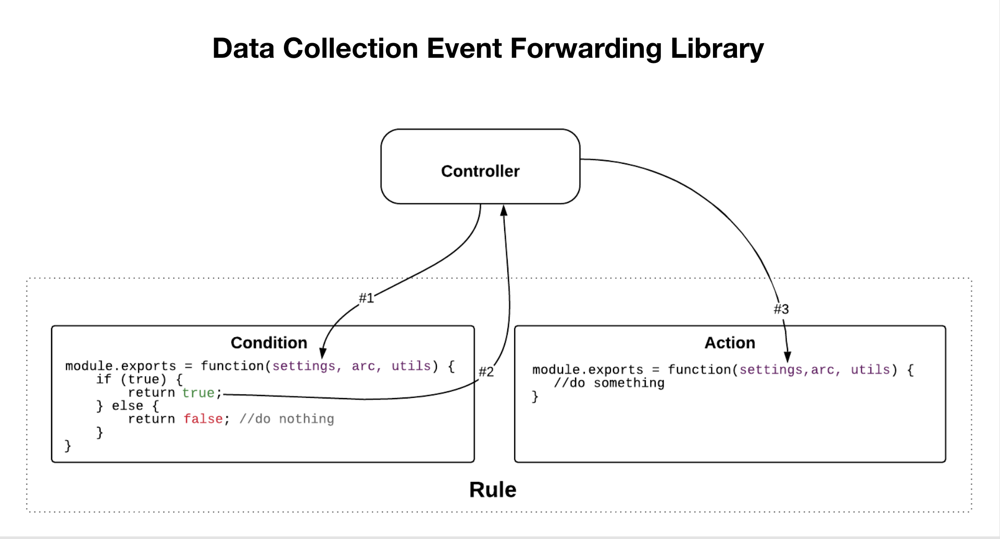

# Edge extension flow

>[!NOTE]
>
>Adobe Experience Platform Launch is being rebranded as a suite of data collection technologies in Experience Platform. Several terminology changes have rolled out across the product documentation as a result. Please refer to the following [document](../../term-updates.md) for a consolidated reference of the terminology changes.

In edge extensions, each condition, action, and data element type has both a view which allows users to modify settings and a library module to act upon those user-defined settings.

As the following high-level diagram shows, the extension's action type view is shown inside an iframe within the application integrated with Adobe Experience Platform. The view is then used to modify settings which are then saved within Platform. When the tag runtime library is built, both the extension's action type library module as well as the user-defined settings will be included in the runtime library that gets deployed to the edge node. User-defined settings from Platform are injected into the library module at runtime.

In the following diagram you can see the link between events, conditions and actions inside the rule processing flow.

The rule processing flow contains the following phases:

1. The `settings` and the `trigger` method are provided to the event library module at startup.
1. When the event library module determines the event has occurred, the event library module calls `trigger`.
1. Platform passes `settings` into the rule’s condition-type library modules where conditions are then evaluated.
1. Each condition type returns whether a condition evaluates to true.
1. If all conditions pass, the rule’s actions are executed.
