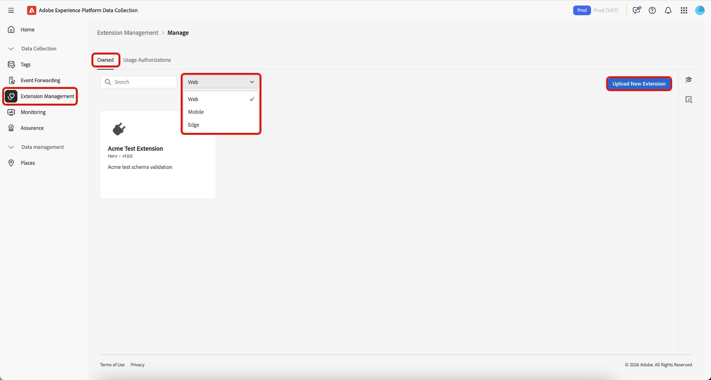
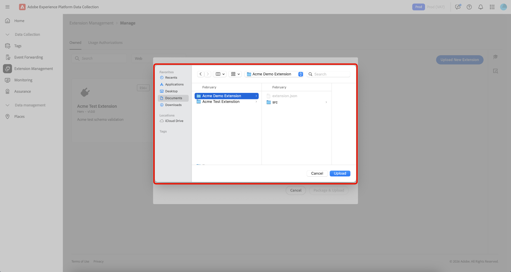
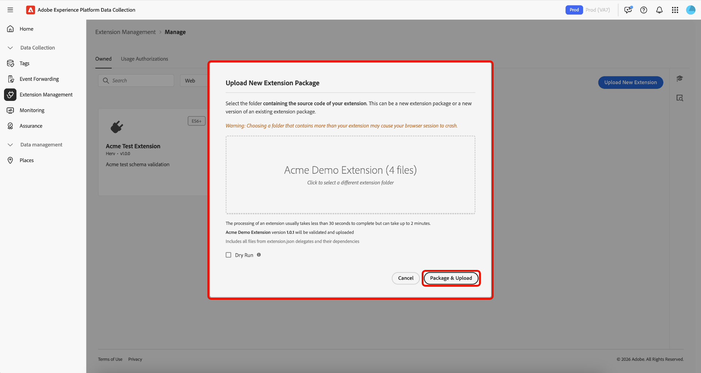
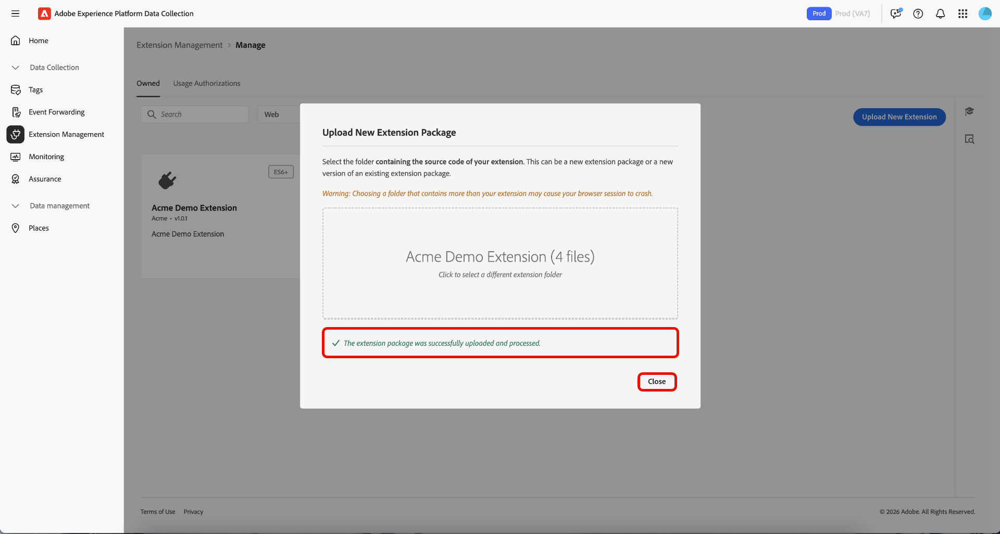

# Tags extension management

Adobe Experience Platform allows you to manage **[!UICONTROL Owned]** extensions. You can upload new extensions, deploy new versions, and release them to either private or public availability. 

## Manage an extension  {#manage-extension}

After you have prepared your extension package locally, use **[!UICONTROL Extension Management]** in the Data Collection UI to upload it, validate the package, and release versions through **Development**, **Private**, and **Public** availability. You can then install the extension on a property and use it for testing.

### Upload an extension {#upload-extension}

To upload an extension, navigate to the Data Collection UI and select **[!UICONTROL Extension Management]** from the left navigation. From here, select the **[!UICONTROL Owned]** tab. This tab shows any extensions owned by you or your organization. They are separated by platform, and you can see what extensions you have on each platform (Web, Mobile, and Edge) using the dropdown. Select **[!UICONTROL Upload New Extension]**.

On the **Upload New Extension** page, select **[!UICONTROL Select Extension Folder]**, navigate to the folder that contains your extension, select the folder, then select **[!UICONTROL Upload]**.

Confirm the number of files that will be uploaded by selecting **[!UICONTROL Upload]**.

The number of files that will be uploaded is displayed including the extension name, and version. You have the option to perform a **[!UICONTROL Dry Run]** which will download a zip file to your local machine for inspection. Select **[!UICONTROL Validate & Upload]**.

Confirmation your extension has successfully been uploaded and processed is displayed along with your **Extension Package ID**. Select **[!UICONTROL Close]** to return to the **[!UICONTROL Owned]** tab where your extension is displayed.

You are returned to the [!UICONTROL Owned] tab where your updloaded extension is displayed.

>[!IMPORTANT]
>
>Extensions are uploaded in **Development** availability. Extensions in **Development** availability cannot be shared until they are released to **Private** availability.

### Release an extension {#release-extension}

To release the extension to be privately available, select your extension to display the information panel on the right. Here you can see the following details of the extension:

* **Version** - Shows the latest version and the state it is currently in. You can use the dropdown menu to view the version history of the extension.
* **Actions** - Allows you to **[!UICONTROL Upload New Version]** of the extension and **[!UICONTROL Release To Private]**.
* **Extension Package ID** - Displayed at the bottom. This will change depending on the version selected.

Select **[!UICONTROL Release To Private]**, then select **[!UICONTROL Release To Private]** again to confirm the release.

Confirmation is received once the extension has successfully been released to **Private** availibility. The updated availability can be seen in the right panel.

>[!NOTE]
>
>Once the extension has been released to **Private**, it is available to be shared with other organizations. 

To release the extension to **Public** availability, select **[!UICONTROL Request Public Release]** from the right panel. 

The **[!UICONTROL Release Extension Package]** screen provides details that will be required on the request form, with an option to copy the details. Select **[!UICONTROL Go To Request Form]**.

A new brower tab is opened containing the request form. Copy and paste the information from the **[!UICONTROL Release Extension Package]** screen into the relevant fields. Submit the completed form for review. You will be notified once the extension has been made public.

## Share extension packages with other organizations {#share-extension}

>[!NOTE]
>
>Extension packages must have a version that is either private or public in order to be shared through [!UICONTROL Usage Authorizations]. Versions marked as Development availability are not eligible for sharing and will not appear in the authorization dropdown. This applies even if an earlier version (e.g., 1.0.0) has already been shared. Newer versions (e.g., 1.0.1) must be made at least private before they can be authorized or installed by receiving organizations.
>
>All guidance regarding the sharing of private extension packages also applies if you later choose to make these packages public. The same considerations around visibility, versioning, security, compatibility, support, and documentation remain relevant regardless of the package's availability status.

**[!UICONTROL Usage Authorizations]** is a powerful feature that you can use to securely share private extension packages with trusted partners without making them publicly available in the extension catalog. Use this feature to create a secure bridge between organizations, allowing you to leverage each other's custom extension code while maintaining privacy and control over your proprietary solutions.

Organizations often develop specialized extensions tailored to their unique business requirements. These extensions may contain proprietary logic, custom integrations, or sensitive configurations that shouldn't be made publicly available. Usage authorizations solve this challenge by enabling:

* **Selective sharing**: Share private extensions only with trusted partner organizations.
* **Maintained privacy**: Keep sensitive extension code out of the public catalog.
* **Collaborative development**: Enable trusted partners to benefit from your custom solutions.
* **Controlled access**: Maintain full control over who can access and use your private extensions.

The sharing process involves two key participants:

1. **Sharing organization**: The organization that owns and shares the private extension package
2. **Receiving organization**: The trusted organization that gains access to the shared extension

When a private version is shared, the receiving organization gains access to that specific version, creating a direct connection between the two organizations. If a newer version is later made private, it will also be available to the receiving organization without requiring any additional steps on their part.

### Create an extension package usage authorization {#package-usage-authorization}

To share an extension, navigate to the Data Collection UI and select **[!UICONTROL Extension Management]** from the left navigation. From here, select the **[!UICONTROL Usage Authorizations]** tab.

Here, you see a list of existing shared authorizations organized into two categories:

* **Shared with this org**: Extensions that other organizations have shared with you.
* **Shared with other orgs**: Extensions that you have shared with other organizations.

Select **[!UICONTROL Add Authorization]**.

![The [!UICONTROL Usage Authorizations] tab showing a list of extensions shared with this org, highlighting [!UICONTROL Add Authorization]](../images/shared-extensions/add-authorization.png)

>[!IMPORTANT]
>
>You must obtain the target organization's **`Organization ID`** the Organization's owner. Organizations cannot be searched by name.

Select the **[!UICONTROL Platform]** for which you want to authorize an extension from the dropdown. You can share **[!UICONTROL Web]**, **[!UICONTROL Mobile]**, and **[!UICONTROL Edge]** extensions.

Next, select the **[!UICONTROL Extension]** you want to share from your available extensions in the dropdown. The list displays extensions owned by your organization along with their availability status. Extensions whose latest version is in **Development** availability will not appear in this list.

Next, enter the receiving organization's ID, then select **[!UICONTROL Save]**.

![The [!UICONTROL Create extension package usage authorization] page showing a selected extension and Adobe organization ID entered, highlighting [!UICONTROL Save]](../images/shared-extensions/save-authorization.png)

You are returned to the [!UICONTROL Usage Authorizations] tab where you can see the extension in your **[!UICONTROL Shared with other orgs]** list. The status will show **Awaiting Approval** until the receiving organization approves the authorization, at which point it will be updated to **Approved**.

![The [!UICONTROL Usage Authorizations] tab showing a list of extensions shared with other orgs, highlighting the new authorization](../images/shared-extensions/new-authorization.png)

>[!TIP]
>
>You can also share extensions directly from the **[!UICONTROL Extension Catalog]** by selecting the menu (⋯) on the extension card, and then select the sharing option from the menu.

When an authorization is active, the shared extension displays a ***Sharing*** badge in the catalog indicating it is being shared with other organizations. 

![The [!UICONTROL Catalog] tab showing the shared extension with the badge](../images/shared-extensions/sharing-badge.png)

### Authorize and manage shared extensions {#manage-shared-extension}

>[!NOTE]
>
>As a receiving organization, you can only approve or reject shared extensions. You cannot manage or modify the authorization details, as these are controlled by the sharing organization.

To authorize a shared extension for your organization, navigate to the Data Collection UI and select **[!UICONTROL Extension Management]** from the left navigation, then select the **[!UICONTROL Usage Authorizations]** tab.

You can see a list of shared extensions including those **Awaiting Approval** in the **[!UICONTROL Shared with this org]** section. Select the extension you want to approve, then select **[!UICONTROL Approve]**.

![The [!UICONTROL Usage Authorizations] tab showing a list of extensions shared with this org with the extension that is Awaiting Approval selected, highlighting [!UICONTROL Approve]](../images/shared-extensions/approve-authorization.png)

>[!NOTE]
>
>You can also reject a request within the **[!UICONTROL Usage Authorizations]** tab if the shared extension is no longer required by your organization.

Select **[!UICONTROL OK]** in the **[!UICONTROL Authorization Usages]** dialog.

![The [!UICONTROL Authorization Usages] dialog, highlighting [!UICONTROL OK]](../images/shared-extensions/confirmation.png)

You are returned to the [!UICONTROL Usage Authorizations] tab where you can see the extension now shows an **Approved** status.

![The [!UICONTROL Usage Authorizations] tab showing a list of extensions shared with this org, highlighting the extension with Approved status](../images/shared-extensions/approved-authorization.png)

Once the authorization is approved, the extension is available in your catalog and can be installed and used like any other extension. The shared extension displays a ***Receiving*** badge indicating it is an extension that is shared with you by another organization.

![The [!UICONTROL Catalog] tab showing the shared extension with the "Receiving" badge](../images/shared-extensions/receiving-badge.png)

### Revoking authorizations {#revoke-authorization}

As the owning organization, you can delete an authorization at any point, regardless of its current status (Awaiting approval, Rejected, or Approved).

**If your extension was never made public:**

* Any private version the receiving organization already installed will continue to appear in their installed extensions list.
* If the receiving organization never installed your extension, it will no longer appear anywhere in their interface.

**If your extension was made public:**

* Any private version the receiving organization installed will remain visible in their installed extensions list.
* If they never installed your private version, they will still see the latest public version in their catalog and can install it.
* They can also downgrade from your private version to the latest available public version if desired.

When you revoke an authorization, the receiving organization retains certain rights to protect their existing implementations:

* **Continued use**: The receiving organization can keep using any private version they've already installed, even after you revoke access.
* **Build protection**: If the receiving organization installed your private v1.0.0 and you later release a private v1.0.1, they won't see the newer version but can continue building with v1.0.0 without disruption.
* **Future upgrades**: If you later make your extension public (for example, releasing v2.0.0 publicly), the receiving organization can upgrade from their private v1.0.0 directly to the new public v2.0.0.

>[!IMPORTANT]
>
>Revoking authorization does not break existing builds or implementations. Receiving organizations maintain access to any private versions they've already installed to ensure business continuity.

## Next steps {#next-steps}

This document demonstrated how to use the shared extension feature within Experience Platform. For information on extension development, see the [extension development user guide](./getting-started.md).

For a high-level overview of extension development in Experience Platform, refer to the [overview documentation](./overview.md).
